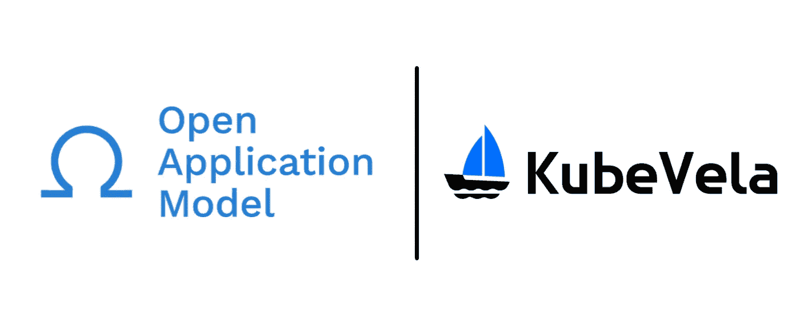
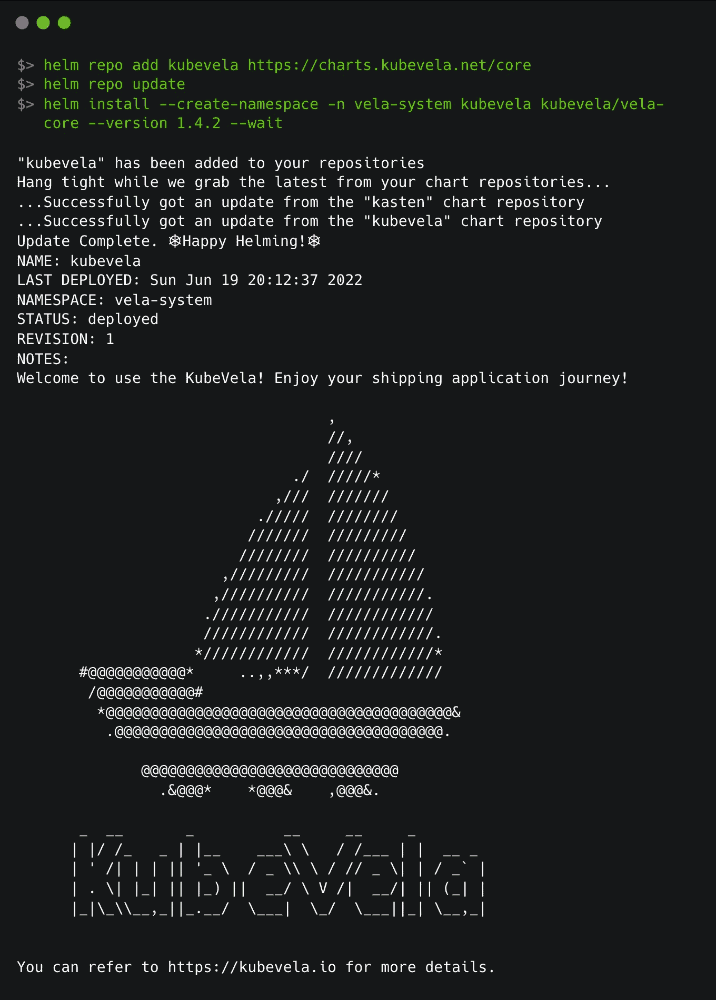
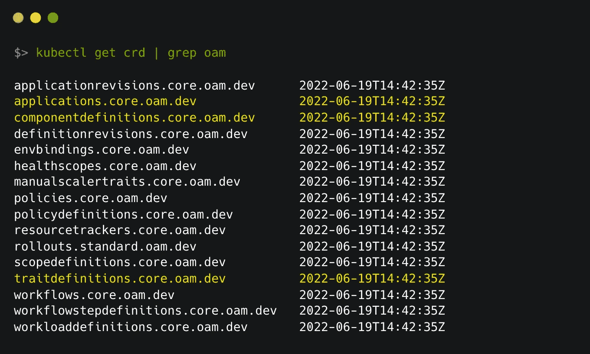
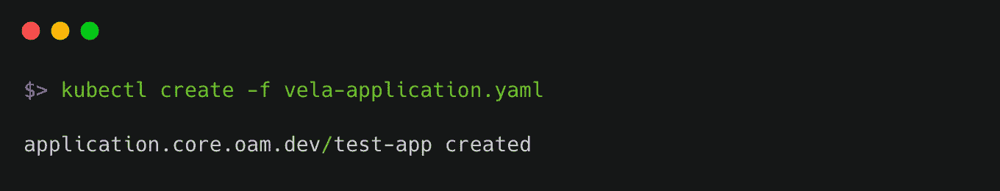
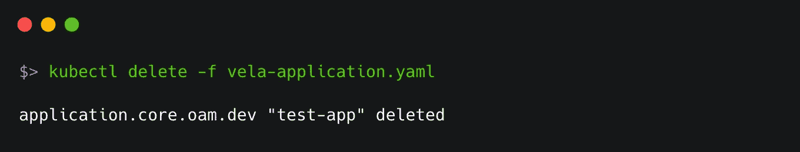

# 开发运维的应用优先方法

> 原文：<https://betterprogramming.pub/application-first-approach-to-devops-75653a51b6ee>

## 标准化 Kubernetes 基础设施，让开发人员更轻松，运营人员更自由


马库斯·温克勒在 [Unsplash](https://unsplash.com?utm_source=medium&utm_medium=referral) 上的照片

本文是关于快速开发环境中一个惊人且关键的概念——开放应用程序模型(OAM)的少数实现之一。

OAM 是一个概念，它提倡开发人员完全专注于他们的应用程序，而不是底层基础设施的知识。它指出，这种方法应该是应用程序优先的、可扩展的和运行时不可知的。你可以在这里了解更多信息[。](https://oam.dev/)



回到我们的话题，我这里说的 OAM 的实现是 KubeVela。我在 Crossplane 上的上一篇文章中简单地提到了它，并认为这是深入研究它的恰当时机。

[](https://rajputvaibhav.medium.com/crossplane-and-beyond-36a7cd855ce0) [## 交叉平面和超越…

### 让我们将基础设施的最新发展视为代码，不要止步于此，而是要进一步全面见证…

rajputvaibhav.medium.com](https://rajputvaibhav.medium.com/crossplane-and-beyond-36a7cd855ce0) 

# **设置**

要开始使用 KubeVela，只需遵循[安装步骤](https://kubevela.io/docs/platform-engineers/advanced-install#install-kubevela-with-existing-kubernetes-cluster)。
为了更轻松地管理资源，您可以选择安装 vela CLI。对于 Mac 系统，您可以像这样简单地使用`brew`

```
brew update
brew install kubevela
```

准备好 vela CLI 后，只需运行以下命令，就可以在集群上安装核心组件(CRD)

```
vela install --version v1.4.2
```

如果您希望跳过 vela CLI，您也可以像这样使用 helm 直接安装它

```
helm repo add kubevela [https://charts.kubevela.net/core](https://charts.kubevela.net/core)
helm repo update
helm install --create-namespace -n vela-system kubevela kubevela/vela-core --version 1.4.2 --wait
```

您应该会看到如下所示的输出:



# 让我们探索一下

作为安装的一部分，安装了一些 CRD。



这里有相当多的东西，但我们将只关注突出的部分。

# 应用程序. core.oam.dev

应用程序是开发人员要创建的东西，只包含特定于应用程序及其配置的细节。这个文件中没有提到 Kubernetes 资源。让我们在下面为自己创建一个:

简单地像这样应用这个清单:



现在，如果您查看参考资料，您会看到有相当多的参考资料是基于这段代码创建的。


但是我怎么知道我想要创建的所有资源是什么呢？

为此，回头看一下清单的第 8 行。我们提到了`webservice`作为我们应用程序的类型。这就把我们带到了下一个 CRD

# 组件定义. core.oam.dev

有几个预定义的`componentdefinitions`你可以使用。您可以像这样列出它们:


我们使用的是一个长期运行的、可伸缩的、容器化的服务，它有一个稳定的网络端点来接收来自客户的外部流量。因此，它创建了一个具有稳定网络端点(服务和入口)的部署(长期运行且可扩展)。

有很多其他的`componentdefinitions`你可以使用，但是说你有一个需求没有被任何人解决。说你要对其中一个做一些补充？还是一起做一个新的？嗯，两种都有可能。

要创建一个自定义的`componentdefinition`，你不必从头开始。使用现有的 Kubernetes 清单并运行`vela def init`(更多细节[在这里](https://kubevela.io/docs/platform-engineers/components/custom-component))。

如果你查看这些组件定义 YAMLs 中的一个，你会看到它们有一个`schematic`块，可以写在 [cue](https://cuelang.org/) 、Kube 或 helm 中。

我个人更喜欢 cue，因为它的灵活性，但这是以学习整个语言为代价的。如果你不想那样做，就去找赫尔姆或者库贝。此外，如果您熟悉 Kustomize，Kube 对您来说可能很容易(它是带有参数化的标准 Kubernetes 清单)。

# traitdefinitions.core.oam.dev

最后，我们可以选择扩展现有的`componentdefinition`。例如，您可以使用它将[水平窗格自动缩放](https://kubernetes.io/docs/tasks/run-application/horizontal-pod-autoscale/)添加到您上面创建的现有 webservice 应用程序中。

这个`TraitDefinition`资源的定义也与`componentdefinition`非常相似，在`schematic`部分下面写有一个模板代码。这里的一个区别是`appliesToWorkloads`，它将定义何时触发这个特性。在我们的例子中，它将与部署相关，因此看起来像这样:

请注意，这些参数有一个默认值`min : 1`、`max : 10`和`cpuUtil : 50`，这意味着用户可能会也可能不会在应用程序定义文件中传递它们。

# 清除

再补充一点，考虑到所有的资源被高效地打包在一个应用程序中，清理也同样容易。



现在，如果您使用

```
kubectl get all,ingress
```

这些你都找不到。

# 离别赠言

至少在我看来，OAM 是 DevOps 社区中我们需要的那种标准化。KubeVela 是一个很好的例子，它将如何使我们受益。

> 我应该提到这个工具有一个缺点。文档最初不是用英语写的，但被翻译成了英语。所以，它没有你想象的那么好。