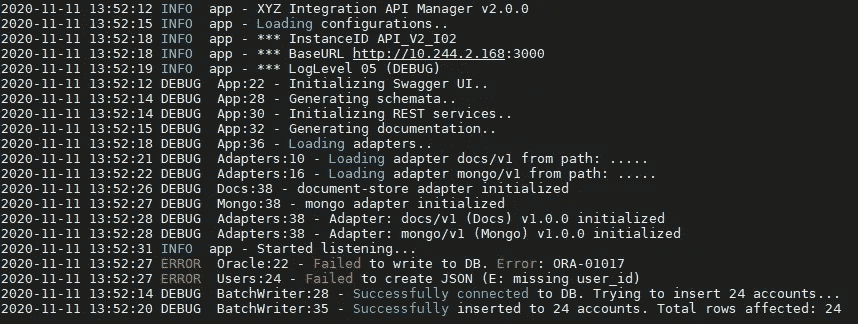

# 企业应用程序日志记录最佳实践(支持工程师的视角)

> 原文：<https://betterprogramming.pub/application-logging-best-practices-a-support-engineers-perspective-b17d0ef1c5df>

## 大家来写点大家都爱的有意义的日志吧！



图片来源:作者

应用程序日志揭示了应用程序在运行时可见的内部和外部事件的信息。当软件部署中出现 bug、安全漏洞或异常时，应用程序日志是对事件进行适当的根本原因分析的最有帮助和最可靠的证据。

在本文中，让我们了解如何编写人人喜爱的有意义的应用程序日志消息。

# 1.记录什么

## ✅传入和传出的消息

当组件通过消息传递相互通信时，传入和传出的消息都必须记录有 API 端点 URL、请求参数、请求源和中间 IP、请求头、身份验证信息、请求和响应正文、业务上下文、时间戳和内部处理步骤。最重要的是，为了跟踪系统中跨多个服务的消息循环/往返，必须为每个消息分配一个惟一的消息 ID(通常在 API 管理器/服务外观级别生成)。

## ✅服务和函数调用

当调用服务或函数时，最好在较低的日志级别记录其上下文，主要用于调试目的(使用 TRACE 或 DEBUG)。拥有这些日志有助于我们轻松地调查与业务逻辑相关的问题，尤其是当我们没有特权将调试器附加到我们的应用程序时(例如，部署到测试、试运行、预生产环境)。

## ✅用户互动和业务统计

每个应用程序都有其独特的业务案例和用户旅程，它们为系统中的领域专家揭示了许多见解。例如，某个事务是否花费太长时间，或者终端用户是否总是被某个功能卡住，这些都是用户体验方面非常关键的信息。其他与业务相关的信息，如交易量和活跃用户及其阶段，对于获取业务洞察力非常重要，甚至可以用于商业智能目的。

## ✅数据操作(审计跟踪)

在大多数企业应用程序中，出于安全性和合规性原因，必须为数据相关操作保留一个单独的日志，其中包含所有重要信息，如访问 id(用户/系统)、使用的确切服务实例和角色权限、时间戳、数据层查询以及已更改数据集(diff)的先前和新状态的快照。审计跟踪必须捕获所有与数据相关的尝试(访问、导入、导出等)。)，以及由用户以及其他系统和服务执行的 CRUD 操作(创建、读取、更新、删除)。

## ✅系统事件

系统事件必须捕获关于行为事件(启动、停止、重新启动、安全事件)、转换模式(冷、热、热)、服务间通信(握手、连接建立状态—连接、断开、重新连接、重试事件)、服务实例 id、主动服务 API、主动监听 IP 和端口范围、加载的配置(初始加载和动态更新)、整体服务健康以及任何有助于理解系统行为的信息。

## ✅性能统计

勤奋是计算设备的一大特点，但它们可能没有我们在学校被教导的那么完美。服务中的性能异常或突然的意外降级(主要是由于未处理的错误和损坏的数据)可能在任何给定的时间发生。为了识别它们，总是建议发布关于整体系统健康和性能的统计数据。此类统计信息可能包括 API 调用计数(成功服务的和单独的失败计数)、网络延迟、平均往返时间、内存消耗和其他特定于应用程序的信息(主要由业务上下文决定)。

## ✅的威胁和脆弱性

借助应用程序运行时和日志消息来揭示威胁和漏洞是每个企业软件开发人员必须学习的一门艺术。一般来说，应用程序中的安全漏洞和灾难性故障不会突然发生。很多时候，有些线索是没有人首先注意到的。因此，我们必须始终记录可疑的人工活动(例如，失败的身份验证和验证尝试，包括使用的网络、请求来源以及附加的用户角色和权限等所有低级信息)以及系统行为(例如，资源消耗模式峰值的增加、web 服务器上的高负载、服务被随机阻塞)。当注意到一个可疑事件时，确保日志捕获与之相关的所有信息，最好是一个完整的堆栈跟踪，包括参数值和应用程序上下文中可用的附加信息。

# 2.什么不要记录

## ❌个人身份信息(PII)

几乎所有的隐私法(如 GDPR、CCPA)都明确建议开发者让 PII 远离日志。PII 包括名字、姓氏、用户名、性别、生日、邮寄和帐单地址、电子邮件、电话号码、社会保险号(SSN)和信用卡号等信息。

## ❌企业名称和联系信息

确保避免记录企业名称、相关人员(员工、客户、供应商等)等信息。)，以及业务和个人联系方式。日志不应向外人暴露业务关系和相关方交易。要追溯特定的交易，不要使用真实的企业名称和标识符，要确保使用系统生成的事件 ID，并通过其他服务传递它。

## ❌金融数据(银行账户、卡的详细信息、交易金额等。)

根据法律，所有财务数据都必须完全隐藏在日志中。在日志中暴露这样的信息很容易导致严重的诉讼(甚至可以被解释为刑事犯罪)。因此，任何时候都要避免这种情况。

## ❌密码、安全密钥和秘密、认证令牌

安全凭证和 auth 令牌被视为敏感信息，通过日志公开它们有助于入侵者在系统中轻松实现安全破坏。因此，请始终注意这些敏感信息，并使其远离日志。

注意:如果您可以为每个字段附加一个属性，指定其可见性级别(例如，show、mask、hide、encrypt)，那么指定从日志中隐藏什么信息将会很容易。如果您有这样的机制，您可以通过更新配置中的属性来启用和禁用字段的可见性。如果您需要在非生产环境中记录一些用户数据，尤其是出于测试和调试的目的，那么这是一个不错的选择。或者，您可以编写解析器来过滤日志消息，并根据基于环境的预定义指令来处理敏感字段。

# 3.最佳实践

## ✅知道何时使用每个日志级别

日志级别用于表示系统中每个事件的严重性。在大多数日志框架中，可以使用以下级别。

*   **致命**:表示可能导致应用程序中止的非常严重的错误事件。通常，这些可能会导致灾难性的失败。
*   **错误**:表示可能仍然允许应用程序继续运行的错误事件，受影响路径中的功能会减少。
*   **WARN** :表示危害小于错误的事件。通常，它们不会导致应用程序的任何功能降级或完全失败。然而，它们仍然是危险信号，必须进行调查。
*   **INFO** :表示应用程序行为中的重要事件横幅和信息性消息。
*   **调试**:表示具体详细的信息，主要用于调试目的。这些日志帮助我们一步一步地检查代码。
*   **TRACE** :表示最底层的信息，如代码的堆栈跟踪，以提供关于某个事件/上下文的最多信息。这些日志帮助我们检查变量值和完整的错误堆栈。

如果我们采用 Linux Syslog，那么会有更多的严重级别，如紧急、警报、严重、错误、警告、通知、信息和调试。

不管每个日志级别实现的复杂性和深度如何，我们都必须在代码中正确地设置它们，以便根据每个场景提供最佳级别的信息。例如，开发人员用于调试和技术分析目的的所有信息必须放在调试或跟踪级别下，而系统级别的横幅可以放在信息级别下。

## ✅使用英语

一些工具和终端控制台不支持打印和存储带有某些 Unicode 字符的日志消息。因此，本地化和其他高级功能在日志级别可能具有挑战性。因此，请确保您坚持使用英语，并始终使用广泛接受的字符集来编写日志消息。

```
2020-11-11 13:52:18 DEBUG  App:36 - **Loading adapters..**
2020-11-11 13:52:21 DEBUG  Adapters:10 - **Loading adapter docs/v1** 
2020-11-11 13:52:22 DEBUG  Adapters:16 - **Loading adapter mongo/v1** 
2020-11-11 13:52:26 DEBUG  Docs:38 - **docs adapter initialized**
2020-11-11 13:52:27 DEBUG  Mongo:38 - **mongo adapter initialized**
2020-11-11 13:52:22 DEBUG  Adapters:20 - **Successfully loaded all**
```

## ✅包括开发人员友好的日志消息(简短易懂)

如果我们记录得太少，我们可能无法获取足够的信息来构建每个重要事件的背景。如果我们记录太多，最终会导致性能问题。(写入巨大的日志文件会导致更高的 I/O 和磁盘存储消耗。如果文件系统不支持它，将会降低系统的整体性能。)

要优化日志消息，需要对系统的功能性和非功能性期望有一个透彻的理解，并为日志消息的正确质量和数量做好计划。让每一条日志信息都有意义，并且与上下文相关——总是简短而甜蜜。

```
2020-11-11 13:52:27 DEBUG  Users:18 - Successfully created new user (RecordID: 5f5a0d594d17e22b848ee570)2020-11-11 13:52:27 ERROR  Users:34 - Failed to update DB (E: inactive user, RecordID: 5f5a0d594d17e22b848ee570)
```

## ✅为频繁和冗长日志消息引入了参考 id/代号/简化模板

不要总是记录完整的描述，尝试引入一个参考 ID 或简化的模板来表示在日志中重复出现的冗长描述。这减少了日志消息的总数和长度，同时提供了隐藏选定信息的灵活性。例如，如果不将漏洞以详细的文本格式发布到日志文件中，使用代码名称或公共引用 ID 来表示它们总是安全的，这样只有领域专家才能理解实际情况。

```
2020-11-11 13:52:27 ERROR  DB:22 - Failed to write (E:**ORA-01017**)// **ORA-01017** denotes "invalid username/password; logon denied" error message
```

## ✅使用正确的时间戳(调整了 utc/时区)

时间戳为我们提供了对日志事件序列的理解，并且是调试和分析所必需的。建议在捕获时间时使用最详细的粒度(例如，毫秒或微秒级精度)，以便可以更容易地识别相邻的日志事件。此外，确保时间戳放在日志消息的开头，格式为 yyyy-mm-dd HH:mm:ss。如果您不使用服务器中的默认时间(UTC ),请务必提及时区。

```
// with default server time (UTC)**2020-11-11 13:52:12** INFO  XYZ Integration API Manager v2.0.0// with timezone (e.g. PST - Pacific Standard Time)**2020-11-11 13:52:12PST** INFO  XYZ Integration API Manager v2.0.0
```

## ✅提到日志来源/起源/设施(用于调试、跟踪、错误)

在调试、跟踪和错误日志中提到日志源非常有助于明确触发相应日志消息的确切位置。一些日志框架提供了提到最详细级别的能力(例如，带有行号的文件名)，但是只提到类/函数/文件名在大多数时候也是可行的。

```
2020-11-11 13:52:12 INFO  app - XYZ Integration API Manager v2.0.0
2020-11-11 13:52:15 INFO  app - Loading configurations..
2020-11-11 13:52:18 INFO  app - *** InstanceID APIM_V2_I02
2020-11-11 13:52:18 INFO  app - *** BaseURL [http://10.244.2.168:3000](http://10.244.2.168:3000)
2020-11-11 13:52:19 INFO  app - *** LogLevel 05 (DEBUG)
2020-11-11 13:52:12 DEBUG  **App:22** - Initializing Swagger UI..
2020-11-11 13:52:14 DEBUG  **App:28** - Generating schemata..
2020-11-11 13:52:14 DEBUG  **App:30** - Initializing REST services..
2020-11-11 13:52:15 DEBUG  **App:32** - Generating documentation..
2020-11-11 13:52:18 DEBUG  **App:36** - Loading adapters..
2020-11-11 13:52:21 DEBUG  **Adapters:10** - Loading adapter docs/v1 
2020-11-11 13:52:22 DEBUG  **Adapters:16** - Loading adapter mongo/v1 
2020-11-11 13:52:26 DEBUG  **Docs:38** - docs adapter initialized
2020-11-11 13:52:27 DEBUG  **Mongo:38** - mongo adapter initialized
2020-11-11 13:52:22 DEBUG  **Adapters:20** - Successfully loaded all
2020-11-11 13:52:31 INFO  app - Started listening...
```

## ✅使每个日志消息在系统中是唯一的

大多数新手开发人员犯的一个错误是将相同的日志消息复制粘贴到多个文件中，同时让最终的日志集合充满来自系统多个不同部分的相似日志行。当他们这样做时，在代码中跟踪触发事件的确切位置并不容易。如果不能更改措辞，至少在日志消息中提到日志来源，以使最终的日志行看起来彼此不同。此外，如果日志记录功能是由父类处理的，请确保在初始化期间发送一个标识符，并在为子行为编写日志消息时使用它。

```
2020-11-11 13:52:18 DEBUG  **App:36** - Loading adapters..
2020-11-11 13:52:21 DEBUG  **Adapters:10** - Loading adapter docs/v1 
2020-11-11 13:52:22 DEBUG  **Adapters:16** - Loading adapter mongo/v1 
2020-11-11 13:52:26 DEBUG  **Docs:38** - docs adapter initialized
2020-11-11 13:52:27 DEBUG  **Mongo:38** - mongo adapter initialized
2020-11-11 13:52:22 DEBUG  **Adapters:20** - Successfully loaded all
```

## ✅将可追踪事件 id/令牌附加到消息上

通常，当事件/消息进入系统时，会为该事件/消息分配一个唯一的 ID。这个 ID 将在下一个处理阶段继续使用，它帮助我们跟踪整个系统中的事件流，特别是对于调试、并发处理和与数据相关的操作。理想情况下，在单个系统中，所有模块和服务中的一个事件应该只有一个惟一的 ID。

```
[87d4s-a98d7-9a8742jsd] Request Body: {
  **"request_id": "87d4s-a98d7-9a8742jsd"**,
  "app_id": "TX001",
  "option_val": "IBM",
  "req_type_id": "0013",
  "data": {...........}
}[87d4s-a98d7-9a8742jsd] Sending request to RefData: [http://10.244.2.168:8280/v1](http://10.244.2.168:8280/v1)
```

## ✅提到了转换点的 ID 映射

在某些情况下，特别是当一个事件从一个系统传递到另一个系统时，事件 id 会根据每个系统的约定而改变。在这样的转换点上，我们必须在一个单独的日志消息中用所需的上下文清楚地提到以前的事件 ID 和新分配的 ID 之间的映射。

```
[1000508] ***** Incoming request from 10.244.2.168:3000 *****
[1000508] **Origin Id: 87d4s-a98d7-9a8742jsd -> System ID: 1000508**
[1000508] Transaction successfully added to Rabbit Queue
```

## ✅为每个服务实例提供实例 id

大多数企业系统作为分布式计算平台运行，同一服务有多个实例，具有各种应用配置、资源、版本和网络属性。为了识别每个实例，建议分配一个实例 ID，并在服务间通信时使用它。

```
2020-11-11 13:52:12 INFO  app - XYZ Integration API Manager v2.0.0
2020-11-11 13:52:15 INFO  app - Loading configurations..
**2020-11-11 13:52:18 INFO  app - *** InstanceID APIM_V2_I02** 
2020-11-11 13:52:18 INFO  app - *** BaseURL [http://10.244.2.168:3000](http://10.244.2.168:3000)
2020-11-11 13:52:19 INFO  app - *** LogLevel 05 (DEBUG)
```

## ✅配置活动日志级别

根据部署环境，活动日志级别也必须更改。生产环境的推荐惯例是打印信息级别的日志。在其他环境中，根据开发和系统操作团队首选的粒度级别，日志将被打印到调试或跟踪级别。

```
// Active Log Level = DEBUG2020-11-11 13:52:12 INFO  app - XYZ Integration API Manager v2.0.0
2020-11-11 13:52:15 INFO  app - Loading configurations..
2020-11-11 13:52:18 INFO  app - *** InstanceID APIM_V2_I02
2020-11-11 13:52:18 INFO  app - *** BaseURL [http://10.244.2.168:3000](http://10.244.2.168:3000)
2020-11-11 13:52:19 INFO  app - *** **LogLevel 05 (DEBUG)**
2020-11-11 13:52:12 DEBUG  App:22 - Initializing Swagger UI..
2020-11-11 13:52:14 DEBUG  App:28 - Generating schemata..
2020-11-11 13:52:14 DEBUG  App:30 - Initializing REST services..
2020-11-11 13:52:15 DEBUG  App:32 - Generating documentation..
2020-11-11 13:52:18 DEBUG  App:36 - Loading adapters..
2020-11-11 13:52:21 DEBUG  Adapters:10 - Loading adapter docs/v1 
2020-11-11 13:52:22 DEBUG  Adapters:16 - Loading adapter mongo/v1 
2020-11-11 13:52:26 DEBUG  Docs:38 - docs adapter initialized
2020-11-11 13:52:27 DEBUG  Mongo:38 - mongo adapter initialized
2020-11-11 13:52:22 DEBUG  Adapters:20 - Successfully loaded all
2020-11-11 13:52:31 INFO  app - Started listening...// Active Log Level = INFO2020-11-11 13:52:12 INFO  app - XYZ Integration API Manager v2.0.0
2020-11-11 13:52:15 INFO  app - Loading configurations..
2020-11-11 13:52:18 INFO  app - *** InstanceID API_V2_I02
2020-11-11 13:52:18 INFO  app - *** BaseURL [http://10.244.2.168:3000](http://10.244.2.168:3000)
2020-11-11 13:52:19 INFO  app - *** **LogLevel 04 (INFO)** 2020-11-11 13:52:31 INFO  app - Started listening...
```

## ✅为错误和失败提供了充分的背景

错误和失败需要尽最大努力检查。要做到这一点，应用程序必须为系统的领域专家提供足够的背景信息以及业务和技术环境。例如，如果请求或消息处理失败，除了错误消息之外，记录失败的请求正文也非常有帮助。

```
[1000508] ***** Incoming request from 10.244.2.168:3000 *****[1000508] Origin Id: 87d4s-a98d7-9a8742jsd -> System ID: 1000508[1000508] Failed to validate msg body (E: Uncaught ReferenceError: missing params - option_val)[1000508] **Failed Message:** {
  "request_id": "87d4s-a98d7-9a8742jsd",
  "app_id": "TX001",
  "req_type_id": "0013",
  "data": {...........}
}
```

## ✅用证据验证数据操作(永远不要假设！)

每次发生与数据相关的操作时，在不盲目接受其完成的情况下，确保总是用证据来验证最终状态。例如，一般来说，当您在数据库中创建/更新/删除记录时，它会返回已更改记录的计数以及更新的记录。在这种情况下，总是对预期的计数或结果运行验证。另一个例子是当您将记录插入数据结构(比如队列)时。不要盲目地假设插入操作，总是获取队列大小并验证它是否增加了 1。(假设您的系统是并发的，但是底层队列不支持并发操作。在这种情况下，您实际上可能会丢失一些记录，而长度验证是检测代码中这种隐藏错误的唯一方法。)

```
DEBUG  BatchWriter:28 - Successfully connected to DB. Trying to insert 24 accounts...DEBUG  BatchWriter:35 - Successfully inserted 24 accounts. Total DB rows affected: 24
```

## ✅加密/屏蔽敏感数据

在大多数情况下，法律要求系统屏蔽和/或加密用户和内部系统的敏感信息。根据您所在的行业和您所属的地理区域，合规要求可能会有所不同。因此，在您的应用程序中进行适当的研究并实施正确的程序。在某些情况下，在启动和运行应用程序之前，您可能需要向安全机构提交日志策略，并获得他们的批准/认证。

```
[1000508] ***** Incoming request from 10.244.2.168:3000 *****[1000508] Origin Id: 87d4s-a98d7-9a8742jsd -> System ID: 1000508[1000508] Request Body: {
 ”user_id”:”XXXXXXXXXX”,
 ”personal_details”:{
   ”firstName”:”XXXXXXXXXX”,
   ”lastName”:”XXXXXXXXXX”,
   ”DOB”:”XXXXXXXXXX”,
   ”gender”:”Male”,
   ”proffessional”:”Software Architect”,
   ”industry”:”IT”,
   ”SSN”:”XXXXXXXXXX”
 },
 ”address_history”:[
   {”streetAdress”:”Street No 1″,”zipcode”:”XXXXX”,”state”:”CA”},
   {”streetAdress”:”Street No 2″,”zipcode”:”XXXXX”,”state”:”NY”},   
   {”streetAdress”:”Street No 2″,”zipcode”:”XXXXX”,”state”:”AL”}
 ],
 ”card_info”:[
   {”type”:”amex″,”card_number”:”XXXXXXXXX”,”credit_limit”:”XXXXX”},
   {”type”:”visa″,”card_number”:”XXXXXXXXX”,”credit_limit”:”XXXXX”}
 ]
}
```

## ✅配置日志文件命名、循环策略、存储大小和备份过程

如果您正在将日志写入文件，请确保它们存储在独立的磁盘上，并且不会影响正在运行的应用程序(例如，您可以从独立的服务器上获取一个专用位置，并将其安装到应用程序服务器上)。此外，还要了解日志文件的日志频率和增长模式。确保您的日志轮换策略具有正确的文件命名约定(例如，在创建每个日志文件时在文件名后附加时间戳)，以保持日志文件的长度和数量。此外，应该有将旧日志备份到安全位置并定期清理日志存储的机制。根据您所处的行业，您可以决定备份到期时间(通常是几个月或几年)，并在到期时销毁所有过去的日志文件。

```
[ec2-user@ip-XXX-XX-X-XXX logs]$ ls 
..
APIM_V2_I02-2020-11-20_04:38:43.log
APIM_V2_I02-2020-11-23_02:05:35.log
APIM_V2_I02-2020-11-24_04:38:17.log
APIM_V2_I02-2020-11-27_03:28:37.log
APIM_V2_I02-2020-11-27_12:06:45.log
...
```

# 4.高级建议

## ✅使用集中式日志聚合器

在企业软件开发人员中，拥有一个集中的、可访问的服务器/位置来聚集日志是一种非常常见的做法。通常，这些日志聚合器不仅跟踪应用程序日志，还跟踪其他日志数据，如设备/操作系统日志(例如 Linux Syslog)、网络/防火墙日志、数据库日志等。此外，它们将日志文件从应用服务器中分离出来，让我们能够以更安全、更有组织、更高效的格式将所有日志数据存储更长时间。在某些行业(如银行和金融)，必须将这些日志保存在本地和中央存储中，以使入侵者和网络犯罪分子很难同时访问这两个位置并删除他们活动的证据。由于这种日志冗余，两个位置之间的不匹配可以提示危险信号，并帮助我们防止违规行为被忽视。

## ✅编写日志解析器并主动监控日志

编写定制的日志解析器和过滤器是集成在大多数日志监控工具中的一个特性，也称为*安全信息和事件管理(SIEM)* 集成。这种解析器帮助我们以更有组织的格式存储日志数据，查询变得更加容易和快捷。此外，适当组织的日志数据可以输入到日志监控和异常检测系统中，以便主动监控系统并预测未来事件。这些工具非常先进，它们通过基于时间序列的交互式仪表盘以及基于日志数据和其他来源的实时事件分析，提供了出色的视觉体验。

## ✅会在发生重大事件时设置警报和推送通知

几乎所有的日志监控工具都包含在特定级别定义自定义阈值的功能。当系统达到这些级别时，监控工具将在日志数据的帮助下主动检测它们，并通过警报、推送通知 API(例如，[松弛审计日志 API](https://api.slack.com/admins/audit-logs) )、电子邮件等通知系统管理员。此外，它们可以预先配置为触发自动流程，如动态扩展、系统备份、转换等。然而，如果您为了日志监控的目的而投资商业软件，请确保您做了适当的分析，因为对于大多数中小型软件系统来说，这可能是多余的。

# 5.推荐工具

## **测井框架**

```
JavaScript/TypeScript ---> [Log4js](https://www.npmjs.com/package/log4js) / [pino](https://github.com/pinojs/pino)
Java --------------------> [Log4j](https://logging.apache.org/log4j/)
Golang ------------------> [Logrus](https://github.com/sirupsen/logrus)
Serverless Functions ----> [aws-lambda-powertools-python](https://github.com/awslabs/aws-lambda-powertools-python) / Build it yourself
.....
...
.
Let me know your favorites. I'd love to list them here!
```

## 日志审查/聚合/监控工具

```
CLI Tools ----> less, vim
Cloud Tools --> Fluentd, AWS CloudWatch
SIEM Tools ---> SolarWinds, Splunk, McAfee ESM, DataDog, IBM QRadar
Other --------> ELK Stack(ElasticSearch, Logstash, Kibana, Beats) , Loggly
.....
...
.
Let me know your favorites. I'd love to list them here!
```

请继续关注下一个编程技巧。在那之前，编码快乐！

## **如果你喜欢这篇文章，你可能也会喜欢阅读这些:**

[](https://medium.com/platform-engineer/microservices-design-guide-eca0b799a7e8) [## 微服务设计指南

### 大家都听说过微服务。但是你知道怎么设计一个吗？

medium.com](https://medium.com/platform-engineer/microservices-design-guide-eca0b799a7e8) [](https://medium.com/platform-engineer/understanding-jvm-architecture-22c0ddf09722) [## 理解 JVM 架构

### 理解 JVM 架构和 Java 在幕后是如何工作的，对每个 Java 来说都是一项重要的学习…

medium.com](https://medium.com/platform-engineer/understanding-jvm-architecture-22c0ddf09722) [](https://medium.com/platform-engineer/web-api-design-35df8167460) [## HTTP 和 Websockets:了解当今 web 通信技术的能力

### 决定为你的下一个 web API 设计选择什么

medium.com](https://medium.com/platform-engineer/web-api-design-35df8167460)