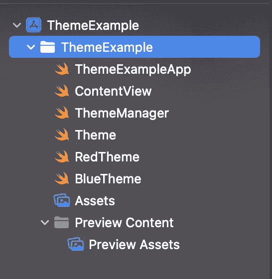
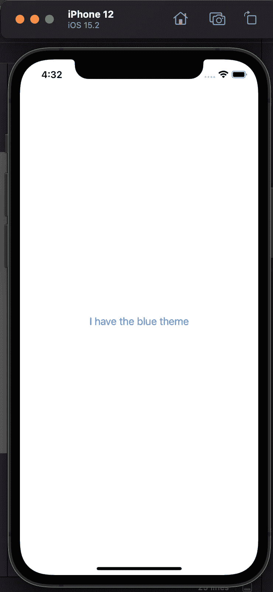

# 如何在 SwiftUI 应用程序中创建多个主题

> 原文：<https://betterprogramming.pub/apply-and-create-multiple-themes-in-swiftui-with-a-simple-ios-app-ce3e10556a9>

## 在 iOS 中自定和应用您自己的主题的快速教程

来源: [Undraw](https://undraw.co/search)

在本教程中，我们将了解如何为用 SwiftUI 编写的应用程序创建多个主题。

我们将使用一个简单的例子，它只有一个基于`Theme`改变颜色和文本的`Text`。

# 设置项目

创建一个新项目，并为您的视图检查 SwiftUI。我们需要为我们的教程创建 4 个新文件。

我们称它们为`ThemeManager`、`Theme`、`BlueTheme`和`RedTheme`。您的文件资源管理器应该如下所示:

将`View`保留为“Hello World”文本。我们以后会改的。

现在让我们看看如何用这种技术创建一个新的`Theme`。

首先，我们需要一个所有主题都可以实现的协议。我们称这个协议为`Theme`。这个文件应该是这样的:

这是一个简单的协议，在我们的例子中只包含两个属性。一个是文本的颜色`textColor` ，另一个是`welcomeText`的字符串`Text`。

现在我们已经创建了协议，让我们看看`BlueTheme`和`RedTheme`是什么样子的。以下是`BlueTheme`的代码:

这是给`RedTheme`的:

好了，现在我们创建了两个主题。正如你所看到的，蓝色主题有一个蓝色的标签颜色和文本`I have the blue theme`。红色主题具有红色文本颜色和文本`I have the red theme`。

在将主题应用到`ContentView`之前，我们需要创建一个`Manager`来跟踪当前主题，这样应用程序的所有实例都可以使用它们。

我们称之为 it 经理`ThemeManager`:

`ThemeManager`是一个简单的 singleton，带有主题的`get`和`apply`功能。为了方便起见，我们将默认主题设置为`RedTheme`。

是时候将我们的主题应用于`ContentView`了:

在用`init`方法创建视图之前，我们调用了我们创建的`applyBlueTheme`函数——它将调用我们的`manager`,并将`BlueTheme`设置为当前主题。

现在设置值非常简单。

构建视图时，我们从`theme.welcomeText`(我们之前创建的)检索文本，从`theme.textColor`检索颜色。

简单地将`BlueTheme`改为`RedTheme`，你将会看到红色的文本。现在让我们看看实际效果:

目前就这些。感谢阅读。