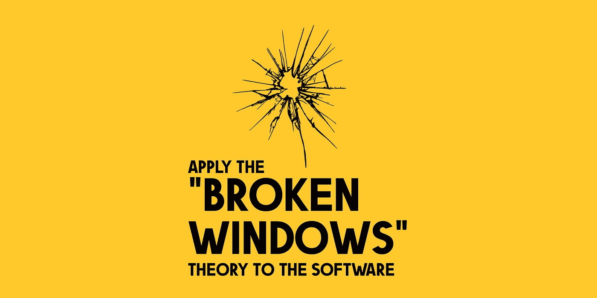

# “破窗”理论在软件设计中的应用

> 原文：<https://betterprogramming.pub/apply-broken-windows-theory-to-the-software-design-9477cef9bdce>

## 知道“破窗”理论意味着什么吗

[*【破窗】*](https://www.simplypsychology.org/broken-windows-theory.html) 是犯罪学史上被引用最多的文章之一。这个理论最早是由社会科学家乔治·l·凯林在 20 世纪 80 年代初在他的文章《大西洋月刊的 T4》中提出的。它遵循了斯坦福德的心理学家菲利普·津巴多在 1969 年进行的一项实验。凯林对这一理论解释如下:

> *“考虑一栋有几扇破窗户的建筑。如果窗户不修理，破坏者往往会打碎更多的窗户。最终，他们甚至可能会闯入大楼，如果没人住，可能会成为里面的非法居住者或生火者。*

或者，在更轻量级的版本中:

> *“考虑一个铺面。一些垃圾堆积起来。很快，更多的垃圾堆积起来。最终，人们甚至开始把外卖餐馆的垃圾袋留在那里，甚至破门而入。*

如果你喜欢这个主题，有关于这个主题的全部文献；看一看[《修理破窗》](https://www.amazon.com/exec/obidos/ASIN/0684837382/codihorr-20)。

[2019 年关于这个话题的一项研究](https://news.northeastern.edu/2019/05/15/northeastern-university-researchers-find-little-evidence-for-broken-windows-theory-say-neighborhood-disorder-doesnt-cause-crime/)显示，这项调查可能不可靠，因为人们对自己社区混乱的看法可能与他们对犯罪的评估以及他们如何描述自己的心理或身体健康交织在一起。

事实上，他说，警务和公共卫生战略不应该基于这样的想法，即混乱导致人们违反法律或参与危险或不健康的行为。

> 然而，如果以一种更精确的方式来研究这种紊乱，就可以提供关于社区中正在发生的事情的有价值的见解，并为公共政策提供信息。

# 极其注重细节的活动

软件设计是一项极其注重细节的活动；虽然打破的窗户不一定意味着附近汽车的轮子被偷了，但是软件中不同组件之间的关系可能要紧密得多。

> 当你的团队不在细节之上时，普遍的感觉是事情失去了控制，你的项目失去控制并且每个人都不再关心维护只是时间问题&进化。

如果你已经关注我一段时间了，你会知道我不相信完美主义，尤其是在软件设计方面。没有一个项目是完美的:在一个具有不断变化的约束的高度可变的环境中，你不能定义一个具有完美的必备条件的要点列表。
Nick Gracilla [用一句漂亮的话解释了这个概念](https://typeshare.co/nickgracilla/posts/great-software-architecture-is-like-great-plumbingbut-for-a-house-thats-constantly-changing?utm_source=pocket_mylist):

> ***伟大的软件架构就像伟大的管道——但是对于一个房子来说，那是不断变化的***

伟大的软件架构是适应性强的；它可以处理企业对软件的不断变更，并为未来的迭代和问题定义变更做好准备。

好吧，等等，*等等*。让我们退后一秒钟。软件设计中的“破窗”理论是什么？

# 没有人一开始就心怀不轨

没有人会带着把工作搞砸的意图开始一个项目。起初，原则、实践和法律是最重要的，即使将它们付诸实践可能会很困难(这也取决于团队技能)

*突然一扇“窗户”被打破了。* 这可能是因为分娩压力大或者只是缺乏知识。人们经常犯错，即使是资深人士。*尤其是资深人士* ( *“你的自我是你灵魂最大的敌人”~ Rusty Eric* )。
但是*破窗*不仅仅是失误的问题；需求经常变化，你可能需要做或大或小的改变来最好地遵循意图。这很正常。

这里有一个 [*推拉门*](https://www.theringer.com/movies/2018/4/24/17261506/sliding-doors-20th-anniversary) 。
如果不采取措施[技术债务开始蔓延](https://www.offnotes.org/the-economy-of-tech-debt/)并且更多的“窗户被打破”:问题通过模仿(*“我刚刚复制了那个”*方法)、重复(一个破碎的假设)，或者只是复制+粘贴在代码中传播。

由此产生的系统表现出*刚性*、*脆性*、*不动*，以及*较低的弹性*随变化而变化。每一个新的改变都伴随着高成本，增加了被改变的部分，因此也带来了高的失败风险。

# 破窗理论表明

> 当不良行为没有立即得到纠正时，它只是向人们表明，打破规则、惯例或标准没有坏处。

任何负面结果的缺失传播了疾病的内在感知；偷工减料变得可以接受，质量开始下降。

虽然问题可能很复杂，但解决方案却很简单:

*   **在你的团队中推行健康的方法——**高级人员想要拼命展示他们的优势*(我是一个该死的 10x 工程师宝宝！)*，学妹们能做多少。很少比估计多一天、两天或三天意味着什么。相反，冷静和专注的方法可以拯救你和你的团队。
*   **没有免费的东西—** 每个人都可以从头开始重写软件；持续的维护和发展要困难得多，这表明你和你的团队是多么擅长软件设计。重构——和调试一样——是一种展示任何开发人员优势的*有洞察力的活动。*