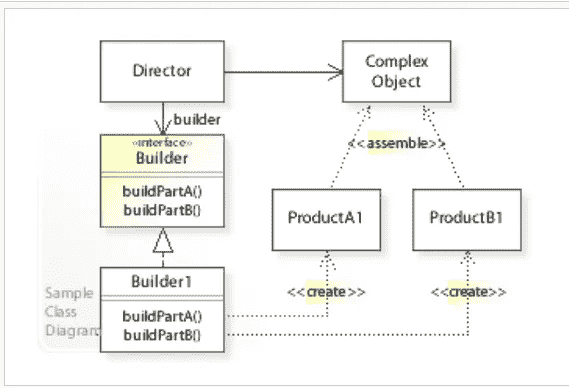
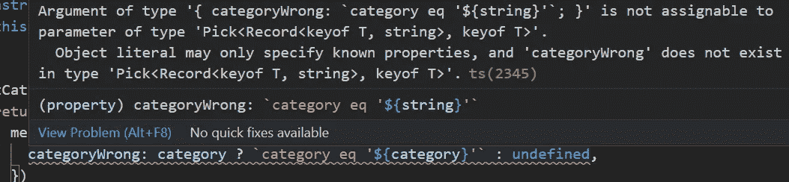

# 应用生成器模式在 TypeScript 中生成查询筛选器

> 原文：<https://betterprogramming.pub/apply-builder-pattern-to-generate-query-filter-in-typescript-651a6b13da38>

## 实现一个不可变的强类型过滤器生成器


由[林赛·亨伍德](https://unsplash.com/@lindsayhenwood?utm_source=unsplash&utm_medium=referral&utm_content=creditCopyText)在 [Unsplash](https://unsplash.com/s/photos/step?utm_source=unsplash&utm_medium=referral&utm_content=creditCopyText) 拍摄的照片

构建器模式是 GoF 设计模式中的一种，它被设计用来构建通常需要一长串参数的对象。它允许您使用 Builder 类创建多个不同但相似的对象。



构建模式的 UML 类(来源:Wikipedia: [构建模式](https://en.wikipedia.org/wiki/Builder_pattern))

正如 UML 图所示，构建者模式包括一个指导者和构建者。构建者一步一步地创建对象的一部分。导演管理将各部分组装在一起的方式。导演的角色是在呼叫客户和建造者之间提供分离。

在某些情况下，模式是在没有控制器的情况下实现的。这意味着客户端直接调用构建器方法并获得结果。这样，我们有了一个更简单的实现，并且仍然保留了主要的好处:封装了构建对象过程的复杂性。在本文中，我们实现了没有控制器的构建器模式。

本文的目的是展示如何用构建器模式重构代码块，使其成为不可变和强类型的。

向前跳:

*   [第一次尝试](#0c3c)
*   [使内部状态不可变](#7a86)
*   [添加强打字](#4cce)
*   [最终想法](#82cb)

# 问题定义

我们需要在一个`Node.js`应用中重构 URL 过滤器的生成。下面的代码片段展示了过滤器如何与多个 if 语句连接在一起。

我们可以很容易地从这个人为的例子中指出一些问题:

*   [多个 if 语句](https://medium.com/p/89937c0f9a99)让人难以读懂。
*   当添加更多的过滤条件时，它会很快变得难以管理
*   相似的代码块在许多不同的地方重复出现。(我们需要在各种 API 调用中使用多个类似的过滤器)。

开始重构时，我首先想到的是提取。让我们继续将这段代码提取到一个生成器类中。

## 第一次尝试

我们创建了一个`EventFilterBuilder`类。它包括以下内容:

*   设置单个过滤器的几种“设置”方法
*   一个私有的`filterResult`对象来表示内部状态
*   一种产生滤波器输出的`build`方法

可以从客户端调用新的构建器，如下所示:

我们的第一次尝试几乎解决了原始代码的所有痛点。多个 if 语句被分隔到每个 set 方法中。代码变得更易于维护。

最重要的改进是构建逻辑被封装到了 builder 类中。我们可以从应用程序中删除重复的过滤器连接。一个额外的好处是构建器集合方法支持链接。它使代码更流畅，更容易阅读。

然而，仍有改进的余地。

## 使内部状态不可变

当在 Builder 中调用 set 方法时，将返回该类的当前实例，并改变内部的`filterResult`状态。这是一个潜在的风险。

下面的例子说明了一个风险的例子。我们声明了两个建设者:`statusBuilder` 和`openOnlyBuilder`。因为两个构建器持有对内部`filterResult`状态的相同引用，因此向`statusBuilder`添加状态过滤器会无意中影响`openOnlyBuilder`的输出。因此，`openOnlyBulder`会产生不正确的输出。

这种错误可能会逃过代码审查，导致运行时错误。我们应该通过使它不可变来防止它发生。

改进后的`EventFilterBuilder2`如下图。在这个版本中，为每个`set` filter 方法调用返回一个新的构建器实例，内部状态`filterResult`用只读修饰符注释。创建一个新的实例可能会有很小的开销。但是这个小小的代价是值得的，因为我们实现了不变性，防止了上述问题的发生。

另一个显著的改进是我们使用`Object.values`来迭代`build`方法中的所有过滤器。这使得代码更容易维护和扩展，以适应未来的变化。

## 添加强类型

您可能已经注意到，构建器中的`filterResult`状态是一个具有字符串类型键值对的对象。这意味着，如果我们在添加或更改过滤器属性时出现打字错误，将不会有任何编译器错误。我们如何提高类型安全性？

首先，我们为`Filter`创建一个类型。然后我们使用`Generics`将新创建的`FilterType` 传递到构建器中。这允许我们在构造函数和所有引用`FilterType`的键的内部状态中实施类型约束。

这里，我们介绍一个新的助手功能`mergeSubObject`。它用于将新的过滤器合并到内部`filterResult`对象中。你可能想知道为什么我们不能使用像 spread 操作符这样简单的方法来执行合并…

```
{...this.filterResult, openOnly: openOnly ? `(deleted eq 0)`: undefined }
```

原因是，虽然上面的代码可以工作，但是我们失去了类型安全。根本原因是 TypeScript 没有对参数类型强制进行[超额属性检查](https://www.typescriptlang.org/docs/handbook/interfaces.html#excess-property-checks)，除了“新鲜”对象。因此,`mergeSubObject`是强制类型检查的一种变通方法。

现在我们可以调用新的构建器，如下所示:

当一个错误输入的过滤器被应用时，我们将被友好的错误消息警告。



这也使构建器更具可扩展性。当提出新的需求时，我们可以从现有的构建器中扩展一个新的构建器，并从`FilterType` *中派生出一个新的过滤器类型。*

# 最后的想法

在本文中，我们将介绍一个应用构建器模式重构过滤器生成代码块的实例。我们将现有的逻辑提取到一个构建器类中，使其不可变，并在几次迭代中被强类型化。最后但同样重要的是，set 方法的链接使得代码可读性更好。

请注意，这是一个人为的例子。对于复杂的用例，可以做更多的改进。例如，如果需要实现多个构建器来匹配不同的 API 格式，我们可以引入一个抽象构建器，从这个抽象构建器可以扩展多个具体的构建器。

如果你找到了这篇文章，你会发现下面的内容也很有用。

[](https://sunnysun-5694.medium.com/path-to-functional-style-a-typescript-refactoring-example-f5f052fe4d84) [## 函数式风格之路:一个类型脚本重构示例

### 本文讨论如何将命令式风格的功能重构为函数式风格。功能是…

sunnysun-5694.medium.com](https://sunnysun-5694.medium.com/path-to-functional-style-a-typescript-refactoring-example-f5f052fe4d84) 

编程快乐！