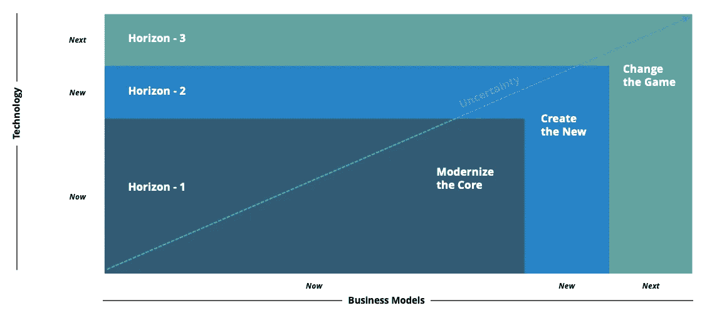
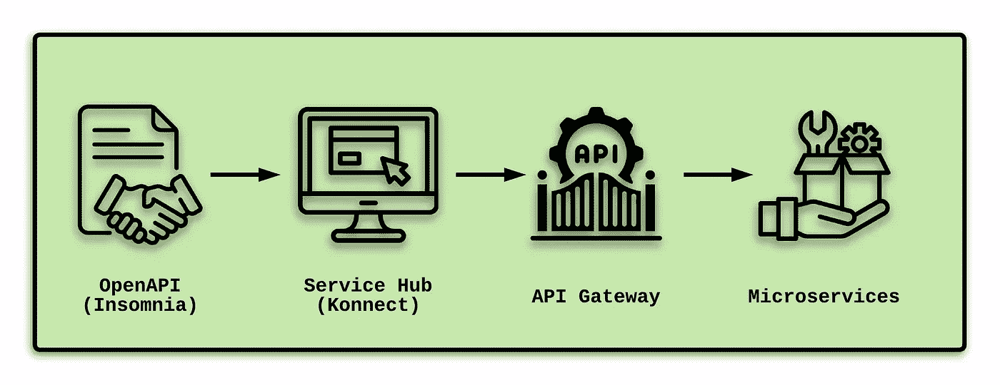
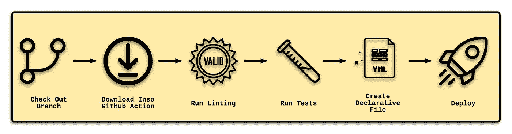
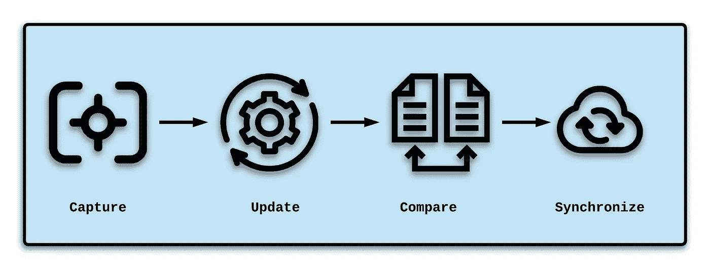

# 将 DevOps 应用于 APIOps 的 API 开发

> 原文：<https://betterprogramming.pub/applying-devops-to-api-development-for-apiops-21e2e605333e>

## DevOps + GitOps = APIOps

在与客户建立短期和长期目标的过程中，我的重点是在麦肯锡三地平线模型中建立地平线二和地平线三目标。

对于那些不了解这个框架的人来说，horizons 和 horizons 主要关注新的和下一代的特性和功能。在这个项目中，我最优先考虑的是采用一个 [API 网关](https://konghq.com/learning-center/api-gateway/?utm_source=guest&utm_medium=devspotlight&utm_campaign=community)。

基于我对 [Kong Gateway](https://konghq.com/kong/?utm_source=guest&utm_medium=devspotlight&utm_campaign=community) 的现有了解，我注意到了“ [APIOps:贯穿 API 生命周期的端到端自动化](https://konghq.com/blog/what-is-apiops/?utm_source=guest&utm_medium=devspotlight&utm_campaign=community)”。这是我第一次看到术语“APIOps”，我需要了解更多—尤其是对于我作为复杂服务层的技术架构师的角色。

我的观点是 APIOps 可以总结如下:

1.  API ops =[devo PS](https://en.wikipedia.org/wiki/DevOps)+[GitOps](https://www.gitops.tech/)应用于微服务层。
2.  大量利用规范，如 OpenAPI，在流程早期定义 API。
3.  从头到尾缩短了周转时间。
4.  承诺随着原料药的生产质量将会提高。

从特性团队的角度来看，我很快理解了 APIOps 如何帮助我的服务层开发团队取得积极的进展。然而，这个练习让我真的想了解采用 API 网关对 DevOps 有什么影响——因为 DevOps 是橡胶与道路相遇的地方。

在这个练习中，我需要从 DevOps 的角度来可视化 APIOps，并关注这些核心概念:

*   设计和测试
*   部署
*   维护

# 建立设计

2021 年，我写了两篇文章，阐述了 API 网关可以为提供 API 消费的项目和团队带来的价值:

*   [我如何用孔停止编写重复的服务组件](https://medium.com/nerd-for-tech/how-i-stopped-coding-repetitive-service-components-with-kong-1308be4000e3)
*   [与孔一起破解单片数据库](/breaking-up-a-monolithic-database-with-kong-4a70f55d4f63)

由于 Kong Gateway 是一个开源解决方案，我觉得将 Kong 的工具结合到我的探索中是理想的。事实上，孔为一份技术领导者名人录(思科、葛兰素史克、霍尼韦尔、PayPal、纳斯达克、三星)提供底层 API 技术，这进一步支持了我的决定。

让我们假设以下设计:

1.  使用 [OpenAPI](https://www.openapis.org/) 在[失眠](https://insomnia.rest/)中引入标准驱动的契约。
2.  [Kong Konnect](https://konghq.com/kong-konnect/?utm_source=guest&utm_medium=devspotlight&utm_campaign=community) 将作为 API 消费者的服务中心。
3.  Kong Gateway 将集中跨微服务共享的公共方面。

考虑下面的例子，它记录了我的方法:

在这个流程中，API 开发人员最初将专注于使用标准驱动的 OpenAPI 规范创建他们的设计。这一步发生在编写任何程序代码之前。由此产生的工件作为一个契约存在于服务中心——可供寻求 API 服务的人发现。

当选择使用已发布的 API 时，对该 API 的每个请求都要通过 API 网关来利用任何共享组件(如身份验证、日志记录、速率限制和安全性)。最后，请求被转发到专门处理独特功能的激光聚焦微服务。

这种方法的结果是，从 API 开始到 API 管理，将会存在一个完全干燥的(不要重复自己)设计。这对创作 API 的服务层开发人员和使用这些 API 的特性团队开发人员来说都是非常好的。但是补充这些团队的 DevOps 工程师呢？

# 采用 APIOps 和 DevOps

当引入新的 API 设计时，对 DevOps 工程师的影响常常被遗忘。DevOps 工程师需要理解和支持这种设计，以保证项目的成功。

幸运的是，Kong 的工具可以利用声明性方法，将服务和配置的所有方面存储在基于 git 的存储库中。成功的设计不止于此，因为测试、部署和维护方面与声明式设计一样重要。

让我们深入了解一下 Kong 是如何让将 DevOps 应用于 API 开发变得简单的。

# 设计和测试

失眠症不仅仅是一个 HTTP 客户端和一个 OpenAPI (YAML)编辑器。在部署到 Kong Konnect 之前，它可以验证、调试和测试新的 API 设计。因此，对于服务层开发人员来说，失眠症应该被认为与他们用于创建实际服务 API 的主要 IDE 一样重要。

API 设计者可以将以下流程应用于失眠症，以引入基于标准的服务:

Kong 的[Speed-Review API Specifications with nimbness](https://konghq.com/blog/api-specifications/?utm_source=guest&utm_medium=devspotlight&utm_campaign=community)文章贯穿了这个流程的每一步，包括使用 nimbness 将代码推送到 Kong Konnect ServiceHub。

# 部署

从 DevOps 的角度来看，通过利用 [Inso](https://github.com/Kong/insomnia/tree/develop/packages/insomnia-inso) ，这些相同的工件可以成为自动化持续集成(CI)处理的一部分，这是失眠症的命令行版本。

下图展示了 Inso 如何作为驻留在基于 git 的存储库中的 CI 管道的一部分来执行自动化任务:

[Inso CLI 简介](https://docs.insomnia.rest/inso-cli/introduction)文档是快速了解 Inso 与现有 CI/CD 管道配合使用的绝佳方式。

# 维持

在 API 网关级别，Kong 提供了一个[声明式配置工具](https://docs.konghq.com/deck/#documentation)(称为 decK)来更新配置，包括跨运行在 Kong Gateway 上的所有已发布 API 的横切更新。甲板流程如下图所示:

来自 Kong 的[用 APIOps](https://konghq.com/blog/automating-developer-pipeline-apiops/?utm_source=guest&utm_medium=devspotlight&utm_campaign=community) 自动化您的开发人员管道文章提供了使用 CI/CD 管道维护 API 的逐步过程。

例如，在一个 API 发布后，我们可以使用 decK 来修改跨 API 的通用速率限制组件，以满足业务需求。上面的流程允许对现有的配置进行分析，可以对其进行更新，然后部署回处理组件的 API 网关。除了进行修改所需的基于 git 的更新之外，剩余的流程流可以是 CI/CD 管道的一部分。

# 结论

DevOps 是橡胶与路面相遇的地方。这意味着功能团队和服务层开发人员可以试验和设计解决方案。但是，如果开发人员无法成功部署这些解决方案，它们很容易失败。

Kong 的团队不仅提供了与 API 开发的每个阶段进行交互的优秀产品套件，还提供了验证、部署和维护这些 API 的必要工具。更令人印象深刻的是在声明性和基于 git 的级别上运行的能力，坚持 DevOps 工程师继续推荐的管道驱动方法。

从去年开始，我一直努力按照下面的使命宣言生活，我觉得它可以适用于任何 IT 专业人士:

> *“将您的时间集中在提供扩展您知识产权价值的特性/功能上。将框架、产品和服务用于其他一切。”*
> 
> *——j·维斯特*

通过承诺使 APIOps 成为一个现实的选择，Kong 无疑坚持了我的个人使命宣言。自 Kong 产品套件问世以来，声明式设计和 DevOps 集成一直是重点关注的领域。

未能认识到这些不成文的需求可能会产生诸如陈旧的 API 规范、对手工过程的依赖以及 API 生命周期中的重复等后果。任何选择的解决方案都应该确保在整个 API 生命周期中考虑到这些挑战。

祝你今天过得愉快！