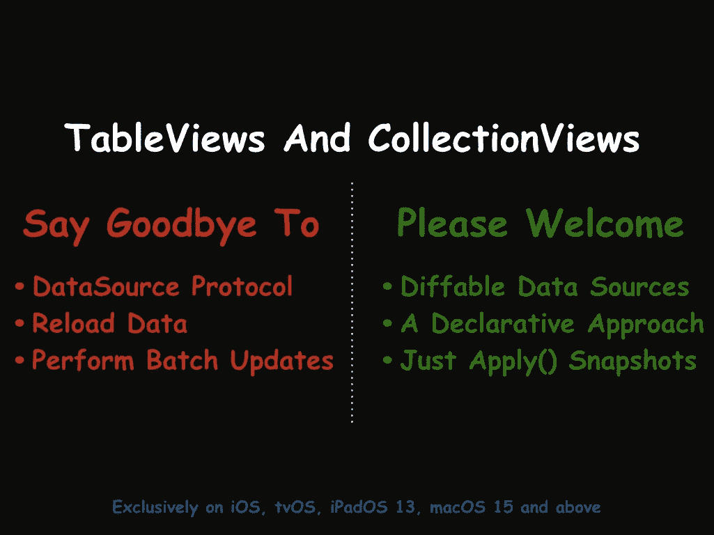
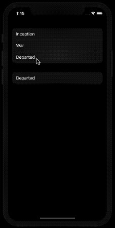

# iOS 13 应用不同的数据源

> 原文：<https://betterprogramming.pub/applying-diffable-data-sources-70ce65b368e4>

## 再见 reloadData()和 performBatchUpdates()


Robbie Noble 在 [Unsplash](https://unsplash.com?utm_source=medium&utm_medium=referral) 上拍摄的照片

声明式编程在苹果 2019 年 WWDC 活动期间得到了苹果的全力支持。

无论是通过引入新的 UI 框架 [SwiftUI](https://developer.apple.com/xcode/swiftui/) ，还是通过升级现有的 UIKit 框架，苹果都展示了声明式编程在推动 iOS 和 macOS 开发方面的力量。

在 UIKit 的最新增强中，[组合布局](https://medium.com/better-programming/ios-13-compositional-layouts-in-collectionview-90a574b410b8)和不同的数据源不仅看起来很有前途，而且也强烈表明 UIKit 框架不会很快消失。

# 我们的目标

*   理解对不同数据源的需求。
*   了解不同数据源和快照的工作原理。
*   在索引路径 API 中访问不同的数据源。

在本文中，我们将在 iOS 应用程序中使用`UITableView`实现不同的数据源。

但是，在我们深入研究不同数据源的复杂性之前，让我们先来看看设置表和集合视图的传统方式。

# 传统方法

传统的插入数据源的方法需要符合`UITableViewDataSource`协议，并实现`numberOfItemsInSection`、`numberOfSections`、`cellForItemAt`方法。

这对于简单的`TableViews`和`CollectionViews`都很好，直到我们需要开始更新行。对于更新，两种方法`reloadData()`和`performBatchUpdates()`都有自己的问题。

虽然`reloadData()`会破坏我们展示好的动画的机会，但是`performBatchUpdates()`如果不小心处理，很容易导致错误。

类似下面所示的错误在`performBatchUpdates()`中很常见:

```
Terminating app due to uncaught exception ‘NSInternalInconsistencyException’,
reason: ‘Invalid update: invalid number of items in section 0.
The number of items contained in an existing section after the update 
must be equal to the number of items contained in that section before.
```

很高兴，苹果带来了不同的数据源来代表我们解决这些错误。

# 不同的数据源——一个无错误的世界

可区分的数据源通过处理类似同步的机制标志着向声明性范式的转变，自动更新更改，从而通过新的状态驱动方法使事情更不容易出错。

通过使用 diffing 工具，不同的数据源负责更新状态(当前和新)之间的`TableView`和收集视图行。

类别`NSDiffableDataSourceSnapshot`代表用户界面的状态。要更新一个`TableView`或`CollectionView`，我们只需要在`UITableViewDiffableDataSource`上点击`apply(snapshot)`，它会为你处理更新和动画。

也可以从后台线程执行`apply`方法。这样做，需要 O(n)时间的差异发生在后台，之后更改被更新到主线程。这加快了更新过程。

苹果建议在调用`apply`方法时坚持使用后台或主线程。



# 设置不同的数据源

为了让动画和更新工作，我们首先需要在`UITableView`上设置我们的`UITableViewDiffableDataSource`。

以下代码创建一个数据源，并将其设置在`UITableView`实例上:

快照不依赖索引路径来更新项目。相反，它依赖于类型安全的唯一标识符来唯一地标识其节和项。

要生成这些唯一标识符，切片和项目必须符合`Hashable`协议。

虽然上面代码中的`Sections`是隐式符合`Hashable`的枚举，但是`Movies`结构需要实现`Hashable`协议，如下面代码所示

```
struct Movies: Hashable {let identifier: UUID = UUID()
let name: Stringfunc hash(into hasher: inout Hasher) {
return hasher.combine(identifier)
}static func == (lhs: Movies, rhs: Movies) -> Bool {
return lhs.identifier == rhs.identifier
}}
```

# 填充不同的数据源

要更新或填充数据源，我们只需在快照实例上添加必要的部分及其项目，然后`apply`它。下面的代码展示了如何做到这一点。

```
func updateDataSource(animated: Bool) {var snapshot = NSDiffableDataSourceSnapshot<Section, Movies>()snapshot.appendSections(Section.allCases)snapshot.appendItems([Movies(name: "Inception")], toSection: .one)
snapshot.appendItems([Movies(name: "War")], toSection: .one)
snapshot.appendItems([Movies(name: "Departed")], toSection: .one)snapshot.appendItems([Movies(name: "Departed")], toSection: .two)dataSource.apply(snapshot, animatingDifferences: animated)}
```

# 访问数据

为了更新或删除`TableView`中的数据，我们需要获取当前快照，这是通过调用`dataSource.snapshot()`完成的。

要访问不同数据源中具有基于索引路径的 API 的项目，我们需要以下列方式将索引路径转换为项目标识符:

```
dataSource.itemIdentifier(for: indexPath)
```

以下代码片段删除了从`UITableView`中选择的元素:

```
func tableView(_ tableView: UITableView, didSelectRowAt indexPath: IndexPath) {
        if let movie = dataSource.itemIdentifier(for: indexPath) {

            var currentSnapshot = dataSource.snapshot()
            currentSnapshot.deleteItems([movie])
            dataSource.apply(currentSnapshot)
        }
}
```

作为回报，我们得到应用程序的以下结果:



注意,“离开的”项目行虽然出现了两次，但由于使用了`Hashable`协议，所以是唯一标识的。

在另一个场景中，项目是不可哈希的，可区分的数据源将无法识别彼此具有相同内容的项目，并最终覆盖前一个项目。

因此，在上面的例子中，对于一个不可散列的条目(比如说字符串)，" Departed "将只显示一次。

# 结论

我们已经看到 diffable 数据源如何为我们的`CollectionView`和`TableViews`引入了一种全新的构建数据源的方式。

它使用条目标识符而不是索引路径，并且能够从后台调用`apply()`函数。

所以，是时候对`reloadData()`和`performBatchUpdates()`说*不*了。完整的源代码可以在 [GitHub 资源库](https://github.com/anupamchugh/iowncode/tree/master/DiffableDataSources)中找到。

这一次到此为止。我希望你喜欢读它。