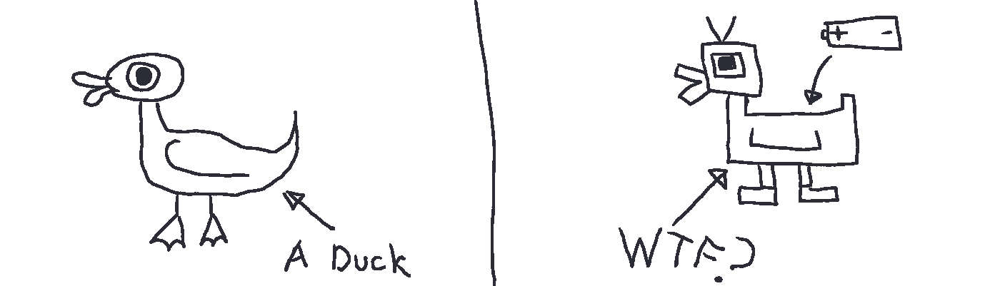
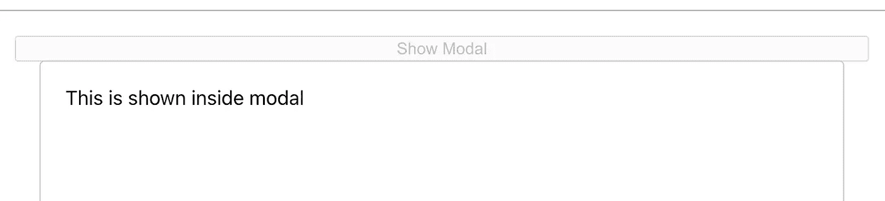
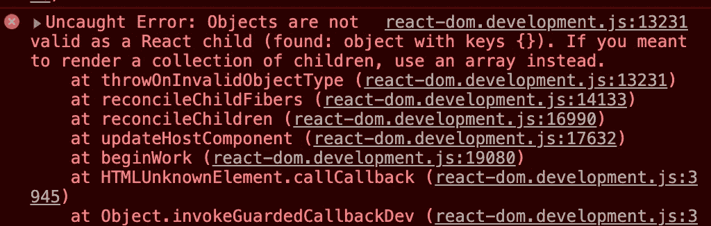
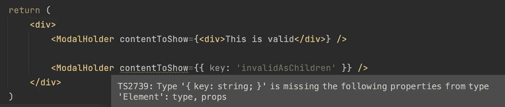

# 里斯科夫替代原理在 React 中的应用

> 原文：<https://betterprogramming.pub/applying-the-liskov-substitution-principle-in-react-3a0614a42a08>

## 看看实际应用中的可靠原则

照片由 [Pexels](https://www.pexels.com/photo/white-wooden-table-with-chairs-in-a-room-4064835/?utm_content=attributionCopyText&utm_medium=referral&utm_source=pexels) 的 [cottonbro](https://www.pexels.com/@cottonbro?utm_content=attributionCopyText&utm_medium=referral&utm_source=pexels) 拍摄。

SOLID 是一组原则，用于指导创建一个干净的、可维护的、更少错误的应用程序。

今天，我们将深入探讨固体的第三个原理:利斯科夫替代原理。我们将试图理解这个原则如何帮助我们创建一个更好、更干净的 React 应用程序。

# 本系列的其他文章

1.  [单一责任原则](/how-to-apply-solid-principles-to-clean-your-code-in-react-cdfd5e0a9cea)
2.  [开启关闭原理](/applying-the-open-closed-principle-to-write-clean-react-components-4e4514963e40)
3.  [界面分离原理](/how-to-apply-interface-segregation-principle-in-reactjs-fadf77113c5d)
4.  [依存倒置原则](/apply-the-dependency-inversion-principle-in-react-c20a0afc3d64)

# 什么是利斯科夫替代原理？

简单来说，这个原则就是:

> "子类应该可以替代它们的超类."

这意味着一个特定类的子类应该能够在不破坏任何功能的情况下替换超类。

## 例子

如果`PlasticDuck`是`Duck`的子类，那么我们应该能够用`PlasticDuck`替换`Duck`的实例，而不会有任何意外。

来源:马克西姆·伊万诺夫

这意味着`PlasticDuck`应该满足`Duck`班设定的所有期望。

# 这在 React 中是什么意思？

React 不是一个面向对象的框架，因为它基本上是 JavaScript。在 React 的上下文中，该原则背后的主要思想是:

> "组件应该遵守某种契约."

其核心是，这意味着组件之间应该有某种契约。因此，无论何时一个组件使用另一个组件，它都不应该破坏它的功能(或者制造任何意外)。

# 让我们更深入地探讨一下

我们来看一个`ModalHolder`组件。该组件将`contentToShow`作为道具，显示在一个模态中:

ModalHolder.jsx

这里的问题是什么？

嗯，现在的问题是对于可以传递给`ModalHolder`组件的内容没有限制。任何东西都可以通过变量`contentToShow`传递给它。

首先，让我们检查一下我们的代码是否正常工作，一切是否如预期的那样:

App.jsx

现在，如果您打开模式，它将正常工作，并向您显示模式:

显示模态

让我们利用前面描述的缺陷，看看它如何破坏我们的应用程序。

让我们试着将一个对象传递到`ModalHolder`中，看看会发生什么:

App.jsx

这段代码非常好，不会出现编译错误。现在让我们打开应用程序，看看单击按钮会发生什么:

错误

因此，即使我们的代码没有错误，我们的应用程序也会崩溃。这里出了什么问题？

我们的`Modal`组件允许包含另一个 React 组件。但是由于没有合同，其他组件不会被绑定。

# 有什么解决办法？

现在我们将看到在我们的应用程序中使用 TypeScript 的重要性以及它为什么重要。让我们将`ModalHolder`组件重构为 TypeScript，看看会发生什么:

ModalHolder.tsx

所以现在我们已经重构了我们的组件，只有当它得到一个`JSX.Element`时才接受属性`contentToShow`。

如果有人想要传递任何不是有效组件的内容来呈现，我们会得到一个错误:

ModalHolder 的有效用法

瞧啊。现在，所有其他想要插入到`ModalHolder`组件中的组件都需要遵循一个契约，这样它们就不会产生任何意外的行为。

# 我们做到了吗？

我们以这样一种方式设计了我们的`ModalHolder`组件，使用这个组件的子组件不能创建任何意外的行为，因为它们必须遵守父组件设置的规则。

这正是**利斯科夫替代原理**的全部内容。

所以是的，我们做到了！

我希望你喜欢这篇文章，就像我喜欢写它一样。

在下面留下你的想法。祝你今天愉快，:D

**有话要说？通过**[**LinkedIn**](https://www.linkedin.com/in/56faisal/)联系我

 [## 如何在反应堆中应用界面分离原理

### 行动中的坚实原则

better 编程. pub](/how-to-apply-interface-segregation-principle-in-reactjs-fadf77113c5d)