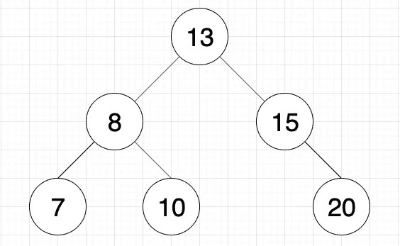
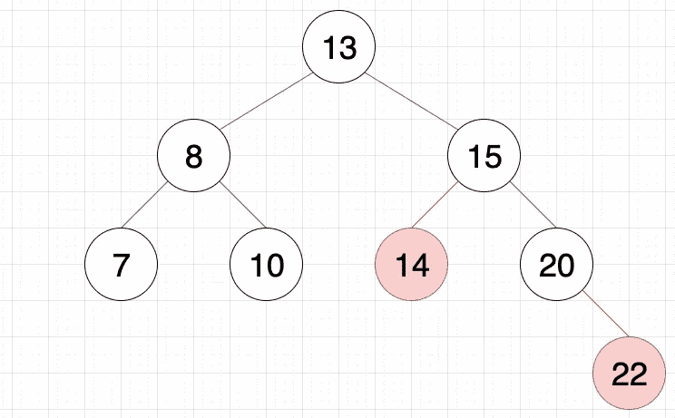
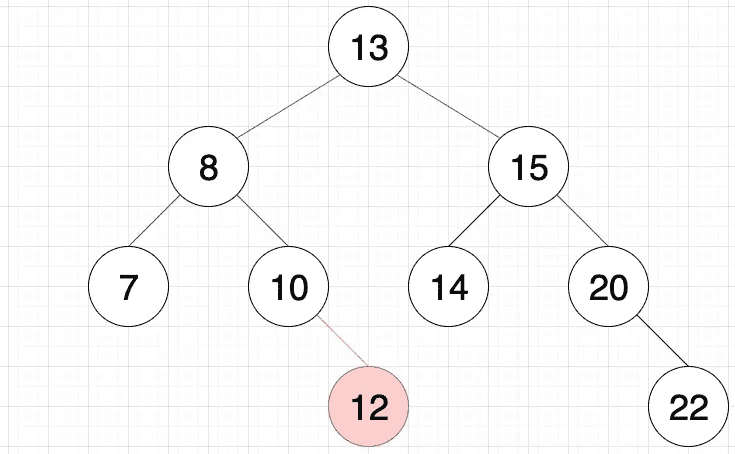
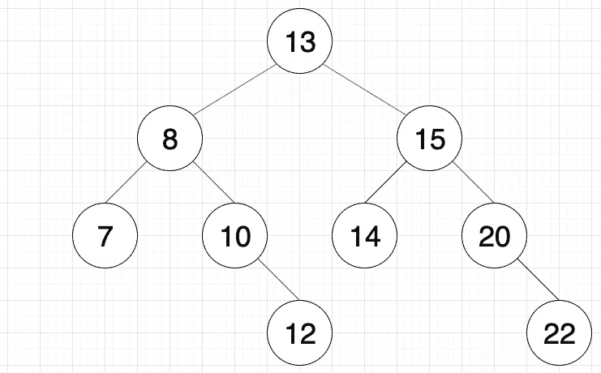

# 用全新的视角处理问题，并正确测试

> 原文：<https://betterprogramming.pub/approaching-a-problem-with-fresh-eyes-and-testing-properly-88e1baf3578d>

## 有时候解决问题的最好方法是休息一下


由[奥拉夫·阿伦斯·罗特内](https://unsplash.com/@olav_ahrens?utm_source=unsplash&utm_medium=referral&utm_content=creditCopyText)在 [Unsplash](https://unsplash.com/s/photos/problem-solving?utm_source=unsplash&utm_medium=referral&utm_content=creditCopyText) 拍摄的照片

# 背景

本周，我参加了纽约市编码员会议，了解二分搜索法树。我们学习了二分搜索法树、插入方法、广度优先搜索方法和深度优先搜索方法。Catherine 关于二分搜索法树的博客很好地解释了二叉查找树的目的、概念和特征。

至于二叉查找树方法，这篇博客将深入探讨广度优先搜索方法(因为我相信有大量的资源已经涵盖了从零开始创建其他二叉查找树方法)。展示广度优先搜索树方法的目的是回顾正确测试的基本概念和编码时的心态。

这听起来可能有点模糊——在这篇文章的结尾，你会确切地知道我的意思。

# 递归…诅咒…离子…

将极大地帮助你理解这篇文章中的代码的一个关键概念是递归。如果这是你第一次听说这个概念，我强烈推荐你在继续之前阅读这个[博客](https://medium.com/free-code-camp/how-recursion-works-explained-with-flowcharts-and-a-video-de61f40cb7f9)。你不需要理解如何实现递归本身(虽然我推荐它，因为一旦你习惯了它，它实际上很有趣)，但是你需要理解这个概念本身。

# 广度优先搜索方法

广度优先搜索方法是为该课程创建的最后一种方法。以前，所有其他方法(即插入、包含和深度优先搜索)都是用递归创建的。遵循这个共同的思路，我和我的结对编程伙伴同意我们应该递归地这样做。下面的代码是我们宽度优先搜索方法的递归方法。

```
class BinarySearchTree {
  constructor(val) {
    this.val = val;
    this.left = null;
    this.right = null;
  }

  //inserstion method
  insert(data) {
    //your code goes here!
    if (data > this.val) {
      if (this.right != null)
        this.right.insert(data);
      else
        this.right = new BinarySearchTree(data);
    }
    else if (data < this.val) {
      if (this.left != null)
        this.left.insert(data);
      else
        this.left = new BinarySearchTree(data);
    }
  }

  //breadth-first search method
  bfs(arr=[this.val]) {
    if(this.left) {
      arr.push(this.left.val);
    }
    if(this.right){
      arr.push(this.right.val)
    }
    (this.left)?this.left.bfs(arr):null;
    (this.right)?this.right.bfs(arr):null;    
    return arr;
  }

}
```

在上面的要点中，插入方法在第 9–23 行。我们将多次调用这个实例方法，因此您可以看到在幕后发生了什么，并作为递归如何工作的一个例子。让我们使用`insert`方法创建二叉查找树:

```
//Creating our binary search tree
let bst = new BinarySearchTree(13);
bst.insert(8);
bst.insert(15);
bst.insert(7);
bst.insert(10);
bst.insert(20);
```



二叉查找树的创建

根据`insert`方法的顺序，这就是我们的二叉查找树目前的样子。呼吸优先搜索方法应该按照从上到下、从左到右的顺序返回一个值数组。这意味着该方法应该为我们的二叉查找树输出`[13, 8, 15, 7, 10, 20]`。让我们调用广度优先搜索方法和 console.log 结果来确认它。

```
//invoking the breadth-first search method and printing out the result
console.log(bst.bfs());
//[ 13, 8, 15, 7, 10, 20 ]
```

看起来该方法正在按预期工作！

但是为了确保万无一失，我和我的搭档在树中又插入了两个数字，增加了额外的高度，以测试我们的函数是否正常工作。

```
//inserting two more values to test the breadth-first search function
bst.insert(14)
bst.insert(22)
```

当前树如下图所示。红色的圆圈和线条是新添加的值。



向当前二叉查找树插入两个新值(即 14 和 22)

随着二叉查找树的更新，广度优先搜索方法应该返回`[13, 8, 15, 7, 10, 14, 20, 22]`。

```
//testing breadth-first search method with newly inserted values
console.log(bst.bfs());
// [ 13, 8, 15, 7, 10, 14, 20, 22 ]
```

看起来广度优先搜索方法正在如预期的那样工作！或者是？

# 递归的细微差别

当我们在 meetup 中与其他人分享广度优先搜索功能时，似乎只有我和我的伙伴使用递归创建了这个功能。Eric，这次活动的共同主持人/老师，对我们的代码很好奇，因为他只见过使用队列堆栈的方法。

在检查了我们的代码后，他说，理论上，它不应该工作。他让我们在二叉查找树中插入一个 12，并再次运行广度优先搜索方法。

```
//inserting the value 12 to test the breadth-first search function again
bst.insert(12)
```



插入 12 后的当前二叉查找树

上图是我们插入 12 后的二叉查找树。红色表示这是最新添加到树中的数字。

为了测试广度优先搜索方法，应该打印出`[13, 8, 15, 7, 10, 14, 20, 12, 22]`。让我们用当前树再次运行这个方法，并打印出结果。

```
//printing out the array after inserting 12 in the binary search tree
console.log(bst.bfs());
// [ 13, 8, 15, 7, 10, 12, 14, 20, 22 ]
```

看来控制台日志*并没有* *符合我们的预期输出。不用说，我和我的搭档都感到震惊和困惑。我问 Eric 是什么促使他认为这个功能不起作用。他回应道:*

> 由于递归的性质，每当函数再次递归调用自身时，递归调用不需要知道该递归调用范围之外的信息。

让我们通过使用我们当前的广度优先搜索方法来分解他的意思。

# 分解递归广度优先搜索方法

为了解开 Eric 的陈述，我们要看看递归广度优先搜索方法在做什么。为了便于阅读，我将复制并粘贴本节中的方法和我们当前的树。注意，`bfs`方法指的是广度优先搜索方法。

```
bfs(arr=[this.val]) {
  if(this.left) {
    arr.push(this.left.val);
  }
  if(this.right){
    arr.push(this.right.val)
  }
  (this.left)?this.left.bfs(arr):null;
  (this.right)?this.right.bfs(arr):null;    
  return arr;
}

//invoking the function
bst.bfs()2 ]
```



当前二叉查找树

在第一个递归调用语句中，考虑了整个树(即，在根节点)。这意味着`arr`已经有了`[13]`,因为这是调用`bfs`方法时的默认参数。在第 2–7 行，有两个 if 语句分别确认左右子树是否存在。如果是，则将这两个子树的值推入`arr`。在这种情况下，两个子树都存在，这意味着 8 和 15 被推入。现在，`arr = [13, 8, 5]`。到目前为止一切顺利。第 8 行是我们递归调用`bfs`方法的地方。现在我们必须在继续之前解决这个递归调用。

在第二个递归调用语句中，左子树被考虑在内(即`[8, 7, null, null, 10, null, 12]`)，而`arr`作为参数被传入。注意，在第二次递归调用中，`arr = [13, 8, 15]`，保留了我们从第一次递归调用中推出的内容。

现在，重复第二行到第七行的逻辑。由于左右子树都存在，我们从左边推`val`并骑子树。现在，`arr = [13, 8, 15, 7, 10]`。在第八行，我们再次递归调用了`bfs`方法——现在我们必须在继续之前解决这个递归调用。

在第三个递归调用语句中，左子树被考虑在内(即`[7, null, null]`)，并且`arr`作为参数被传入。`arr`当前为本次通话的`[13, 8, 15, 7, 10]`。因为这个子树没有左或右子树，所以不调用方法中的任何逻辑，返回`arr`。既然这个递归调用已经解决了，我们可以从第二个递归调用语句继续到第九行。

回到第二个递归调用语句，因为第八行已经解析，我们移到第九行，再次递归调用`bfs`方法，但是是针对右边的子树。现在我们必须在继续之前解决这个递归调用。

在第四个递归调用语句中，考虑了右边的子树(即`[10, null, 12]`),`arr`仍然是`[13, 8, 15, 7, 10]`。第二到第四行被跳过，因为这个子树没有左子树，但是第五到第七行被调用。右边子树的值是 12，在哪里推入`arr`。这现在使得`arr = [13, 8, 15, 7, 10, 12]`。

*这就是错误的根本原因所在。*

要读的东西太多了，所以如果需要的话，可以休息一下！

递归`bfs`方法的流程首先关注根节点左边的子树。在遍历了左子树中的所有子树之后，它将关注右子树中的所有子树。这个`bfs`方法流程是先向左倾斜，然后向右倾斜。而应该是从上到下，从左到右。

让我们再来看看第二个递归调用。至此，`arr = [13, 8, 15, 7, 10]`。它应该按下的下一个数字是 14，位于右边的子树中。然而，这是不可能的，因为第二次递归调用期间的子树是[8，7，null，null，10，null 12]。为了推送 14，我们需要引用原始树，这个引用超出了第二个递归调用的范围。这就是埃里克的意思

> …递归调用不需要知道递归调用范围之外的信息。

我们可以在`bfs`方法中传递原始的二叉查找树作为参数，但是每当我们递归调用函数时，我需要以某种方式跟踪高度以及我已经遍历了哪些子树，以便不会意外地重复任何数字。这将是不必要的困难。

这表明递归可能不是创建`bfs`方法的最佳方法。最后，我和我的结对编程伙伴改用了队列堆栈方法。我不会把我们的解决方案贴在这里，尽管我建议你先自己想办法解决。

# 关键要点

我从这次经历中学到了两个教训:

## 1.不要陷入与前面问题相同的实现中

我和我的搭档立即尝试用递归创建`bfs`方法，因为之前所有其他的二叉查找树方法都使用了递归。我们隐含地假设二叉查找树的所有方法都是基于递归的，这是不正确的。相反，我们应该后退一步，用全新的思维对方法进行伪代码化，并认识到递归只是一种解决方案，而不是解决方案。

## 2.测试每一个可能的场景

当我和我的伙伴插入两个值(即 14 和 22)来测试我们的`bfs`方法时，它是成功的，我们就到此为止了。我们没有注意到这两个值被插入到了右边的子树中，这在默认情况下可以与我们的`bfs`方法一起工作。我们没有测试在左子树中插入一个值的情况，因为我们太兴奋了，以至于想出了`bfs`方法。我知道几乎不可能想出每一个潜在的测试用例，但是至少要有覆盖方法本身不同方面的各种测试用例。