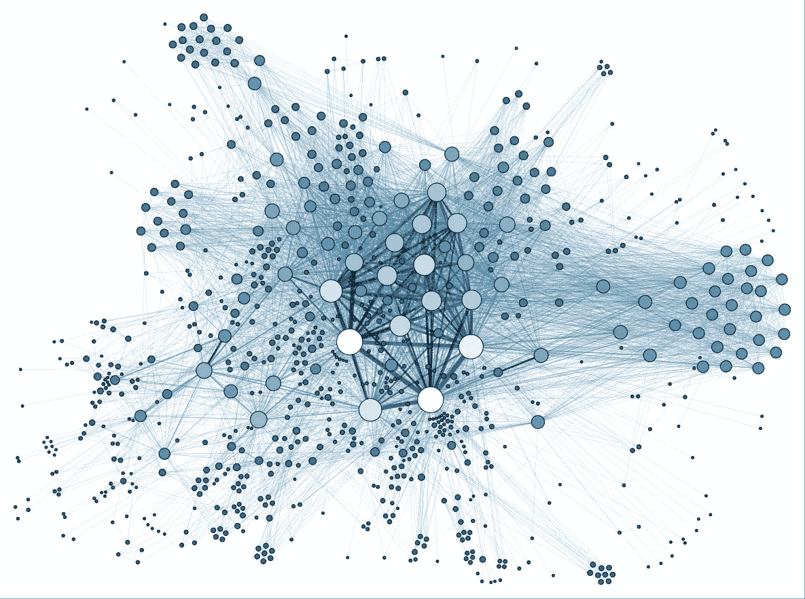

# 接近分布式系统

> 原文：<https://betterprogramming.pub/approaching-distributed-systems-958d9926d77b>

## 转向分布式计算时需要考虑的细微差别

从[这里](https://www.google.ca/url?sa=i&rct=j&q=&esrc=s&source=images&cd=&ved=2ahUKEwiqydLuj-riAhXCOn0KHeIWCtUQjRx6BAgBEAU&url=https%3A%2F%2Fcommons.wikimedia.org%2Fwiki%2FFile%3ASocial_Network_Analysis_Visualization.png&psig=AOvVaw0O7GyPSf_I8QCXUrFk1X9-&ust=1560641042348456)开始重复使用

# **简介**

随着像[亚马逊 AWS](https://aws.amazon.com/) 、[谷歌云](https://cloud.google.com/)和[微软 Azure](https://azure.microsoft.com/en-us/) 这样的服务从开发者手中夺走统治权，让他们更加专注于应用程序，分布式系统的抽象变得更加普遍。这些服务提供了很多好处，比如按需扩展任务和容忍网络问题。毫无疑问，这种合作依赖对双方都没有好处，但是，开发者需要调整和停止顺序思考，开始分散思考。传统思维坚持使用顺序单节点应用程序来解决当今的问题。现在不是这样的了。今天的问题涉及[呈指数增长的客户数量](https://futurism.com/by-2020-there-will-be-4-devices-for-every-human-on-earth)；用户使用多种设备，如笔记本电脑、台式机、手机、平板电脑等。在这篇文章中，我将看看开发人员在过渡到这种新的计算方式时需要考虑什么。

# **分布式系统意味着什么？**

分布式系统是一个抽象的节点网络，作为一个单一的机器。这种系统可以减少大规模数据集的计算时间，这些数据集通常会淹没单台机器并使其变得无用(根据用户完成任务的预期)。有两种类型的分布式系统:集中式和分散式系统。

在过去，并行、并发和分布式计算这三个术语在很大程度上被认为是同义词。并行计算和分布式计算在非常重要的一点上是不同的。并行计算涉及使用共享内存的进程，而在分布式系统中，每个节点都有自己的本地内存。这消除了对共享资源的显式锁定的需要。

# 抽象概念

简单的单节点计算是连续的，处理前一步之后的每一步，并在事件发生时进行处理。如果要在这个节点上同时复制和执行一个程序，那么这两个进程将在并行状态下执行(看起来——调度程序在进程之间切换如此之快，以至于看起来是并行的)。让我们不要复制这个流程，而是将这个想法放入一个[线程](https://en.wikipedia.org/wiki/Thread_(computing))到我们的[流程](https://en.wikipedia.org/wiki/Process_(computing))中。线程能够将功能从主执行序列中转移出来，并在单个进程中以看似[的并行](https://en.wikipedia.org/wiki/Parallel_computing)状态运行。这就是我们所说的[多线程](https://en.wikipedia.org/wiki/Thread_(computing)#Multithreading)编程。

我们从主流程中派生出一个流程，并使其成为子流程，而不是线程。线程和进程的区别在于，线程是调度程序可以管理的最小指令集。进程是一个更大的指令集，线程通常是它的子组件。假设我们的流程调用一个子流程，该子流程对一组数据进行操作以返回值，而我们的主流程一直在自己的时间空间中操作。

让我们更进一步。如果我们将这个子流程移动到它自己的流程中，我们现在有两个彼此独立运行的流程。这对我们没有用，除非我们认为这两个过程仍然需要通过一些信息进行交流。[进程间通信(IPC)](https://en.wikipedia.org/wiki/Inter-process_communication) ( [论文](https://link.springer.com/content/pdf/10.1007/BF01786228.pdf))是允许独立进程对一些共享数据进行操作的协议。

最后，让我们从单个节点中删除这个流程，并将其放在一个新的不同节点上。我们将需要一个新的消息传递系统，而不是通过 IPC 进行通信。这就把我们带到了[远程过程调用(RPC)](http://www.cs.princeton.edu/courses/archive/fall03/cs518/papers/rpc.pdf) 。RPC 允许我们通过网络传输控制和数据。让我们考虑一下我们的主流程及其对一个值的需求。我们的主流程将向我们的第二个节点提交一个 RPC，其中包含它希望它完成的任务以及任何必要的补充参数。一旦提交，我们的主流程可以像往常一样继续运行。一旦我们的第二个节点完成了它的任务，它将返回这个值和任何其他关于它的操作的相关信息。

两个节点并不令人兴奋。让我们假设我们的主节点是一个主节点(负责的节点),而我们的次节点以及尽可能多的节点是主节点的工作节点(计算节点)。目前，为了简单起见，让我们只考虑一个主节点(我们将在后面讨论故障)。假设我们有一个 10TB 的数据集要处理，我们的单节点视图要么崩溃，要么运行速度太慢，看起来好像已经崩溃了。这就是任务分配发挥作用的地方。我们的主节点只需要组织任务并将任务委派给工作节点，工作节点在被给予下一个任务之前返回结果。假设我们有 100 名工人；10TB 仍然是一个很大的工作量，但是它会有一个更合理的执行(这间接指的是一个[服务级别协议(SLA)](https://corescholar.libraries.wright.edu/cgi/viewcontent.cgi?article=1077&context=knoesis) )。那是一个分布式系统(在一个集中的网络上)。

## IPC 到 RPC

在上面的抽象中，我们从进程间通信的 IPC 发展到 RPC。考虑在单个节点上的进程之间利用共享内存的 IPC，我们将其与存在于不同地址空间(通常是不同的节点)中的 RPC 进行比较。调用 IPC 调用共享内存是一种分布形式，比如说两个不同的节点运行在同一个数据库/服务器上。这两个过程是不同的，但是在涉及如何允许它们继续的过程/协议的本地式网络上操作。然而，RPC 不是管理中间介质，而是用于直接与另一个进程通信以请求/发送信息。通常，调用 RPC 的进程只使用其本地内存空间，并通过通信链路传递参数。应该注意的是，事实上，RPC 可以在不同进程之间的同一个节点上使用——这样做有一些好处。

从 IPC 到 RPC 的迁移使得分布式系统设计者不再需要共享内存上的信号量和锁([和其他类型的 IPC](http://csweb.cs.wfu.edu/~torgerse/Kokua/More_SGI/007-2478-008/sgi_html/ch02.html) )。这将计算从锁步时间顺序中解放出来，并进入并发操作。到目前为止，我们已经考虑了共享内存 IPC。还有另一种涉及消息传递的 IPC。这就是 RPC 的起源。

通过网络，调用 RPC 允许调用进程在被调用方接收和处理请求时继续运行(取决于调用的性质)。这提高了分布式系统在并发进程方面的性能。

通过实现 RPC，通信的困难被消除了，剩下的就是分布式系统的困难[定时、组件的独立故障和独立执行环境的共存](http://www.cs.princeton.edu/courses/archive/fall03/cs518/papers/rpc.pdf)。

## 并发性与并行性

前面，我们提到了线程并行。然而，这不是分布式系统的工作方式，因为这些词的定义有细微的差别。分布式系统不是并行的，但它是并发的。这里概述的的区别在于，并行进程同时执行，而并发进程*以不确定的速度前进*。工作人员可能被分配计算费用不同的任务，因此对于并行操作的工作人员来说，在每一轮任务子集中，系统将被最慢的工作人员阻塞。同时，由于已经完成任务的工人可以接收新任务，工人可以更有效地操作(作为系统)，而较慢的工人(尽管仍然是限制因素)可以继续处理他们的任务。

# 分布式系统

根据定义，[分布式系统是一个完全连接的系统](https://www.geeksforgeeks.org/comparison-centralized-decentralized-and-distributed-systems/)(如果实现为图的话)。这并不总是可能的，这就是为什么有一个被完全连接的[范围可以被称为分布式系统](https://www.ibm.com/support/knowledgecenter/en/SSAL2T_8.2.0/com.ibm.cics.tx.doc/concepts/c_wht_is_distd_comptg.html)。通过结构来定义系统更像是一种商业方法。从计算上来说，分布式系统是任务的传递，以达到改进的计算性能来解决全局目标。[谷歌将](http://www.hpcs.cs.tsukuba.ac.jp/~tatebe/lecture/h23/dsys/dsd-tutorial.html)分布式系统定义如下:

> 一个*分布式系统*是一个应用程序，它执行一组协议来协调网络上多个进程的动作，这样所有组件一起合作来执行一个或一小组相关的任务。

分布式计算的好处是允许水平扩展。[水平扩展](https://github.com/vaquarkhan/vaquarkhan/wiki/Difference-between-scaling-horizontally-and-vertically)是指当系统需求增加时，添加更多节点来平衡和承担增加的负载。

## 集中式分布式系统

在此从[重新使用](https://www.google.ca/url?sa=i&rct=j&q=&esrc=s&source=images&cd=&ved=2ahUKEwiPorydkOriAhUyJzQIHYbGBj4QjRx6BAgBEAU&url=https%3A%2F%2Fwww.flickr.com%2Fphotos%2Fcaseorganic%2F4396857417&psig=AOvVaw2kzv8zGkQW4jLZR3BLYkif&ust=1560641179631917)

在我们上面的例子中，集中式系统包含一个中央主节点，它代表网络上的工作人员。这仍然是一种分布式系统，因为它仍然通过网络分配工作负载，以实现更好的计算性能。

## 分散分布式系统

在分散式系统中，每个节点独立于任何主节点运行，每个节点都是独立的主节点。每个主节点可以是它拥有工作节点的集中式网络的一部分。不管子结构如何，每个节点都能够相互通信，但是如果没有严格的任务委托协议(就像在集中式系统中一样)，就需要对如何达到向网络提出的目标达成某种程度的共识。

# 运转中的系统

假设我们已经构建了我们的分布式系统，并且它已经启动并运行。在一个完美的世界中，这个系统将运行没有故障或失败。在一个完美的世界里，分布式系统的八个谬误将是真实的，一切都将是美好的:

*   网络是可靠的
*   延迟为零
*   带宽是无限的
*   网络是安全的
*   拓扑不会改变
*   有一个管理员
*   运输成本为零
*   网络是同构的

不幸的是，这不是真的。现实世界中的系统必须更加健壮，能够处理这些谬误的反面(甚至更多)。

让我们从一个正在运行并成功通信的系统开始。所有节点都在发送和接收包含值、操作和状态的消息。这种通信原则有一个一致性的概念，它解决了确保所有节点都包含与其他节点相同的信息的问题。这一点很重要，因为节点和网络链接不可靠，确实会发生故障。故障可能出现在软件或硬件中，但无论哪种情况，故障都会导致网络的其余部分无法访问某个节点。通常的做法是，如果出现故障的是节点，则重新启动节点进程。看起来很简单，但是，当节点停机并脱离网络时，环境发生了变化。如果网络链路出现故障，节点被分区，必须等待通信重新建立，也是如此。在此期间，新的值、数据和操作由它的邻居处理。这个失败的节点现在必须以某种方式赶上。已经有了适应这种情况的协议，例如 [Paxos](http://www8.cs.umu.se/kurser/5DV153/HT14/literature/chandra2006paxos.pdf) 追赶方法。故障节点需要一种方法来收集最新信息，以便与网络的其余部分保持一致。

## 一致性

如果网络的其余部分与最新信息保持一致，故障节点可以从管理协议允许的地方请求该信息。Paxos、Raft 和 2 阶段提交(2PC)是通过共识确保一致性的机制，并提供了使故障节点恢复到最新状态的方法。2PC 被称为原子提交协议(APC)，这意味着对于要提交的信息，它必须由网络上的所有对等体提交。原子承诺协议被称为“强一致性”模型，但是在共识协议中存在“弱一致性”模型。

Paxos 是一种共识协议，其中大多数节点必须就提交给历史/日志的值达成一致，Raft 通过将顺序的重要性引入提交来扩展这一点。其他协议包含所谓的“最终一致性”或“乐观复制”。这意味着，如果一个值不再被写入，那么随着连续的读取，它将最终在整个系统中传播，直到所有节点都包含这个最新的值，因此是一致的。尽管在实践中成功地使用了最终一致性，但最终一致性的问题是达到一致性所需的时间是未知的和无限的。

实现一致性的一种流行方法是使用日志(或历史)。这些日志或者在整个系统中复制(如在原子协议中),或者在大多数节点就信息达成共识时写入。当节点恢复并尝试获取系统的最新信息时，这些日志将被引用和共享。

## 有效性

通过这些故障和修复，运行的协议可以与这些节点进行通信。当一个节点不可用时，网络可能会出现以下几种情况。网络可能不再大到足以获得多数票(如 Raft 中所使用的)来达成共识，并因此停止运行，直到网络链路或节点故障被修复。不可用的节点可能会重新加入网络并变得不一致——如果不加检查，它可能会在网络上传播陈旧的信息(这就是为什么上面引入了一致性的概念)。

对节点如何重新加入网络的考虑必须实现为不中断系统操作。只要系统的其余部分是一致的，那么重新加入的节点的恢复应该相当简单，一致性一节中介绍的相同机制可以用于恢复节点。不可用节点的概念否定了系统拓扑不变的说法。在向系统添加新节点(不恢复)的情况下，可以应用恢复故障节点的相同机制来使新节点更新并可用于工作。

## 分区容差

如前所述，网络链路故障可能会发生，就像单个节点重新加入网络一样，必须考虑分区如何恢复到整个网络。有时，网络故障非常严重，会导致分区，将一个网络分成两个。提到的协议具有一旦建立就恢复整个网络一致性的机制，但是必须考虑从划分时间到网络被解析期间发生的事情。只有当分区包含大多数对等体时，Raft 协议才会继续在分区上运行。这有助于就信息达成共识。如果 Raft 中的某个分区上不存在多数，该分区将停止运行并等待恢复。但是，如果网络足够大，大多数可以存在于分区的两端，那么恢复到完整的网络就变得更加复杂。

## CAP 定理

一致性、可用性和分区容忍度的概念结合在一起就是所谓的[上限定理](https://dspace.mit.edu/bitstream/handle/1721.1/79112/Brewer2.pdf?sequence=1&isAllowed=y) (C:一致性；答:可用性；p:分区容差)。这个定理在分布式系统社区中是众所周知的，它表明在任何给定的时间，三个场景中只有两个可能存在，所以它可以是 CA、AP 或 CP 系统。近年来，随着地理上分布式数据中心的出现，CA 系统仅在小型局域网中有效，并且不支持分区。由于网络足够小，它可能不需要处理这样的故障(尽管它应该处理)。分区容差已经成为一种常见的做法，在构建分布式系统时应该加以考虑。由于系统的一致性可以帮助恢复不可用的节点，使其再次变得可用并对系统有用，因此可以认为 CAP 定理现在只是 CP 原理。

## 同质网络

如上所述，网络有多种协议(2PC、Paxos、Raft 等)和架构可供操作。然而，网络并不仅限于使用一种协议。必须考虑实现利用一个或多个协议的系统。为了解决这个问题，使用了互操作性的概念，这是一个系统在不同类型的系统之间传递信息的能力。

## 贮藏

大多数日志被写入文件，以便对重要信息进行非易失性存储。然而，I/O 操作的成本可能很高，因此大多数分布式系统都实现了缓存。缓存将重要信息保存在可以快速访问的本地内存中，同时也将这些信息写入存储。当低延迟很重要时，实现缓存可以防止性能瓶颈，从而避免整个网络超时。

## 服务水平协议

SLA 指的是消费者和提供者之间的[预期服务水平。这意味着用户期望特定的一组系统指标的某个级别得到支持，以便系统可用。这些指标可能涉及性能(任务的延迟和吞吐量)、跨节点的数据一致性、工作人员和服务的可用性、容错能力、工作人员的可伸缩性等。](https://corescholar.libraries.wright.edu/cgi/viewcontent.cgi?article=1077&context=knoesis)

## [集装箱化](http://doras.dcu.ie/20642/1/CCM-2015-Pahl-Containers-PaaS-Cloud.pdf)

随着容器技术的引入，分布式系统的实现和部署又发生了变化。容器能够承载实现的本地需求，而不需要它被部署到任何主机上。每个容器都与主机架构相隔离，并且能够通过 RPC 进行通信。因此，这不会破坏任何已经实现的基础，而是增加了对部署实现的环境的控制。这是一个轻量级的虚拟化解决方案。

# 排除故障

因为分布式系统就是分布式的，所以隔离和复制问题以确定 bug 的典型方法变得很困难。

## 记录

在分布式系统中广泛使用日志记录是解决不直观或不明显的问题的关键因素。节点可以被设计成记录故障和/或行为，这对于确定系统缺陷是有用的。这些节点可以将这些报告发送回主/客户端(尽管当这种情况发生时网络故障的问题仍然普遍存在)。

## 压型

有时问题在于系统的性能。为了考虑重构或要推出的补丁，对实现进行剖析以隔离计算成本高的区域可能证明是有用的。

# 结论

将思维模式从单一顺序计算转变为分布式并发计算需要更多地考虑伴随着分布式本质的各种设计细微差别。理解进程是如何分布的以及它们的通信能力是实现系统的基础。引入恢复和一致性机制提高了故障发生时系统的稳定性。利用技术来满足 SLA 有助于开发可用的系统。这些概念是开发人员开发分布式系统的核心。

## 附录

关于“主”节点的术语已更改为“主要”节点。功能保持不变。