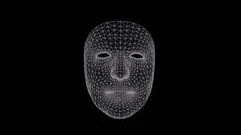
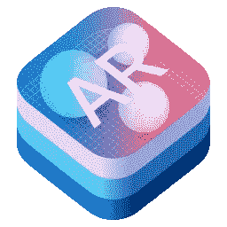
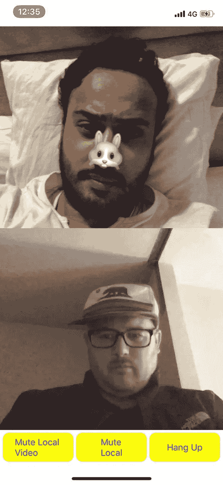

# Agora iOS 电话会议中的 AR 人脸跟踪

> 原文：<https://betterprogramming.pub/ar-face-tracking-in-an-agora-ios-conference-call-fb85b40c1fe0>

## 使用 AR 面部跟踪使多人通话比普通电话会议更具参与性


照片由 [Raxpixel](https://www.pexels.com/photo/close-up-photo-of-smiling-woman-sitting-on-sofa-using-smartphone-1919238/) 在[像素](https://www.pexels.com/photo/close-up-photo-of-smiling-woman-sitting-on-sofa-using-smartphone-1919238/)上拍摄

使用 AR 人脸跟踪来增强实时虚拟家庭聚会对话的真实性是一种虚拟实验的好方法。这也是一种很好的方式，你可以戴着虚拟的派对面具和你的朋友在网上玩啤酒乒乓，或者参与其他网络恶作剧。

# 设置 Agora 的 iOS SDK


设置 Agora 的 iOS SDK 真的很简单。核心是一个 Singleton，您可以随意使用它来实现 Agora 功能。简而言之:您在目录上运行 Cocoapods，向 AppDelegate.swift 添加一个 AppID，并添加摄像头和麦克风权限(别忘了这一步！).然后，将`AgoraRtcEngineKit`导入视图控制器，添加设置本地和远程视频的功能，加入通道，并设置代理。您可以一步一步地完成集成。

## 第一步:椰子

导航到根目录。如果你还没有酝酿好，现在就是开始的好时机。如果没有安装 Cocoapods，运行:`brew install cocoapods`。如果有，跑:`pod init`。

接下来，将以下内容添加到您的`Podfile`:

```
platform :ios, ‘9.0’
use_frameworks!
   target ‘Your App’ do
   pod ‘AgoraRtcEngine_iOS’
end
```

更新您的本地 Cocoapods 库:

`pod update`

更新 pod 后，安装:

`pod install`

打开你的应用程序:

`open YourApp.xcworkspace`

现在，添加摄像头和麦克风的权限。



## 第二步:应用程序委托和单例

在你的`AppDelegate.swift`顶部添加一个常量:

`**let** AppID = “”`

在那里加上你的`AppID`。

然后，转到您的视图控制器文件。在这里，您需要在顶部添加以下内容:

`import AgoraRtcEngineKit`

Agora 用于调用`AgoraRtcEngine`实例的`Singleton`设计模式是通过调用`sharedEngine:withAppID:delegate`方法触发的，其中`agoraKit.enableWebSdkInteroperability(**true**)`。

```
func initializeAgoraEngine() {
    agoraKit = AgoraRtcEngineKit.sharedEngine(withAppId: AppID, delegate: self)
    agoraKit.enableWebSdkInteroperability(**true**)
}
```

## 第三步:设置视频

*   启用视频:

```
func setupVideo() { agoraKit.enableVideo()
       agoraKit.setVideoEncoderConfiguration(AgoraVideoEncoderConfiguration(size: AgoraVideoDimension640x360, frameRate: .fps15, bitrate: AgoraVideoBitrateStandard, orientationMode: .adaptative) ) // Default video profile is 360P }
```

*   加入频道:

```
func joinChannel() {
    agoraKit.setDefaultAudioRouteToSpeakerphone(true)
    agoraKit.joinChannel(byToken: nil, channelId: “demoChannel1”, info:nil, uid:0){[weak self] (sid, uid, elapsed) -> Void in
    // Join channel “demoChannel1”
    }
   UIApplication.shared.isIdleTimerDisabled = true
}
```

*   调用`viewDidLoad()`中的方法:

```
override func viewDidAppear(_ animated: Bool) {           
    super.viewDidAppear(animated)

    initializeAgoraEngine()
    setupVideo()
    showJoinAlert()
}func showJoinAlert() {
    let alertController = UIAlertController(title: nil, message: “Ready to join channel.”, preferredStyle: .alert)
    let action = UIAlertAction(title: “Join”, style: .destructive) { (action:UIAlertAction) in
    self.joinChannel()
  }
  alertController.addAction(action)
  present(alertController, animated: true, completion: nil)}
```

*   代理分机:

```
extension VideoCallViewController: AgoraRtcEngineDelegate {
   func rtcEngine(_ engine: AgoraRtcEngineKit,      
   firstRemoteVideoDecodedOfUid uid:UInt, size:CGSize, elapsed:Int) {
   if (remoteVideo.isHidden) {
   remoteVideo.isHidden = false
}let videoCanvas = AgoraRtcVideoCanvas()
    videoCanvas.uid = uid
    videoCanvas.view = remoteVideo
    videoCanvas.renderMode = .hidden
    agoraKit.setupRemoteVideo(videoCanvas)
}internal func rtcEngine(_ engine: AgoraRtcEngineKit, didOfflineOfUid uid:UInt, reason:AgoraUserOfflineReason) {self.remoteVideo.isHidden = true
}func rtcEngine(_ engine: AgoraRtcEngineKit, didVideoMuted muted:Bool, byUid:UInt) {remoteVideo.isHidden = muted
    remoteVideoMutedIndicator.isHidden = !muted
    }
}
```



阿尔基特

# 电话会议

将 Agora SDK 连接到 ARKit 可以在实时电话会议中实现增强现实。正如 ARSCNView 文档中所描述的:“视图自动呈现来自设备摄像机的实时视频作为场景背景。”在我们的 AR 人脸跟踪实现中，我们将设置 ARKit 在本地而不是远程跟踪我们的人脸。

## 阿尔基特

要启用本地视频的 AR 人脸跟踪，请将本地视频方法配置到`ARSCNView()`。然后，配置视图控制器，通过以下方式检查是否支持 AR:

```
func setupLocalVideo(uid: UInt) {

        let videoView = ARSCNView()
        videoView.tag = Int(uid)
        videoView.backgroundColor = UIColor.orange

//        let videoCanvas = AgoraRtcVideoCanvas()
//        videoCanvas.uid = uid
//        videoCanvas.view = videoView
//        videoCanvas.renderMode = .hidden
//        agoraKit.setupLocalVideo(videoCanvas) self.sceneView = videoView
        self.sceneView?.delegate = self

        if isARSupported {
            let configuration = ARFaceTrackingConfiguration()
            sceneView?.session.run(configuration)
        }

        let tapGuesture = UITapGestureRecognizer(target: self, action: #selector(handleTap(_:)))
        tapGuesture.numberOfTapsRequired = 1
        self.sceneView?.addGestureRecognizer(tapGuesture)stackView.addArrangedSubview(videoView)
    }
```

要使 ARSCNView()能够显示表情符号，您必须采取一些额外的步骤。Ray Wenderlich 的博客文章详细介绍了这些步骤。

简而言之，让我们在这里回顾一下这些步骤:

*   导入 ARKit:

```
import ARKit 
```

*   添加配置:

```
override func viewWillAppear(_ animated: Bool) {
  super.viewWillAppear(animated)

  // 1
  let configuration = ARFaceTrackingConfiguration()

  // 2
  sceneView.session.run(configuration)
}

override func viewWillDisappear(_ animated: Bool) {
  super.viewWillDisappear(animated)

  // 1
  sceneView.session.pause()
}
```

*   添加网格遮罩:

```
// 1
extension Bling: ARSCNViewDelegate {
  // 2
  func renderer(_ renderer: SCNSceneRenderer, nodeFor anchor: ARAnchor) -> SCNNode? {

    // 3
    guard let device = sceneView.device else {
      return nil
    }

    // 4
    let faceGeometry = ARSCNFaceGeometry(device: device)

    // 5
    let node = SCNNode(geometry: faceGeometry)

    // 6
    node.geometry?.firstMaterial?.fillMode = .lines

    // 7
    return node
  }
}
```

*   将以下代码添加到`viewDidLoad()`:

```
sceneView.delegate = self
```

*   更新网格遮罩:

```
// 1
func renderer(
  _ renderer: SCNSceneRenderer, 
  didUpdate node: SCNNode, 
  for anchor: ARAnchor) {

  // 2
  guard let faceAnchor = anchor as? ARFaceAnchor,
    let faceGeometry = node.geometry as? ARSCNFaceGeometry else {
      return
  }

  // 3
  faceGeometry.update(from: faceAnchor.geometry)
}
```

*   添加表情符号 bling:

```
let noseOptions = ["👃", "🐽", "💧", " "]
```

*   添加表情符号节点:

```
// 1
node.geometry?.firstMaterial?.transparency = 0.0

// 2
let noseNode = EmojiNode(with: noseOptions)

// 3
noseNode.name = "nose"

// 4
node.addChildNode(noseNode)

// 5
updateFeatures(for: node, using: faceAnchor)
```

构建并运行应用程序。如果一切工作正常，那么你有一个本地视频的网格遮罩。点击它可以从表情数组中的一个元素添加一个手势！如果你需要代码库的精确副本，那么就在[的剪贴板](https://pastebin.com/0ZrSb1aX)上查看。



iPhone X iOS 上的 ARKit 网络视频通话

# ARKit 的其他面部跟踪集成

使用以下系列为您的眼睛、嘴巴或头部添加新选项:

```
let eyeOptions = ["👁", "🌕", "🌟", "🔥", "⚽️", "🔎", " "]
let mouthOptions = ["👄", "👅", "❤️", " "]
let hatOptions = ["🎓", "🎩", "🧢", "⛑", "👒", " "]
```

在您的`renderer(_:nodeFor:)`中添加详细信息:

```
let leftEyeNode = EmojiNode(with: eyeOptions)
leftEyeNode.name = "leftEye"
leftEyeNode.rotation = SCNVector4(0, 1, 0, GLKMathDegreesToRadians(180.0))
node.addChildNode(leftEyeNode)

let rightEyeNode = EmojiNode(with: eyeOptions)
rightEyeNode.name = "rightEye"
node.addChildNode(rightEyeNode)

let mouthNode = EmojiNode(with: mouthOptions)
mouthNode.name = "mouth"
node.addChildNode(mouthNode)

let hatNode = EmojiNode(with: hatOptions)
hatNode.name = "hat"
node.addChildNode(hatNode)
```

要索引这些功能，请添加以下内容:

```
let features = ["nose", "leftEye", "rightEye", "mouth", "hat"]
let featureIndices = [[9], [1064], [42], [24, 25], [20]]
```

用以下代码更新`updateFeatures(for:using:)`方法:

```
// 1
for (feature, indices) in zip(features, featureIndices)  {
  // 2
  let child = node.childNode(withName: feature, recursively: false) as? EmojiNode

  // 3
  let vertices = indices.map { anchor.geometry.vertices[$0] }

  // 4
  child?.updatePosition(for: vertices)
}
```

如果您正确地实现了本节中的代码片段，您应该能够添加眼睛、嘴巴或帽子。以下是视图控制器的代码:

ViewController 的代码库

# 下一步是什么？

AR 人脸跟踪是一种很好的方式，可以让多成员通话比一般的电话会议更活跃。如果你喜欢美容产品、服装或其他类型的购物，那么你和你的朋友可能会喜欢尝试 AR 化妆、染发、皮肤光滑、光泽、口红、牙齿美白或面部整形。有很多不同的方法可以集成 AR 人脸跟踪以实现实时互动。