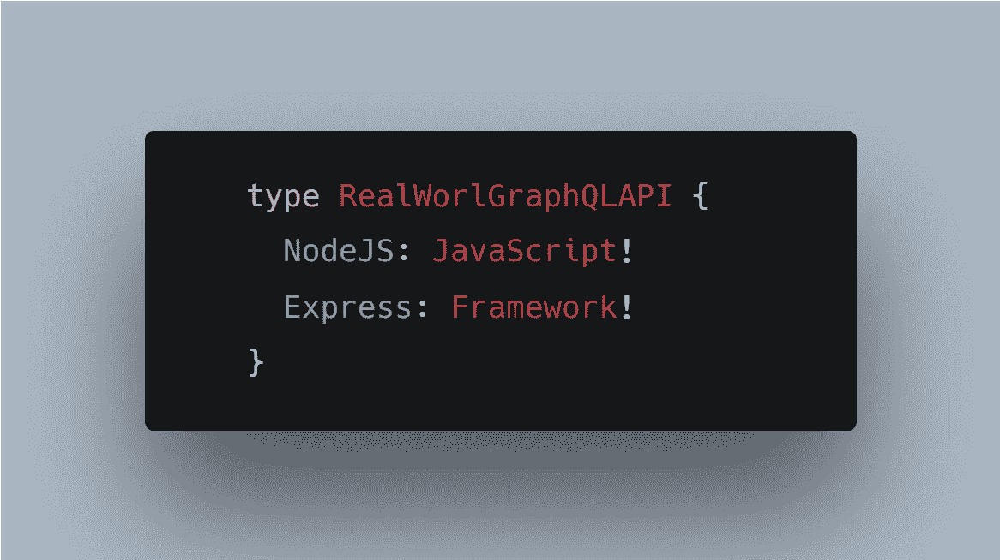
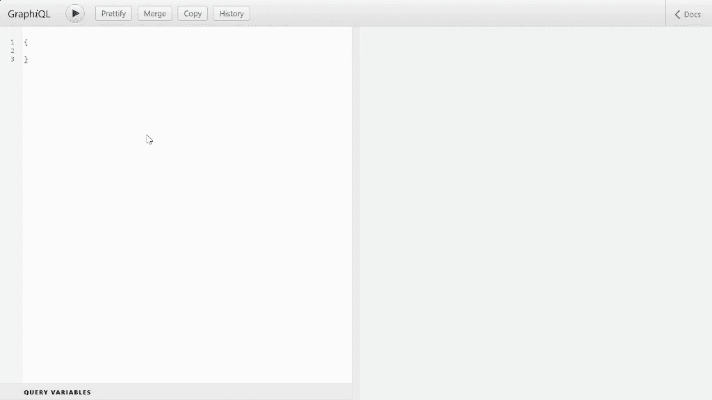

# 在 Node.js 中构建 GraphQL API 代码库

> 原文：<https://betterprogramming.pub/architecting-a-graphql-api-codebase-in-node-js-3a951cd7f0f4>

## 建立一个具有模块化和认证的 GraphQL 服务器



图片来源:作者

大多数 GraphQL 教程都没有教你如何拆分模式和解析器，就像在典型的 REST API 中模块化路由和控制器一样，也没有教你如何从`.grapqhl`文件而不是模板文本中定义和加载类型定义。我将在本教程中尝试教你这些重要的概念。

我假设您对 [GraphQL](https://graphql.org/) 及其工作原理有基本的了解。不然这个教程就没多大意义了。你可以自己随意探索[代码库](https://github.com/haseebanwar/graphql-server)，如果你想和我一起编码，那也很好。

# 初始设置

让我们从一个基本服务器开始，安装以下依赖项。

```
npm i express express-graphql graphql @graphql-tools/schema
```

*   `express`是 NodeJS 的框架
*   `express-graphql`是一个让你用 Express 构建 GraphQL API 的模块
*   `graphql`是 GraphQL 的 JavaScript 参考实现
*   `@graphql-tools/*`是一组使 GraphQL 工作更容易的包

基本 graphql 服务器

请注意，我使用的是来自`@graphql-tools`的`makeExecutableSchema`，而不是来自`graphql`的`buildSchema`，因为它限制了你的模式的功能。更多关于这个 StackOverflow 的回答。

# 要处理的数据

我们需要数据来使用 API，我将使用虚拟数据进行演示(存储在 JS 文件中)。但是无论您使用虚拟数据还是数据库，概念都是一样的。

在代码库的根目录下创建一个名为`data`的目录，并放入以下内容:

```
const authors = [
  { id: 1, name: 'J. K. Rowling' },
  // ... more authors
];const books = [
  { id: 6, name: 'Forrest Gump', authorId: 2 },
  { id: 7, name: 'The Way of Shadows', authorId: 3 },
  { id: 8, name: 'Beyond the Shadows', authorId: 3 },
  // ... more books
];exports.authors = authors;
exports.books = books;
```

如果您正在编写代码，只需将[中的数据复制并粘贴到这里](https://raw.githubusercontent.com/haseebanwar/graphql-server/master/data/index.js)。有两个实体，作者和书。作者有一套书，一本书有作者。

# 定义模块化模式

让我们在应用程序的根目录下创建两个新目录:

*   模式(用于保存作者和书籍的类型定义)
*   解析器(用于保存作者和书籍的解析器函数)

```
root
 └─ resolvers
     ├─ authors.js
     ├─ authors.js
     └─ index.js
 └─ schemas
     ├─ authors.graphql
     └─ books.graphql
     └─ index.graphql
 ├─ package.json
 └─ server.js
```

解析器中的`index.js`文件和模式目录中的`index.graphql`文件分别是所有解析器和模式的交汇点。

```
// index.graphqltype Query {
  _empty: String
  *# define any root queries here*
}type Mutation {
  _empty: String
  *# define any root queries here*
}
```

目前，我们只在类型`Query`中定义了一个空查询，因为稍后我们将在书籍和作者各自的模式文件中为他们定义查询。

请注意，GraphQL 的当前版本不允许您拥有空类型，即使您打算以后扩展它。所以我加了一个空字段。

```
// authors.graphqltype Author {
  id: Int!
  name: String!
  books: [Book]
}*# extending root query type we defined in index.grapqhl*
extend type Query {
  authors: [Author]
  author(id: Int!): Author!
}
```

类似地，书籍的模式如下所示:

```
// books.graphqltype Book {
  id: Int!
  title: String!
  authorId: Int!
  author: Author!
}extend type Query {
  books: [Book]!
  book(id: Int!): Book!
}input NewBook {
  title: String!
  authorId: Int!
}extend type Mutation {
  createBook(newBook: NewBook): Book!
}
```

为了定义模式和类型，我使用了 GraphQL 的 SDL。您还可以通过编程方式生成架构。由于 GraphQL 可以用于任何后端编程语言，所以我认为最好使用 SDL。

*如果您正在使用 VSCode，并且在您的* `*.graphql*` *文件中没有看到语法高亮/自动完成，请安装* [*正式 GraphQL 扩展*](https://marketplace.visualstudio.com/items?itemName=GraphQL.vscode-graphql) *。*

# 定义解析器

现在我们已经为书籍和作者定义了模式。是时候为作者和书籍制定解决方案了。

```
// resolvers/authors.jsconst { authors, books } = require('../data');const authorsResolvers = {
  Query: {
    authors: () => authors,
    author: (parent, { id }) => {
      return authors.find((author) => author.id === id);
    }
  },
  Author: {
    books: (author) => {
      return books.filter((book) => book.authorId === author.id);
    }
  }
};module.exports = authorsResolvers;
```

类似地，书籍解析器

```
// resolvers/books.jsconst { authors, books } = require('../data');const booksResolvers = {
  Query: {
    books: () => books,
    book: (parent, { id }) => {
      return books.find((book) => book.id === id);
    }
  },
  Book: {
    author: (book) => {
      return authors.find((author) => author.id === book.authorId);
    }
  },
  Mutation: {
    createBook: (parent, { newBook }) => {
      const createdBook = { id: books.length + 1, ...newBook };
      books.push(createdBook);
      return createdBook;
    }
  }
};module.exports = booksResolvers;
```

在解析器目录的`index.js`中，我们可以将书籍和作者解析器合并成一个对象。

```
// resolvers/index.jsconst authorsResolvers = require('./authors');
const booksResolvers = require('./books');const rootResolver = {};const resolvers = [
  rootResolver,
  authorsResolvers,
  booksResolvers,
];module.exports = resolvers;
```

这是我们正在做的事情

*   导入所有解析器(本例中为书籍和作者)
*   定义根解析程序
*   导出一组解析器(graphql-tools 会自动组合它们)

# 在服务器中注入我们的模式和解析器

最后，我们可以在`server.js`中导入模式和解析器。由于我使用`.graphql`文件进行类型定义，我将使用两个小的 graphql 工具来帮助我读取`.graphql`文件

```
npm i @graphql-tools/load @graphql-tools/graphql-file-loader
```

而在 server.js 中

带有模块化模式和解析器的 server.js

我使用 glob 模式来加载类型定义，所以`loadSchemaSync`将从`schemas`目录中加载所有的`.graphql`文件，并将它们组合成一个模式。

现在我们有了一个运行在 [localhost:5000/graphql](http://localhost:5000/graphql) 的功能性 GraphQL 服务器，我们可以执行以下查询:



演示

# 证明

向 GraphQL API 添加身份验证很简单。在`server.js`中定义`/graphql`路径之前，添加一个 express 中间件即可

带身份验证的 server.js

然后在解析器函数中，你可以

```
// resolvers/authors.jsconst authorsResolvers = {
  Query: {
    authors: (parent, args, context) => {
 **if (!context.isAuthenticated) {
        throw new Error('You are not authenticated');
      }** return authors;
    },
    author: (parent, { id }) => {
      return authors.find((author) => author.id === id);
    }
  },
};
```

# 分解剂成分

因为我们需要在每个解析器上执行认证，所以我们可以使用来自`@graphql-tools`的工具，让我们为一组查询或变化定义一个认证中间件，而不是检查用户是否在每个解析器上都被认证

```
npm i @graphql-tools/resolvers-composition
```

和

```
// resolvers/authors.js**const { composeResolvers } =
  require('@graphql-tools/resolvers-composition');**
const { authors, books } = require('../data');const authorsResolvers = {
  Query: {
    authors: (parent, args, context) => {
      return authors;
    },
    author: (parent, { id }) => {
      return authors.find((author) => author.id === id);
    }
  },
};const authenticateReq = (next) => {
  return (root, args, context, info) => {
    if (!context.isAuthenticated) {
      throw new Error('You are not authorized');
    }
    return next(root, args, context, info);
  };
};// run auth middleware for all types and all fields
// on authors resolver
**module.exports = composeResolvers(authorsResolvers, {
  '*.*': [authenticateReq],
});**
```

现在，每当您查询`auhtors`或`author(id: id_here)`时，中间件`authenticateReq`会在解析器功能之前运行，它会确保只有经过身份验证的请求才会发送到实际的解析器功能。

对于我们 API 的 books 资源，您可以遵循相同的方法。请在此查看解析器组合[支持的 glob 模式。](https://www.graphql-tools.com/docs/resolvers-composition#supported-path-matcher-format)

这是任何复杂的 GraphQL 项目的起点，但它的结构方式将帮助您轻松地维护代码，因为资源是模块化的。

感谢阅读。这里是代码库。