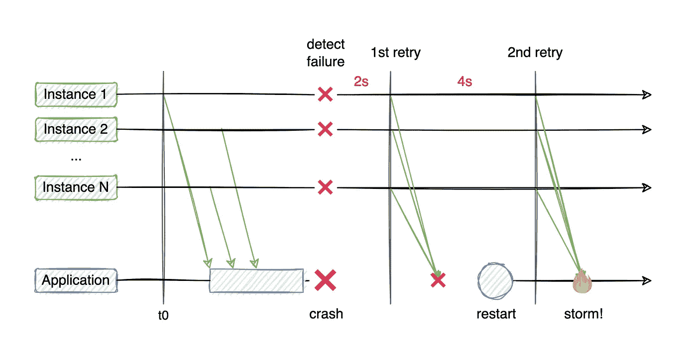
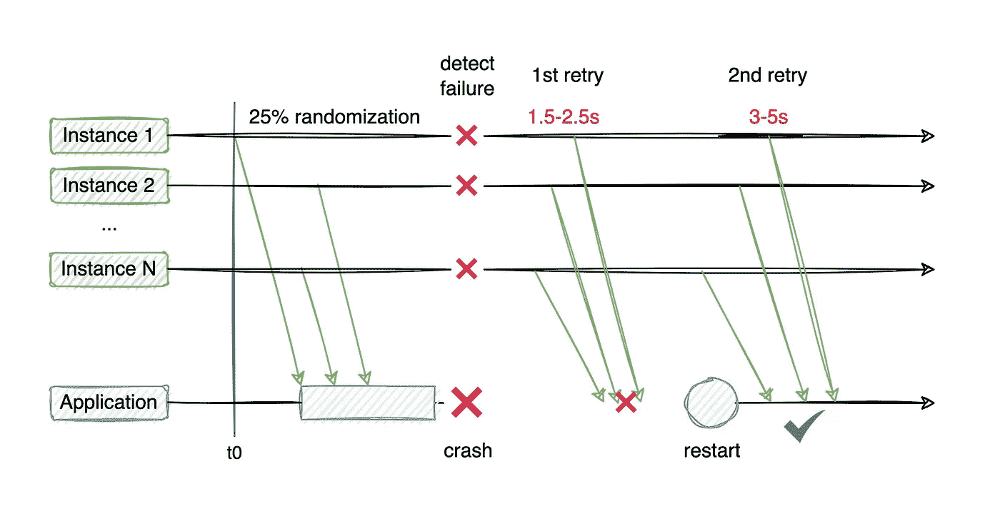
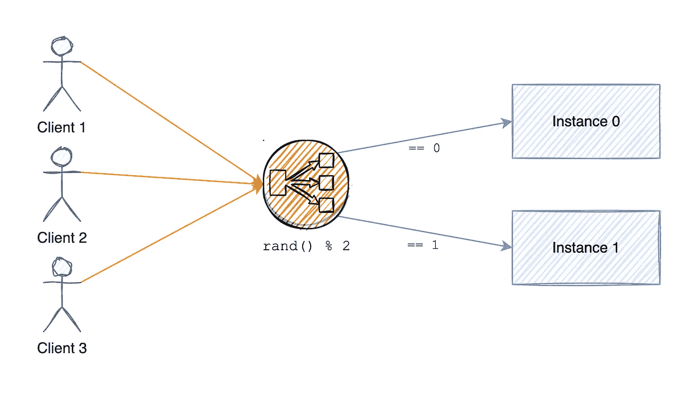
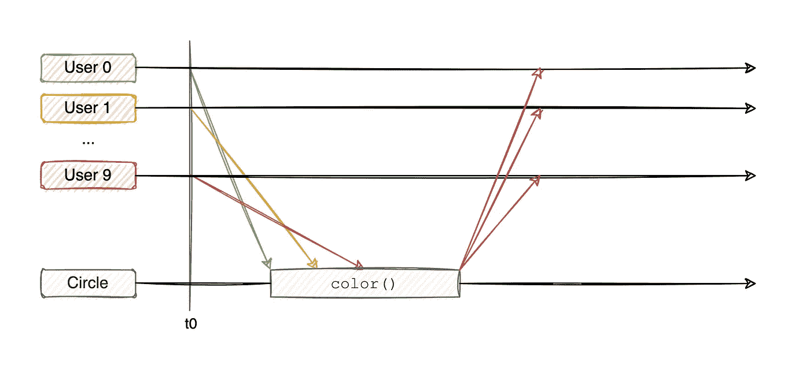
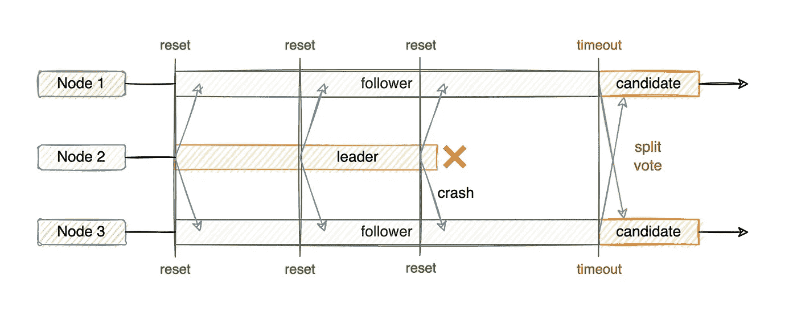

# 构建分布式系统:随机数的使用

> 原文：<https://betterprogramming.pub/architecting-distributed-systems-random-code-8db0cd9b87d1>

## 随机数生成如何支持更健壮的分布式系统的开发


不久前，我问了自己以下问题:“*我们的软件有多随机？*”。这导致了对从数据库和网络协议到基础设施和测试自动化的整个软件开发栈的解决方案的一个相当漫长而迷人的调查。在浏览了大量的文档并剖析了我过去参与的一些系统之后，我整理了一个在分布式系统中出于不同目的使用随机化的情况列表。其中一些用例非常明显，而另一些可能会让你大吃一惊。

我不打算给出诸如“掷骰子”或“选择一天中的随机引用”之类的明显用例的例子。相反，我们将探索随机数如何对常用的通用软件组件和库的功能做出贡献，以及为什么。

# 💥重试策略

当执行某个[操作的初始尝试](https://medium.com/geekculture/bulletproof-distributed-systems-how-to-fail-at-http-calls-e7f0b3240d19)失败时，比如调用另一个微服务，我们可能想要使用重试策略进行重试。重试时通常会使用以下一些策略:

*   **立即重试**:失败后立即重试一次
*   **定期间隔**:每 3 秒重试一次
*   **线性回退**:2、5、9、14 秒后重试，依此类推
*   **指数回退**:2、4、8、16 秒后重试，依此类推

虽然根据系统需求，这些策略中的一个或组合非常有用，但简单地选择一个并在系统中的任何地方使用它可能会造成危害。

想象一下，有几个实例向一个服务发出请求，这个服务在返回响应之前关闭了，关闭了所有活动的连接。指数回退策略开始生效，重试开始发生。然后，过了一会儿，服务最终重新启动，并被来自所有未能更早到达它的实例的请求淹没，所有这些同时发生，导致**连接风暴**和对新启动的应用程序的巨大压力。



无随机化的指数退避策略

在某些情况下，如果应用程序在启动时就收到大量请求的轰炸，它们可能会陷入无休止的崩溃和重启状态。这种风暴可以通过在重试间隔中添加一些随机化来防止，使它们在时间上分散开。在下面的例子中，说明了 25%随机化的好处。



25%随机化的指数后退策略

例如，Kafka 将 20%的随机化因子应用于他们的大多数政策，并结合默认的指数后退。你可以在他们的文档中读到。

# 🤖基础设施

类似地，与测试一样，拥有可重复和可预测的基础设施变更有很大的优势。然而，即使在这里，网飞和亚马逊也发现了随机化的用例。

为了确保工程师们开发出真正有弹性的软件，网飞开发并运行了 [ChaosMonkey](https://netflix.github.io/chaosmonkey/) :一种**不时随机终止应用程序**的工具。操作员可以配置终止之间的最短时间，以及终止之间的间隔，该工具将决定何时终止应用程序组的一个实例。

当这样的工具在生产中使用时，工程师在设计他们的应用程序时被迫将[故障](https://medium.com/geekculture/bulletproof-distributed-systems-how-to-fail-at-http-calls-e7f0b3240d19)考虑在内，因为它们*将*发生，而不仅仅是*可能*发生。近年来，在混沌工程学科中已经开发了大量类似的解决方案，显示了行业中不断增长的需求。

另外值得一提的是**备份和维护窗口**是随机的。通读 [Amazon DocumentDB 文档](https://docs.aws.amazon.com/documentdb/latest/developerguide/db-instance-maintain.html#maintenance-window)，我发现他们会在每个地区更大的 8 小时维护窗口内随机选择一个 30 分钟的时间段，并执行必要的软件更新。同样的逻辑也适用于创建定期备份，在每个区域的 8 小时维护窗口内，以随机的 30 分钟间隔进行备份。

# ⚖️负载平衡

通常，负载平衡器使用以下流行算法之一在组中的应用程序实例之间分配流量:

*   **循环调度**:计数器随着每个请求而递增，请求被路由到列表中的下一个实例
*   **最少连接数**:打开连接数最少的实例获得请求
*   **基于资源的**:利用率最低的实例(CPU、内存)获得请求
*   随机:一个随机选择的实例得到请求



随机负载平衡器逻辑:通过实例数量来确定路由到哪里

如果应用程序组由具有相似资源配置(CPU、内存等)的实例组成。)，随机路由策略能够均匀有效地分发请求。这是最容易实现且开销最小的方法:循环算法需要一个共享的计数器，最少连接算法需要跟踪所有打开的连接，基于资源的策略需要在每个实例上运行一个代理来报告其利用率。

在 Kafka 中可以观察到类似的行为，默认情况下，使用 randomly 将消息路由到主题分区，与所有其他可用策略相比，这导致了最均匀的分布。

# 🧪测试自动化

通常，我们希望我们的自动化测试尽可能地可重复，以便最小化外部影响和减少剥落。当我们有一个有限的可能场景列表时，100%可重复的测试通常是首选的方式，并且它不会太长。然而，在一些更复杂的用例中，当可能的输入组合数量太大而无法手工覆盖时，生成一堆测试场景可以帮助更好地识别问题。例如，随机生成的测试可以用来识别**竞争条件**。

当两个或多个进程试图同时修改相同的数据时，就会出现竞争情况，并且我们无法控制操作的执行顺序。假设我们正在开发一个协作绘图应用程序，10 个用户几乎同时在画布上尝试给一个圆着色。该系统有一个简单的规则:*最后一次写操作赢得*，我们希望确保无论发生什么，所有 10 个用户最终都会观察到最后一次修改的结果。



多个用户同时修改同一资源—最后写入的用户胜出

确保无论 10 个用户以何种顺序执行操作，最后一个用户总是获胜的方法之一是为每个输入案例编写场景。但是，它会导致 10！= ~3.6M 组合。

不运行所有这些场景，可以随机生成 1000–10000 个可能的输入组合，并评估每个用户最终是否观察到预期的结果。虽然我们不会涵盖大约 360 万种可能的组合中的每一种，但几千次运行通常足以检测出可能的问题。

值得注意的是，虽然生成的测试有助于检测有关竞争条件的问题，但它们有点像一把双刃剑，应该小心使用:运行数千个场景有时会产生不可靠的结果，并且根据运行这些测试所需的基础设施，最终会在资源和时间方面耗费大量资源。

# 🤝共识协议

共识协议用于确保两个或多个应用程序能够以容错方式就一个共同的值达成一致，这意味着只要大多数节点处于运行状态，群集就可以保持运行。Raft 是一种流行的共识算法，广泛用于分布式系统中的领导者选举。领导者选举是大多数分布式系统的核心，包括 Kafka、Riak 和许多其他系统。

在 5 个节点的集群中，Raft 允许集群中的节点使用投票机制选举一个领导者，结果正好是一个领导者和四个追随者。然后，领导者负责每隔几秒钟 ping 一次每个追随者节点，重置他们的选举超时。如果跟随者节点在选举超时内没有收到 ping，它就认为领导者已经不在那里了。然后，它成为候选人，开始投票过程，并保持这种状态，直到选出新的领导人。

然而，如果领导者崩溃，所有追随者节点同时超时，他们将同时成为候选人，并开始为自己投票，这使得很难选出一个领导者，因为所有节点都将为自己的权利而斗争。



多个追随者节点轮流成为候选人并同时开始选举

Raft **将选举超时**随机化，以减少多个节点同时成为候选节点的机会。相反，单个节点将超时，赢得选举，然后成为领导者，并在任何节点超时成为候选人之前开始 win 其他节点。

为了更完整地解释 Raft 是如何工作的，我推荐观看[这个短视频](https://youtu.be/6xwMIYBp944)或者[查看他们的网站](https://raft.github.io/)。

# 摘要

我们已经探讨了软件堆栈的不同部分如何在其功能核心利用随机数生成，或者提高其性能和可靠性。其中一些知识可以在编写软件时直接应用，例如重试策略，而其他的只是有趣地了解一下，除非你自己正在开发一个分布式共识协议。

本文有意忽略了密码学、惟一 ID 生成、数据库和蒙特卡罗模拟中的某些用例，只是因为它们非常广泛，需要专门的工作来解释。

您可能有兴趣查看我在本系列中关于 [API 故障](https://medium.com/geekculture/bulletproof-distributed-systems-how-to-fail-at-http-calls-e7f0b3240d19)和[幂等性](/architecting-distributed-systems-the-importance-of-idempotence-138722a6b88e)的其他部分。

```
**Want to Connect With the Author?**Check out [konarskis.com](https://konarskis.com/).
```