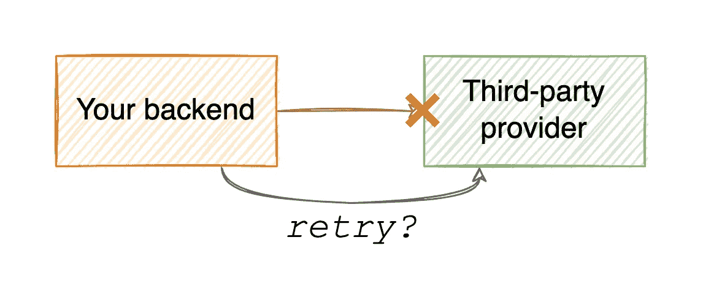
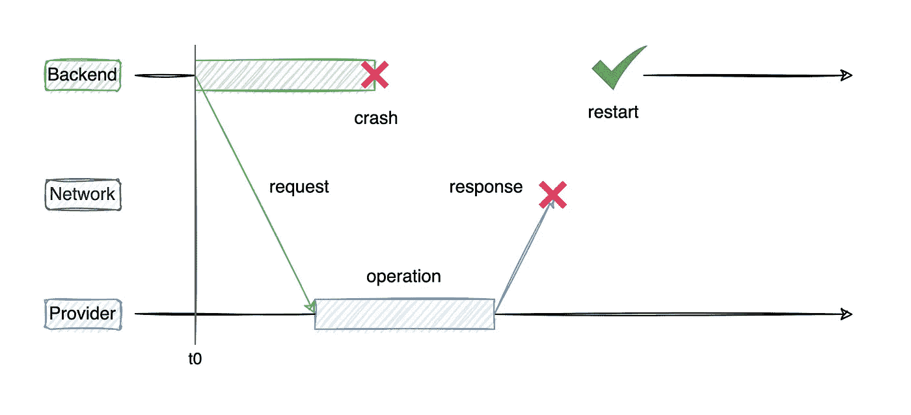
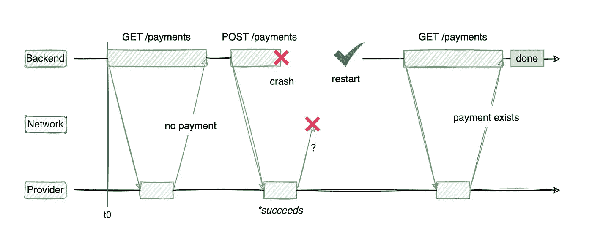
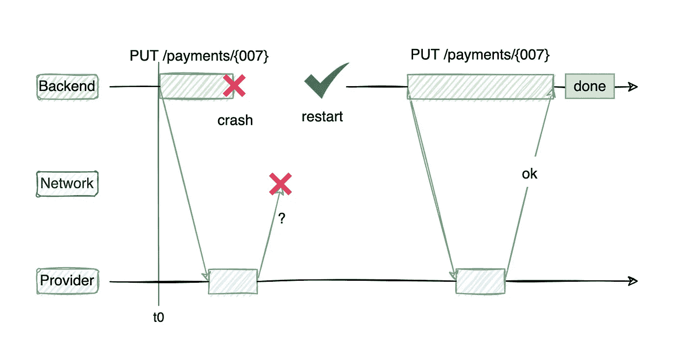

# 构建分布式系统:幂等性的重要性

> 原文：<https://betterprogramming.pub/architecting-distributed-systems-the-importance-of-idempotence-138722a6b88e>

## **幂等系统如何允许更简单和更少浪费的软件集成的图解说明**



作者图片

幂等性(如果你愿意，也可以称之为*幂等性*)是一个操作的特征，比如一个 HTTP 端点或一个 RPC 调用，允许多次执行它并观察到相同的结果，就好像操作只应用了一次一样。

换句话说，当与另一个系统(如第三方支付提供商)集成时，您希望能够不止一次地请求相同的支付，但您希望提供商只转移一次资金。

一个显而易见的问题是:为什么有人会不止一次要求相同的付款？在理想的情况下，通常在 99%以上的情况下，您的系统、提供商、网络和其他一切都工作正常，并且操作在第一次尝试时成功完成。但是，如果出现问题，并且您不确定操作的结果，您可能需要重试，再次提交相同的付款请求。这种情况在我的关于 API 失败的文章中有详细的解释，如果你还没有接触过集成，我强烈推荐你阅读这篇文章，因为它有助于理解本文的其余部分。

为了充分理解幂等运算的价值，我们将比较两个假想的支付提供商的集成工作:第一个不是幂等的，第二个是幂等的。我们的要求保持不变:

*如果操作过程中系统的任何部分出现故障，并且我们不知道操作是否成功，我们应该能够重试操作，直到操作成功，并且操作必须恰好执行一次*。

为了模拟这个场景，我们将假设我们的服务器在发送请求之后*崩溃，但是在*收到来自第三方系统的响应之前*崩溃。在我们的服务器重新启动后，我们希望确保只有一次支付成功执行。*



注意:如果我们不知道执行是否成功，或者如果我们有理由相信故障是暂时的，我们必须重新启动。如果提供者用一个`400: bad request`来响应，重试没有任何帮助，我们必须使操作失败。

# 与非幂等系统集成

让我们集成一个非幂等系统，并尝试使它对故障有弹性，满足我们最初的要求。这里有一个我们必须集成的非幂等 API:

```
POST /payments
{
  "from": "sender@email.com",
  "to": "recipient@email.com",
  "amount": 120
}
```

每次我们向`/payment`端点发出 POST 请求时，支付提供商都会尝试将指定金额的钱从发送方转移到接收方。

由于我们的服务器在等待响应时崩溃，并且我们不知道第一次尝试的结果是什么(支付可能实际上已经成功)，我们不能再次调用同一个端点，因为这样我们就冒着进行两次支付而不是一次支付的风险。首先，我们需要弄清楚我们之前执行支付的尝试发生了什么。这意味着提供者需要公开至少一个以上的端点，列出已经执行的过去的支付，以便我们检查是否应该继续 POST 调用:

```
GET /payments
```

在我们这边，现在我们需要在每次尝试调用 POST 端点之前调用这个端点，而不仅仅是为了重试。这是因为，如果不对我们的系统进行任何额外的修改(例如，在呼叫第三方提供商之前坚持所有的支付尝试)，我们就无法判断我们是第一次尝试还是再次尝试相同的支付。这导致我们执行一次支付所需的 API 调用增加了 2 倍，但看起来它解决了双重执行的问题！



…或者是吗？

上面的内容在理论上看起来很好，一次只有一个后端实例试图调用提供者…但是现实总是这样吗？如果用户打开了两个浏览器标签，并试图在几乎相同的时间从这两个标签中查看同一个购物车，会怎么样？很有可能,`GET /payments`请求会对我们的两个并行流程产生相同的响应，并且两个流程都会继续尝试并执行`POST /payments`调用，这可能会导致两次支付而不是一次。不理想。

有多种方法可以解决这个问题，但是所有这些方法都依赖于使自然的异步过程同步，比如一次从几个浏览器窗口进行 API 调用。我们可以用单线程处理所有请求，使用锁，将所有尝试保存在数据库中，或者使用一些其他的魔法来防止相同支付的并行执行。

虽然这肯定是可能的，但它增加了复杂性，需要仔细维护和彻底测试。在这个阶段，我们已经满足了我们的需求，但是我们需要使用一个额外的 API 调用和某种同步机制来防止相同支付的并行执行。此外，我们的整体性能可能会受到这些增加的影响。

让我们看看这个开销是否可以避免。

# 与幂等系统的集成

下面是我们的等幂支付提供商 API 的样子:

```
PUT /payments/{payment_id}
{
  "from": "sender@email.com",
  "to": "recipient@email.com",
  "amount": 120
}
```

如您所见，有两个显著的区别:

1.  用 PUT 代替 POST
2.  附加`payment_id`参数

POST 和 PUT 的主要区别在于，PUT 应该是幂等的，而 POST 应该在每次被调用时创建一个新的资源。更详细的解释可以在[这里](https://restfulapi.net/rest-put-vs-post/)找到。

额外的`payment_id`参数充当我们的幂等键，用于唯一地标识支付，允许提供者在我们不止一次调用 API 的情况下删除重复的请求。这确实使我们有必要**生成这个唯一的 id** ，尽管在某些情况下这可能是有挑战性的，并且这个逻辑将取决于用例。在我们的情况下，我们可以假设用户 id 和购物车 id 的组合唯一地标识了一个付款请求。如果您正在与电子邮件提供商集成，作为一个选项，这可以是发件人、收件人列表和主题的散列。



这样的端点允许我们多次尝试执行相同的操作，直到得到成功的响应，而不必担心并行执行或额外的支付成功检查。因此，我们可以编写更少的生产代码，更少的测试代码来覆盖生产代码，并且睡得更好。

额外提示:当重试此类操作时，建议在超时中添加一些随机化。我在我的关于分布式系统中随机数的文章中解释了原因。您可能还想将重试逻辑封装在客户端库中，以简化集成，正如关于[客户端库如何提高系统可用性的文章](/architecting-distributed-systems-increasing-availability-using-client-libraries-b4763d4d74c9)中所解释的那样。

# 结论

我希望这个例子显示了与幂等系统集成是多么容易。作为一名开发人员，花一点时间来欣赏这些令人愉快的 API，如果您自己正在开发一个 API，那么尽可能使它幂等。

```
**Want to Connect With the Author?**Check out [konarskis.com](https://konarskis.com/).
```