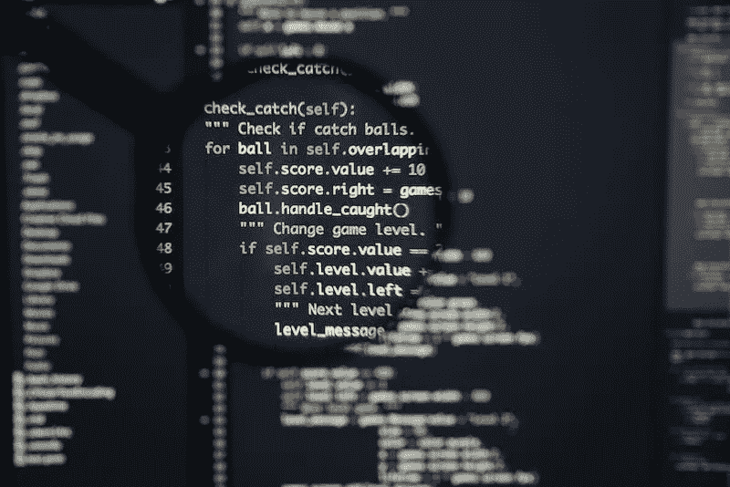

# 设计 Django 软件项目

> 原文：<https://betterprogramming.pub/architecting-django-software-projects-dfe20238bfb2>

## 关于如何组织和构建 Django 项目的一些经验教训

软件项目的架构是其长期成功的定义点。如果架构没有很好地定义，维护会变得越来越困难，实现新功能会变得很麻烦，并且需要重写应用程序的大部分。

在本文中，我将快速地谈谈这些年来为了更好地组织 Django 项目而学到的一些经验。这里有些东西适用于任何软件项目，但我会不时地添加一些 Django 特有的建议。

这远不是一个权威的指南，因为其中一些主题可以很容易地扩展成多篇文章(或者甚至是书籍！)但它应该提供思考的食粮。

# 独立的应用程序

Django 鼓励你将你的代码分成不同的应用程序。这不是偶然的，因为这对于保持您的应用程序精简和易于使用是绝对必要的。

当研究您正在进行的项目的需求时，您应该采取的第一步是将相关的功能组合在一起，同时在不相关的部分之间划出清晰的界限。这些独立的部分将在您的应用程序中组成不同的 Django 应用程序。

重要的一点是，应用程序应该**完全独立**，它们之间没有直接引用。根据经验，**一个应用程序应该永远不需要直接从另一个应用程序导入模型**。如果一个应用程序需要与另一个应用程序交互，它应该通过调用在另一个应用程序中实现的一些助手功能来实现(或者更好的是，使用[信号](https://docs.djangoproject.com/en/4.0/topics/signals/)来处理应用程序之间的通信)。

这应该使每个应用程序的内部与外界隔离，使你更容易在不破坏应用程序无关部分的情况下进行修改。

# 将模型逻辑与视图分离

Django 使用模型-视图-模板范式(MVT)，这是模型-视图-控制器范式(MVC)的一个微小变化。这种架构模式鼓励您将前端代码与应用程序的内部逻辑分开。然而，将模型和视图逻辑混合在一起是非常容易的。

总的来说，视图应该负责解析来自前端应用程序的任何数据。这意味着将字符串转换为日期，验证参数，并在必要时返回用户友好的错误消息。另一方面，它不应该负责操纵模型实例、修改它们的属性或运行查询。

您的视图代码应该精简和简单，唯一的目的是准备应该发送到后端逻辑的参数。您的后端逻辑可以由[自定义管理器方法](https://docs.djangoproject.com/en/4.0/topics/db/managers/#custom-managers-1)或您自己的类和函数来执行，然后它们将操纵模型实例并运行查询。

这使得您的后端逻辑与外部世界屏蔽开来，使您能够重用它，不管它是如何被访问的。例如，您可以拥有一些由使用 Django Rest 框架的 REST 端点触发的逻辑，并在使用 Django 表单接收输入的其他地方重用相同的逻辑。在给你这种灵活性的同时，编写精确的测试也变得容易多了。

# 隔离依赖关系

每当向项目中添加依赖项时，您都应该认真考虑。库增加了应用程序的脆弱性，因为你将依赖于不是由你或你的团队编写的代码，而你可能并不熟悉这些代码。一个今天看起来很有前途的库可能被它的作者落满灰尘，留给你一个未解决的 bug。

然而，这并不意味着您应该完全反对向项目中添加依赖项。毕竟，每次都从头开始构建并不是最明智的决定。在快速为你的应用添加功能和确保你的应用能够平稳发展之间有一个很好的平衡。

一般来说，每当我需要向一个项目添加一个依赖项时，我首先会研究我需要解决什么以及库如何解决它。这意味着浏览库的文档**和源代码**。如果我看到库解决问题的方式足够简单，我会自己实现它。如果没有，我将检查这个库是否有足够多的维护者，以及它的源代码是否组织良好。

然后，当您决定确实需要将一个依赖项添加到项目中，并且没有简单的方法绕过它时，如果您需要替换它，还有另一个技巧可以让您的生活更轻松。诀窍是将库与应用程序的其余部分完全隔离开来。

例如，假设您需要一个库来向移动设备发送推送通知。不要在需要发送通知时直接导入库，而是定义一个自己的类或函数，其唯一目的是发送推送通知(理想情况下是在自己负责处理推送通知逻辑的应用程序中)。然后，在整个应用程序中调用这个函数。

如果有一天这个库被弃用了，或者一个令人讨厌的未解决的 bug 出现了，您可以简单地用另一个库替换它，甚至编写自己的实现，而不必修改任何应用程序逻辑。这是一个由 [*清洁架构*](https://blog.cleancoder.com/uncle-bob/2012/08/13/the-clean-architecture.html) 所宣扬的概念的简化版本(根据项目的不同，这可能有些矫枉过正，但是你绝对应该深入研究一下)。

这种策略并不新鲜，Django 自己在处理不同的[数据库后端](https://docs.djangoproject.com/en/4.0/ref/databases/)、[电子邮件后端](https://docs.djangoproject.com/en/4.0/topics/email/#defining-a-custom-email-backend)、[缓存](https://docs.djangoproject.com/en/4.0/topics/cache/#using-a-custom-cache-backend)等的源代码中都使用了这种策略。这是保护您的代码不受外界影响的可靠方法，允许您轻松地交换依赖关系。

# 测试，测试，测试

我写了一些关于如何测试你的应用程序的文章，强调测试对于你的应用程序的长期生存是多么重要是远远不够的。

即使您小心地采取了本文中的所有预防措施，也有可能在某个时候您会意识到，要实现某个特性，您需要重构一些已经运行了很长时间的逻辑。这时，写得好的测试会让你更平静地呼吸。

测试有助于确保您的应用程序在未来仍能像现在一样正常工作。每当你需要重构大部分代码时，它也会给你更多的信心。

# 结论

我认为软件架构是你永远不会停止学习的东西。阅读这样的文章可以给你一个方向，并向你展示一些你感兴趣的事情，但当你在现实世界中开始面对这些问题时，事情会变得更加复杂。

我希望我能够分享我收集的一些知识(尽管我也在不断地学习)。如果您有任何问题或其他建议，我将非常乐意倾听🙂。