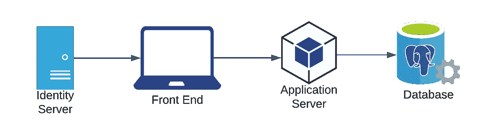

# 使用 Auth0 设计 SaaS 应用程序。NET Core 和 Postgres

> 原文：<https://betterprogramming.pub/architecting-saas-applications-with-auth0-net-core-and-postgres-562744ca7cbe>

## 考虑多租户的构建指南

由 [Kelvin Ang](https://unsplash.com/@kelvin1987?utm_source=medium&utm_medium=referral) 在 [Unsplash](https://unsplash.com?utm_source=medium&utm_medium=referral) 上拍摄的照片

Salesforce、Slack 和 Shopify 的共同点是什么？

他们都是建立在多租户 SaaS 软件基础上的一批非常成功且不断成长的公司的一部分。在我写这篇文章的时候，这三家上市公司的[市值](https://www.investopedia.com/terms/m/marketcapitalization.asp)已经超过 5000 亿美元。

但是什么是 SaaS 软件呢？什么是多租户？这些概念是如何驱动如此成功的企业的？

为了回答这些问题，我们将从分解 *SaaS* 和*多租户开始。*

> “软件即服务(或 SaaS)是一种通过互联网交付应用程序的方式——即服务。您只需通过互联网访问软件，而不是安装和维护软件，将自己从复杂的软件和硬件管理中解放出来。”— [销售队伍](https://www.salesforce.com/in/saas/)

SaaS 是通过互联网交付的即用型软件。用户通常需要支付一定的费用才能使用和访问该软件。

另一方面:

> “多租户是一种软件架构，其中单个软件实例可以服务于多个不同的用户组。[软件即服务](https://www.redhat.com/en/topics/cloud-computing/what-is-saas) (SaaS)产品是多租户架构的一个例子。”— [红帽](https://www.redhat.com/en/topics/cloud-computing/what-is-multitenancy)

多租户是一种模式，在这种模式下，一个应用程序的实例可以服务于多个用户，通常称为租户。这个概念与 SaaS 密切相关。

要回答上面提出的最后一个问题，构建 SaaS 产品的进入门槛很低，并且(通常)在增加额外租户的金钱和时间方面的成本非常低。

要构建 SaaS 软件，你需要的只是一个想法和开发软件的能力。如果你自己不写代码，你可以出去雇佣开发人员来帮你写。

一旦你发现有人愿意为你的想法买单，把他们作为租户加入你的应用程序的成本通常可以用几美元或者更少来衡量。假设您有自助注册流程，这些租户也可以非常快速地添加。

所有这些都使得 SaaS 的企业有能力快速发展。

记住这个背景，让我们在构建 SaaS 应用程序时考虑更多的技术问题。

# 多租户架构

设计和实现一个能有效处理多个租户及其数据的应用程序绝非易事。

有许多事情需要考虑，包括以下内容:

*   **数据安全和隔离** —数据必须安全存储，并与其他租户的数据隔离(逻辑上或物理上)
*   **认证和授权** —用户需要能够登录并拥有适当级别的访问权限来使用应用程序
*   **优化性能/可扩展性** —因为系统可能会经历快速增长的使用率，所以它必须能够快速高效地扩展以满足需求
*   **处理升级** —部署新功能应该相对容易
*   **控制成本** —随着应用程序的增长，基础架构成本应降至最低
*   **自助服务和定制** —不同的租户会有不同的要求，因此从一开始就内置可定制性非常重要
*   **法规遵从性和治理** —如果您处于高度管制的领域(医疗保健、政府等)。)，将有适用于您的应用程序的附加规则

我们将主要关注上述考虑事项中的数据安全性/隔离、身份验证/授权、管理利用率和控制成本。

现在我们已经了解了多租户应用程序应该具备的一些特征，让我们来看看我们将要构建的系统级图表:

系统图

为了简单起见，我们将我们的应用程序建模为一个基本的三层架构。

这种架构的一般流程如下:

1.  前端代码([反应](https://reactjs.org/)、[角度](https://angular.io/)等。)将根据用户凭证从身份服务器请求并接收一个 [JWT (JSON Web 令牌)](https://jwt.io/introduction)
2.  前端代码将提供这个 JWT 作为[承载令牌](https://swagger.io/docs/specification/authentication/bearer-authentication/)来认证对应用服务器的任何请求
3.  然后，应用服务器将验证/解析 JWT，并从数据库返回适用的数据

虽然您可以选择使用(或构建)任何您想要实现该架构的工具集，但我们将使用以下工具:

*   [***Postgres***作为我们的数据库](https://www.postgresql.org/)
*   [***auth 0***](https://auth0.com/)*作为我们的身份服务器*
*   *[***。NET Core***](https://github.com/dotnet/core) 作为我们的应用服务器*

*我们将省略对前端工具的详细讨论，因为这里不会包含太多的多租户逻辑(尽管我们将在 Auth0 一节中触及)。*

*然而，如果您选择在应用程序中使用 React 或 Angular，那么 Auth0 有一些用于实现客户端登录的优秀文档，可以在这里找到[这里找到](https://auth0.com/docs/quickstart/spa/react/01-login)和[这里找到](https://auth0.com/docs/quickstart/spa/angular/01-login)。*

*现在，让我们从数据库开始，看看如何在架构的每一层实现多租户。*

# *Postgres*

*数据库是设计多租户应用程序时首先要关注的领域之一。正是在这一层，每个租户的数据在逻辑上或物理上都是分离的。*

*当考虑数据隔离和安全需求时，这是关键。此外，经过深思熟虑的数据设计是任何成功应用程序的关键。*

*说到实现，对于关系数据库，我们可以采用三种主要方法:*

1.  *一种**“每租户数据库”**方法*
2.  *一种**“每租户模式”**方法*
3.  *一种**“共享模式”**方法*

*选择哪种方法适合您的体系结构在很大程度上取决于业务需求。每一种都有适合某些用例的属性，但不适合其他用例。*

*让我们更深入地看看这些利弊。*

## *每个租户的数据库*

*在这种方法中，每个租户都有自己独立的数据库服务器。这意味着添加的每个租户都需要一个物理数据库来存储他们的数据。*

*赞成的意见*

*   *提供最高级别的数据隔离*
*   *它在概念上简单易懂*
*   *针对特定租户执行数据迁移非常容易*
*   *可以为每个租户定制数据模型*

*骗局*

*   *就基础设施而言，这是迄今为止最昂贵的方法*
*   *硬件资源没有得到有效利用*
*   *管理开销随着规模迅速增加*

*假设你在一个高度监管的领域，如医疗保健或金融。在这种情况下，由于法规要求，您可能别无选择，只能使用这种方法。*

*这种方法开始起来很简单，但是扩展性不好。维护的资金成本和工程时间随着系统中租户数量的增加而线性增长。*

*因此，如果您只希望有几个租户，这种方法可能行得通。否则，这种设计模式可能难以大规模支持。*

## *每租户模式*

*在这个场景中，应用程序中的所有租户共享同一个数据库服务器。但是，每一种都有自己逻辑上独立的模式。每当有新的租户加入时，都必须为该租户创建新的模式。*

*赞成的意见*

*   *提供相当多的逻辑数据隔离*
*   *比每租户数据库更高效地利用资源*
*   *因为硬件是共享的，所以更便宜*
*   *允许在每个租户级别进行更多定制*

*骗局*

*   *仍然需要大规模的工程开销*
*   *可能无法为某些用例提供足够的数据隔离*

*这是数据库多租户的中间选择。*

*唯一的主要缺点是管理可能有成百上千个模式的数据库。需要为所有租户进行的任何数据/模式迁移都必须在每个单独的模式上执行。*

*如果您只打算有几个租户，这不是太大的问题。*

*如果您的租户有安全意识，但没有任何需要单独数据库的法规要求，这也是一个不错的选择。*

*同样，大规模支持这种数据库架构可能会很困难(尽管没有每个租户支持一个数据库的方法那么困难)。*

## *共享模式*

*这最后一个选择或多或少是一种“共享一切”的方法。*

*每个租户的数据都驻留在同一个数据库中，在同一个模式中，甚至在同一个表中。将一个租户的数据与另一个租户的数据区分开来的方面是包含了一个**鉴别器列。***

*例如，这个列称为`TenantId`，用于指示表中的哪些行属于哪个租户。*

*赞成的意见*

*   *最有效地利用资源和最低成本的选择*
*   *最简单的工程管理开销*
*   *可以轻松地在租户之间共享桌子*
*   *最快的租户入职*

*骗局*

*   *最低级别的数据隔离*
*   *为单个租户定制数据模型非常困难/不可能*
*   *如果表变得太大，所有租户的性能都会受到影响*

*这是一个小型团队构建多租户应用程序的流行方法。*

*这是因为这是最便宜的选择，并且当应用程序增加租户时，需要维护的工程工作量最少。*

*另一方面，注重安全性的租户可能对这种方法提供的数据隔离级别有问题。此外，您必须在应用程序/API 层投入更多，以确保租户只能访问他们自己的数据。*

*出于本文的目的，我们将采用这种方法，因为对于各种各样的应用程序来说，这是一个极好的选择。*

*所以我们在数据库中建立了一个模式。*

*让我们看一个模式-模式设计的例子，我们可以用它来构建一个简单的多租户电子商务平台:*

*使用此模式，我们可以执行以下操作:*

*   *通过向`tenant`表添加记录，向我们的应用程序添加新的租户*
*   *允许每个租户使用`product`表列出产品(该表包含对`tenant`表的外键引用)*
*   *使用`product_image`表将图像与产品关联起来(该表包含对`product`表的外键引用)*

*值得注意的是，`product`表中的`tenant_id`是我们的鉴别器列。这将在逻辑上隔离每个租户的数据。*

*虽然这个示例模式相对简单，但是它的概念应该很简单，可以扩展到更高级的用例。这些可以包括购买/销售产品、“购物车”系统、用户管理、财务报告等。*

*如前所述，这种方法不能提供与我们其他数据库设计(每租户数据库、每租户模式)相同级别的数据安全性和隔离。但是，它具有成本/资源效率，对于小型团队来说易于管理，并且使添加新租户和扩展变得简单。*

*此外，假设我们需要在租户之间共享一个表(例如，共享管理员的列表)。用共享模式设计实现这一点，在数据和 API 层需要较少的逻辑。*

*同样，哪种方法适合您的应用的答案是**这取决于具体情况。**务必根据您独特的业务需求评估每种方法的利弊。*

*讨论完数据库层后，让我们继续处理身份。*

# *Auth0*

*毫无疑问，**身份**可能是构建 SaaS 应用程序最具挑战性的部分之一。密码学、 [OAuth 2.0](https://oauth.net/2/) 、 [OpenID Connect](https://openid.net/connect/) 等概念。，理解和正确实施起来都很复杂。*

*因此，在构建应用程序时，首先要做出的决定之一是构建身份服务还是使用[身份即服务(IDaaS)平台](https://www.okta.com/identity-101/idaas/)。*

*构建自己的身份服务当然有优势，首先是可定制性。当您开发自己的产品时，您可以根据应用的具体需求进行定制。从短期来看，这也是一个更便宜的选择。*

*但是，这种方法也有明显的缺点，包括以下几点:*

*   *这里不太安全*
*   *额外的维护开销，尤其是大规模维护*
*   *它占用了本可用于构建应用程序核心功能的时间*

*和往常一样，在某些边缘情况下，构建身份服务可能是有意义的。尽管如此，如果可以的话，尽量避免这种情况，使用像 Auth0 这样的知名 IDaaS 提供商。*

*使用 Auth0，有许多不同的方法可以实现多租户。同样，您实现它的方式高度依赖于您特定的业务需求。*

*例如:*

*   *租户需要定制的登录页面吗？*
*   *用户需要登录像脸书或谷歌这样的社交网站吗？*
*   *租户需要访问他们自己的 Auth0 帐户控制面板吗？*

*为了简单起见，我们将对应用程序的要求做一些假设:*

1.  *用户只能使用用户名/密码登录*
2.  *所有用户都存在于同一个 Auth0 管理的[数据库](https://auth0.com/docs/connections/database)*
3.  *租户无需访问他们自己的 Auth0 控制面板*
4.  *用户将只属于一个租户*
5.  *我们将只有一个 [Auth0 应用程序](https://auth0.com/docs/configure/applications)和一个 [Auth0 API](https://auth0.com/docs/configure/apis)*
6.  *所有租户都有自定义子域(例如，`https://tenant1.myapplicationdomain.com`)*
7.  *所有租户通过同一个登录域(例如，`https://login.myapplicationdomain.com`)登录，没有自定义品牌*

*我们还假设已经设置了我们的 Auth0 帐户，包括一个应用程序、一个 API 和该 API 的权限/范围。*

*虽然介绍这些资源的设置超出了本文的范围，但是请务必查看 Auth0 的文档中提供的各种[快速入门指南。入门很容易，文档也很优秀。](https://auth0.com/docs/quickstarts)*

*鉴于我们已经了解了背景，让我们进入架构。*

*我们必须解决的最关键的问题是*“当用户注册/登录时，我们如何将用户与特定租户相关联？”。**

*不管实现如何，在 Auth0 [用户配置文件](https://auth0.com/docs/users/user-profiles)中有两个地方可以存储对应用程序中租户的引用。*

*这些是`[user_metadata](https://auth0.com/docs/users/metadata)` [和](https://auth0.com/docs/users/metadata) `[app_metadata](https://auth0.com/docs/users/metadata)`字段。*

*`user_metadata`字段旨在存储用户可能看到和编辑的特征。另一方面，`app_metadata`意在存储仅应用程序的信息，如权限或外部 id。*

*因此，在用户档案的`app_metadata`部分存储一个`tenant_id`更合适。正如您所料，有许多方法可以做到这一点。*

*一种方法是创建一个定制的登录页面来捕获用户注册信息，包括租户名称或 ID。然后，您可以利用自己的 API/auth 0 管理 API[来创建用户。](https://auth0.com/docs/api/management/v2)*

*另一种方法是使用默认的 [Auth0 登录页面/小部件](https://auth0.com/docs/login/universal-login)。从那里，您可以使用一个 [Auth0 定制动作在注册/登录过程中将](https://auth0.com/docs/actions/triggers/post-login/redirect-with-actions)重定向到由您的应用程序管理的页面。该页面将负责收集任何特定于租户的信息，并将其添加到用户配置文件中。*

*这些都是合理的解决方案。但是，对于我们的设计，我们将尝试做到以下几点:*

1.  *让用户体验尽可能无缝*
2.  *最小化我们负责的代码量*

*考虑到这些设计目标，我们将使用 [Auth0 通用登录页面](https://auth0.com/docs/login/universal-login)和由[登录后事件](https://auth0.com/docs/actions/triggers/post-login)触发的[自定义动作](https://auth0.com/docs/actions)。*

*通用登录页面需要最少的自定义代码/不需要自定义代码。此外，使其工作所需的集成工作量很低。它满足上面的#2，并处理各种不同的身份验证场景。*

*如果通用登录页面的默认设置不适合您的应用程序，您可以随时定制页面的[外观和代码。](https://auth0.com/docs/brand-and-customize/universal-login-page-templates)*

*另一方面，定制动作满足我们设计的需求#1。Auth0 自定义操作是版本化的函数，可以在 [Node.js](https://nodejs.org/en/) 中实现，并且可以在 Auth0 运行时的特定点执行。*

*通过挂钩 post-login 事件，我们可以在用户成功登录之后(但在他们被重定向到应用程序之前)添加定制逻辑。在我们的例子中，这个定制逻辑将执行以下操作:*

1.  *检查用户的`app_metadata`是否包含一个`tenant_id`属性*
2.  *如果是，则结束执行。否则，将适当的`tenant_id`添加到`app_metadata`*
3.  *将用户的`app_metadata`添加到 Auth0 返回的访问令牌中*

*虽然这种方法应该可行，但我们仍然需要弄清楚如何将上下文传递给登录后的操作，这将允许它确定要添加给用户的正确的`tenant_id`。*

*特定于租户的自定义子域的假设是解决方案的一部分。*

*假设我们有一个子域格式`https://{tenant_name}.myapplicationdomain.com`。通过强制租户的名称是惟一的(就像在前面介绍的数据库模式中一样)，我们可以对该名称执行数据库查询以确定一个`tenant_id`。*

*太好了！现在，我们所需要的是让我们的自定义操作知道用户试图访问什么 URL。*

*幸运的是，作为传递给登录后操作的[事件对象](https://auth0.com/docs/actions/triggers/post-login/event-object)的一部分，我们可以访问启动登录流的请求的细节。这包括 Auth0 在成功登录尝试后应该重定向到的 URL(即我们特定于租户的子域)。*

*简单地说，Auth0 要求你在登录后将特定的 URL 加入白名单。这是出于安全目的，主要是为了防止重定向 URL 被操纵将用户发送到恶意站点。*

*这也意味着我们可以对我们将用来在自定义操作中驱动多租户逻辑的`event.request.query.redirect_uri`属性有相当程度的信心。*

*让我们看看自定义操作中的代码可能是什么样子的:*

*通过这段代码，我们现在可以说明多租户用户注册和登录过程:*

1.  *用户导航到租户的子域(`https://tenant1.myapplicationdomain.com`)*
2.  *假设用户没有通过身份验证，重定向到 Auth0 通用登录页面*
3.  *用户通过默认的注册过程，提供一个电子邮件和密码*
4.  *然后，用户使用他们的凭据登录*
5.  *登录后自定义操作将执行，并将新创建的用户与正确的租户相关联*
6.  *前端从 Auth0 接收包含`tenant_id`的访问令牌，用户被重定向到租户的站点*

*从这里开始，前端的职责是将访问令牌作为承载令牌包含在对后端的每个请求中。后端是多租户逻辑的其余部分将被实现的地方。*

*所以，事不宜迟，让我们开始讨论如何在我们的后端做到这一点。*

# *。网络核心*

*对于多租户，后端职责的高级视图包括:*

1.  *验证传入请求的身份验证标头中提供的 JWT(身份验证)*
2.  *确保用户/租户有权访问适用于请求的端点(授权)*
3.  *在响应中访问并返回正确的用户/租户数据*

*为了确保数据隔离和身份验证/授权，后端必须正确执行这些操作。否则，一个租户可能会看到另一个租户的数据(这不太理想)。*

*幸运的是。NET Core framework 提供了可配置的工具来解决这些确切的情况。*

*首先，我们可以[在我们的`Startup.cs`文件中注册一个认证服务和中间件](https://docs.microsoft.com/en-us/aspnet/core/security/authentication/?view=aspnetcore-6.0)，它验证来自 Auth0 的 JWT 不记名令牌。代码如下:*

*。NET 身份验证启动配置*

*上述代码片段最重要的方面是对`services.AddAuthentication()`和`app.UseAuthentication()`的调用。*

*这些告诉了。NET 应用程序向 [DI(依赖注入)容器](https://docs.microsoft.com/en-us/aspnet/core/fundamentals/dependency-injection?view=aspnetcore-6.0)注册我们定制的认证服务，并包含[认证中间件](https://docs.microsoft.com/en-us/aspnet/core/fundamentals/middleware/?view=aspnetcore-6.0)。反过来，中间件将使用注册的服务来验证传入的请求。*

*因为我们将`DefaultAuthenticateScheme`配置为`JwtBearerDefaults.AuthenticationScheme`并添加了对扩展方法`.AddJwtBearer()`的调用，所以我们的认证中间件将在认证头中期待一个 JWT 承载令牌。*

*它还将验证它是由 Auth0 为特定的**受众**(即 Auth0 中的 API)发布的**(即发布机构)。***

*从这里开始，在我们的应用程序中向任何路由添加身份验证就像向端点或控制器添加 [AuthorizeAttribute](https://docs.microsoft.com/en-us/dotnet/api/microsoft.aspnetcore.authorization.authorizeattribute?view=aspnetcore-6.0) 一样简单。代码如下:*

*示例产品控制器*

*这将确保访问端点的用户通过身份验证，但不确保他们有权访问端点。为了做到这一点，我们必须向我们的`Startup.cs`文件添加更多的配置。*

*出于演示的目的，我们假设用户的权限编码在 JWT 的`scope`字段中。*

*需要一些自定义代码来验证这些权限。下面是代码:*

*来自 [Auth0 的 HasScopeRequirement.cs。网络核心快速入门](https://auth0.com/docs/quickstart/backend/aspnet-core-webapi/01-authorization#validate-scopes)*

*来自 [Auth0 的 HasScopeHandler.cs。网络核心快速入门](https://auth0.com/docs/quickstart/backend/aspnet-core-webapi/01-authorization#validate-scopes)*

*这两段代码将允许我们实现[基于策略的授权](https://docs.microsoft.com/en-us/aspnet/core/security/authorization/policies?view=aspnetcore-6.0)，这将由我们的授权服务和中间件来执行。*

*最后一步是将这段代码连接到`Startup.cs`文件中，如下所示:*

*。NET 授权启动配置*

*上面的代码假设应用程序中有一个`admin`类别的用户。*

*我们可以通过再次使用 AuthorizeAttribute 将对某些端点的访问限制为只有具有该权限的用户。*

*管理产品控制器示例*

*有了适当的身份验证和授权，我们现在需要一些逻辑来为每个请求返回正确的特定于租户的数据。*

*第一步是从 JWT 中提取`tenant_id`属性。这可以在控制器、[动作过滤器](https://docs.microsoft.com/en-us/aspnet/core/mvc/controllers/filters?view=aspnetcore-5.0#action-filters)等中完成。重要的是`tenant_id`在 API 的[服务和存储库层](https://exceptionnotfound.net/the-repository-service-pattern-with-dependency-injection-and-asp-net-core/)中可用。*

*当在存储库层对 Postgres 进行数据库调用时，将`tenant_id`作为请求参数之一。*

*租户使用 [LINQ](https://docs.microsoft.com/en-us/dotnet/csharp/programming-guide/concepts/linq/) 过滤产品的示例*

*通过这种方法，我们能够查询与特定租户相关的所有产品。*

*尽管这是一个简单的例子，但它可以扩展到支持更高级的概念，如分页、排序和附加过滤。*

*这就完成了在我们的应用程序中实现多租户。用户现在可以注册/登录、查看特定于租户的网站，并安全地访问后端提供的特定于租户的数据。*

# *结束语*

*虽然这种体系结构提供了一种构建多租户应用程序的建议方法，但是还有大量可能的替代方法。*

*仅举几个例子，这些备选方案受所选技术堆栈、开发人员体验和个人偏好的影响。*

*此外，在实践中构建多租户应用程序是很麻烦的。业务需求和潜在的假设很少像这个例子中呈现的那样清晰。根据我的经验，我发现身份层是大多数挑战出现的地方(但并不总是如此)。*

*也就是说，在为你的下一个 SaaS/多租户应用编写任何代码之前，你应该确保做好研究，至少有一个粗略的架构计划。关于将多租户构建到应用程序中的最佳方式，有大量优秀的资源和大量其他观点。*

*一如既往，我很乐意听到您构建 SaaS 系统的经验、最佳实践，或者对本文中使用的任何工具的想法！*

*下次见，感谢阅读。*