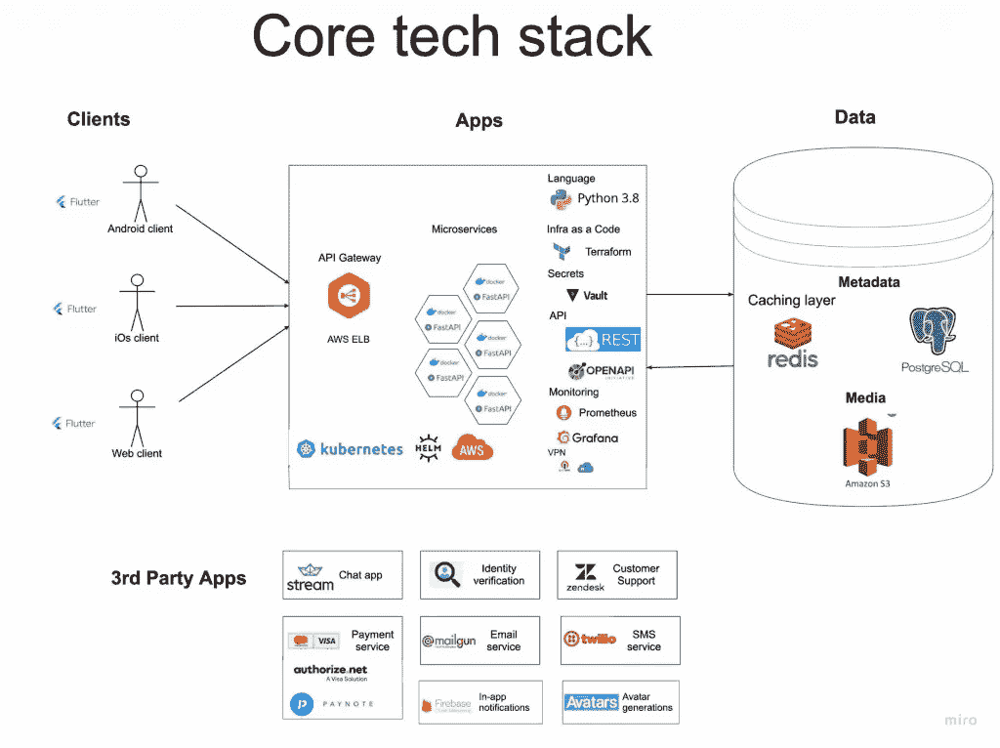
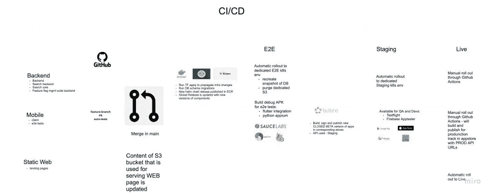
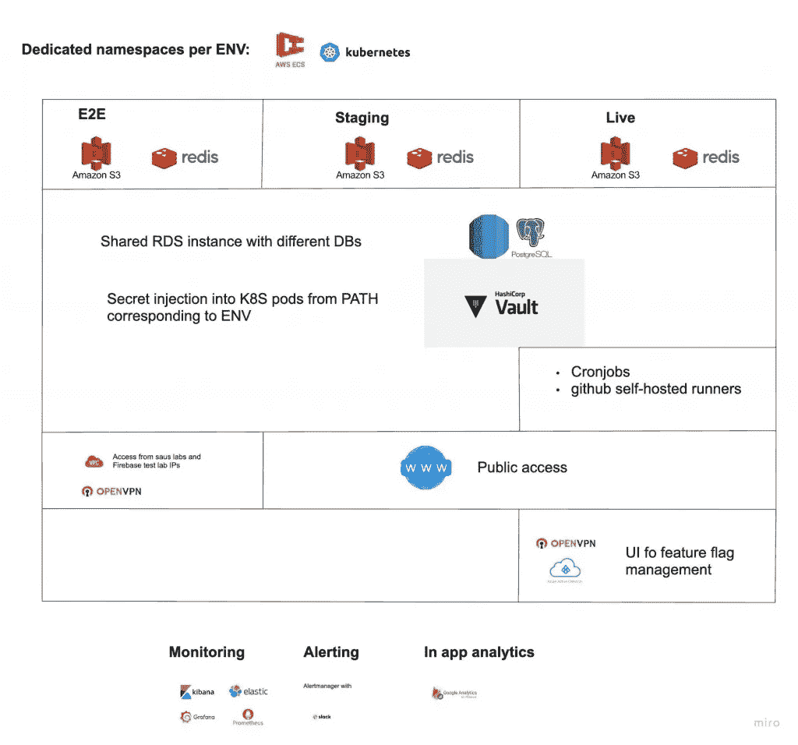

# 现代创业公司的架构

> 原文：<https://betterprogramming.pub/architecture-of-modern-startup-abaec235c2eb>

## 炒作浪潮、务实的证据与快速行动的需要

工作流程-按作者分类的所有图像

初创公司的技术层面有时会非常不稳定，包含许多未知因素。使用什么技术堆栈？哪些组件目前可能有些多余，但将来值得关注？如何平衡业务特性开发的速度，同时保持足够高的质量标准以获得可维护的代码库？

在这里，我想分享我们从头开始建立[https://cleanbee.syzygy-ai.com/](https://cleanbee.syzygy-ai.com/)的经验——我们如何根据需求塑造我们的流程，以及当我们用新组件扩展我们的技术堆栈时，我们的流程是如何发展的。

企业想要征服市场和工程师——尝试酷酷的东西，开动脑筋。与此同时，该行业产生了大量的新语言、框架和库，以至于您无法一一查看。而且，通常，如果你抓下一个大东西闪亮的表面，你会发现一个很好的老概念。很好，如果你幸运的话。

争论的最令人兴奋的话题之一是过程——无论你是依赖于[基于主干的开发](https://trunkbaseddevelopment.com/),更喜欢更可怕的 [GitHub 流](https://www.endoflineblog.com/gitflow-considered-harmful),是[围攻](https://www.agilealliance.org/glossary/mob-programming/)的粉丝，还是发现花时间在[基于 PR 的](https://trunkbaseddevelopment.com/short-lived-feature-branches/)代码评审上更有效率。

我有在一个没有任何标准化过程的环境中工作的经验。在问题的情况下，开发人员有很多乐趣(不！)试图找出实际部署的组件版本。

另一个方面是对 CI 的永无止境的排队。创建 PR 后，您必须在最近的 30 分钟内自娱自乐，打赌 CI 集群是否会找到资源对您的更改进行测试。有时，平台团队会引入新的、令人兴奋的、有用的特性，这些特性可能会破坏与现有 CI 样板文件的兼容性。这些可能会导致在等待一个小时后的最后一分钟，你所有的检查都失败。

我坚信，像往常一样，这完全取决于团队的成熟度、您正在构建的软件的种类以及各种业务约束，例如，[错误的预算](https://about.gitlab.com/handbook/engineering/error-budgets/)的存在，以及[上市时间](https://enkonix.com/blog/time-to-market/)相对于 [SLXs](https://cloud.google.com/blog/products/devops-sre/sre-fundamentals-sli-vs-slo-vs-sla) 的重要性。

我认为重要的是建立一些大家都知道并遵守的商定流程。同样重要的是，如果有证据表明有更好的选择，要有挑战和改变它的勇气。

# 开始塑造过程

我们在开始时有什么:

*   不到 12 名开发人员——内部团队和临时承包商，他们希望能够异步工作
*   完全是一个全新的项目——还没有编写一行代码。需求是模糊的，但是他们已经开始成型了
*   技术方面——显然需要一个能够与移动客户端对话的后端
*   一些简单的 web 前端——静态页面应该足够了！(没有)

我们已经开始简单的-在 GitHub 的代码和一个单一要求的基于 PR 的流程-在 1-3 天内交付可拆分的门票。这需要一些[故事切片](https://www.thoughtworks.com/en-de/insights/blog/slicing-your-development-work-multi-layer-cake)的练习，似乎通过将门票移动到`Done`的能力显示出一种可见的快速进展感。这对团队来说是一个很好的激励因素。

Linters 和静态分析器跳过令人兴奋的讨论，例如每个方法有多少参数太多了(6！).我们将逐步添加自动测试。我们也试试 [codesense](https://codescene.com/) 。他们有一个非常有前途的方法来突出代码[的重要部分](https://codescene.io/docs/guides/technical/hotspots.html)(那些经常改变的部分，绝对应该有更高的可维护性！)并通过查看代码中的嵌套级别来识别复杂性。对于初创公司来说，这可能有点昂贵，但 100%为工程师提供了体面的提示。

在架构方面，有一种深入微服务仙境的诱惑。但是看着来自大玩家的他们之间可怕的联系图，T2 需要追踪他们之间的请求，这对于早期阶段想要快速行动的团队来说，真的是一种自杀的方法。

需求分析允许我们检测三组工作:

*   具有类似 CRUD 活动的核心 API
*   搜索和推荐
*   根据时间表做一些有用的事情的临时工作量(有时偶尔的延迟是可以的)

技术堆栈的选择:时间有限且期望值较高的情况。[用你所知道和掌握的](https://boringtechnology.club/)(是啊，也许对某些人来说，就是[枯燥的技术](https://mcfunley.com/choose-boring-technology))。因此，Fastapi、REST、stateless、Python、redis 和 Postgres 是我们最好的朋友(是的，我们喜欢 Go 和 Rust，但我们需要付出更多！).

对于移动客户端，情况有所不同。我们预见了许多带有状态和与远程服务交互的屏幕，但没有太多定制的、特定于平台的调整。因此，为 iOS 和 Android 提供单一代码库的想法非常有吸引力。

如今，框架的选择真的很广泛，但是由于对 Flutter 的一些经验，我们决定尝试一下。在移动开发中，更好地决定的一个重要方面是状态管理。在这里，您将会对来自各种语言和框架的大量首字母缩略词感到困惑。有的包括 [MVC](https://en.wikipedia.org/wiki/Model%E2%80%93view%E2%80%93controller) 、 [MVVM](https://medium.com/@buttonsrtoys/flutter-state-management-with-mvvm-1b55e6911975) 、[毒蛇](https://www.kodeco.com/8440907-getting-started-with-the-viper-architecture-pattern)、 [TCA](https://www.kodeco.com/24550178-getting-started-with-the-composable-architecture) 、[排骨](https://github.com/uber/RIBs/wiki)、[集团](https://bloclibrary.dev/#/coreconcepts)、[等](https://docs.flutter.dev/development/data-and-backend/state-mgmt/options)。

我们的座右铭是从足以支持必要功能的最简单(*)解决方案开始。(*)简单。好吧，这么说吧，我们认为我们理解它。

然而，我们在建造 MVP 后肯定犯了一个错误，因为我们决定在上面建造而不是[扔掉](https://errolhassall.com/blog/2019/11/2/why-you-need-to-throw-away-your-mvp)。因此，在一个美妙的(不！)阳光明媚的一天，我质疑自己的理智:在我注释掉代码，清理了所有可能的缓存后，仍然没有在新的屏幕上看到我的更改。是啊，[死码](https://wiki.sei.cmu.edu/confluence/display/c/MSC07-C.+Detect+and+remove+dead+code)应该去掉！

# 开始建设！

在这些最初的手续解决之后，下一件必要的事情是能够检查客户机-服务器交互。

API [契约](https://en.wikipedia.org/wiki/Design_by_contract)是一件很棒的事情，但是当一个真实的服务器向您抛出“模式验证错误”或者悲惨地失败并显示 HTTP 500 错误代码时，问题就更加明显了。

后端服务最初被分成两组——API monolith 和搜索与推荐。第一个或多或少包含与 DB 交互的简单逻辑，第二个包含可能需要特定硬件配置的 CPU 密集型计算。每个服务都有自己的可伸缩性组。

当我们还在考虑部署策略(并争论购买哪个域)时，解决方案很简单:尽量减少移动工程师在处理后端(即异类堆栈)时的困难。让我们把所有的东西都装进 docker。

当我们准备好可以在本地部署的一切时——移动工程师可以运行 docker-compose 命令，并做好一切准备(经过几次痛苦的尝试，暴露了文档中的缺陷，但这种练习的真正价值是对每一个“WTF！”并加以改进)。

一切都很好，但是在一个空的数据库上运行 API 有什么意义呢？手动输入必要的数据很快会导致抑郁(以及增加开发周期持续时间的风险)。因此，我们准备了一个精选的数据集，它被插入到本地数据库中以便使用。我们也开始使用它进行自动测试。双赢！当您有几十个密码相似的虚拟用户时，Auth 在定义测试场景时会变得不那么成问题！

## 尝试新事物或选择第三方提供商

处理新技术总是有点危险。你和你的团队不可能知道所有的事情(有时你认为你知道的事情可以让你充实，但那是另一回事)。尽管如此，它还是经常被要求去评估和调查一些没人接触过的东西。

支付、电子邮件、聊天、短信、通知、分析等。每一个现代应用程序通常都代表着与几个第三方提供商粘合在一起的业务逻辑。

我们选择合作伙伴的方法——有时间限制的“尝试用 it 构建”活动，通过功能、支持的语言以及价格(对于提供商而言)来尝试最有前途的选择。

## 我们是怎么进入 Terraform 的？

后端是数据库的一部分，也应该有一些对象/文件存储。迟早，我们也应该有域名系统，这样我们的服务就可以和这个残酷的世界一起玩了。

选择云提供商纯粹是基于团队中现有的专业知识。我们已经在其他项目中使用了 AWS，所以我们决定继续使用它。当然，在 AWS 控制台中做任何事情都是可能的，但是随着时间的推移，事情变成了一个经典的大泥球，每个人都害怕接触，没有人记得为什么这一点存在。

好吧，看起来将[基础设施作为代码](https://www.redhat.com/en/topics/automation/what-is-infrastructure-as-code-iac)的范例在这里很方便。

就工具而言，选择并不多——特定于供应商(AWS [云形成](https://aws.amazon.com/ru/cloudformation/)，谷歌云([部署管理器](https://cloud.google.com/deployment-manager/docs)， [Azure Automation](https://learn.microsoft.com/en-us/azure/automation/overview) )， [terraform](https://www.terraform.io/) ，以及其[对手](https://www.pulumi.com/)。

根据 terraform 的经验…你已经知道我们如何选择东西了？

是的，初始设置将花费一些时间(如果没有控制，也很容易变成 TF 中的泥球)，但至少它将有一些关于基础设施的文档和它为什么在那里的可见性。另一个主要优点是，无论你通过 TF 管理什么，都会自动更新(嗯，当你或 CI/CD 运行相应的命令时)

## 机密管理

对于 AWS 本身，假设我们在 AWS 内部运行一切，我们可以通过将必要的策略附加到我们的虚拟机来依赖 [IAM](https://docs.aws.amazon.com/eks/latest/userguide/iam-roles-for-service-accounts.html) 和[承担角色](https://docs.aws.amazon.com/STS/latest/APIReference/API_AssumeRole.html)。但我们需要与第三方服务集成，并通过某种方式将一些秘密传递给我们的应用程序，例如，数据库的密码。我们需要一些秘密管理的解决方案。AWS 有 [KMS](https://aws.amazon.com/kms/) ，GitHub actions 有[自己的秘密](https://docs.github.com/en/actions/security-guides/encrypted-secrets)，除此之外还有一堆其他的提供商。所以，真正的问题是:你需要从秘密管理中得到什么:

*   审计
*   基于路径的访问
*   与 Kubernetes 集成
*   颁发临时证书的能力
*   Web 用户界面
*   自由的
*   机密版本

KMS 非常方便，我们设法将它添加到 GitHub actions 中，但 [vault](https://www.vaultproject.io/) 的用户界面和免费使用它的能力(如果你自己运行的话)在这件事上是一种交易破坏者。

## 通往 Kubernetes 的道路

一旦我们对应用程序进行了分类，我们就开始考虑 Kubernetes，因为它提供了一些现成的好东西。最重要的一点是能够增加必要数量的 pod 来满足性能需求，并且能够以声明的方式定义您的所有需求。所以，如果有足够的自动化水平，没有人应该跑`kubectl apply`。AWS 从 EKS 开始，可以通过 terraform 进行管理。

另一方面，陡峭的学习曲线(理解准确定义了什么应该启动和运行)和一些特定的工具是考虑两次的合理理由。

## 舵图

如果我们谈论 Kubernetes，并已经在每次合并到 main 时发布 docker 应用程序，helm charts 将成为适应现代基础设施堆栈的下一步。我们已经插入了 AWS ECR 来跟踪每个新版本，并在专用的 S3 桶中发布舵图，这些舵图成为我们的内部舵图注册表。

将所有这些拼凑在一起并不像预期的那样简单。Kubernetes 节点最初无法连接到 ECR 并提取必要的 docker 图像，旨在与 AWS KMS 中的机密一起工作的 terraform 模块(`aws-ssm-operator`)已被弃用，并且不支持最新的 Kubernetes API，机密和配置映射也没有心情暴露在 pods 中。

服务的首次推出为移动用户带来了快乐——无需关心本地设置的说明！最初的一周左右，虽然它并不真正稳定，但后来，少了一件需要关心的事情。

你需要全部吗？没必要。

我必须承认，这种组合——Kubernetes 通过地形和头盔提供拱顶——可能并不适合所有人，而且你很可能在初始阶段不需要它。在合并到 main 时简单的 docker 推送 ECR，在从 CICD 发布时将 ssh 推进 ec2 `&& docker pull && docker-compose`可以很好地工作(至少对于一个快乐的路径来说)。大家一看就清楚了。这正是我们目前重新部署静态网站的方式。我们可以关注 ci 构建的新版本，并将其复制到相应的 s3 存储桶中。

# 成熟的基础设施

AWS 很好，为那些大胆探索创业世界阴暗道路的人提供学分。我们能不能用它来节省 GitHub 的几分钟时间，并向 GitHub 虚拟机暴露更少的秘密和基础设施？

如何看待自托管运行程序，即当你打开一个 PR 时，不是 GitHub VMs，而是你自己的 Kubernetes 分配一个 pod 来运行你的 CI 检查？当然，为 iOS 版本做好一切准备是很困难的(下面会有更多的介绍)，但是 Android 和后端肯定可以在优秀的老 Linux 上工作？！

我们已经通过专用的 [k8s pods](https://registry.terraform.io/modules/DNXLabs/eks-github-runner/aws/latest) 构建了它，但是也有一个选项可以在[现场 EC2 实例](https://github.com/philips-labs/terraform-aws-github-runner)上运行检查。

## 可观测性和 Co

围绕监控和警报等术语有很多营销上的废话。

在一些公司，那些东西的实现只是为了吹嘘，“我们有 X 做那个！”。然而，当出现真正的问题或警报时，工程师仍然对他们的生产情况视而不见，因为它包含不可操作的噪声，必须将频道静音。

我必须说，我们还有很长的路要走。

当你搜索这种解决方案时，你首先会发现的是 [ELK stack](https://www.elastic.co/what-is/elk-stack) 和一群付费提供商。在衡量了维护我们自己的设置所花费的时间和精力之后，我开始思考付费解决方案可能是值得的。当且仅当你真的能够将获取关于你的应用和基础设施状态的最重要信息的负担委托给现有的解决方案时。这完全取决于他们是否有预设的指标、日志解析器和索引映射，您可以很容易地适应您的项目。

对于伐木，目前，我们依靠[麋鹿](https://github.com/elastic/helm-charts)。是的，它的设置或多或少很简单，而且很有可能，有些人觉得 elastic 的查询语言非常方便日常使用。

在这里，我们仍然在探索各种选项，因为似乎旧的好的`kubectl logs`和`grep`可以更及时地洞察诸如“来自`app1` pods 的最后一个错误是什么”之类的问题，而不会迷失在无尽的 UI 控件中。但最有可能的是，Kibana 的 UI 仍然隐藏了我们应该用来添加适当的摄取管道并为 filebeat 的弹性索引选择相应映射的杠杆。

为了警戒，我们设置了[普罗米修斯](https://github.com/prometheus-community/helm-charts)并整合到 Slack 中。还是那句话，主要是因为我们之前经历过。

## 现在，我们为什么需要 Azure？！

随着产品的发展，新的需求会引入新的事物:

*   现在，作为公开可见的一部分，我们需要一些仅供团队使用的资源
*   要管理功能标志，请访问 vault UI，或者与 elastic 一起努力找出最后一个 API 错误

当然，有[付费解决方案](https://www.cloudflare.com/products/zero-trust/)，或者你可以混合一些`Identity`作为服务提供商(Azure active directory)为你的队友与任何 VPN 提供商进行认证。我们选择 [OpenVPN](https://openvpn.net/) 是因为它们的免费层，并且只向内部网络公开必要的服务，以便那些应该使用他们的凭证登录的人使用。与使用 AWS 堆栈相比，它有一个明显的优势——它是免费的(对于有限数量的连接)。

## 好吧，我们为什么需要谷歌云？

到目前为止，我们主要讨论了事物的后端部分。但是还有更多。您首先看到的是移动应用程序！颤振或其他东西也必须建立，棉绒，和测试。并且以某种方式在某个地方发布，这样涉众可以立即对新特性感到敬畏(并发现新的 bug)。

为了推出产品，你需要通过一系列的手续(截图，修改日志=新内容，评论),这会延迟你的观众欣赏这些艺术作品。

我必须说，商店的 API 对于频繁发布并不真正友好。构建和签署应用程序时，发布可能需要 15 分钟以上。和其他每一个 API 一样，app stores 的 API 迟早会失败。是的，签名可能是一场噩梦，因为它在不同的平台上是不同的。如果工程师们不把时间浪费在所有这些事情上，从他们的笔记本电脑上准备发布，那就太好了。

第一个(而且很可能是单身？)你应该考虑的是[fast lane](https://fastlane.tools/)——最初，我确实对所有这些新术语有一些偏见，比如 [gems](https://en.wikipedia.org/wiki/RubyGems) (尽管喜欢这个名字！)和[捆绑](https://bundler.io/)，但是很管用。要从 CI 中运行它们，将需要一些努力来处理 Android 的 secret[jks](https://developer.android.com/studio/publish/app-signing#sign_release)或 iOS 的 [match](https://docs.fastlane.tools/actions/match/) 。

## 走向“黑暗”的一面

接下来，你会开始考虑应用分发: [testflight](https://developer.apple.com/testflight/) 对于 iOS 世界来说是一个方便的工具，但是 Android 呢？我们最终使用了应用分发——来自 [Firebase](https://firebase.google.com/products/app-distribution) 的解决方案——主要是因为它在第一次尝试后对我们有效。但是还有其他[选项(声称对两个平台都有效)。](https://testfairy.com/)

重要的是你可以从快车道开始做任何事情！即使当你的应用不断发展，你开始添加各种额外的东西——分析、聊天、地图、地理——很多都是直接来自 Google 或 Firebase。由于 Firebase 提供了许多好东西，收集分析事件是很自然的，在对 IAM 策略做了一些调整后，我们将原始事件导出到 GS-bucket 中，以便能够使用 BigQuery。

# 生产 vs 暂存—大分裂！

对于后端，我们从一开始就有自动测试。像 test double 这样的各种实践证明，即使在与辅助服务集成的复杂业务逻辑中，防止回归也是非常有效的。在移动端，由于来自 MVP 的代码共存，我们受到了一些限制，并且自动测试对于复杂的业务场景不是很有帮助，比如有人想要使用我们的服务，但是我们不能向他们的银行卡收费。

手工测试非常耗时并且容易出错，特别是当业务逻辑动态发展，并且从领域规则的角度来看，数据库中的数据状态在最近更新后变得不可能时。

是的，所以通过点击我们维护的数据(并确保它是有效的)来运行 e2e 测试会很好。如果这些测试没有污染实际的数据库、S3 桶和第三方提供商，那就太好了。

我们从第一批测试人员和开发人员使用的单一主分支和单一环境(rds、redis、k8s 名称空间和 s3)开始。我们没有暴露在公众面前，但随着我们越来越接近发布，很明显，对于我们可以打破东西并拥有稳定环境的地方来说，某种区分是必要的。

在移动应用程序中，在构建过程中更改 API 的 URL 是一个问题。在后端，必须完成几个方面来支持特定于部署的配置:在基础设施方面，通过创建专用的策略和资源，并在代码中需要特定 URL 的地方参数化一些位。除此之外，还有几个存储库，有些是独立的，有些是依赖的——就像共享功能的情况一样。

你知道在没有立即重新部署和测试所有相关应用程序的情况下更新共享功能会发生什么吗？几天后，当您完全忘记它时，您在依赖回购的其他地方进行了一些无害的——纯粹是装饰性的更改，这将导致重新部署并拉出最新的依赖。

当然，在一个重要的 dem 期间或之后，您会看到一些愚蠢的错误，这些错误与您忘记仔细检查的单个条件缺乏兼容性有关。

1.  因此，拆分环境的第一个重要考虑事项是，如果某个基本存储库被更新，则自动化所有相关应用程序的全面部署。你可能会要求团队去做，每个人都同意，但却忘了进行拉动。
2.  第二个方面—我们需要部署什么？我们是否需要维护每个环境中的所有应用，包括负责发送电子邮件或通知的临时工作？似乎在部署中包含或排除作业的一些标志可能会有所帮助。
3.  E2E，以及以后，可能不需要登台，应该是互联网上的每个人都可以到达的。
4.  向 e2e 推广新版本和准备工作必须自动化
5.  推广新版本到 prod，至少现在，最好有控制和手动

目前，我们有三个目标，可以实现上述所有目标:

*   E2E —在该环境中，将对精选的数据运行集成测试，以确保基本功能仍然存在
*   阶段——核心开发发生的地方，测试人员可以尝试破坏我们构建的东西的地方
*   prod——乐于迎接新用户

Kubernetes 星团仍然是一个单独的星团。一切都在名称空间级别上被拆分。RDS 也发生了类似的事情，几个数据库共存于一个 RDS 实例中。

在移动测试的自动化方面，选择并不多。你首先必须选择是使用任何云端设备提供商还是自己运行测试。

你当然可以把智能手机插到笔记本电脑上运行测试，但是这不是很好吗？)如果是 CI 来代替呢？当您开始考虑提供模拟器和真实设备的供应商时，您会发现移动测试框架的选择并不广泛，但这是您必须做出的第二个选择(供应商的选择可能会将您限制在这里)。另一个重要的考虑因素—是否有特定的硬件要求，即使用 GPU 还是 npu？因此，任何模拟器对我们来说都是足够的。

我们确定了移动 e2e 测试框架的两个主要选项— [颤振综合测试](https://docs.flutter.dev/cookbook/testing/integration/introduction)和[基于 appium 的 pytests](https://appium.io/) 。Firebase 测试实验室支持颤振集成测试，虽然它需要一些调整，以允许来自他们的 IP 范围(运行模拟器的虚拟机)的请求到达我们的 E2E API。

Python API 的一部分 Appium 非常有前途，因为它就像使用类似于 [testproject](https://testproject.io/) 的东西一样(你们太棒了！).您可以记录每个场景中应用程序的所有点击。因此，它不需要特定的编程知识，但它允许您逐渐学习)。到目前为止，Appium 在场景覆盖方面的设置更加全面。

E2E 测试有一个微小的(不！)问题—应用程序在仿真器中的冷启动速度不是很快。如果我们增加构建应用程序所必需的时间，以及将调试版本复制到提供者的持续时间，这将成为快速运行的真正瓶颈。

到目前为止，我们已经尝试了一天运行两次，但是让我们看看效果如何。

# 下一步是什么？

许多有趣的任务仍在我们的待办事项列表中:

*   在基础设施方面——性能测试、安全性测试、尝试 web 颤振
*   在开发方面——为推荐引擎提供和更新 ML 模型，预测清理持续时间，使用推荐的特征向量构建缓存，混合[优化问题](https://en.wikipedia.org/wiki/Optimization_problem)以匹配引擎，以及调度作业和博弈论

最重要的是，没有什么可以取代现实世界的使用。

只有当你开始收集关于用户行为的真实数据时，你才会看到许多疯狂的事情，所以我们期待着即将到来的发布！