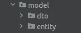

# ArchUnit:轻松测试软件架构

> 原文：<https://betterprogramming.pub/archunit-test-software-architecture-easily-a874c54bda1e>

## 如何使用 ArchUnit 验证 Java 项目中的架构约束


[安德鲁·尼尔](https://unsplash.com/@andrewtneel?utm_source=medium&utm_medium=referral)在 [Unsplash](https://unsplash.com?utm_source=medium&utm_medium=referral) 上拍照

# 为什么我们要测试架构

随着项目的增长，架构变得更加复杂。每个项目都有开发人员需要遵循的标准规则。如果新同事加入项目，他们可能会在不知道的情况下违反架构约束。如果每个人都在他们认为合适的地方添加新代码，代码库将变得混乱。

这导致了代码维护的费力，并为错误打开了大门。当然，可能会有一位资深开发人员已经在这个项目上工作了多年。他们定期检查新代码，并让其他人知道他们是否应该修复任何东西。

问题是这需要人工干预，有时人类不能发现所有的问题。保护软件架构不受侵犯的最好方法是拥有一个自动化的过程。

在本文中，我将展示解决此类问题的 [ArchUnit](https://www.archunit.org/) 框架。您将看到典型的实际例子来理解如何将这个工具集成到您的项目中。

让我们开始吧！

# 什么是建筑单位

ArchUnit 用于 Java 项目架构的单元测试。它验证了架构约束。通常，架构师或首席开发人员会建立通用模式。他们在人类可读的单元测试中编写规则，可以用任何单元测试工具如 [JUnit](http://junit.org/) 进行评估。

当有人违反规则时，测试就会失败。开发人员将看到关于该问题的信息。它确保代码库保持完整，每个人都遵循指导方针。

这种测试艺术对于新加入者理解项目结构特别有益。

# ArchUnit 演示

我假设您已经有了一个用于测试的 Java 项目，例如 SpringBoot 项目。

首先，将 ArchUnit maven 依赖项添加到您的`pom.xml`:

```
<dependency>
    <groupId>com.tngtech.archunit</groupId>
    <artifactId>archunit</artifactId>
    <version>0.23.1</version>
    <scope>test</scope>
</dependency>
```

现在，让我们来看看一些常见的使用案例。

创建一个新的 Java 类，例如`ArchUnitTest.java`。为了简单起见，我们将所有的测试都放在那里。

## 命名约定测试

如果您有多个模块，您可以使用注释`AnalyzeClasses`来指出要扫描哪个包。

例如，您可能希望在所有 SpringBoot 项目中保持一致，应用程序类名应该是“MainApp”:

如您所见，代码是不言自明的。您只需要提供 ArchUnit 需要验证的注释，验证是开箱即用的。

您可以检查是否所有控制器类都有后缀“Controller”:

控制器应该是带后缀的测试用例

注意，如果给定的项目不包含控制器，`allowEmptyShould(true)` 选项允许测试失败。

## 包装位置测试

您可能想要检查实体是否位于“模型”包中:

请注意，您可能具有以下结构:



模型和子包

测试将是有效的，因为实体位于“模型”包下的“实体”中。

类似地，您可以检查配置类是否位于“config”包中:

配置文件应该位于配置包测试用例中

请注意，如果您需要使规则更加复杂，您可以轻松地将多个条件链接起来。

如果您想要验证扩展父类的所有类，可以通过以下方式实现:

xml 请求应该位于请求包测试用例中

在这个例子中，所有扩展了`SoapRequest.class`的类都将被验证。

## 注释测试

以下示例说明了对有效批注的检查:

配置应该是带注释的测试用例

所有的配置类都应该有一个想要的注释。

## 软件设计模式测试

假设您的项目应该遵循[洋葱架构](https://en.everybodywiki.com/Onion_Architecture)风格:

洋葱架构模式测试用例

## 测试排除

有时候你不想执行某些类的规则。通常，对于 JUnit 测试。

这可以通过以下方式轻松实现:

测试排除选项

或者你有一个你想忽略的类，因为规则不适用于它。创建一个自定义规则并导入它，如上例所示。

特定测试排除选项

# 结论

恭喜你！您现在知道为什么测试架构是必要的了。

您了解了如何将 ArchUnit 测试框架集成到您的 Java 项目中。您还熟悉了可以在您的架构指南中应用的常用规则。

查看下面的参考资料部分，了解更多的规则示例。

希望这篇教程有所帮助。如果您想阅读更多关于软件架构最佳实践的内容，您可能会喜欢我的另一篇文章:

[](/use-fitness-functions-for-evolving-architecture-a4d6c3f6fda2) [## 使用适应度函数进化建筑

### 用简单的例子介绍适应度函数概念

better 编程. pub](/use-fitness-functions-for-evolving-architecture-a4d6c3f6fda2) 

感谢您的阅读，祝您编码愉快！

# 参考

*   [ArchUnit GitHub 示例](https://github.com/TNG/ArchUnit-Examples/tree/main/example-junit5/src/test/java/com/tngtech/archunit/exampletest/junit5)