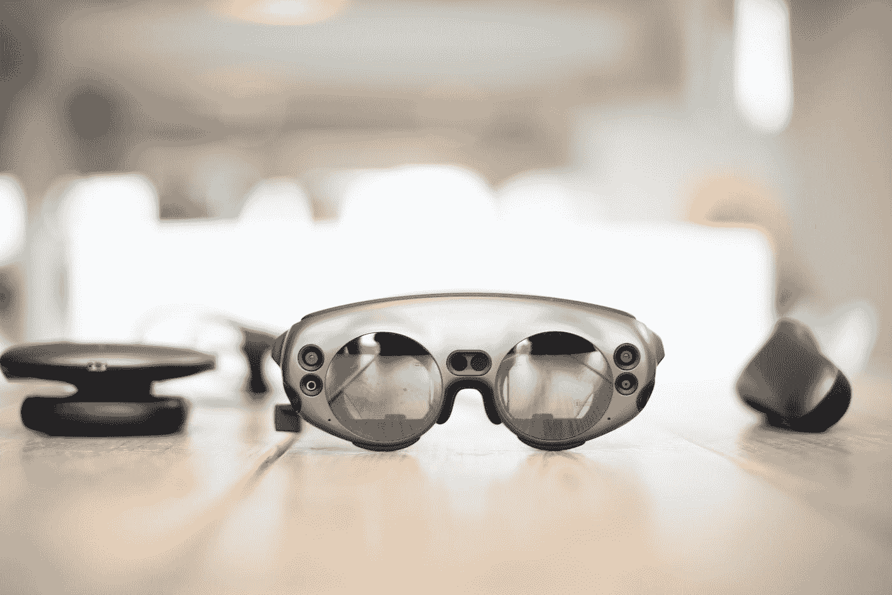
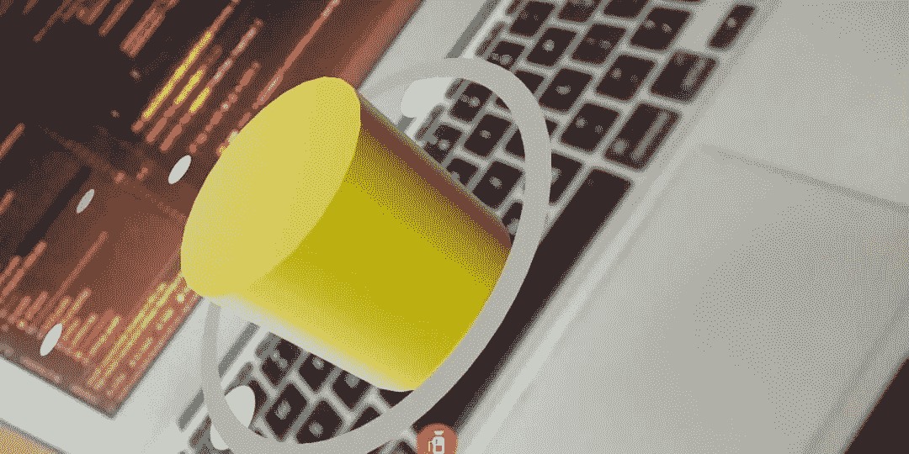
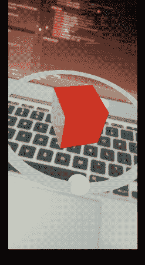

# Android 中的 ARCore 和 Sceneform 在可变换的节点上执行手势和碰撞

> 原文：<https://betterprogramming.pub/arcore-and-sceneform-in-android-performing-gestures-and-collisions-on-transformable-nodes-c66a474f7905>

## 使用 Sceneform 在 Android 上轻松构建 AR 应用



Bram Van Oost 在 [Unsplash](https://unsplash.com?utm_source=medium&utm_medium=referral) 上拍摄的照片

在这个新的十年之交，如果有一个领域有可能彻底改变我们与智能手机的交互方式，那就是增强现实(AR 眼镜:你在读这个吗？).谷歌一直在推进自己的平台 ARCore，该平台使开发者能够在 Android、iOS、Unity 等平台上创建 AR 体验。

# 简史

ARCore 做了很多事情。从运动跟踪到环境理解和光线估计，它已经涵盖了大部分的基础。然而，尽管它是在 2017 年推出的，但直到最近，当增加了增强人脸、共享相机和 AR 元素等新功能并开始显示 ARCore 的真正潜力时，它才获得了很多关注或进展。

ARCore 的采用花了一些时间的原因之一是因为它最初依赖于 OpenGL 的 3D 图形。ARCore 发布时，3D 内容导入和查看在 Java(或 Kotlin)中是不可能的，这迫使开发人员使用 OpenGL(陡峭的学习曲线会让任何人做噩梦)或 Unity，这是与 Android 组件集成时的一个痛苦。谷歌必须对此采取措施。

他们在 2018 年推出了 Sceneform，剩下的就是历史了。

# scene form:Android 开发者的救生艇

Sceneform 是一个 3D 框架，允许我们通过使用高级图形 API 来呈现 3D 模型。它附带了一个插件，可以让你直接从 Android Studio 导入、预览和构建 3D 资产。Sceneform 与 ARCore 紧密集成，使 Java 和 Kotlin 开发人员可以轻松构建高质量的 Android AR 应用。

Sceneform SDK 代表您处理以下事情:

*   ARCore 的设备兼容性检查
*   摄像机权限
*   创建 ARCore 会话

既然我们已经很好地了解了 Sceneform 为我们做了什么，那么让我们来定义本文的目标。

# 我们的目标

*   介绍 ARCore 和 Sceneform 的一些关键术语和构建模块。
*   使用 Kotlin 设置平面检测和点击测试以在 Android AR 应用程序中添加多个节点。
*   处理可变换节点上的手势和碰撞。

# 关键术语

Sceneform 是一个基于节点的图形，可以做很多事情。从处理平面检测并允许我们在场景中设置节点(可以是零个或多个节点)，到执行点击测试，等等。

点击测试是一种从屏幕转换 2D 坐标的方法，用户在屏幕上点击他们在 AR 场景中的 3D 投影。想象一下，一束光线从屏幕上的点击点发出，穿过手机的摄像头视图。这条假想光线与 AR 场景的平面表面的第一个交点为我们提供了世界位置。然后我们可以在这个世界位置上设置我们的节点。

在上一节中，我们讨论了术语节点、可转换节点等等。让我们在这里定义它们:

*   **场景**——我们的 3D 对象被渲染的地方。它有一个树状的数据结构。
*   **节点** —一个包含所有需要在屏幕上呈现的信息的对象。它可以包含一个`renderable`属性，我们可以在上面设置我们的 3D 资产和材质形状。此外，它由一个`collisionShape`组成，有助于检测碰撞。节点可以有零个或多个子节点和一个父节点。
*   **可渲染** —可从资产文件(OBJ、FBX、glTF)创建的 3D 模型，如此处[所示](https://heartbeat.fritz.ai/build-you-first-android-ar-app-with-arcore-and-sceneform-in-5-minutes-af02dc56efd6)或使用`MaterialFactory`或`ShapeFactory`创建具有纹理的基本形状，如立方体、球体和圆柱体
*   **锚节点** —这些类型的节点被分配到 ar 世界空间中的特定位置。通常，这是检测到平面后放置的第一个节点。
*   **可变形节点**——顾名思义，可以变形。它们能够通过对用户手势做出反应，在 AR 场景中进行缩放、平移和旋转。
*   **姿态** —提供节点在场景中的位置和方向。我们还可以确定相机的姿态，并找到相机和场景中锚节点之间的距离。

一旦您将`ArFragment`添加到您的活动布局中，它就为设置`ARCore`会话和`ArSceneView`做好了基础工作，一旦检查到设备通过了 ARCore 兼容性测试。

`setOnTapArPlaneListener`设置在`ArFragment`中，用于在检测到的平面上发生任何点击事件时监听变化。通过使用从监听器返回的`HitResult`，我们可以将锚点添加到我们将设置节点的平面上。

## 材料工厂和形状工厂

下面的代码演示如何创建一个带有形状的可呈现的，并将其放在节点上:

```
MaterialFactory.makeOpaqueWithColor(this, Color(android.graphics.Color.*YELLOW*))
        .thenAccept **{** material **->** val vector3 = Vector3(0.05f, 0.05f, 0.05f)
            cubeRenderable = ShapeFactory.makeCube(vector3, Vector3.zero(), material)

            cubeRenderable!!.*isShadowCaster* = false
            cubeRenderable!!.*isShadowReceiver* = false

        **}**
```

`MaterialFactory`让我们定义材质类型——金属色、颜色、不透明度等等——并将其放在`ShapeFactory`实例上。`ShapeFactory`类允许我们定义形状的大小。设置球体(带半径)和圆柱体(带半径和高度)的功能有:

```
ShapeFactory.makeCylinder(0.1f,0.3f,Vector3.zero(), material)ShapeFactory.makeSphere(0.1f, Vector3.zero(), material)
```

下面是将一个带有可渲染集的节点放在`ArSceneView`上时的样子。



你看到的点是平面上可以放置锚点的特征点。

当用户选择节点或者以编程方式使用`select()`方法时，节点周围的圆圈就会显示出来。

以下代码片段展示了如何将我们在上面创建的可呈现对象添加到平面上的可转换节点:

```
arFragment!!.setOnTapArPlaneListener {hitResult, plane, motionEvent -> val anchor = hitResult.createAnchor()
val anchorNode = AnchorNode(anchor)
anchorNode.setParent(arFragment!!.*arSceneView*.*scene*)val node = TransformableNode(arFragment!!.*transformationSystem*)
node.*renderable* = cubeRenderable
node.setParent(anchorNode)

arFragment!!.*arSceneView*.*scene*.addChild(anchorNode)
node.select()}
```

因此，在一个平面上点击，我们可以添加一个可变换的节点，它可以在该平面的边界内移动。



现在我们已经很好地了解了 Sceneform 的不同组件，让我们构建一个基于 ARCore 的 Android 应用程序，它可以检测冲突并计算两个可转换节点之间的距离。

# 入门指南

首先，在 Kotlin 中创建新的 Android Studio 项目。请确保 ARCore 和 Sceneform 的最低 Android API 级别为 27，并在应用的`build.gradle`文件中添加以下依赖项:

```
implementation 'com.google.ar.sceneform.ux:sceneform-ux:1.14.0'
```

# 设置 ArFragment

接下来，让我们给`activity_main.xml`布局文件添加一个`ArFragment`，如下所示:

我们还添加了一个`TextView`来显示节点之间的距离。

# 检查 OpenGL 兼容性

现在回到`MainActivity.kt`类，在链接布局之前，我们将检查 OpenGL 版本是否是 3.0 或更高版本:

```
override fun onCreate(savedInstanceState: Bundle?) {
    super.onCreate(savedInstanceState)

    if (!checkIsSupportedDeviceOrFinish(this)) {
        Toast.makeText(*applicationContext*, "Device not supported", Toast.*LENGTH_LONG*).show()
    } setContentView(R.layout.*activity_main*) 
} fun checkIsSupportedDeviceOrFinish(activity: Activity): Boolean {

    val openGlVersionString = (Objects.requireNonNull(activity.getSystemService(Context.*ACTIVITY_SERVICE*)) as ActivityManager)
        .*deviceConfigurationInfo* .*glEsVersion* if (java.lang.Double.parseDouble(openGlVersionString) < MIN_OPENGL_VERSION) {
        Toast.makeText(activity, "Sceneform requires OpenGL ES 3.0 or later", Toast.*LENGTH_LONG*)
            .show()
        activity.finish()
        return false
    }
    return true
}
```

# 在平面上添加多个节点

现在，让我们修改`setOnTapArPlaneListener`方法来容纳两个可转换的节点。在下面来自`MainActivity.kt`类的代码中，我们已经初始化了两个 3D 渲染模型——其中一个在碰撞过程中修改可变形材料。

注意我们在`Activity`类中设置的`Scene.OnUpdateListener`接口`onUpdate(frameTime: FrameTime)`。这将在场景更新之前每帧调用一次回调方法。我们可以在这个函数中处理任何事件。属性将为我们提供当前帧的时间信息，从而允许我们利用它来周期性地添加一些自定义的场景。

在下一节中，我们将检测两个节点上的冲突事件

# 使用 OverlapTest 检测碰撞

Sceneform 处理冲突的方式略有不同(它称之为重叠)。目前，它没有一个事件处理器来告诉你碰撞何时开始，何时结束。

通过调用`overlapTest()`函数并传递节点，您可以确定它是否与场景中的任何节点重叠。或者，您可以使用`overlapTestAll()`函数来获取重叠节点的列表。

以下代码处理碰撞并相应地更改节点的可渲染材质:

为了简单起见，我们只在两个可变换节点放置在平面上时检测重叠。

# 计算两个节点之间的距离

要连续计算两个可变换节点之间的距离，请在`onUpdate`回调函数中添加以下代码:

```
val positionA = nodeA!!.*worldPosition* val positionB = nodeB!!.*worldPosition* val dx = positionA.x - positionB.x
val dy = positionA.y - positionB.y
val dz = positionA.z - positionB.z

val distanceMeters = Math.sqrt((dx * dx + dy * dy + dz * dz).toDouble()).toFloat()

val distanceFormatted = String.*format*("%.2f", distanceMeters)

tvDistance!!.*text* = "Distance between nodes: $distanceFormatted metres"
```

最后，设置好一切后，在 ARCore 兼容设备上运行上述应用程序，我们得到了以下结果:

# 结论

ARCore with Sceneform 最近取得了一些不错的进展。随着最新更新发布有趣的功能，如增强人脸、UI 元素、在 AR 运行时加载元素、共享相机等，谷歌正在缓慢而稳步地追赶其竞争对手。ARCore 的跨平台支持也给了它比其他公司更大的优势。

新的深度 API 的发布应该只会帮助开发者构建更具沉浸感的 AR 场景和体验。

这篇文章的完整源代码可以在 [GitHub 库](https://github.com/anupamchugh/ARCoreSceneformCollisions)中找到。这一次到此为止。感谢阅读。