# Arduino 和 Visual Studio 代码:入门

> 原文：<https://betterprogramming.pub/arduino-and-visual-studio-code-getting-started-1362539ea9d3>

## 如何使用 PlatformIO 进行 Arduino 开发

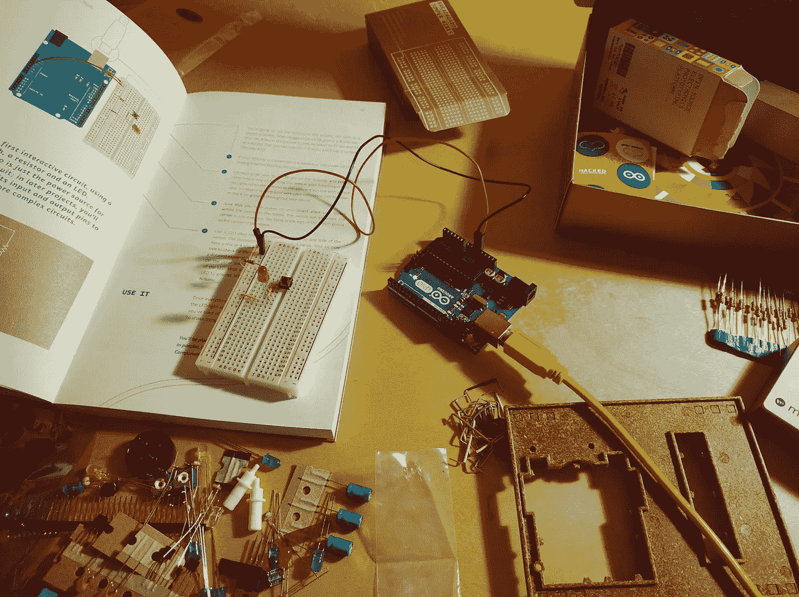

[斯潘塞](https://unsplash.com/@spen?utm_source=unsplash&utm_medium=referral&utm_content=creditCopyText)在 [Unsplash](https://unsplash.com/s/photos/arduino?utm_source=unsplash&utm_medium=referral&utm_content=creditCopyText) 上拍照

在使用标准 Arduino IDE 完成了几个 Arduino 项目之后，您可能想知道如何脱离初学者 IDE，找到一种不同的方法，在. ino 文件中使用`setup()`和`loop()`函数来设置您的文件。

很可能你的第一个项目在。ino 文件:

```
setup() {}loop() {}
```

为了摆脱这种情况，我想开始使用一个我几乎用于所有其他事情的编辑器:Visual Studio 代码。

你可以在 VS 代码中使用一些不同的扩展来开发 Arduino，但是我选择了 PlatformIO。PlatformIO 的扩展允许 VS 代码成为许多不同嵌入式系统(包括 Arduino)的成熟 IDE！

一旦安装了 Visual Studio 代码，就可以使用`control + shift + p`打开快捷菜单。打开后，键入 install，然后找到显示“扩展:安装扩展”的选项

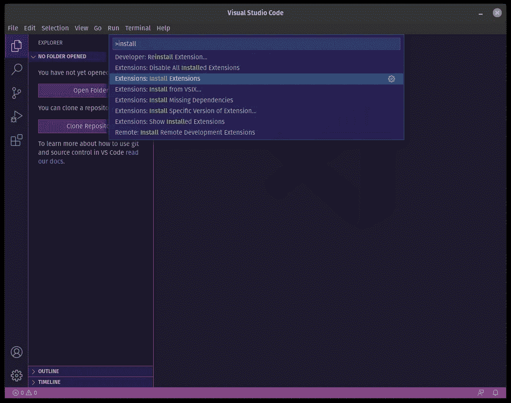

安装扩展提示

一旦选择了“扩展:安装扩展”提示符，您就可以通过键入“平台”来搜索 PlatformIO 一旦 PlatformIO IDE 选项出现在左侧栏上，我们就可以选择它，然后单击“安装”

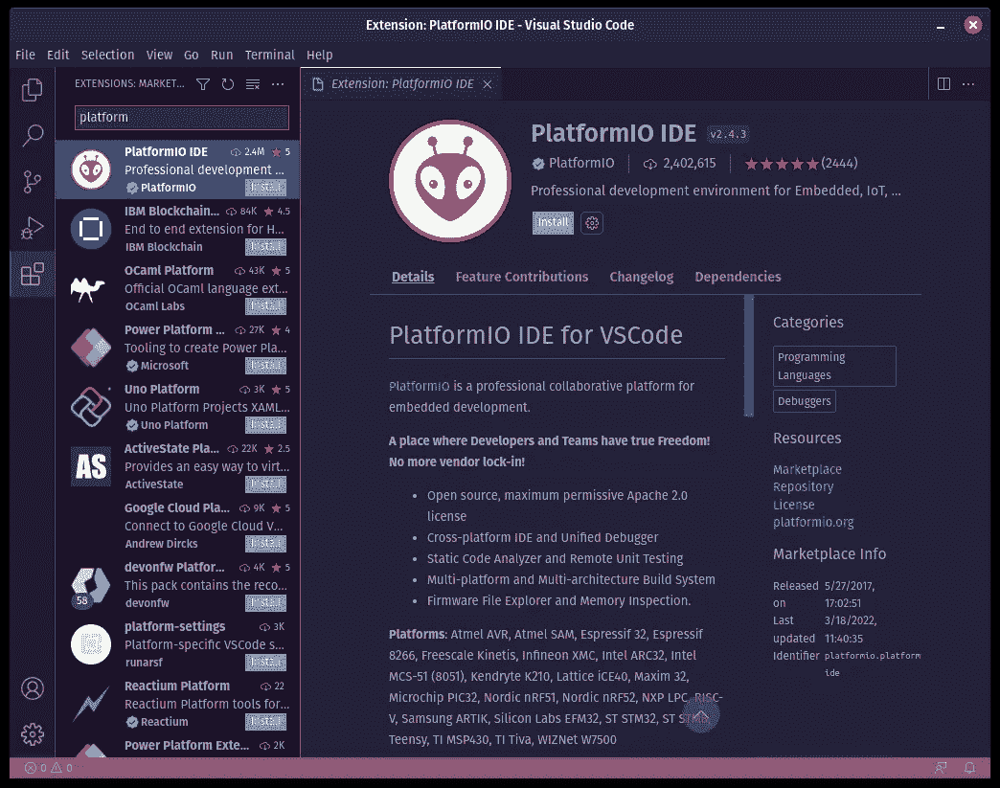

PlatformIO 扩展安装

安装完成后，VS 代码的左侧栏会有一个外星人图标，是针对 PlatformIO IDE 扩展的。选择它以打开 PlatformIO IDE GUI。

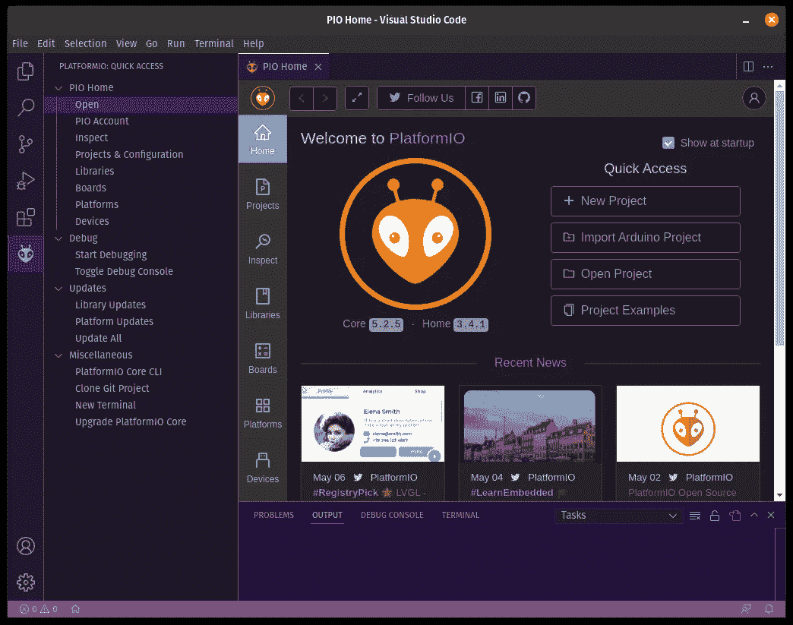

平台界面

一旦 PlatformIO 的 GUI 打开，您就可以选择“新建项目”提示，在 Arduino 的初学者 ide 之外开始您的第一个 Arduino 项目！

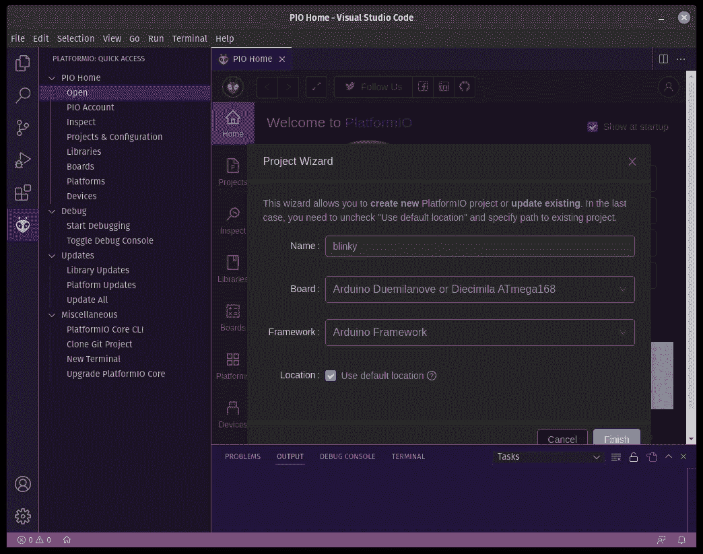

PlatformIO 开放项目对话

比如我用的是嵌入式系统版的 Hello，World 它使一个 LED 闪烁。因此，我把这个项目命名为“blinky”在“板”选择字段中，确保选择您拥有的板；否则，以后构建和闪烁序列可能无法成功完成。

命名项目并选择正确的 Arduino 板后，对话框将打开项目目录和主源代码文件。`main.ino`文件已不存在！这个目录结构现在更有条理了，主要的源代码文件位于`main.cpp`。

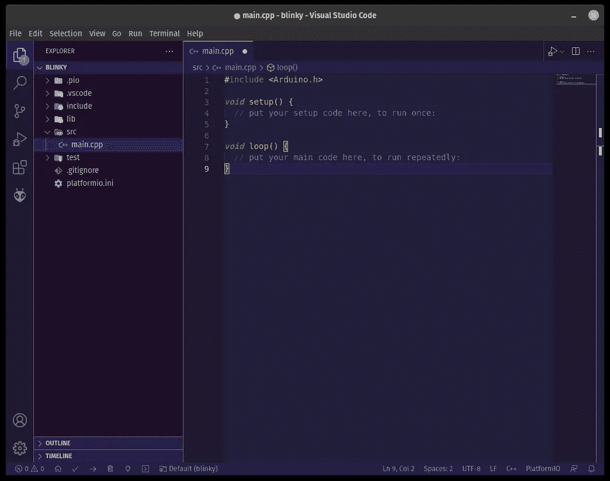

VS 代码中的主源代码文件

目前，您真正需要担心的唯一文件是`main.cpp`。随着我开始更多地在其他系统上进行嵌入式开发，我注意到 Arduino 通过使用`setup()`和`loop()`在主函数中抽象出了大量的初始化。我不是这个的超级粉丝，所以我删除了`main.cpp`的内容，用`main()`代替:

```
#include <Arduino.h>int main(int argc, char **argv) {init();for(;;) {}}
```

将`setup()`和`loop()`功能替换为 main 后，您会注意到还有一个`init()`功能。此函数用于初始化 Arduino 板，以便与它后面的代码一起使用。如果没有`init()`函数，您的代码很可能无法按预期运行。

你会注意到文件开头的`#include`语句，我们仍然拥有 Arduino 的所有输入、输出、管脚等功能。

要启用输出引脚，使用`pinMode()`功能:

```
const *int* ledPin = 12;pinMode(ledPin, OUTPUT);
```

我用我的 Arduino 上的 12 号引脚来控制试验板上的一个 LED。

接下来，我们需要在操作之间有一秒钟的延迟来循环打开和关闭 LED。下面的代码允许我们让灯闪烁一次:

```
digitalWrite(ledPin, HIGH);delay(1000);digitalWrite(ledPin, LOW);delay(1000);
```

这段代码应该放在`for(;;)`循环中，使其持续闪烁。

我们最终的`main.cpp`文件看起来像这样:

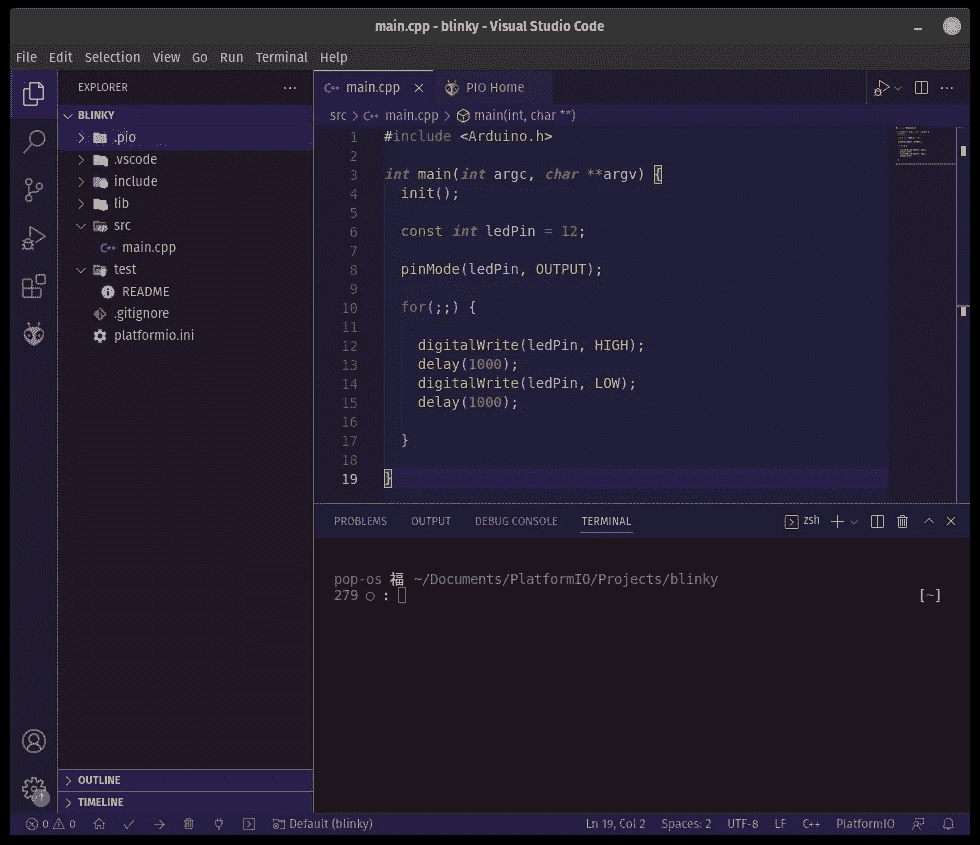

最终 main.cpp 文件

一旦所有的代码都写好了，就该构建项目并刷新它了。要构建项目，使用`control + shift + p`调出快捷菜单。进入菜单后，键入“build”应该有一个“PlatformIO: Build”的条目。该选项允许 PlatformIO 为之前创建项目时指定的特定 Arduino 板编译和构建 Arduino 项目。

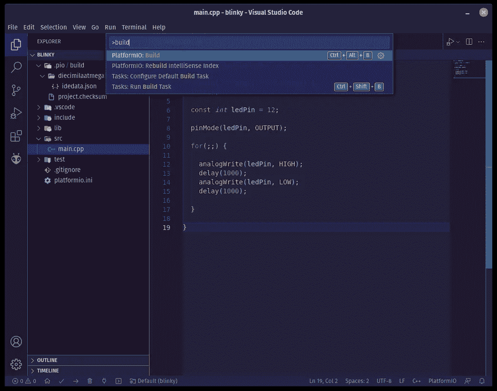

一旦选中，您会注意到一个小终端出现在 VS 代码窗口的下半部分。一旦代码成功编译和构建，就可以进行刷新了！一个成功的构建将在终端中输出如下内容:

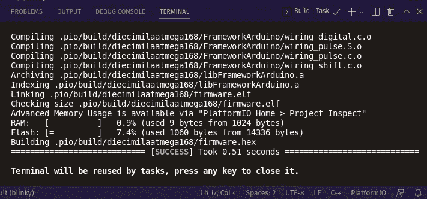

成功的 Arduino 平台构建

在项目成功构建之后，是时候将构建上传(刷新)到 Arduino 板上了。再次使用`control + shift + p`并输入“上传”应该会有一个提示说“PlatformIO: Upload”选择此提示将您成功构建的项目上传到 Arduino 板上。

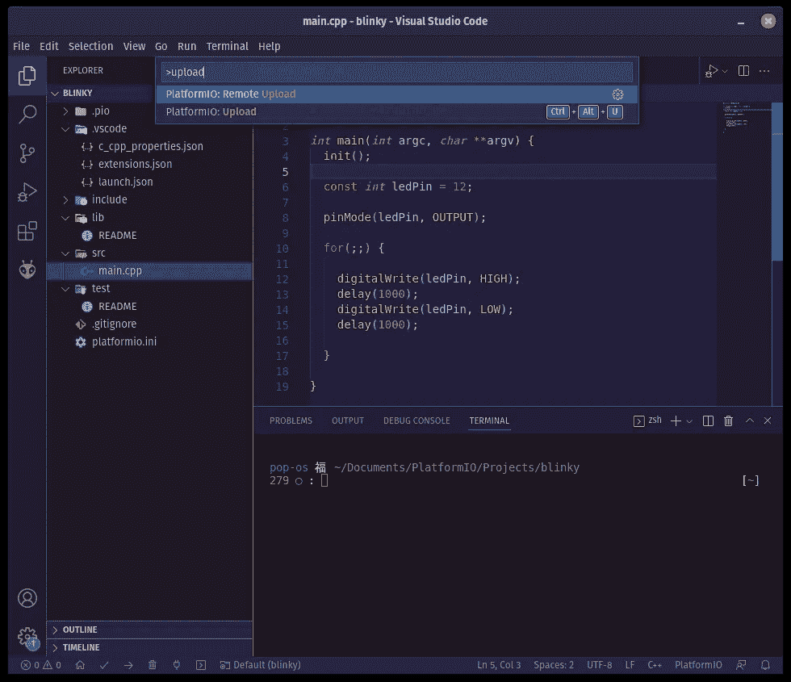

平台视频上传对话

成功将项目上传到板上后，Arduino 应该会在每次操作之间让 LED 闪烁一秒钟！

在 VS Code 的终端中，一次成功的上传将如下所示:

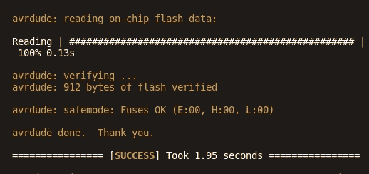

成功上传到 Arduino

恭喜你在 Arduino 初学者 ide 之外编写了第一个 Arduino 项目！您现在使用的是独立于 Arduino IDE 的嵌入式系统。PlatformIO 也可以用于 STM32 板，甚至可以在互联网上找到更便宜的克隆板。:)

https://platformio.org/

恭喜你在初学者 Arduino IDE 之外编写了你的第一个 Arduino 项目！您现在使用的是 Arduino IDE 之外的嵌入式系统。PlatformIO 也可以用于 STM32 板，甚至可以在互联网上找到更便宜的克隆板。:)

https://platformio.org/


成功上传到 Arduino

恭喜你在初学者 Arduino IDE 之外编写了你的第一个 Arduino 项目！您现在使用的是 Arduino IDE 之外的嵌入式系统。PlatformIO 也可以用于 STM32 板，甚至可以在互联网上找到更便宜的克隆板。:)

https://platformio.org/