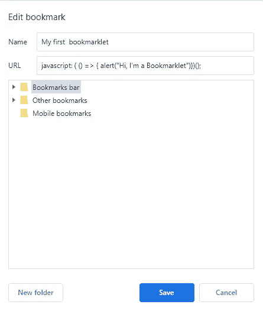
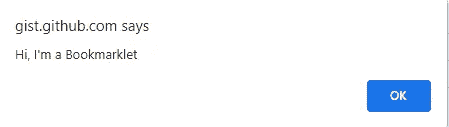
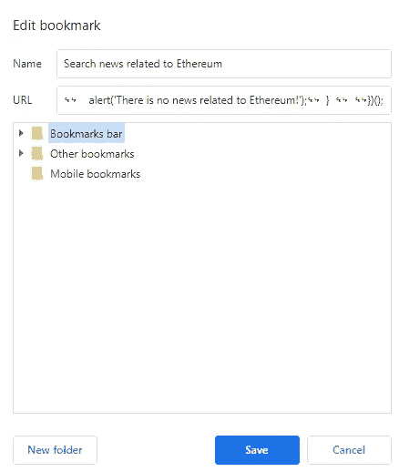

# Bookmarklets 还有用吗？

> 原文：<https://betterprogramming.pub/are-bookmarklets-still-useful-48e2672795aa>

## 如何使用 JavaScript 为浏览器添加新功能

照片由[Firmbee.com](https://www.pexels.com/@firmbee-com-22729701?utm_content=attributionCopyText&utm_medium=referral&utm_source=pexels)从[派克斯](https://www.pexels.com/photo/person-in-blue-jacket-using-macbook-pro-6927333/?utm_content=attributionCopyText&utm_medium=referral&utm_source=pexels)拍摄。

Bookmarklets 类似于常规的浏览器书签，但是它执行 JavaScript 而不是打开链接页面。因此，它们可以很方便地以一种简单的方式在你当前的网页上执行一些任务。

例如，您可以将当前页面提交给翻译服务或修改页面内容。

bookmarklet 的概念出现在 1998 年 Netscape 的 JavaScript 指南中，解释了如何使用 JavaScript 代码片段来做浏览器在不同菜单中没有提供的事情。在 2021 年，当前的浏览器和扩展已经实现了其中的大部分功能，但它们仍然是有帮助的。

这篇文章向你展示了什么是书签工具，并解释了如何创建和使用它们。

# Bookmarklets 和扩展有什么区别？

使用 bookmarklets，您可以操作当前页面；也就是说，你可以这样做:

*   小书签可以点击完成基本任务。
*   Bookmarklets 类似于书签。
*   书签工具比扩展更安全，因为书签工具不能修改你的浏览器设置。
*   Bookmarklets 比扩展更快。
*   Bookmarklets 在任何浏览器中都以同样的方式运行。
*   扩展依赖于浏览器。
*   就其本质而言，Bookmarklets 比扩展更受限制。
*   它们是通用的，也就是说，它们通常可以在任何浏览器和平台上工作，无论是手机还是桌面。

# 书签的实际案例

*   在浏览器中修改网页的外观。
*   从页面中移除元素。
*   虚拟点击按钮。
*   从网站中提取内容:链接或图片。
*   使用页面内容打开新页面。
*   将页面发送到 web 服务，如翻译器。
*   查看网页的隐藏选项。
*   在社交网络上分享一页。
*   在当前页面上搜索某些内容，并通过刷新页面来显示结果。

# 如何创建它们？

bookmarklet 类似于常规书签，不同之处在于您将在 URL 字段中编写 JavaScript，而不是 HTTP/HTTPS URL。

因此，要创建一个 bookmarklet，你需要具备 JavaScript 知识，或者你可以复制粘贴其中一个的代码，并将其作为书签添加到你的浏览器中。

在 web 上，有一些带有书签的存储库可供使用。

作为一个提示，如果你会经常使用它，我建议你把它添加到你的书签栏。

## 创建您的第一个书签

我们已经说过，bookmarklet 是 JavaScript 代码，所以要创建 Bookmarklet，我们将使用 JavaScript。

下面的例子已经在一些最新版本的谷歌浏览器(版本 95.0)上进行了测试，但在其他浏览器上也能类似地工作。

编写 Bookmarklet 的 JavaScript 代码:

显示消息的 JavaScript 函数:嗨，我是一个 bookmarklet。

将代码添加到新书签:

如何通过将前面的 JS 代码添加到书签栏来创建 Bookmarklet。

从任何页面运行 Bookmarklet:

运行书签小程序点击它。

## 创建更复杂的 bookmarklet

之前的 Bookmarklet 没有神秘感或实用性，所以让我们创建一个更复杂的 Bookmarklet，它将在 [Cointelegraph](https://cointelegraph.com/) 网站上搜索与以太币(ETH)相关的新闻。

编写以下 JavaScript 代码:

在文档上找到“Eth”或“以太坊”链接，然后单击它。

第 3-4 行:[*document . evaluate()*](https://developer.mozilla.org/en-US/docs/Web/API/Document/evaluate)*根据一个*[*XPath*](https://developer.mozilla.org/en-US/docs/Web/XPath)*表达式和其他给定参数返回一个*[*XPath result*](https://developer.mozilla.org/en-US/docs/Web/API/XPathResult)*。*

添加书签:

如何将 Bookmarklet 添加到书签栏？

在 Cointelegraph 网站上运行 Bookmarklet:

硬币电报网页。

如果您在 [Cointelegraph](https://cointelegraph.com/) 网站上运行之前的 Bookmarklet，您会获得以下泄露以太坊新闻的页面:

在前一个网页上执行 Bookmarklet 的结果。

# 分享书签

要将 bookmarklet 添加到您的计算机中，您只需将代码复制并粘贴到一个新的书签中，但如果您想要共享它，一个好的技巧是使用链接锚的“href”属性。

如何用 HTML 文件共享一个 Bookmarklet？

现在，这个 HTML 文件可以在任何浏览器中打开，并被拖到书签栏。

# 关于隐私和安全的考虑

需要注意的是，任何 Bookmarklet 都可能是危险的，因为 JavaScript 代码在您的浏览器中运行。因此，只有在您了解 JavaScript 并理解 Bookmarklet 或信任来源的情况下，才添加 Bookmarklet。

你肯定不想添加一个 Bookmarklet 来读取你的浏览器的 cookies，然后把它发送到一个危险的 URL，是吗？

# 最后的想法

尽管 bookmarklets 的使用已经被遗忘了，但是对于特定的任务来说，它们是方便和实用的，不需要创建或使用扩展，也不会使您的生活变得太复杂。

要考虑的一个优点是，书签工具只能在你有意识地点击它们时访问你当前的网页。

我希望这篇文章对你有所帮助。

再见！