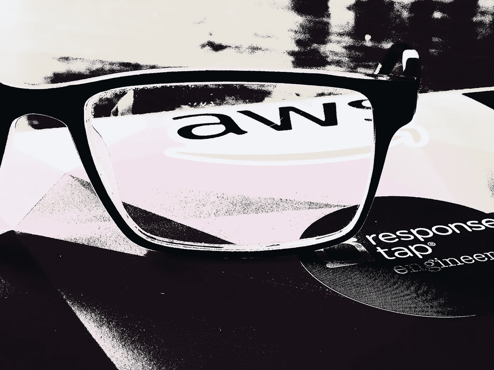
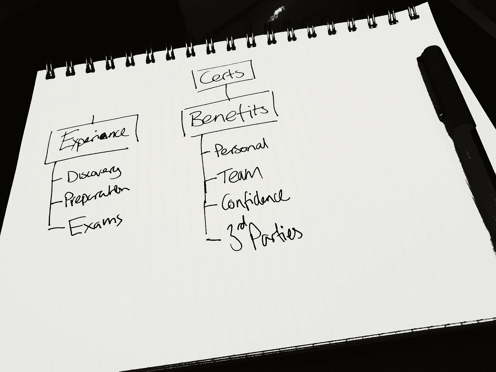
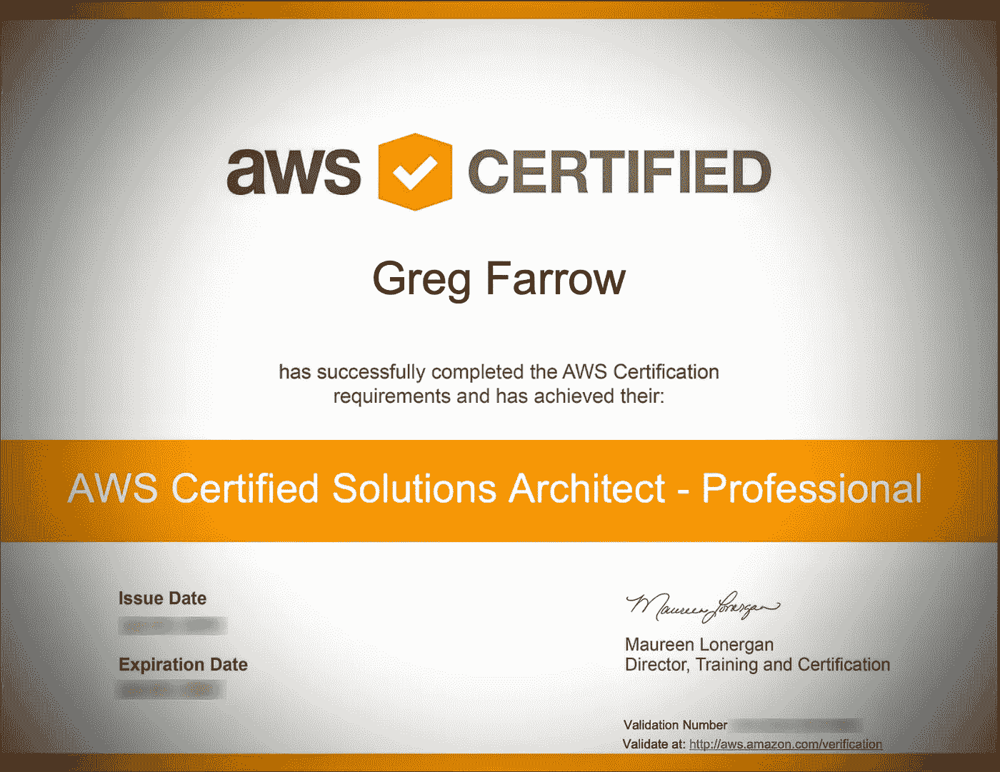

# 云认证值得付出汗水和眼泪吗？

> 原文：<https://betterprogramming.pub/are-cloud-certifications-worth-the-sweat-and-tears-d948dbe09352>

## 接受云认证可能是一项重大承诺

如果你最近开始使用云服务，如 [AWS](https://aws.amazon.com/certification/?nav=tc&loc=3) 、 [GCP](https://cloud.google.com/certification/) 或 [Azure](https://www.microsoft.com/en-us/learning/azure-exams.aspx) ，你可能已经发现了他们的认证项目。也许你已经使用云有一段时间了，但是不确定参加认证是否值得。

参加认证是一项艰苦的工作，但也是非常值得的。在 ResponseTap，我们 75%的工程师现在拥有一项或多项认证，另外 25%的工程师正在积极学习他们的认证。*那么，我们为什么要费神呢？*

格雷格·法罗

# 发现云认证

直到我开始使用 AWS 12-18 个月后，我才发现 AWS 认证计划。在那之前，我一直在使用一些特定的服务(Lambda，Kinesis，Dynamo…)并取得了一定的成功。那时，我的知识非常“贫乏”——我对那些特定的服务有相当多的了解，但对其他任何服务都知之甚少。

直到我的同事 [Ben Jones](https://medium.com/u/7b4759dcd8ac?source=post_page-----d948dbe09352--------------------------------) 提到他发现了[Udemy Solutions Architect(Associate)](https://www.udemy.com/aws-certified-solutions-architect-associate/learn/lecture/13885822)课程，我才开始考虑获得认证。我们聊了聊课程，双方都认为完成课程可能会很有趣。在这一点上，我们并没有把它看得很重——我甚至不确定他们中的任何一个是否真的打算在最后参加考试。

# 坚持到底

于是我们俩都买了课程，开始了我们的冒险。这个课程是由 Ryan Kroonenburg 教授的课程的静态版本，10.99 英镑，很便宜！

一开始，我们满怀热情，相当快地浏览了材料。每周我们都会聊一聊前一个周末学到的东西，然后开始一场友好的竞赛——谁能最快完成课程？

但是几个星期后，我们失去了我们的魔力。解决方案架构师的课程非常广泛。它涵盖了广泛的可用 AWS 服务。我们很高兴能更多地了解我们已经在使用的服务，但了解我们认为是 EC2 的“旧”技术时，我们发现不太有动力。最终，我们完全停止了学习。

没有明确的目标和目的，我们就没有必要的决心去坚持到底。

这是一个警示性的故事，对于那些正在考虑认证的人来说，因为他们觉得他们应该去认证，而不是因为他们希望 T2 去认证。

**完成云认证需要动力和决心。**

# 说着同样的语言

当我们经历这个过程时，在工作中我们更多地使用 AWS。我对 ResponseTap 的架构愿景完全以无服务器技术为中心。这意味着我们几乎花费了所有的时间来设计和构建 AWS 服务。

这开始暴露出这个团队的问题。我们所有人都有“尖锐”的知识。我们中的一些人对云知识知之甚少，而另一些人(比如我自己)在特定领域有更多的知识(这些知识并不总是重叠的)。我们都没有广博的知识。

格雷格·法罗

**那又怎样？对我们正在使用的 AWS 服务的理解水平参差不齐是一个问题。我们经常浪费时间让人们了解一些基本知识。比如 S3 物体一致的阅读行为，或者 Kinesis 和 SQS 的不同特征。**

很明显，我们都需要以某种方式达到相同的基本理解。我们需要开始说同一种语言。

# 能做到吗？当然

当我意识到团队是如何在平等的条件下努力沟通时，解决方案就很明显了。我们需要学习同样广泛的知识。在我看来，最有能力建议这个基础知识水平应该由什么组成的人是 AWS 自己。我的理论是:

> 如果我们都获得了 AWS 助理级认证，我们将有更好的技术对话，我们将更有能力寻找利用我们直接体验之外的服务的解决方案。

ResponseTap 工程认证项目由此诞生。

# 提供工具

对于那些刚接触认证的人来说，要获得认证需要两样东西:知识*和*经验。你可以观看视频和阅读白皮书，但如果没有经验，你不太可能为考试做好充分准备。

ResponseTap 的工程师们已经有很多机会获得实践经验，但是在知识方面还是有差距。我从 [Udemy](https://www.udemy.com/) 购买的 [acloud.guru](https://acloud.guru) 课程给我留下了深刻的印象，我决定将团队注册到 [acloud.guru](https://acloud.guru) 平台将是一个伟大的举动。

格雷格·法罗

# 该认真工作了

我又回到了我的学习中——但是带着一个真正的目的。与我之前的尝试不同，这次我要证明一点。我向我的团队发出了挑战:获得认证。作为公司的解决方案架构师，负责使用 AWS 服务实现我们的产品，我感受到了难以置信的成功压力。我总是努力以身作则。

对我来说，仅仅获得认证是不够的，我觉得我必须首先*获得*认证——我感到了压力！

我发现 acloud.guru 上的 AWS 解决方案架构师助理课程是一个非常好的资源。它定期更新，以确保它是最新的，以我的经验，它涵盖了我在考试中被问到的所有问题。

每个人都是不同的，有些人喜欢有多种学习资源。但是我相信 ACG 的课程让我做好了充分的准备。

我花了大约两个月的时间完成课程，包括花额外的时间恢复一些我不太自信的话题。ACG 的课程包括实践教程(Ryan 称之为“实验”)，你可以在 AWS 的免费层中完成。我发现这些会议特别有帮助。当他们有机会将所学付诸实践时，谁不学得更好呢？

我在学习期间收到的最好的建议是来自 Mattias Andersson 的 ACG 课程。他说仅仅为了通过考试而学习是一种低效和无效的学习方式。如果这是你唯一的动机，那么你将很难通过。相反，他建议你应该以成为专家为目标。通过考试会变得更容易，也更有意义。这个过程对你来说会更有价值。

# 坚持住。

在我失去勇气之前，我预约了考试。这帮助我在学业接近尾声时保持专注。我参加了 ACG 提供的模拟考试，也使用了 AWS 提供的[样题](https://d1.awsstatic.com/training-and-certification/docs/AWS_Certified_Solutions_Architect_Associate_Sample_Questions.pdf)。

对于这个认证，我没有使用 AWS 实践考试。但是，我会向其他人推荐您应该使用这个资源。从那以后，我用模拟考试来准备其他认证，它是你准备情况的一个重要指标。

格雷格·法罗

# 参加考试

自从我上次参加考试已经有很长时间了——好几年了。考试那天，我很紧张。最重要的是，我不想回去工作并承认我失败了！

我在一个偏僻的报亭里参加了考试。我不能对考试本身描述太多(你必须签署 NDA)，但我有以下建议:

*   仔细阅读问题和答案。这些问题不会试图欺骗你，但很容易误读，尤其是当你紧张的时候。
*   如果你对某个问题感到困惑或卡住了，把它标记出来，继续前进。不要在这上面浪费太多时间。我发现，当后来回顾这个问题时，答案往往更容易找到。
*   不要着急。有足够的时间阅读和回答每个问题。
*   慢慢来。这个考试和其他考试一样都是关于时间管理的。意识到你用了多长时间，还剩下多长时间，这样你就知道你是要快还是要慢。
*   许多考试大约持续 3 个小时。[这太长了，无法有效集中注意力](https://medium.com/responsetap-engineering/working-hard-is-important-but-so-is-taking-proper-breaks-ea3b45dbb5cd)，所以你需要给自己一点时间休息，以帮助你增强耐力。我发现每 10 个问题休息 20 秒是有帮助的。我停下来，摘下眼镜，让眼睛休息一下，检查我的计时。
*   如果你遇到一个你不知道答案的问题，尽可能少花时间。优先考虑你知道的那些问题。

谢天谢地，没有必要等待数周才能得到结果。在考试结束时，你会发现你是通过了…还是失败了。令我极度欣慰的是，我通过了！

格雷格·法罗

# 值得吗？

是的。毫无疑问，从个人角度和团队角度来看，这都是值得的。正如你所看到的，我已经达到了我的专业水平！

## 信心

通过认证，我对自己有效使用 AWS 服务的能力更有信心。

## 沟通

作为一个团队，我们有更多关于 AWS 服务的有意义的对话。我们花更少的时间互相教授一些基本的功能。这意味着我们在重要的设计和构建上花费了更多的时间。

## 思维能力

随着知识范围的扩大，我现在能够在寻找技术解决方案时考虑更多的选项。我可以考虑使用我以前没有设计过的服务的解决方案，因为我对它们的特性有很好的理解。

## 可靠性

成为认证专家表明我已经达到了一定的知识和理解水平。这让同事们相信你知道自己在说什么。

## 第三方互动

根据我的经验，市场上有相当多的供应商缺乏相应的知识。对于无服务器技术来说尤其如此。在采购过程中，我经常意识到，提供服务的所谓“专家”对它的了解比我自己还少。如果没有我的 AWS 知识，这些人可能会说服我。

## 更好的解决方案

这些认证的真正价值在于它们是否改进了您的解决方案。毫无疑问，自从我和我的团队获得认证后，我们的设计有了显著的改进。这些设计比以往任何时候都更安全、更高效、更可扩展、更易于构建、运行成本更低。

# 最后的反思

接受任何云认证都很困难。就像生活中任何困难的事情一样，如果你不投入，你就不太可能成功。

如果你决心成为一名更好的基于云的工程师，那么你绝对应该考虑认证课程。我发现这是一次非常积极的经历。

**如果*你*正在参加认证，*祝你*好运！**