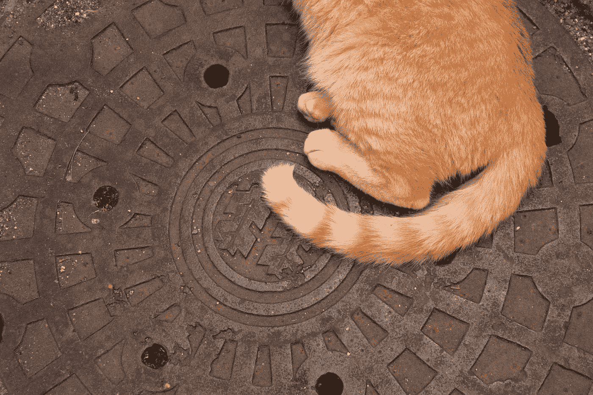

# CSRFs 还是一个东西吗？

> 原文：<https://betterprogramming.pub/are-csrfs-still-a-thing-7e16c09c951a>

## 默认情况下，SameSite 对 CSRFs 的未来意味着什么



[Mak](https://unsplash.com/@mak_jp?utm_source=medium&utm_medium=referral) 在 [Unsplash](https://unsplash.com?utm_source=medium&utm_medium=referral) 上拍照。

[CSRF 漏洞](https://medium.com/swlh/intro-to-csrf-cross-site-request-forgery-9de669df03de)发生在攻击者可以从外部域发起伪造的状态改变请求时。这通常是因为无论请求来自何处，用户的浏览器都会发送会话 cookies。

除了实现 CSRF 令牌来确保请求的真实性，另一种防范 CSRF 的方法是`SameSite`cookie。

# SameSite Cookies

web 应用程序通过一个`Set-Cookie`头指示用户的浏览器设置 cookies。例如，这个头将使客户端浏览器将 cookie 的值`PHPSESSID`设置为`UEhQU0VTU0lE`:

```
Set-Cookie: PHPSESSID=UEhQU0VTU0lE
```

除了基本的“cookie_name=cookie_value”标志之外，`Set-Cookie`头还允许使用几个可选标志来保护用户的 cookie。其中之一是`SameSite`旗，它有助于防止 CSRF 袭击。当 cookie 上的`SameSite`标志设置为`Strict`时，客户端的浏览器将不会在跨站点请求期间发送 cookie。

```
Set-Cookie: PHPSESSID=UEhQU0VTU0lE; Max-Age=86400; Secure; HttpOnly; SameSite=Strict
```

`SameSite`标志的另一个可能设置是`Lax`。这个设置告诉客户端的浏览器只在引起顶级导航的`GET`请求中发送 cookie。如果跨网站请求是有意的，此设置可确保用户仍然可以访问您网站上的资源。

例如，如果您从第三方网站导航到脸书，您的脸书登录帐户将被发送。但是如果一个第三方网站向脸书发起一个`POST`请求或者试图在 Iframe 中嵌入脸书的内容，cookies 将不会被发送。

```
Set-Cookie: PHPSESSID=UEhQU0VTU0lE; Max-Age=86400; Secure; HttpOnly; SameSite=Lax
```

指定`SameSite`属性可以很好地防止 CSRF，因为`Strict`和`Lax`设置都将阻止浏览器在跨站点表单`POST`、`AJAX`请求中以及在 iframes 和 image 标签中发送 cookies。这使得经典的 CSRF 隐藏形式攻击变得无用。

# 默认情况下相同的站点

今年早些时候，Chrome 和其他一些浏览器将`SameSite=Lax`设为默认 cookie 设置，如果 web 应用程序没有明确设置的话。这意味着，即使 web 应用程序没有实现 CSRF 保护，攻击者也无法使用后 CSRF 技术攻击使用 Chrome 浏览器的受害者。

因此，在未来，经典的 CSRF 攻击的效力将大大降低，因为 Chrome 拥有最大的网络浏览器市场份额。

在 Firefox 上，`SameSite by default`设置是一个需要启用的特性。你可以通过进入`about:config`并将`network.cookie.sameSite.laxByDefault`设置为`true`来启用它。

# CSRF 还有可能吗？

是的。即使浏览器采用了`SameSite by default`策略，CSRFs 在某些情况下仍然是可能的。

首先，如果站点允许使用`GET` HTTP 方法的状态改变请求，那么第三方站点可以通过使用`GET`请求创建 CSRF 来攻击用户。

例如，如果网站允许你通过`GET`请求更改密码，攻击者可以在论坛中嵌入这样的链接，诱骗用户点击它:

```
[https://email.example.com/password_change?new_password=abc123](https://email.example.com/password_change?new_password=abc123)
```

在这种情况下，由于点击链接将导致顶级导航，用户的会话 cookies 将被包括在`GET`请求中，CSRF 攻击将会成功。

```
GET /password_change?new_password=abc123
Host: email.example.com
Cookie: session_cookie=YOUR_SESSION_COOKIE
```

另一个场景是站点手动将 cookie 的`SameSite`属性设置为`None`。一些 web 应用程序具有要求第三方站点发送跨站点、经过身份验证的请求的功能。在这种情况下，开发人员可能会显式地将会话 cookie 上的`SameSite`设置为`None`。当`SameSite`属性设置为`None`时，允许跨来源发送 cookie，因此传统的 CSRF 攻击仍然有效。

最后，如果受害者使用的浏览器在默认情况下没有将`SameSite`属性设置为`Lax`(如 IE 和 Safari ),如果目标应用程序没有实施尽职的 CSRF 保护，传统的 CSRF 攻击仍然会起作用。