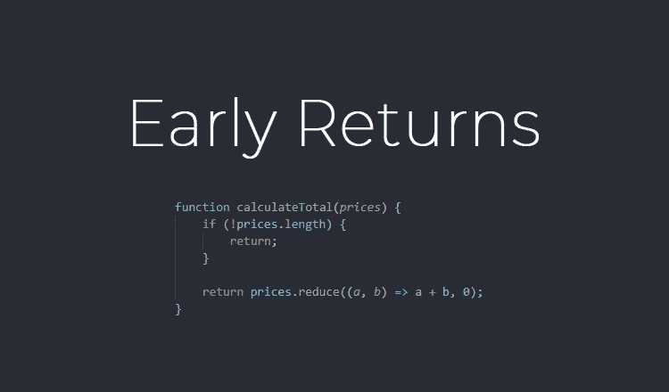

# 提前回报有好处吗？

> 原文：<https://betterprogramming.pub/are-early-returns-any-good-eed4b4d03866>

## 我们应该用逻辑包装我们的代码，然后悄悄地失败，还是经常提前返回？



使用或不使用提前退货。两者都有道理。

当谈到使用早期回报时，程序员往往有强烈的个人偏好。有些人从不使用它们，有些人却对此深信不疑。但是，除了您个人的编程风格之外，还有其他原因吗？

在这篇文章中，我们将讨论为什么你可以考虑在你的代码中使用早期返回。

我们还将讨论为什么一些程序员选择*而不是*使用早期回报。对于如何编写干净的代码，每个程序员都有自己的偏好和观点。

但是在我们开始深入探讨早期回报的话题之前…

# 提前回报到底是什么？

提前返回背后的思想是，编写在函数结束时返回预期正结果的函数。

函数中的其余代码应该在与函数的目的不一致的情况下尽快触发终止。

早归顾名思义。这就是早期回报的样子:

```
function someFunction(someCondition) {
    if (!someCondition) {
        return;
    } // Do something
}
```

但是通常，在编程中，有多种方法可以解决一个问题。这两种解决方案都非常好，没有好坏之分。

提前返回的另一种方式可能是这样的:

```
function someFunction(someCondition) {
    if (someCondition) {
        // Do something
    }
}
```

# 你为什么会考虑使用提前回报？

你可以考虑使用早期返回的一个原因是它可以让你的代码看起来更扁平。如果您选择使用包装 if 语句的替代方法，那么就不需要额外的缩进。这使得代码更具可读性。

使用早期回报的另一个理由是，它让你的差价更清晰。尤其是当您所做的更改会改变缩进时。如果你不喜欢提前返回的方法，你可能会得到一个巨大的差异，而它可能只是几行。

我要为使用早期回报提出的最后一个论点是让程序员安心。通过使用早期返回，您首先得到无效的情况(bouncer 模式)，接下来在那里放一个空行，然后您可以专注于函数的“真正的”主体。

除此之外，当你不使用早期回报时，你只有一个出场点。这意味着你必须一直在脑子里追踪整个代码，直到函数结束。

# 为什么不呢？

另一方面，有一些关于为什么你不应该使用早期回报的争论。我在 Stack Overflow 上读到过一个关于这一点的很棒的评论，几乎涵盖了为什么你会决定不提前返回的大部分原因:

> “一般来说，你希望在一个函数中有尽可能少的返回点。这样做的实际原因是，它简化了您对代码的阅读，因为您可以总是假设每个函数都将接受其参数，执行其逻辑，并返回其结果。
> 
> 在各种情况下输入额外的返回往往会使逻辑变得复杂，并且增加了阅读和完全搜索代码所需的时间。
> 
> 一旦你的代码进入维护阶段，那么当新程序员试图破译逻辑时，多次返回会对他们的生产力产生巨大的影响(当注释稀少和代码不清楚时，这尤其糟糕)。
> 
> 这个问题随着函数的长度成指数增长。"

此评论归功于[马克·凯格尔](https://stackoverflow.com/users/14788/mark-kegel)。尽管这是十多年前[发布的](https://stackoverflow.com/a/355863)，我仍然认为如果你决定反对提前回报，它还是有意义的。

在某些情况下，使用早期回报有些夸张。看一下下面的例子:

```
function setAge(age) {
    if (!age) {
        return;
    }

    this.age = age;
}
```

在这里使用提前返回似乎不太合适。这对您的代码来说可能弊大于利，因为这样做要干净得多:

```
function setAge(age) {
    if (age) {
        this.age = age;
    }
}
```

# 现在轮到你了！

既然我们已经到了这篇文章的结尾，是时候分享你对早期回报的想法了。由于代码风格是主观的，当谈到早期回报时，我对你的观点很感兴趣。

谈到早期回报，你站在哪一边？你是那种喜欢早期回报的程序员吗，因为它能让你的代码保持扁平？或者你更喜欢在你的函数中有一个最大的回报？

来聊聊提前退货吧！