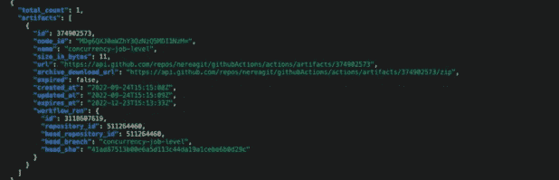

# GitHub 的工作流程是否存在不足？以下是处理并发性的方法

> 原文：<https://betterprogramming.pub/are-githubs-workflows-falling-short-here-s-how-to-handle-concurrency-93a598348333>

## GitHub 中的数据持久性和工作流通信


卢克·切瑟在 [Unsplash](https://unsplash.com?utm_source=medium&utm_medium=referral) 上的照片

我已经和 GitHub 合作了一段时间，管道并不总是像我们希望的那样运行。你是否曾经有过这样的一天，所有的特性和用户故事都需要在你的主分支中关闭和合并？您很可能经历过这种世界末日的场景，每个人都急于完成自己的工作，大量的拉取请求触发了验证和部署。

然而，这并不令您担心，毕竟，您的 CI/CD 流程是自动化的，一切都在顺利运行。

在一个理想的世界中，它应该是这样的，但是实际上，随着时间的推移，GitHub 中的修复、验证和操作的数量最终可能会产生一个瓶颈。我以前也遇到过这种情况，当时我唯一能打开管道的方法就是寻找窒息流程的流程，并杀死那些过时的和重复的流程。

直截了当地说，并发性是在 CI/CD 中工作时经常出现的话题。如果你在敏捷项目中工作，或者在 sprints 中工作，这种场景很可能每两周重复一次。但是，我们能摆脱这种土拨鼠日的局面吗？经过一番挖掘，我得出结论，我们其实可以，管道是有希望的！

> 我们能从这个土拨鼠日挣脱出来吗？

我首先从我以前的经历中找出并发性的来源。我能够识别两个可能的并发触发器:

*   在 GitHub 中，单个拉请求在短时间内触发多个工作流运行。
*   外部系统中的作业是由一个动作触发的，除了手动之外没有办法取消它们。

知道了原因，我开始在 GitHub 和那些由动作触发的外部作业中探索并发性。

## 避免 GitHub 中的并发

第一个问题非常容易解决！您可以配置 GitHub 动作，在运行任何工作流之前检查[并发性](https://docs.github.com/en/actions/using-jobs/using-concurrency)。使用此配置将停止任何正在运行的工作流，并优先考虑最新的工作流。

查看下面的示例，了解它的样子。

## 使用 GitHub 避免外部系统中的并发

停止这种类型的并发有点棘手，因为在 GitHub 中停止动作，在其他系统中不会停止，并且在工作流运行之间没有标准的通信方式。此外，当在另一个系统中触发一个作业时，您很可能只会从那个系统收到一个作业 ID，告诉我们执行已经开始。然后，该 ID 将存储在缓存或临时变量中，一旦工作流运行完成，该变量将消失，但您的外部系统将继续在后台运行。

总之，您有一个正在运行的触发外部作业的工作流，外部系统返回一个引用，该引用存储为临时数据，一旦工作流完成，将无法再访问。幸运的是，我们可以使用像工件这样的容器来存储数据，并在工作流运行之间使用它。

它们在工作流运行之间是持久的，通过最新的 GitHub API 版本，我们可以从我们的操作中访问它们。这正是我所做的沟通工作流程和运行。该流程的基本思想如下，

*   对于当前作业，使用外部系统返回的作业 ID 引用创建一个文件。这里有一个如何做的例子，

```
#replace here the github.run_id by you system's id
- name: Create file with id      
      run: |
         echo "Writing in workflow log file..." 
         echo ${{ github.run_id }} >> WorkflowRunLog.txt
```

*   [使用新文件](https://medium.com/r?url=https%3A%2F%2Fdocs.github.com%2Fen%2Factions%2Fusing-workflows%2Fstoring-workflow-data-as-artifacts)创建工件，并将其上传到工作流运行。您可以使用 actions/upload-artifact@v3 来实现这一点。

```
- name: Upload Workflow Artifact
      uses: actions/upload-artifact@v3
      with:          
        name: ${{ github.head_ref }} # source branch of the PR
        path: WorkflowRunLog.txt
```

*   验证一个并发作业是否正在 GitHub 中运行，并使用本文的第一个配置停止它。继续通过[检索你正在工作的分支的最新神器](https://medium.com/r?url=https%3A%2F%2Fdocs.github.com%2Fen%2Factions%2Fmanaging-workflow-runs%2Fdownloading-workflow-artifacts)，并获得 ID。

```
- name: Get artifact for specific branch
  id: get-artifact
  run: |          
   input_file="WorkflowRunLog.txt"
   artifactFile=$(gh run download -n "concurrency-job-level")
   jobId=$( tail -n 1  ${input_file} )
   echo "${jobId}"
   echo ::set-output name=job_id::$(tail -n 1 ${input_file})
```

在这个例子中，我直接通过名称来下载工件，但是您可以根据自己的规范进行修改。如果您还没有 GitHub API CLI，请不要忘记安装它。

```
#retrieve a specific artifact in a branch
gh api -H “Accept: application/vnd.github+json” /repos/<username>/<repo name>/actions/artifacts — jq “.artifacts[] | select(.workflow_run.head_branch == \”concurrency-job-level\”)”
```



GitHub API 从您的 repo 返回工件信息。

您将看到响应返回了 URL，我们可以从这里下载实际的工件，并访问它包含的信息。使用下面的命令只检索实际的 URL，您可以使用 bash 或其他脚本语言检查信息。

```
#retrieve a specific artifact
gh api -H “Accept: application/vnd.github+json” /repos/<username>/<repo name>/actions/artifacts — jq “.artifacts[] | select(.workflow_run.head_branch == \”concurrency-job-level\”) | {archive_download_url}”
```

如果你已经走了这么远，谢谢你！我希望它是有用的。