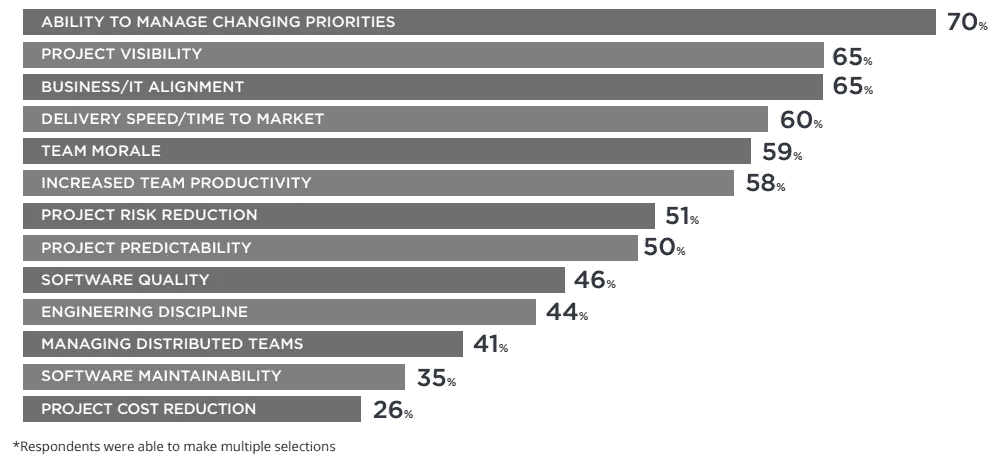
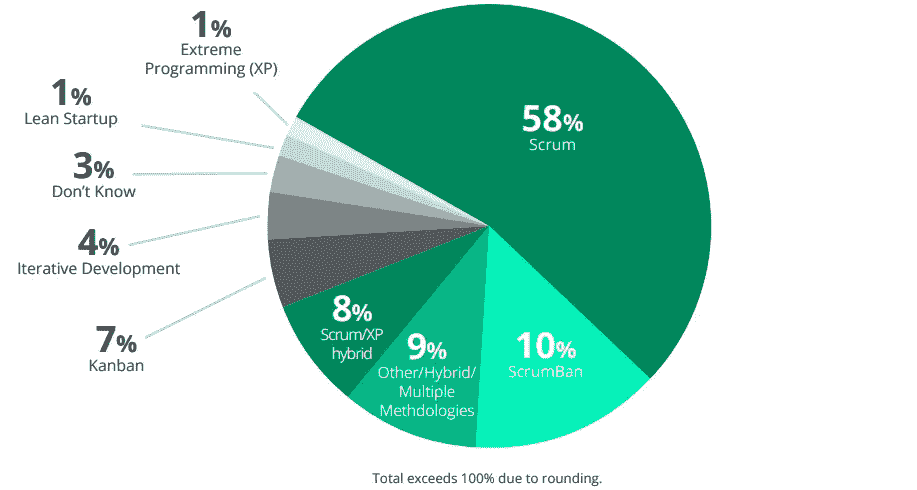
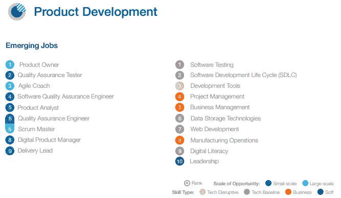
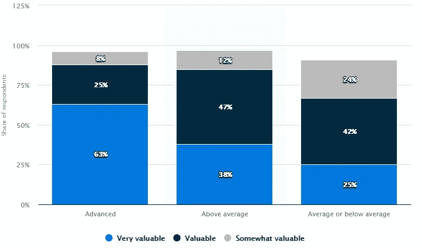

# Scrum Master 认证值得你花费时间和金钱吗？

> 原文：<https://betterprogramming.pub/are-scrum-master-certifications-worth-your-time-and-money-a807c931cd7a>

## Scrum 认证正变得越来越流行，但是专业人士是否对此感兴趣仍有待讨论

照片由 [Siora 摄影](https://unsplash.com/@siora18?utm_source=unsplash&utm_medium=referral&utm_content=creditCopyText)在 [Unsplash](https://unsplash.com/s/photos/study?utm_source=unsplash&utm_medium=referral&utm_content=creditCopyText) 上拍摄。

Scrum 是敏捷的子集。它是敏捷开发的一个轻量级过程框架，帮助团队一起工作，根据明确定义的目标，以迭代的方式交付产品。它描述了一组会议、工具、角色，以及它们如何结合在一起帮助团队组织和管理他们的工作，从而将产品交付给市场。

现在已经有多种认证可以用来评估一个人对框架的技术知识。但是对于那些愿意参加测试的人来说，他们在现实世界中的重要性和价值仍然存在疑问。

在这篇文章中，我将分享一些事实和一些利弊，来帮助你决定是否应该在 Scrum 中认证。

# 业务和敏捷采用

现在，越来越多的组织在他们的工作文化中采用敏捷来革新项目管理和软件开发过程。这导致了对敏捷方法及其众多框架(包括 Scrum)的从业者的需求增加。

根据[第 14 届年度敏捷报告](https://explore.digital.ai/state-of-agile/14th-annual-state-of-agile-report)，95%的回答者说他们的组织实践敏捷开发方法。这些公司已经意识到采用敏捷的各种好处。据报道，最大的好处是*速度*和*适应性*。

根据第 14 届年度敏捷状况调查，敏捷的优势

根据同一份报告的结果，Scrum 仍然是被调查者的组织最广泛使用的敏捷框架，获得 58%的选票，其次是 ScrumBan，获得 10%的选票。

根据第 14 届年度敏捷调查使用的敏捷方法

这支持了一个事实，即 Scrum 现在不仅在技术领域，而且在各种行业都广泛用于项目的执行，包括金融服务、政府、保险、制造、电信、医疗保健和制药、教育、零售、媒体和娱乐、交通、能源等。

# 对 Scrum 的需求

那么未来会怎样呢？Study.com 的一份报告表明，Scrum Master 的角色将会以每年 24%的速度增长，直到 2026 年。这可能会受到软件开发需求不断增长以及对数字和人为因素需求的影响，从而导致新兴技术的采用，进而导致对产品开发相关职业的更高需求。

根据世界经济论坛发布的 [*明日工作:映射新经济*](http://www3.weforum.org/docs/WEF_Jobs_of_Tomorrow_2020.pdf) 中的机会，在 Burning Glass Technologies、Coursera 和 LinkedIn 的帮助下，预计需求大幅增长的新兴产品开发工作中有九分之三与 Scrum 有关。产品负责人、敏捷蔻驰和 Scrum Master 就是这些角色中的一员。

新兴产品开发工作，2020 年世界经济论坛

# 获得认证的可能优势

对于任何职业来说，要获得一个资格证书都需要花费大量的时间和精力。做任何决定时，你都需要权衡利弊。

值得投入所有的精力和金钱吗？考虑获得 Scrum 认证的这些优势，并评估你是否能在你的案例中最大化这些优势。

## 让你在竞争中获得优势

获得认证的好处之一是，它有助于你在入门级别的申请人中脱颖而出。职业生涯越早，证书通常越重要，尤其是当你转行从事新的职业时。与大学学位课程相比，正确的认证课程是一种更容易、更简单、更便宜的学习基础知识的方式。

招聘过程中的竞争往往很激烈。如果你有证书，而其他申请人没有，你就有明显的优势。

## 帮助您保持适销性

用人单位想招谁？归根结底，每个人都想和最有能力、最值得信赖的候选人做生意。当你有证书来支持你的专业知识和对框架的理解时，你就比那些没有同样证书的人领先很多。

2019 年 8 月在美国对 400 名 HR 和 L&D 从业者进行了调查。这项研究的目的是评估 IT 认证在该国的价值。阿恩·休斯在六月份的《统计》杂志上发表了这些结果。

根据该报告，63%接受调查的认为自己在理解和利用技术方面处于领先地位的美国企业认为 IT 证书在招聘过程中非常有价值。

截至 2019 年，美国用于验证技能和支持招聘流程的 IT 认证价值评级

## 有助于提高个人和职业信誉

认证的一个附带好处是，它可以帮助你展示你对职业发展的奉献精神、动力和承诺。它让你成为一个持续的学习者。

能够在你的名字或简历上添加证明有助于你建立自己的品牌，并向潜在客户展示你是可信的。虽然你实际上不需要专门为此目的去获得一个证书，但这绝对是一个积累经验的好方法。

一篇名为 [*的文章提出了一个场景:工作经验与证书——雇主在寻找什么？*](https://www.networkworld.com/article/2303927/work-experience-vs--certifications---what-do-employers-look-for-.html) 网络世界上梁珊写的。

在场景中，有三个人申请网络技术人员/管理员的职位。申请人 1 有超过十年的管理经验，但没有证书。申请人 2 拥有五年多的管理员经验，拥有 CompTIA 的 A+、Network+、Security+和 Server+认证。申请人 3 有一年的网络技术经验，并持有 NT 4 MCSE +互联网认证。

挑战在于根据几个招聘顾问的意见来决定谁最有可能被录用。

申请人 1 和 2 被 Spherion 的德州地区董事总经理 Karen Person 视为该职位的候选人。她说:

> “我们发现，越来越多的客户在寻找有类似(IT)环境经验的人。此外，从文化角度来看，合适的契合也很重要……候选人知道如何在公司和特定团队的独特环境中很好地工作。如今，团队/同事面试在招聘决策中发挥着重要作用。”

休斯顿职业介绍公司 JDA 专业服务公司的总裁詹姆斯·德尔·蒙特也分享了他的观点:

> “有正规教育或证书总比没有好。它表明有一个知识底线，并给那些可能不具备真正合格的候选人的技术能力的技术技能的人以安慰。有相关经验总比没有经验好。因此，理想的人选应该受过该职位所需的正规培训，并有足够的经验来胜任这份工作。”

潜在雇主不仅看重证书或经验，还看重融入组织文化的能力。

# 获得认证的缺点

认证考试有点贵。你需要在获得认证的过程中投入时间、金钱、努力和精力。你需要考虑学习时间，资源，准备资料，练习测试，考试费用。

与可能的好处相比，它几乎没有缺点，但它不能保证任何事情，除非你在你周围有机会的情况下朝着你的目标努力。

# 在你走之前

为了帮助你决定是否获得 Scrum 认证，强烈建议对你的目标雇主进行快速的市场调查，评估你的相关经验和技能，然后根据利弊评估认证是否有益。

虽然我们不能用认证或缺乏认证来筛选出有技能的候选人，但一些雇主可以将此视为明确的证据，表明你知道自己在做什么，或者至少知道基本原则。

认证可能是有益的，但是专业知识的水平和你可以提供的有效项目的数量仍然是不可替代的。