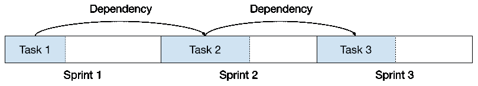

# 短跑会让你慢下来吗？

> 原文：<https://betterprogramming.pub/are-sprints-slowing-you-down-5f404c668017>

## *如何避免冲刺边界带来的不必要的延误*

照片由[布拉登·科拉姆](https://unsplash.com/@bradencollum?utm_source=unsplash&utm_medium=referral&utm_content=creditCopyText)在 [Unsplash](https://unsplash.com/s/photos/sprinter?utm_source=unsplash&utm_medium=referral&utm_content=creditCopyText) 上拍摄

如果你在一个使用 scrum 的地方工作过(现在几乎无处不在)，那么你应该听说过 sprints。如果你听说过 sprint，那么你也会听到这样一句老话:*“我们要等到下一次 sprint 才能做这件事。”*

“但是只要一个小时，下一次冲刺还要两个星期才开始！”你可能会以完全冷静和专业的方式惊呼。

“这是规矩。也许你需要敏捷顾问的培训。”

“但是为什么呢？这违背了常识！”

我们今天在这里回答这个问题，并提供在进程中断时打破僵局的技巧。

# 第一步:承认你有问题

这似乎是显而易见的，因为你看到了这篇文章的标题，并继续阅读，但对一些人来说，这种类型的对话没有什么错。如果你不能对人们说不，那么过程的意义何在？

让我们把这一点说清楚:*如果一个准备工作的重要任务被搁置，你就有问题*。库存是精益的 [8 浪费之一，停滞的任务就是库存。这增加了正在进行的工作和周期时间，减慢了迭代和学习的速度。在 sprint 开始时严格锁定任务范围会导致延迟，并违背 scrum 的精神，即优先实现更高层次的目标。当任务停滞不前时，你应该采取措施改进你的过程。](https://theleanway.net/The-8-Wastes-of-Lean)

# 第二步:测量它

“被度量的东西得到改进”是一个有点被滥用的说法，但是它在这里是适用的。sprint 边界延迟工作的问题很容易被忽视。要了解这个问题在您的团队中有多严重，您应该查看在提交高优先级任务后需要多长时间才能开始，以及正在进行的项目有多长时间处于空闲状态。

你可以从你的项目管理系统中手动查看数据，或者从数据中构建 DIY 报告，如果在像吉拉这样的系统中很容易访问的话。还有更高级的解决方案，如[athensian](https://www.athenian.co/product/quality-insights)(提供关于修复 bug 的时间的数据)和 [Allstacks](https://www.allstacks.com/) (通过高级燃尽报告和警报跟踪项目进度)。

# 第三步:尝试用计划来解决它

scrum 的意图不是减慢速度，但这可能是结果。冲刺的界限是为了更好的计划而作为一个强制功能，强制意味着在必要的时候挥舞大棒。如果营销团队希望在一天结束前完成他们已经筹备了一个月的活动的开发任务，那么说不以避免产生道德风险可能是一件好事。

在这种情况下，它迫使他们更早地通知开发团队，以便他们的任务可以有效地实现，而不会中断将来的其他工作。

然而，利益相关者并不是唯一的规划违规者；计划外的任务通常来自团队内部。如果一个团队计划了组件 A，并在 sprint 结束前完成了它，但未能计划项目的下一个组件，严厉的爱可能会帮助他们学会在未来更好地收集需求。

然而，总会有一些任务对之前的工作有很强的依赖性，比如修复尚未编写的模块中的 bug。在这里，scrum 的强迫功能迫使你延迟工作或者中断过程。如果相关任务比 sprints 短(这是不可避免的)，那么您最终得到的项目时间表如下所示:

# 步骤 4:调整你的流程

低功能团队可能只是举手投降，接受这个问题作为一种生活方式，但是任何高功能团队都遇到过这个依赖问题，并找到了解决它的方法。以下是一些常见的方法:

## 选项 1:中断冲刺

这是最简单的:只需将下一个任务添加到 sprint 中，并删除其他任务。这样做的一个缺点是浪费了其他任务的计划工作，这些任务被踢出了 sprint。此外，如果你养成了中断冲刺的习惯，这可能会降低 scrum 作为更好计划的强制功能的效率，并导致所有 scrum 应该避免的效率问题。

这可以通过明确只有产品负责人可以中断 sprint 来缓解，并且只对那些事先不知道的紧急任务(例如，关键的 bug 修复)和与其他当前 sprint 任务有很大依赖关系的任务进行中断。同样重要的是，对团队在冲刺开始后增加的任务的速度给予信任；否则，即使这是正确的做法，他们也会抵制这种做法。

在一天结束时，打破冲刺解决了眼前的等待问题。这不太理想，但对于真正未知的紧急任务来说可能是必要的。

## 选项 2:在 sprint 下工作

不管你遵循什么过程，总有一些任务很小，以至于在你的项目管理系统中没有意义。像“编写这个函数”和“更改变量名”这样的事情通常由开发人员在更大的范围内处理。

打破依赖关系并在当前 sprint 中安排下一个任务的一个方法是不指定它。不知道在项目结束时你必须修复哪些 bug？提交一张“为 X 修复 bug”的票，给它一个相当于 sprint 速度一半的故事点数。

这种方法有所有明显的不规范问题。您失去了对实际需求进展的所有评估和可见性。这可能会避免延误项目工作，但并不能真正解决问题；它只是把它扫到了地毯下面。

## 选项 3:在冲刺阶段填充不足

如果你在 sprint 中做计划，不知道会出现什么任务，但想马上开始，那么你可以在 sprint 中留出空间，以后再添加。这是选项 1 和 2 的一个不那么混乱的版本，在这里你基本上承认冲刺的界限是错误的，并在中途计划更多的工作。

虽然这更干净，但也有一些缺点。额外的冲刺空间是没有记录的，所以看起来团队可能计划完成更少的工作，或者有一些空间可用于最后一分钟的营销任务！团队可能明白发生了什么，但是这种方法由于缺乏透明度而可能会产生问题。

## 选项 4:占位符

理论上，最好的计划方式是利用你拥有的所有信息——代表存在的不确定性，而不是排除低信心的信息。您可以在 sprint 中通过为尚未准备好工作的任务创建占位符票证来实现这一点。

这种方法的美妙之处在于，每个人都可以看出您打算做这项工作，但是这项工作只有在占位符被替换为满足正常任务的规范和评估要求的标签之后才会开始。然后，在 sprint 结束的时候，只要忽略原来的占位符，把替换它们的票当作它们在开始的 sprint 中，就可以进行正常的 sprint 回顾和速度度量。

# 第五步:减少工作量

如果你已经消除了 sprint 边界的延迟，但仍然经历了长时间的响应或缓慢的项目，那么你的团队可能有太多的工作。这是另一天的主题，但重要的是要认识到，再多的流程优化也无法让骆驼穿过针眼。

# 结论

使用占位符的方法减轻了避免冲刺边界延迟的其他方法所带来的问题，而不会破坏 scrum 的好处。然而，仍然有一些基本的限制。如果实际任务的工作量与您的最佳猜测占位符估计不同(例如，发现的 bug 比预期的多)，那么您可能需要在 sprint 中添加更多的任务或者删除一些任务。

没有魔法水晶球，真的没有办法解决这个问题——这就是生活。然而，对于团队和经理来说，重要的是要认识到，每次冲刺中的一点不确定性比保证的低效率要好。