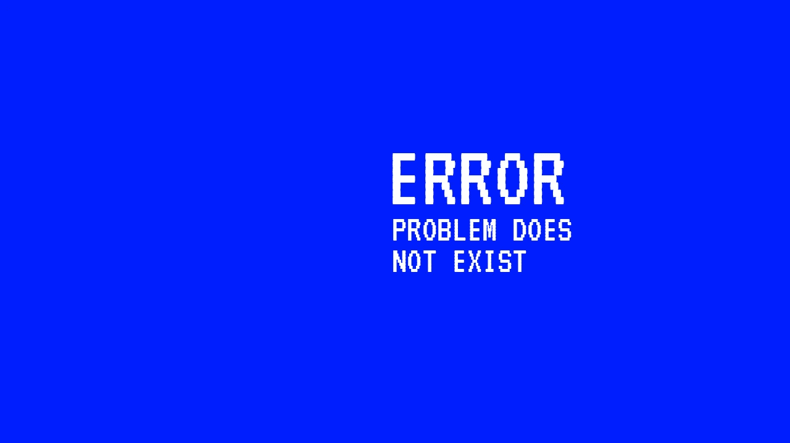
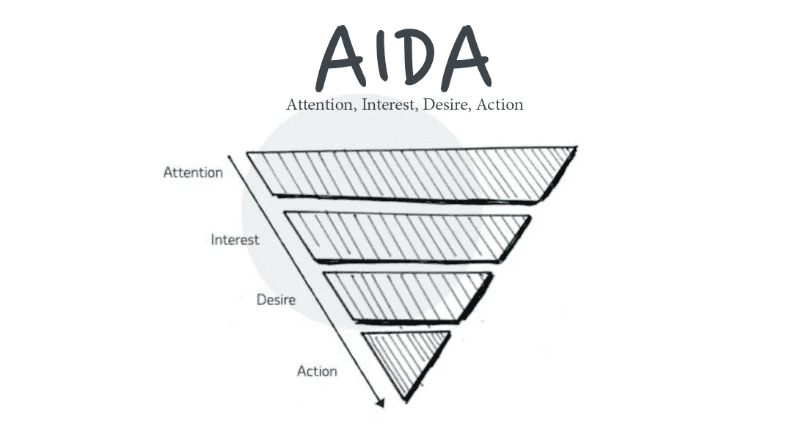
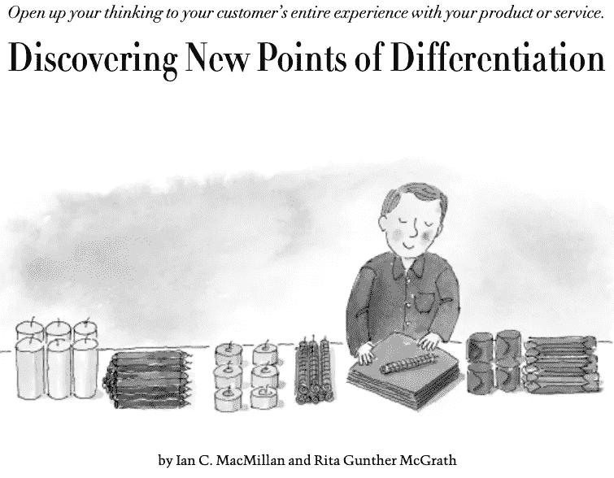
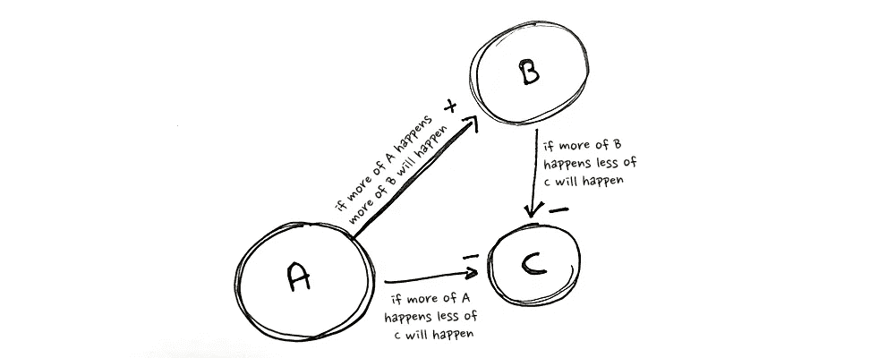

# 你在解决不存在的问题吗？

> 原文：<https://betterprogramming.pub/are-you-solving-problems-that-dont-exist-c36685ad8c8b>

## 当事情不顺利时，我们会责怪解决方案还是问题？

图片由胡庆炉·坦诺拍摄

雷姆科·维穆伦说过“75%的创业公司失败是因为他们解决了根本不存在的问题。”这是否适用于所有企业，而不仅仅是初创企业？如果不是 75%，那么是 35%还是 24%？

> 我们是否在虚构的问题上花费了太多时间，这些问题永远不会成功，因为它们只是想象而已？

怎么会这样？我们怎么能如此持续地投资于不存在的问题呢？

# 1.不是你；这是你的模型

每一个决定都是基于对世界的假设。当他们做决定时，没有人面前有一个精确的 1:1 的世界模型，所以我们使用一个镜头和一个过滤器来将一些信息融入我们希望真实的真实世界的叙述中，并采取行动。我们称这些为心智模型(2)。

> “心智模型是我们理解世界的方式。它们不仅塑造了我们的想法和理解方式，还塑造了我们看到的联系和机遇(2)。”—法南街

为了共同做出决策，我们有时会将我们的见解和理解外化到可视化和/或组织世界的模型中，例如，客户旅程、业务模型、人物角色、SWOTs 等。

freepik.com free pik 的客户旅程地图模板

然而模型的挑战在于它们是简化的，它们必须是简化的。他们过滤掉可能有意义的信息，而我们甚至都没有注意到。

正因为如此，每个模型都有偏差。它为你决定哪些信息是重要的，哪些是不重要的。如果你的模型是错误的，你的完美解决方案将是解决一个存在于你的模型中而不存在于其他地方的问题。

> 你的完美解决方案将是解决一个存在于你的模型中而不存在于其他地方的问题。

# 2.客户模型是风险最大的模型

1898 年，E. St. Elmo Lewis 发表了 AIDA 模型(3)。这是一个线性的，连续的，层次模型，几乎没有实证支持，并已被发现是一个消费者行为的穷人预测(7)。尽管如此，它仍然获得了大量的关注和使用，甚至直到 124 年后的今天，以及几场技术和社会革命之后。

胡庆炉·坦诺插图

我认为它受欢迎的原因是因为它简单。因为我们希望这个世界和我们的工作变得简单，即使它并不简单。但是简单的模型更糟糕，因为它们增加了信心，减少了挑战我们自己的假设和学习的欲望:

> “如果我们简单的故事塑造了我们注意到的数据，以及我们包装这些数据的方式，我们对正确的自动感觉就会锁定我们的信息搜索”——詹妮弗·陈嘉炜·伯杰，解开领导思维陷阱(4)

1997 年，McMillan 和 McGrath 发表了文章“发现新的差异化点”(5)。它引入了消费链，也就是后来被采用的顾客之旅。这种模式给了组织一个机会来阐明他们自己对他们假设的客户正在做什么的叙述，并引导他们为企业(而不是他们自己)创造价值。

> 该公司既是旅程的调查者、想象者和叙述者，以近乎机器人般的美丽将顾客组织成整齐的流程，他们在其中折叠成线，随着英国排队文化的完善，cogly 穿过流程并进入公司的口袋。—作者

从文章[发现新的差异化点，HBR](https://hbr.org/1997/07/discovering-new-points-of-differentiation)

顾客之旅可视化了顾客的购买途径，并极大地简化了团队寻找问题并加以解决的过程。

不幸的是，很难确认这是对现实的公平再现。

例如，在 2012 年，Google 和 Shopper Science 调查了 3000 种购买途径，发现甚至没有两个客户遵循相同的途径(6)。

> 例如，客户之旅可能将客户描绘成生活在一个单一的世界中，一个简单的问题需要通过一个不存在的问题的线性路径来解决。从客户的角度来看，没有人是有线电视的客户购买，加入和搅拌。他们是在漫长的一天工作后的詹妮尔，孩子们想坐下来，放松一下，无意识地娱乐一下，也许会得到一个笑声，巧克力棒或一杯百事可乐的奖励。
> 
> 第二个例子，在几年前我自己的一次分析中，我发现我们的客户在做出对我们重要的关键决策时受到 35 种不同力量的影响。我进行分析的公司甚至不存在于决策本身中(即使所有以前的模型都反映了它们的存在，有时甚至是唯一的影响力)。
> 
> 第三个例子，通常你的客户不是在一次旅行中的一个地方，而是在许多次旅行中的同一时间的许多地方(所有的事情，所有的地方，所有的时间)。所以心流和成熟的逻辑被打破了。比如:你现在正在计划多少次未来的旅行？或者，如果你是一名治疗糖尿病患者的医生，你现在正在治疗多少患者(答案可能是几十个或几百个)？

# 3.模特是签约艺术家，画出我们想看到的画面

大多数顾客根本不是顾客；他们是人(7)。例如，晚上他们去睡觉，他们中的许多人在同一个床垫上睡了几年甚至几十年。他们每天晚上都使用床垫来休息和恢复精力。有的背痛，有的压力大，有的一起睡，有的一个人，有的睡不着，有的在床上躺几天，有的吃冰淇淋，有的交媾，有的看电视。他们最不可能(即使在某些时候)成为新床垫的顾客。对他们来说，最重要的不是买新床垫，而是使用能完成工作的床垫。

> 大多数顾客根本不是顾客；他们是人

如果该模型将叙述从对客户重要的东西(企业开展业务的原因)改变为企业如何获得报酬(交易的产出)，它可能仍然是正确的模型。我们只需要绝对确定它是——特别是如果我们依赖于我们的客户，并希望确保我们正在为他们解决存在的问题。

> 我们是否依赖我们的客户，需要为他们解决存在的问题？

# 4.没有简单的解决方法吗？

是的，有:选择一个合适的模型，并进行实验以确保它确实合适。

## A.选择正确的模型

> “数据先于框架。”戴夫·斯诺登(8)

模特面临的最大挑战是我们选择她们，而不是她们选择我们。我们熟悉一些我们倾向于反复使用而不评估它是否正确的方法。

对模型有很好的了解(你可以在这里阅读更多的)并且有一个过程来评估哪种模型适合给组织一个好的起点。

> 模特面临的最大挑战是我们选择她们，而不是她们选择我们。

就我个人而言，我经常使用因果循环图(9)来收集和绘制组织对我们正在调查的主题的看法。这是一种相当中性的方式来识别假设存在的因果关系以及它们之间的联系。然后，根据出现的系统，我们找到合适的模型，一路测试它，以确保我们在一条好的道路上。

胡庆炉·坦诺的因果图插图

## B.实验

不是每个决策者都承认他们在做假设；有些人认为他们的知识合成是事实。这样做，他们削弱了组织的学习能力。

> “如果管理者‘相信’他们的世界观是事实，而不是一套假设，他们不会公开挑战这些世界观”——彼得·圣吉，第五条纪律(10)

最危险假设测试(11)试图解决这个问题。它有助于组织询问和发现“问题的真实性取决于什么？”。它产生了一个组织可以优先考虑、评估和测试的假设列表(12)。

> “传统模式的策略是关注这样一个问题:什么是真的？制定和做出战略选择的一个更有效的模式是关注选择背后的逻辑，问自己:什么必须是真的？”——罗杰·l·马丁，一种新的思考方式(13)

## C.简单的更好，对吗？

也许不是。虽然模型从噪音中过滤信号，给我们清晰和自信，但它也可以消除好奇心和学习的意愿。

我们的模型越简单，测试它可能就越重要。简单不是质量的标志(14)，它只是模型制作者和使用者心中的一种情感上的舒适感。

> “你对某件事的正确感，那种确定性的闪闪发光的清晰感，不是一种思维过程，不是一种推理过程，而是一种与你是否正确无关的情感。”—解开领导思维陷阱(4)

所以，你的模型越简单，测试它就越重要。

# 摘要

我们如何知道我们是在解决一个真实的问题，一个想象的问题，还是一个不重要的问题？我们必须做到以下几点:

1.  通过将我们用来解释这个世界的模型外在化，找出我们对这个世界的真实想法(例如，一起写在纸上)
2.  确定我们的模型必须为真的关键潜在假设
3.  测试它们

# 来源

(1).https://remkovermeulen.com/的雷姆科·维穆伦

(2).心智模型，https://fs.blog/mental-models/[法南街](https://fs.blog/mental-models/)

(3).AIDA-marketing，维基百科，[https://en . Wikipedia . org/wiki/AIDA _(marketing)](https://en.wikipedia.org/wiki/AIDA_(marketing))

(4).解开领导力思维陷阱，詹妮弗·陈嘉炜·伯杰，[https://www . culturing Leadership . com/book/unlock-Leadership-mind traps](https://www.cultivatingleadership.com/book/unlocking-leadership-mindtraps)LinkedIn

(5).发现新的差异点，HBR，[https://HBR . org/1997/07/发现新的差异点](https://hbr.org/1997/07/discovering-new-points-of-differentiation)

(6).一切事物的数字化——对购买者旅程和营销角色的影响，[https://www . SAS . com/no _ no/insights/articles/marketing/digital-of-everything-buyers-journey . html](https://www.sas.com/no_no/insights/articles/marketing/digitization-of-everything-buyers-journey.html)

(7).顾客只是一个附在身上的钱包，[https://everythingnewisdangerous . medium . com/what-thoughts-do-you-wish-create-383 a 845 f29e 8](https://everythingnewisdangerous.medium.com/what-thoughts-do-you-wish-to-create-383a845f29e8)

(8).赛尼芬的起源——第二部分，【https://thecynefin.co/part-two-origins-of-cynefin/ 

(9).因果循环图，【https://www.transentis.com/page/causal-loop-diagrams】T4

(10).第五项修炼，彼得·圣吉，[https://en.wikipedia.org/wiki/The_Fifth_Discipline](https://en.wikipedia.org/wiki/The_Fifth_Discipline)

(11).最有价值球员死了。老鼠万岁，Rik Higham，[https://hacker noon . com/the-MVP-is-dead-long-live-the-RAT-233 D5 d 16 ab 02](https://hackernoon.com/the-mvp-is-dead-long-live-the-rat-233d5d16ab02)

(12).这篇文章包括一个关于如何将你的问题分解成要测试的假设的指南。[https://everything newis dangerous . medium . com/how-to-write-a-customer-value-proposition-part-3-testing-it-and-personal-learnings-93aa 90 fdf 434](https://everythingnewisdangerous.medium.com/how-to-write-a-customer-value-proposition-part-3-testing-it-and-personal-learnings-93aa90fdf434)

(13).一种新的思考方式，罗杰·l·马丁，[https://store . HBR . org/product/a-New-Way-To-Think-your-guide-To-superior-management-effectiveness/10565](https://store.hbr.org/product/a-new-way-to-think-your-guide-to-superior-management-effectiveness/10565)

(14).[https://www.youtube.com/watch?v=UuRxRGR3VpM 认为，美学是好模特的标志](https://www.youtube.com/watch?v=UuRxRGR3VpM)