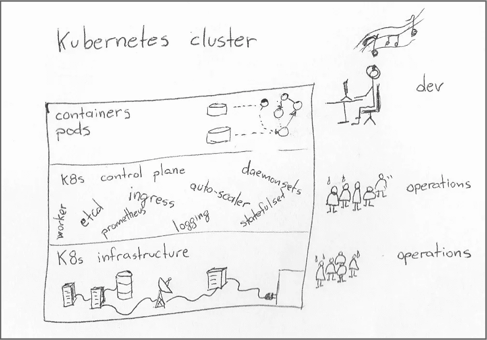
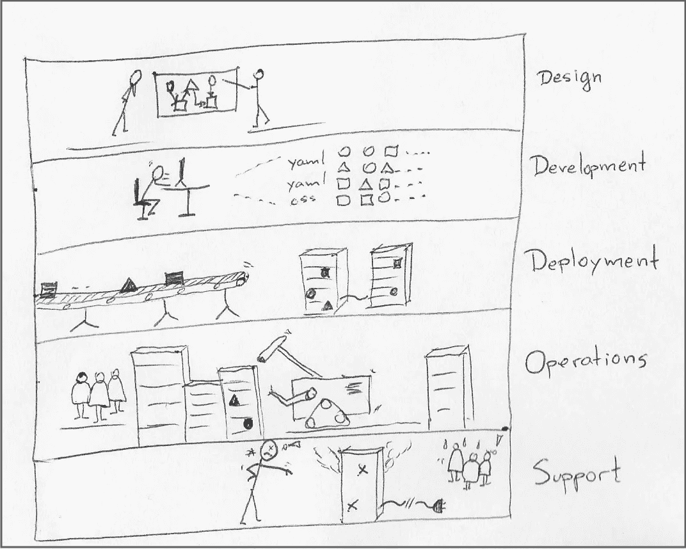
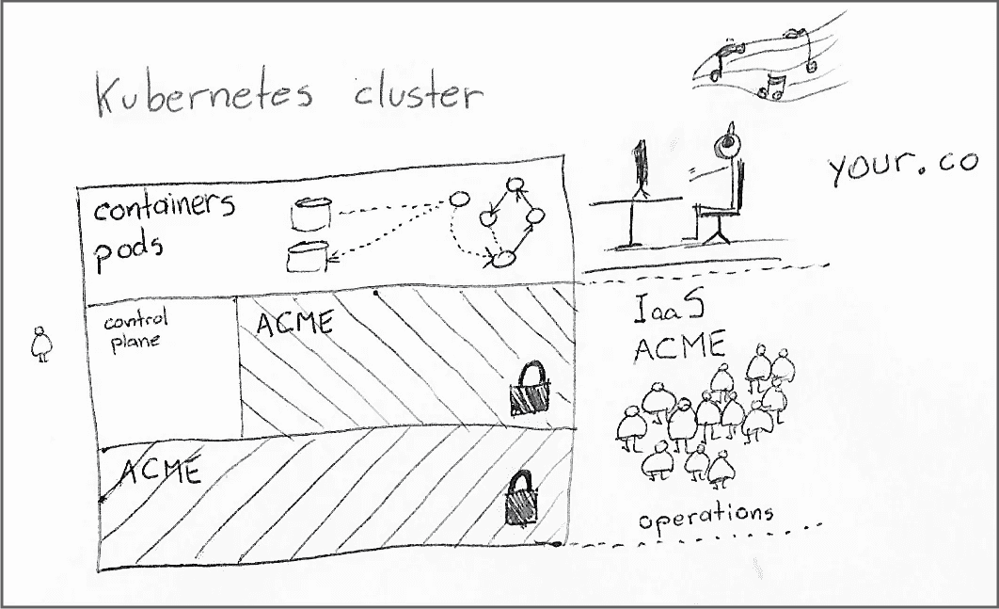
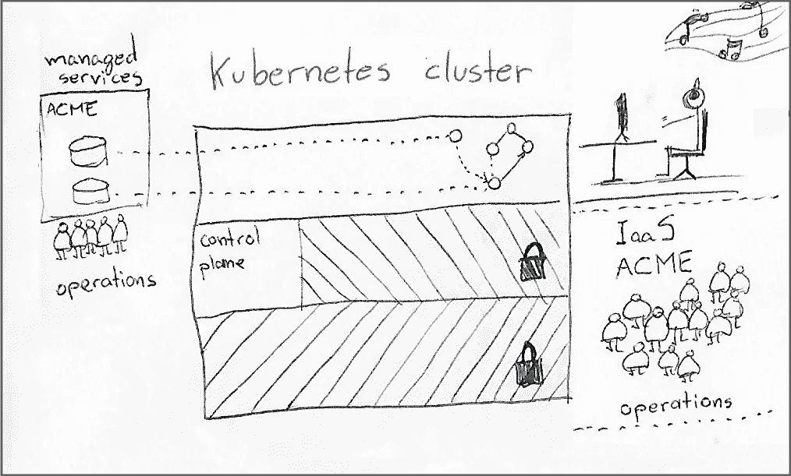
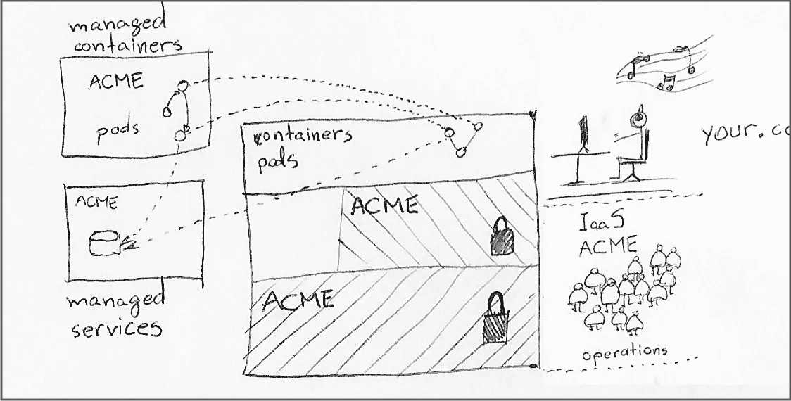
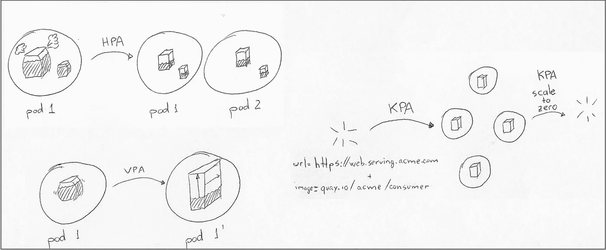

# 你在 Kubernetes 上花费太多了吗？

> 原文：<https://betterprogramming.pub/are-you-spending-too-much-on-kubernetes-179d703ec5c5>

## 可能吧，是的。

维塔利·塔拉诺夫在 [Unsplash](https://unsplash.com?utm_source=medium&utm_medium=referral) 上的照片

任何运行 Kubernetes 集群的人都知道，保持一切在线需要在硬件和操作人员方面的持续投资。这种投资水平使 Kubernetes 保持在为管理大型环境的公司保留的架构图的稀薄层中，这些公司通常处于需要在内部运行它们的受监管行业中。

当选择 Kubernetes 还是 Docker 时，[选择 Kubernetes 的决定很简单](https://diginomica.com/docker-loses-first-mover-advantage-kubernetes)，但是几波新的和复杂的托管服务否定了许多支持这些决定的假设，从成本到安全性到可靠性。

如今，有许多可行的替代方案来调度基于容器的工作负载，而无需从头开始运行整个集群堆栈。

运行 Kubernetes 集群需要跨不同抽象层的许多不同技能。

我收集了一些关于运行容器的最具成本效益和无摩擦的方式的常见主题，无论是否在 Kubernetes 集群中，都提供了一个可以实现这些的景观视图。

# 一件产品的实际成本是多少？

在讨论独自运行整个 Kubernetes 集群是否仍然有意义之前，有必要分解开发一个产品的重要阶段。

不同的人以不同的方式对这些阶段进行分组，但让我们使用一个通用的安排作为这个故事的背景:

1.  **设计**。最终用户体验、系统组件的规范及其交互。
2.  **发展**。编码、功能测试、最终用户文档和系统集成商文档。它还包括支持开发活动的持续集成管道。
3.  **部署**。将开发版本投入生产。它包括持续的输送管道。
4.  **操作**。与运行系统相关的一切，包括硬件和人员。
5.  **支持**。处理客户造成的产品故障。

参与产品周期的人在做决策时通常不会考虑业务的所有部分。产品负责人必须持续评估所有层面的机会(或新特性)成本。

请注意，不同的团队和组织可能共同拥有这些阶段。例如，购买软件作为许可证的客户拥有大部分“部署”和“操作”阶段。

# 第一课:金钱是廉价的。时间不是。

在讨论资源时，我们必须承认金钱和时间是交织在一起的。

向任何系统增加资本都需要良好的信用和合理的商业计划。另一方面，向系统添加更多的“时间”资源可以采取多种形式。例如，你可以雇佣一家咨询公司，雇佣更多的人，或者采购提高生产力的工具和服务。矛盾的是，在产品周期中增加更多的“时间”能力需要付出努力和时间。简而言之，你不能像增加货币供应量那样快速地增加你的“时间”能力。

当做出将成本从一个产品阶段转移到另一个产品阶段的决策时，考虑转移的性质，并问自己:

*“它会增加资本支出还是时间支出？”*

至关重要的是要认识到，周期早期阶段的决定对后期阶段的影响特别大。在“设计”阶段添加现成的中间件组件可能会降低“开发”阶段的成本，但也会增加“运营”阶段的费用。我在“[中提到过这个场景，问了一个错误的问题:开发人员应该随叫随到吗？](http://sourcepatch.blogspot.com/2021/09/asking-wrong-question-should-developers.html)”。

**收获**:只要你还在管理时间，就继续关注机会*。如果你的资本用完了，你可以获得贷款，也许可以稀释所有权，然后再试一次。另一方面，当你用完了所有的人，这就是这条线的终点。*

# 第二课:90%的无就是无

专注于产品周期某一阶段的人通常缺乏对其他领域最重要的事情的认识，并且倾向于几乎完全专注于他们专业领域的改进。

对系统架构的改进可能听起来很棒，比如从 Kubernetes 集群中的固定 pod 分配转变为使用托管容器服务的动态容器调度。这些改进中有许多确实很棒，但是我们必须总是停下来考虑对产品生命周期后续阶段的影响。

例如，如果您的产品在 R&D 方面负担很重，比如一个医疗决策平台，而 IaaS 法案仅占总预算的 5%，那么即使这些成本减少 50%也不会产生很大的影响，特别是当您将实现这些节省所需的投资考虑在内时。

在这种情况下，优化工作应该从“开发”阶段开始，而不是从“运营”阶段开始。虽然像我们这样关心开发和基础设施的人可能很难接受它，但在某些情况下，像改进的电子表格模板这样的东西比修改部分系统架构更好。阻止技术人员做出这种权衡的激励应该有他们自己的故事。

**要点** : Kubernetes 的采用是达到目的(运行工作负载)的一种手段，而不是唯一的方式，即使对于大量采用者来说也是如此。在任何给定的业务中，许多重要的流程仍然在其他地方运行，比 Kubernetes 集群更关键，消耗更多的资源。

# 第三课:考虑托管 Kubernetes 服务

Kubernetes 非常擅长将数据中心进一步虚拟化为一组完善的可移植 API，这大大简化了静态资源的所有权，但您仍然拥有一切。当存储磁盘出现故障时，集群中相应的持久性卷也会出现故障，您需要了解这两方面的人来诊断和修复每一层中的问题。

为了强调这一点，前几天我正在编写一个 Terraform 模板，以创建安装 Kubernetes 集群所需的所有 IaaS 资源。最后的统计是将近 100 个资源，包括 DNS 记录、子网、安全组、负载平衡器、网络网关等等。模板变得如此广泛，以至于现在需要一个专门的 CI 流程来验证更改，然后再将其应用到生产系统中。

借助托管 Kubernetes 服务，您不再拥有底层基础架构资源，如 VPC(虚拟私有云)、虚拟机、磁盘和网络。这种转变将管理成本(占用基础设施资源的时间更少)转变为运行时成本(服务提供商向您收取运行所有基础设施的额外费用。)

有了托管的 Kubernetes 服务，底层基础设施和部分控制平面被锁定，并对服务提供商以外的任何人保持只读状态。您的公司仍然可以访问群集，包括控制平面的许多部分，例如能够添加存储类和守护程序集。

这里的决定性因素是部署的规模。当您只需要少数几个集群时，建立 CI/CD 渠道来验证新版本的集群和培养一整班待命工程师(12-18 人)在财务上毫无意义。一旦你达到十个或更多，它*可能*为整个 Kubernetes 运营团队配备人员并在内部发展这种做法是划算的。

**外卖**:托管集群在成本和所有权之间提供了一种不同的平衡，使得即使是久负盛名的 Kubernetes 商店[也在考虑他们的选择](https://www.infoworld.com/article/3664052/why-mercedes-benz-runs-on-900-kubernetes-clusters.html)。

# 第 4 课—首先是无状态，其次是无服务器

分析 Kubernetes 集群中的工作负载，并渴望将所有东西都转移到同一个 IaaS 中的容器服务，这很有诱惑力。

使用托管容器服务可能非常适合无状态和短期工作负载，例如将一页文本从一种语言翻译成另一种语言的微服务。不过，如果您咨询您的运营团队，他们可能会告诉您，有状态工作负载是他们最大的担忧来源，也是他们花费大部分工程工作的地方。这些是您的数据库和消息传递集群，它们具有复杂的存储、备份、归档、升级等过程。

在集群中运行有状态依赖比运行无状态工作负载要复杂得多。备份、存档、灾难恢复和升级等工作需要专业技能、详细规划和持续维护。

回想一下第 2 课(“90%的无就是无”)，首先处理无状态工作负载可能不会导致产品“运营”周期的总体预算有意义的减少，因此考虑首先处理有状态工作负载。

这些工作负载不太适合无服务器模式，因为计算方面(CPU)位于 pod 内部，再加上装载的存储卷。在这种情况下，起点是用 IaaS 中的服务替换这些工作负载，比如使用 PostgreSQL 或 Kafka 的托管实例。

请注意，这种转移仍然会留下剩余的运营成本，例如需要监控服务的健康状况，并建立适当的程序来跟踪服务中的故障的最终问题。尽管如此，这些活动需要的人员较少，并且不需要深入了解服务运行时。

**要点**:评估您的总体产品成本中有多少花费在数据中心的每项服务上，从设计到支持。然后评估从专业提供商那里租赁服务是否成本更低(同样，就总成本而言)。

# 第 5 课—虚拟库伯勒

尽管这种服务并没有遍及所有的云提供商(见例子[这里](https://azure.microsoft.com/en-us/services/container-instances)和[这里](https://docs.aws.amazon.com/eks/latest/userguide/fargate-getting-started.html)，这种类型的服务是对托管 Kubernetes 服务的巧妙补充。虚拟 Kubelets 扩展了集群调度服务，以便在 IaaS 中的其他地方运行选择容器，而不是在集群节点内部。

对于那些不准备将整个系统重新构建为服务组合，但仍然需要保留 Kubernetes 集群一段时间的场景，这是一个非常好的解决方案，其额外的优势是尽可能减少固定工作节点的数量。

由于这种方法重用了 Kubernetes 的开发和部署 API，因此过渡到无服务器模型的成本是最小的。

使用虚拟 kubelet，有人可以在托管集群中创建新的工作负载。服务提供商使用额外的用户配置来决定是在集群内部还是在服务提供商云中的其他地方调度 pod。

**要点**:如果您已经开始使用托管 Kubernetes 集群，请确定那些不常运行且不需要在集群内部运行的工作负载。让服务提供商在集群外安排相应的 pod，然后取消分配您为其预留的任何固定集群容量。

# 第六课:自动缩放所有事物

如果您已经做到了这一步，那么您的工作负载就不能明智地移出 Kubernetes 集群。剩下的唯一任务是消除集群内浪费的容量过度配置。

例如，如果您的集群有十个工作节点，并且它们的资源利用率(CPU、内存或磁盘)都在 90%以上，那么临时失去一个工作节点意味着集群无法再调度所有的 pod。

现在，还记得我提到的运营总成本吗？不可安排的 pod 可能会导致其他系统出现问题，并促使几个人来处理这种情况，从联系支持的客户到自动监视器呼叫人员来调查这一问题。

这种认识促使系统管理员过度配置容量，以将这些利用率降低到更安全的水平，可能低于 70%。

当您更仔细地观察这个已经不太理想的利用率时，实际的浪费量就变得更加明显，因为您意识到相当大的一部分资源被永久地分配给了[容器资源请求](https://kubernetes.io/docs/concepts/configuration/manage-resources-containers/#requests-and-limits)，而不管请求资源的容器是否完全利用了它们。

进入单元和集群的自动扩展，这允许容量更接近请求量和实际资源利用率。

我在[这个故事](https://dnastacio.medium.com/kubernetes-resources-1a1fa1e72dcf)中介绍了自动缩放选项，但是快速回顾一下，您需要考虑:

*   HPA (Horizontal Pod Autoscaling):根据工作负载容器中的资源利用率调整工作负载的副本数量
*   VPA(垂直容器自动缩放):在无法修改容器副本数量的情况下修改容器大小。
*   KPA (Knative pod autoscaling:)基于每秒请求目标调度容器，如果暂时没有挂起的请求，可以选择将部署缩减到零。
*   集群自动扩展:根据资源请求和利用率扩展工作节点池。

Pod 自动扩展技术可自动调整容量以匹配工作负载。当与集群自动伸缩配合使用时，它们允许运营团队使用更少的节点运行容器。这种影响在 IaaS 账单上更加明显，因为集群节点数量的微小变化对管理集群所需的工作几乎没有影响。

**外卖**:自动缩放并不适合所有人；做好这件事需要努力。这是大规模部署的一个选项，在大规模部署中，运行时成本的节省抵消了部署和调整自动缩放器的投资。

# 结论

Kubernetes 是 IT 基础设施中引人注目的一部分，优化资源利用可能是降低成本的一个诱人的起点。

请抵制诱惑，从最明显的目标开始，花时间了解产品的总运营成本及其在产品生命周期多个阶段的分布。

负有设计和开发责任的团队必须掌握其他阶段是如何工作的，并且在做每一个决定时都要考虑项目的总体成本。

对于小型运营团队来说，将整个系统层转移到 IaaS 供应商可能是一个明智的选择，在这些团队中，不可能为所有层的技术人员配备 24x7 随叫随到的轮班人员。在自托管集群上采用托管 Kubernetes 是一个很好的起点，而有状态工作负载是一个很好的第二步。

**如果你喜欢这个故事，你可能会喜欢另一个关于云计算的故事。**

 [## 你要离开云了吗？

### 为未来的长途旅行做好旅行准备。

better 编程. pub](/leaving-the-cloud-ad816640d5c3)