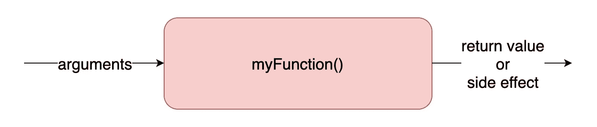
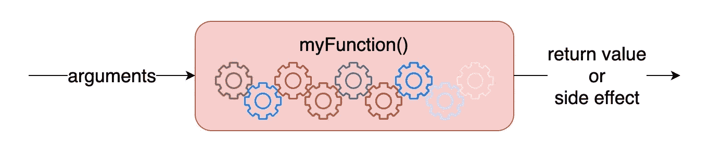

# 你的单元测试变得多余了吗？以下是如何有效地写它们

> 原文：<https://betterprogramming.pub/are-your-unit-tests-getting-redundant-heres-how-to-write-them-effectively-a4d98234ec94>

## 忙碌生活中减少工作的一个令人信服的理由

生活中有很多事情要做。任何时候我们可以给自己一个喘息的机会，我们很容易把它当成一个受欢迎的改变。工程师在单元测试方面的职责也不例外。

根据我的观察，我见过太多的跨项目、跨公司、跨领域的单元测试，这是多余的。多余多余。这些测试需要承担更大的维护责任，并且更容易出现不必要的故障。

本着在生活和工作中有很多事情要做的精神，当我们能够更聪明地工作，而不是更努力地工作时，好工作的真正优点就来了。在这篇文章中，我将分解我在单元测试中看到的常见错误，并揭示如何在保持相同覆盖率的同时简化您的方法。

# 单元测试的要点

在日复一日的编写单元测试的过程中，很容易忽略全局。为了平衡我们的理解，让我们花点时间回顾一下业界是如何推荐我们的单元测试的，以及它们的目的。

为了便于说明，请将这个表示函数的图表视为我们的测试单元:

单元测试的理想流程

从一个单元测试的角度来看，这是它应该看到的。该函数有一些输入，导致返回值、可观察到的副作用或两者的混合。就测试而言，函数的内部工作是一个完全的黑盒。

作为单元测试的作者，您应该看到一些不同的东西。您对该功能的看法更像是上图的 x 光片:

只有测试的作者应该知道函数内部发生了什么

将函数中的每个齿轮想象成代码用来完成其工作的类、方法或组件。这些是我们嘲笑而不测试的部分。然而，这些组件正是我看到困扰太多单元测试的冗余的来源。

# 不适当的测试

让我们考虑一个我在单元测试中经常看到出错的简单例子。在这种情况下，我使用 BDD 风格的测试。然而，这些问题在 TDD 风格的测试中同样普遍。幸运的是，这个共同的问题有一个共享的解决方案。

下面是测试中的单元:

测试中的简单单元

下面是一个不恰当测试的例子:

如何对 PhotosController 进行单元测试的错误示例

这些测试有什么问题？一切编译通过。这个问题相当微妙，但它打破了我上面提到的黑盒范式。这个例子没有任何参数作为输入，它测试了两个副作用。然而，测试第 48–50 行中的函数`getPhotos()`是否不属于这两个类别。

最后一个事实是这个谜题的关键部分。用外行的话来说，你给你的单元测试 x 射线视觉去了解黑盒中的一些它不应该看到、测试或者知道存在的东西。这是您的设置代码的责任。

# 修复测试

我们的错误只与单元测试有关，与实现无关。因此，我们只需要修复我们的测试。让我们看一个修改后的例子:

如何对 PhotosController 进行单元测试的正确示例

这个样本和前一个一样有效。然而，我用较少的代码完成了它。在这种情况下，第 48–50 行覆盖了一个不同的测试，在该套件中只有两个断言。当我删除这些断言时，我如何确保它覆盖了代码中的每个必要分支？

这么想吧。您的设置代码也在测试中评估您的单元。想象一下，如果我将我在实现中调用的函数从`getPhotos()`改为`getPhotosWithDetails()`。然后，我所拥有的模拟基础设施将不再足以运行我的测试，它将失败。任务完成。

# 模拟和测试同时进行

所有好的单元测试都旨在尽可能具体。因此，如果您希望断言精确，请考虑如何将这些评估转移到您的设置代码中。

考虑这个例子，其中一个模拟的输出输入到另一个模拟的输入中:

单元测试的模拟设置，其中一个函数的输出流入另一个函数的参数

注意这个模仿设置是多么特别。从这个例子中，我可以看到`getUrlToAvatarImage()`功能依赖于`getUserId()`的输出来正常运行。我的设置帮助我理解和测试它的工作。

如果我将我的`getUrlToAvatarImage()`函数改为需要用户名才能操作，我将被迫更新我的测试。这是因为我对我的设置非常明确。

想象一下，如果我采取这样一个通用的方法:

单元测试的模拟设置，其中一个函数的输出不流入下一个函数的输入，而是使用通用匹配器

我的设置不会发现我更改了实现，要求用户名而不是 ID。因此，我要么在我的覆盖范围内错过这个概念，要么需要单独进行单元测试。当然，对我的黑盒进行单元测试打破了一个基本的范式，所以具体到 mocking 设置可以解决这两个问题。

# 结论

我在本文中给出的例子无论如何都不算过分，但它们是一个系统性问题的症状。想象一下，在一个大型项目中，这些冗余测试违反黑盒规则数百次甚至数千次。

这个问题表明作者忘记了单元测试的意义。我们不会编写测试来确保代码中的每一行都按照我们的预期运行。这将是测试代码的内部。相反，我们评估我们的代码，以确保给定的输入导致给定的输出或副作用，在代码的所有分支上符合我们的期望。

忽视这种思维方式通常会导致一个问题，这个问题比实现相同目标的小型测试产生更高的维护成本。最后，我观察到有这个问题的单元测试变得脆弱，没有提供任何额外的价值。

我们的解决方案很简单。编写精确的设置代码来处理模拟初始化——所有单元测试中不可避免的前景——和评估，同时为我们节省了大量的精力和困难。

所以下一次当你怀疑你的测试是否值得你努力时，也许这个观点会给你一个平衡的答案，你可以把它应用到工作中。

# 喜欢你读的东西吗？

媒体上还有成千上万篇类似的文章。我是这个网站的付费会员，我完全认为这项投资是值得的。[点击这里加入](https://go.oliverspryn.com/medium-membership)，你将会用你的一部分会员资格来支持我的工作。

本文原载于 https://oliverspryn.com/[。](https://go.oliverspryn.com/your-unit-tests-are-probably-redundant)[加入我的邮件列表。](https://go.oliverspryn.com/medium-subscribe)