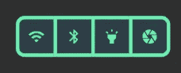
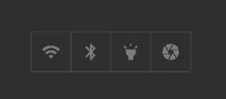
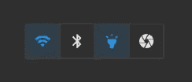
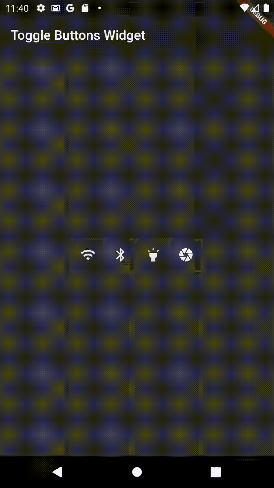
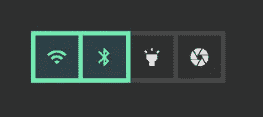
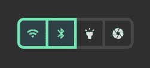

# 用 ToggleButtons Flutter 小工具将按钮排成一行

> 原文：<https://betterprogramming.pub/arrange-buttons-in-a-row-with-togglebuttons-flutter-widget-3e28b1ad51bb>

## 发现颤动——第 12 周


照片由[莱昂纳多·叶](https://unsplash.com/@yipleonardo?utm_source=unsplash&utm_medium=referral&utm_content=creditCopyText)在 [Unsplash](https://unsplash.com/?utm_source=unsplash&utm_medium=referral&utm_content=creditCopyText) 上拍摄

我不知道你怎么想，但我喜欢在手机上设置快捷方式，让我可以快速进入一些动作。

我在思考是否有一个小部件可以在你的应用程序中提供这样的外观，然后发现了 ToggleButtons 小部件。



使用 ToggleButtons 的示例

# 目标 1。创建切换按钮

要创建一个切换按钮，需要调用`ToggleButtons`的构造函数。发现新部件的第一步是它的强制参数。这个小部件有两个必需的参数:

*   `children`(`List<Widget>`)—`children`中的每个小部件代表一个按钮，在我们的例子中，它是一个`Icon`。
*   `isSelected`(`List<bool>`)—`bool`的一个`List`，包含每个按钮的状态，无论是选择(如果值为`true`)还是不选择(如果值为`false`)

**注意:**`children`和`isSelected`的长度必须相同。

我们的目标是有四个切换按钮，这意味着我们将创建一个状态变量来存储这四个按钮的状态，即它们是否被选中。我们将所有按钮的初始状态设置为 false。

**注意:**初始化`Stateful`小部件中的这个状态变量。

```
List<bool> _buttonsState = List.generate(4, (*index*) => *false*);
```

下一步是调用构造函数并传递所需的参数。

```
*child*: ToggleButtons(
  *children*: [
    Icon(Icons.*wifi*),
    Icon(Icons.*bluetooth*),
    Icon(Icons.*highlight*),
    Icon(Icons.*camera*),
  ],
  *isSelected*: _buttonsState
)
```

如果我们运行我们的项目，我们会看到四个禁用的按钮。



切换按钮

# 目标 2。让你的按钮可点击

如果用户尝试点击按钮，这些按钮的状态不会改变。为了处理点击，我们需要向`onPressed`参数传递一个回调函数，该函数返回`void`并接受一个类型为`int`的参数，这是被点击按钮的索引。

```
*child*: ToggleButtons(
  *children*: [
    Icon(Icons.*wifi*),
    Icon(Icons.*bluetooth*),
    Icon(Icons.*highlight*),
    Icon(Icons.*camera*),
  ],
  *isSelected*: _buttonsState,
  *onPressed*: (int *index*) => {
    setState(() {
      _buttonsState[*index*] = !_buttonsState[*index*];
    })
  },
),
```

现在可以点击按钮了:



操作龙头

# 目标 3。定制吧！

定制`ToggleButtons`小部件体现在定制其颜色和边框的能力上。

## 自定义颜色

与颜色相关的属性有`selectedColor,``focusColor``highlightColor``hoverColor``splashColor`。你可以在[官方扑文档](https://api.flutter.dev/flutter/material/ToggleButtons-class.html)中阅读各个属性的描述。

我们将设置`selectedColor`和`splashColor`。

```
*child*: ToggleButtons(
  *children*: [
    Icon(Icons.*wifi*),
    Icon(Icons.*bluetooth*),
    Icon(Icons.*highlight*),
    Icon(Icons.*camera*),
  ],
  *isSelected*: _buttonsState,
  *selectedColor*: Colors.*greenAccent*,
  *splashColor*: Colors.*teal*,
  *onPressed*: (int *index*) => {
    setState(() {
      _buttonsState[*index*] = !_buttonsState[*index*];
    })
  },
),
```

颜色的微小变化改善了按钮的设计。



颜色定制

## 自定义边框

默认情况下，`renderBorder`设置为`true`，表示边框反映在屏幕上。在`borderColor`属性中，如果按钮没有被选中，您可以设置边框颜色。要更改所选按钮的边框颜色，请使用`selectedBorderColor`。要更改边框宽度，请设置`borderWidth`属性。

```
*child*: ToggleButtons(
  *children*: [
    Icon(Icons.*wifi*),
    Icon(Icons.*bluetooth*),
    Icon(Icons.*highlight*),
    Icon(Icons.*camera*),
  ],
  *isSelected*: _buttonsState,
  *selectedColor*: Colors.*greenAccent*,
  *splashColor*: Colors.*teal*,
  *selectedBorderColor*: Colors.*greenAccent*,
  *borderWidth*: 5,
  *onPressed*: (int *index*) => {
    setState(() {
      _buttonsState[*index*] = !_buttonsState[*index*];
    })
  },
)
```

输出:



边框定制

作为一个圆边的爱好者，可以通过使用`BorderRadius`让边框看起来很圆。

```
*child*: ToggleButtons(
  *children*: [
    Icon(Icons.*wifi*),
    Icon(Icons.*bluetooth*),
    Icon(Icons.*highlight*),
    Icon(Icons.*camera*),
  ],
  *isSelected*: _buttonsState,
  *selectedColor*: Colors.*greenAccent*,
  *splashColor*: Colors.*teal*,
  *selectedBorderColor*: Colors.*greenAccent*,
  *borderWidth*: 5,
  *borderRadius*: BorderRadius.all(Radius.circular(10)),
  *onPressed*: (int *index*) => {
    setState(() {
      _buttonsState[*index*] = !_buttonsState[*index*];
    })
  },
),
```



圆形边框定制

# 结论

如果你是涵盖各种 Flutter 主题的简短有趣文章的粉丝，并且你想养成在接下来的 18 周内和我一起学习 Flutter 的习惯，你可以每周二阅读我的文章。

如果你对这篇文章有任何问题或评论，请在评论区告诉我。

对于那些想加入我们的颤振之旅的人，可以在下面找到前几周的链接:

*   [第一周](https://medium.com/the-innovation/discover-flutter-roadmap-for-learning-flutter-why-textalign-property-does-not-work-aa055a469025)——“学习颤振路线图”
*   [第 2 周](https://medium.com/@jelenajjovanoski/discover-flutter-how-to-create-sliders-how-to-create-cool-text-designs-8adb0e1feea3)——“如何创建简介滑块”
*   [第三周](https://medium.com/@jelenajjovanoski/discover-flutter-how-to-easily-generate-routes-how-to-flatten-deeply-nested-widget-trees-9c66dae99a73)——“如何轻松生成路线”
*   [第 4 周](https://medium.com/datadriveninvestor/discover-flutter-great-packages-for-pdf-viewing-tagging-flush-bar-26066e3c0d3b)——“某些颤振包的推荐”
*   [第 5 周](https://medium.com/@jelenajjovanoski/discover-flutter-bottom-navigation-bar-generate-hex-color-code-easily-d6d949dd860b)——“底部导航栏”
*   第六周——“每个动画的神圣三位一体”
*   [第 7 周](https://medium.com/@jelenajjovanoski/discover-flutter-new-material-buttons-in-flutter-version-1-22-39b8f1887d8)——“Flutter 1.22 版本中的新材料按钮”
*   [第 8 周](https://medium.com/@jelenajjovanoski/discover-flutter-october-recommendation-for-flutter-packages-9d1b07f3490f)——“我的十月颤振包推荐”
*   [第 9 周](https://levelup.gitconnected.com/discover-flutter-flutter-version-manager-fvm-411dc2bff4b4)——“Flutter 版本经理——FVM”

下周见，不要打破记录！