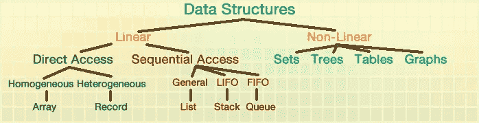
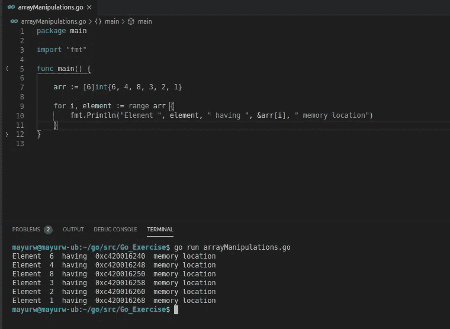

# Golang 中的数组和堆栈实现

> 原文：<https://betterprogramming.pub/array-and-stack-implementations-in-golang-1ce6f728d202>

## Go 中常见的数据结构


[奥斯汀·尼尔](https://unsplash.com/@arstyy?utm_source=medium&utm_medium=referral)在 [Unsplash](https://unsplash.com?utm_source=medium&utm_medium=referral) 上的照片。

数据结构用于识别数据在任何系统中的存储方式。数据结构的另一个定义，由 [GeeksforGeeks](https://www.geeksforgeeks.org/commonly-asked-data-structure-interview-questions-set-1/) 提供，是“一种组织数据的方式，以便数据可以被有效地使用。”

显示[电脑希望](https://www.computerhope.com/jargon/d/data.htm):

> “一般来说，数据是为了某种目的(通常是分析)而收集和翻译的任何字符集。如果数据不放在上下文中，它不会对人或计算机产生任何影响。”

数据结构及其类型如下所示:



图片来自[奥格斯堡大学](https://web.augsburg.edu/~crockett/210/210%20Lab%20Set%202/Lab3.html)。


数据结构和类型。

在本文中，我将介绍一些基本的结构，如数组和堆栈。

# 排列

数组数据结构包含具有相同数据类型的连续元素。在 Golang 中，数组与 Java 等其他语言中的一样。数组中不允许混合类型，因为它们具有相同类型的元素。

## 声明数组:

```
var array [4]int
```

`var a [3]int`声明一个长度为`4`的整数数组。数组中的所有元素都自动被赋予数组类型的零值。所以如果你打印这个数组，你会得到一个类似*【0，0，0，0】*的数组。

数组分配一个连续的内存字节，如下所示:



具有连续内存位置的数组。

上面的数组在内存中有连续的内存位置地址。因此，获得阵列观测值的两个属性是`length`和`capacity`。

1.  `Length` : 数组中有多少个元素。
2.  `Capacity`:数组可以容纳多少个元素。

在 Golang 中，我们有特殊的函数来获取数组的`capacity`和`length`。

## **获取数组长度:**

```
len(array)
```

## **获取数组的容量:**

```
cap(array)
```

为了确定运行时间长度，我们可以使用省略号:

```
array := [...]int{5060, 8446, 5234}
fmt.Println(len(array)) // it will print 3
```

在 Golang 中，数组是值类型，而不是引用类型。数组不能调整大小。为了克服这一点，Golang 提出了切片概念。

# 堆

栈是 LIFO(后进先出)或 FILO(先入后出)数据结构。一个栈的数据结构包含两个东西:一个栈指针(也叫峰元素指针或顶指针)和一个数组来存储栈**中的数据。**插入和删除发生在同一端。

[GeeksforGeeks](https://www.geeksforgeeks.org/stack-data-structure/) 提供了另一个定义:

> 堆栈是一种线性数据结构，它遵循操作执行的特定顺序。顺序可能是 LIFO(后进先出)或 FILO(先入后出)。”

## **栈上的操作**

1.将一个元素推入堆栈，并将指针值增加 1。

2.从堆栈中弹出一个元素，并将指针值减 1。

3.当按下一个元素时，检查堆栈是否已满。

4.弹出元素时，检查堆栈是否已经为空。

可以在 GitHub 上看到我对栈[的终端应用。](https://github.com/imwaddy/Go_Exercise/blob/master/terminalApplications/stack.go)

# 结论

简单地说，数据结构定义了数据在系统中的存储方式。您应该根据数据的性质选择数据结构。