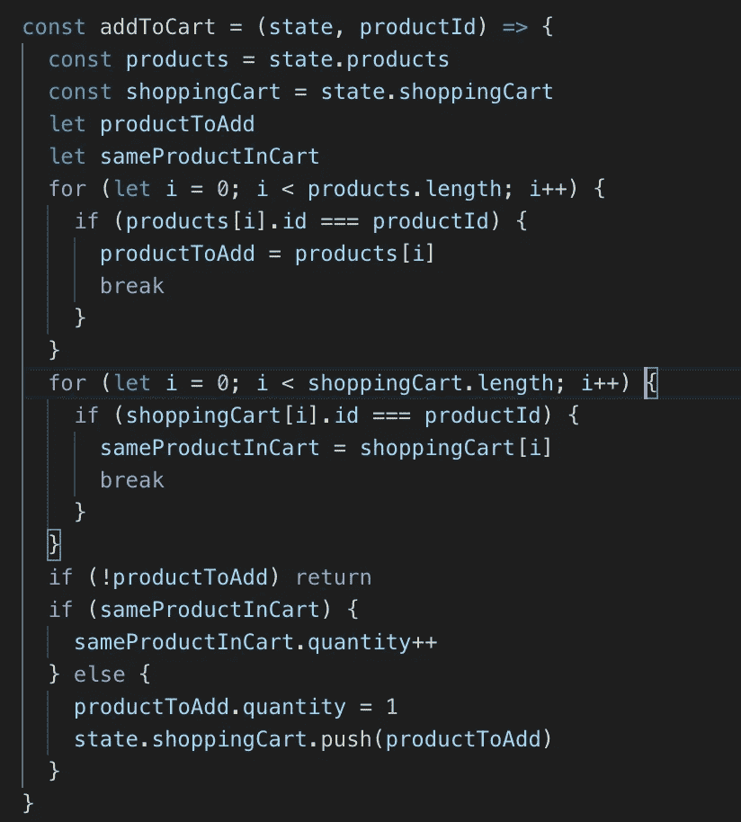
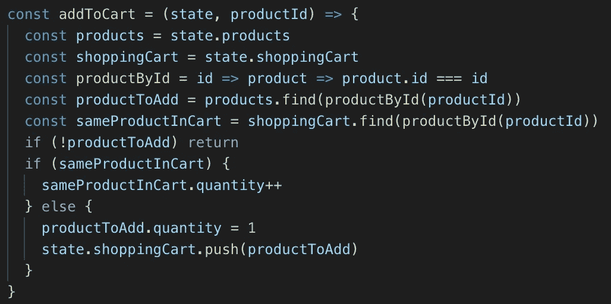

# 数组方法和无指针的 Curried 函数改善了 JavaScript 代码

> 原文：<https://betterprogramming.pub/array-methods-point-free-style-and-curried-functions-make-your-js-code-better-b5516c513b37>

## 编写更简洁的代码

最近写了[这个](https://medium.com/@cqpro/rewrite-your-own-array-methods-foreach-map-filter-find-reduce-1718e1138c3e)。

许多初级开发人员和刚接触 JavaScript 的人经常会问，“为什么我们需要把事情分成许多方法，比如`map`、`filter`、`find`和`reduce`？为什么我们不用一个`for`环呢？它可以处理那些数组方法提供的各种逻辑。”

答案很简单:使用这些方法，我们可以写出更干净、更好、更易读的代码。


在解释原因之前，我想向您介绍一些新概念。

# 无点风格

无点样式是一种通过消除不必要的参数来提高可读性的技术。

让我们来看看这段代码:

```
const scores = [3,1,5,7,9]
const goodScores = scores.filter(function(score){ 
  return score >= 7
})
```

是的，很容易理解；这个功能帮助我们筛选出分数≥ 7 的。我们可以做得更好:

```
const scores = [3,1,5,7,9]
const isGoodScore = score => score >= 7
const goodScores = scores.filter(score => isGoodScore(score))
```

是啊，把函数命名为`isGoodScore`更好一点。但是我们可以用无点风格做得更好。

```
const scores = [3,1,5,7,9]
const isGoodScore = score => score >= 7
const goodScores = scores.filter(isGoodScore)
```

看，我们可以删减论点，变成这样。代码

`const goodScores = scores.filter(isGoodScore)`

更像人类的语言，更简单易懂。

# 简化的功能

curried 函数是一个一次接受多个参数的函数。

这是一个正常的功能:

```
const add = (a, b, c) => a + b + c
add(1,2,3) // This will return 6
```

这是一个咖喱函数:

```
const add = a => b => c => a + b + c
add(1)(2)(3) // This will also return
```

那么，为什么我们需要 curried 函数，它们如何帮助我们更好地编写代码呢？

好了，这些问题我已经想了好几年了，我就通过这个例子来解释一下:

```
const scores = [3,1,5,7,9]
const isGoodScore = score => score >= 7
const goodScores = scores.filter(isGoodScore)
```

就拿前面的例子来说吧。如果我们想分别过滤出等于 1，2 …一直到 10 的分数呢？定义十个函数`isEqual1` … `isEqual10`是可以的，但是对于 curried 函数，我们可以通过只有一个名为`isEqual`的函数来改进它。代码将如下所示:

```
const scores = [3,1,5,7,9,1,5]
const isEqual = compareValue => score => score === compareValue
const scoresEqual1 = scores.filter(isEqual(1))
```

太棒了。:D 不再需要写十个不同的函数了。

万一你不熟悉胖箭头函数，上面的 curried 函数可以改写成这样:

```
const isEqual = function(compareValue){
  return function(score){ 
    return score === compareValue
  }
}
```

所以，我想你现在理解了无点风格和 curried 函数。让我们使用一个`for`循环来创建一个函数`addToCart`。



看，我们使用一个`for`循环在`products`数组和`shoppingCart`数组中寻找一个产品。然后我们检查该产品是否已经在`shoppingCart`中。如果是这样，我们增加数量；如果没有，我们将该产品添加到`shoppingCart`。

让我们用一个`find`的方法，无点风格和 curried 函数来重新制作它。



看，现在我们只需要 14 行`find`和无指针风格的代码，而不是 25 行`for`循环。当然，这个函数在很多方面更好，比如可读性和干净性。功能`productById`也可以在很多其他地方重用。

# 更大的

使用数组方法和无指针风格，我们可以编写更简洁的代码，如下所示:

```
const products = [....] //An array of product object
const toProductView = product => (
  {
    title: product.name + ' ' + product.brand, 
    price: product.newPrice
  }const isValid = product => product.price > 0
const displayProducts = products.filter(isValid).map(toProductView)
```

希望你能理解如何使用无指针的数组方法。可以通过打开当前项目，用数组方法替换`for`循环，用无点风格替换回调函数来练习。

感谢阅读。