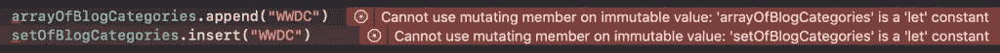

# 数组与集合:Swift 基础讲解

> 原文：<https://betterprogramming.pub/array-vs-set-fundamentals-in-swift-explained-9c78f3552e52>

## 它们看起来可能是一样的，但是它们有一些重要的区别


克里斯托弗·高尔在 [Unsplash](https://unsplash.com/search/photos/coding?utm_source=unsplash&utm_medium=referral&utm_content=creditCopyText) 上拍摄的照片

乍一看，数组和集合似乎几乎是一回事。它们都是集合类型，并且有很多相似之处。尽管如此，我们还是经常倾向于使用数组而不是集合。虽然这不一定是一个问题，但有时选择一套肯定更好。

# 根本的区别

在我们深入研究使用数组或集合的实际原因之前，让我们先来看一下这两种类型之间的一些基本区别。

## 初始化

当我们比较数组和集合的初始化时，我们可以看到它们非常相似:

```
let arrayOfBlogCategories: [String] = ["Swift", "Debugging", "Xcode", "Workflow", "Optimization"]
let setOfBlogCategories: Set<String> = ["Swift", "Debugging", "Xcode", "Workflow", "Optimization"]
```

这两种类型都支持相同的`ExpressibleByArrayLiteral`协议，尽管知道`Array Literal`类型默认为数组是件好事。使用下面的代码将会在一个字符串数组中结束:

```
let blogCategories = ["Swift", "Debugging", "Xcode", "Workflow", "Optimization"] // Defaults to Array<String>
```

乍一看，您可能认为两个集合在初始化后完全相同。然而，事实并非如此。请看文档中的以下引文:

> *集合*存储集合中相同类型的不同值，没有定义排序。当项目的顺序不重要时，或者当您需要确保一个项目只出现一次时，可以使用集合而不是数组。

换句话说，*集合是无序的，但是数组是有序的*。初始化后打印出集合证实了这一点:

```
print(arrayOfBlogCategories) // ["Swift", "Debugging", "Xcode", "Workflow", "Optimization", "WWDC"]
print(setOfBlogCategories)   // ["Xcode", "WWDC", "Swift", "Workflow", "Debugging", "Optimization"]
```

这是重要的考虑到当你选择的时候。

## 添加对象

数组和集合都是值类型。因此，如果你使用`let`将它们定义为常量，当你试图添加一个对象时，你会遇到下面的错误:



显示数组和集合不可变的错误

如你所见，我们有了第一个不同点。我们必须使用`append(_:)`作为数组，使用`insert(_:)`作为集合。这两种方法都将 WWDC 类别添加到集合中，但是只有在数组中，我们才能确定它被添加到了列表的末尾，因为数组是有序的。

这里的另一个区别是`insert(_:)`方法的返回类型。它返回一个`inserted`布尔值和一个`memberAfterInsert`属性，该属性包含已经存在的对象或刚刚插入的对象。如果您希望在对象已经存在的情况下向用户提供反馈，这可能很有价值:

```
let (inserted, memberAfterInsert) = setOfBlogCategories.insert("Swift")
if !inserted {
    print("\(memberAfterInsert) already exists")
}
// Prints: "Swift already exists"
```

## 元素的唯一性

集合和数组的一个很大的区别是元素的唯一性。一个数组可以包含两次相同的值，而一个集合永远不会包含重复的值。这也是上面的`insert(_:)`方法返回一个布尔值来指示插入是否成功的原因。

这是一个重要的区别，也是*为什么*选择一个集合并防止自己在数组上使用过滤器来过滤掉重复项的原因。

## 元素的顺序

数组和集合的最大区别之一是元素的顺序。文档对此进行了描述:

*   Array: *“一个有序的、随机访问的集合。”*
*   Set: *“唯一元素的无序集合。”*

因此，如果元素的顺序很重要，就用数组。

# 那 NSOrderedSet 呢？

另一种可用的类型是`NSOrderedSet`。然而，这不是一种迅捷的类型，而且是有代价的。由于它是非泛型类型，我们必须处理`Any`对象，并在我们使用它的任何地方进行强制转换。

但是它是数组的一个很好的有序替代品，应该在测试元素成员的性能很重要的时候使用。测试一个对象是否包含在一个集合中比测试一个数组的成员关系要快。

因为它是一个静态集合类型，所以在初始化后不能添加或移除对象。这可能是使用数组的好理由。

# 性能差异

使用集合的另一个原因是当性能很重要或者需要大量数据时。集合中的元素需要符合`Hashable`协议，这使得集合在性能上得到优化。在小集合中查找一个元素与在大集合中查找一个元素需要相同的时间。

一般来说，如果可能的话，为了提高性能，创建不可变的集合是一种好的做法。这适用于数组和集合，并允许 Swift 编译器优化您创建的集合的性能。如果您想了解更多关于性能和集合的信息，请查看 Swift 中的[性能、函数式编程和集合。](https://www.avanderlee.com/swift/performance-collections/)

## 核心数据、NSSet 和转换为 Swift 类型

在核心数据中处理集合时，选择类型化集合是很诱人的。然而，这是有代价的，并不总是立竿见影的。

如果您的核心数据集合是一个常量，并且不会(经常)改变，那么桥接到一个集合就更好了，因为桥接时使用的`copy(with:)`方法在常量时间内返回相同的集合。可变 NSSet 类型的复制性能是未指定的，应该是。你可以在[文档](https://developer.apple.com/documentation/swift/set#2845530)中读到更多关于这个主题的内容。

## 结论

事实证明，集合和数组有很大的不同。所以，这里有一个简单的备忘单来结束这篇博文！

*走阵如果:*

*   秩序很重要
*   重复元素应该是可能的
*   性能不重要

*去一套如果:*

*   顺序不重要
*   独特的元素是一个要求
*   性能很重要