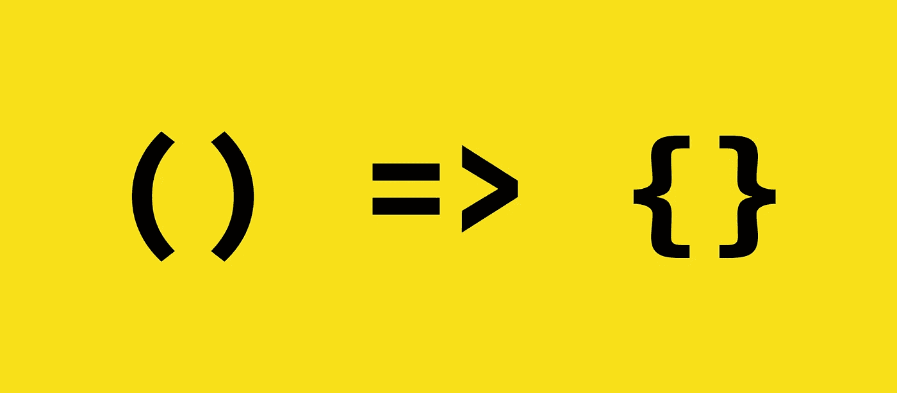

# 箭头函数与 JS 中的函数

> 原文：<https://betterprogramming.pub/arrow-function-vs-function-in-js-81f7a70b1295>

ES6 中引入的最受欢迎的功能之一是箭头功能(也称为*胖箭头功能*)。这是定义函数的简洁方法。

考虑下面的例子:

但这并不是箭头函数如此流行的唯一原因。

arrow 函数解决了 JavaScript 的一个非常令人困惑的方面——我喜欢称之为 *this* 指针不确定性。

我们先来了解一下*这个*指针不确定性是什么。看看下面的代码:

这里发生了什么？

在 JavaScript 中，考虑一个附加到对象的函数。对于该函数， *this* 指针指向定义该函数的同一个对象(在我们的例子中是`jsObject`)。

所以，当我们的代码在`jsObject`中寻找名为 *message* 的变量时，它找不到。让我们修改代码并在我们的对象中添加`message`变量。

注意对象中的变量赋值。

当我们给内部消息变量`jsObject`赋值时， *this* 指针仍然指向全局对象。

但是早些时候，当同一个*这个*指针在函数内部使用时，它指向了别的地方，也就是指向我们的`jsObject`。

当在 JavaScript 中调用函数时，这个指针将要指向的*的位置并不是由函数定义的编写位置决定的。相反，重要的是如何调用函数。*

现在，在一个大的应用程序中，很难跟踪这个指针以及将所需的值传递给适当的函数。这就是箭头函数语法的用武之地。

如果你正在访问函数中的这个指针，并且你想让它指向函数定义的周围代码，使用箭头语法。

让我们用箭头语法写`printMessage`，看看会发生什么。

同样，改变内部变量`message`的值，这样我们就知道当我们调用函数时这个指针指向哪里。

这就是粗箭头函数解决*和*指针不确定性问题的方法。

在使用 arrow 函数时，不要假设*这个* 指针总是指向全局对象。

重要的是要注意，当你使用箭头函数定义函数时，这个指针将指向*的什么地方完全取决于函数定义的周围代码。*

感谢您的阅读！