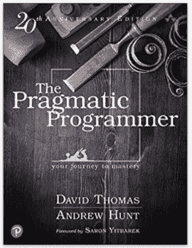
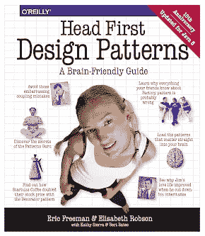
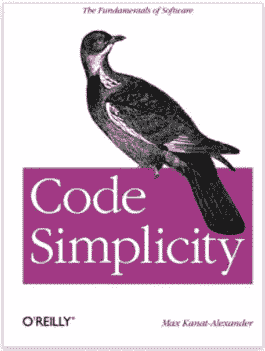
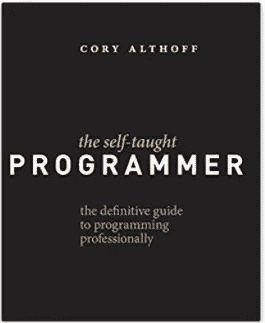
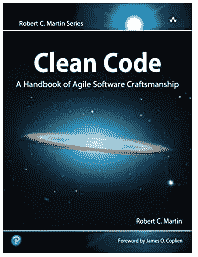
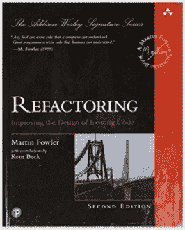
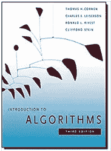

# 作为一名软件工程师，这里有 7 本你应该经常放在办公桌上的书

> 原文：<https://betterprogramming.pub/as-a-software-engineer-here-are-7-books-you-should-always-have-at-your-desk-e0262bccf09a>

## 放弃(或者至少暂停)所有那些课程，开始读书

Pixabay.com

如果你是一名刚刚开始职业生涯的软件工程师，或者是一名职业程序员，或者你只是想学习新的东西，提高自己的编码和编程技能，那么你来对地方了。

书籍是丰富的信息。在编程中，特别是在软件开发领域，没有比读书更好的学习和增加经验的方法了。课程是好的，但它们主要是为了获得一个快速的概述(或一个编程的创可贴方法)。但是如果你真的想深入研究某样东西，书籍是你最好的选择。

这里有一个精选的顶级编程书籍列表，应该是任何初学者到高级实用程序员图书馆的一部分。

# [务实的程序员](https://geni.us/YXbQAy)

这本书最初于 1999 年发行，一直是程序员中的畅销书。

刚开始时，学会用你理解的方式编程是最重要的。这就是务实的程序员做得很好的地方。这本书实事求是、理性地看待事物，没有让它变得太专业或太难。

这本书帮助工程师创造更好的软件，更重要的是，帮助重新发现编码的乐趣。这本书的教训帮助一代软件开发人员检查软件开发的本质，独立于任何特定的语言、框架或方法，以及实用主义哲学。

这是陪伴你工程之旅的必备。

# [头先设计图案](https://www.java67.com/2016/10/top-5-object-oriented-analysis-and-design-patterns-book-java.html)

Headfirst 设计模式向您展示了久经考验的软件开发团队模式，以创建功能强大、可重用且灵活的软件。

设计是一个好程序的本质。而且读完这本最好的编程书，你会从那些设计过各种类型软件的人的最佳设计实践和经验中受益。这本书提供了视觉上丰富的格式。这本书使用了认知科学和学习理论的最新研究，提供了一种多感官的学习体验。

我就是喜欢这本书。我已经记不清自己读了多少遍，也提到了我的同事。

# [代码简单:软件的基础](https://amzn.to/3dvf4Tn)

这本面向初学者的编程书是编码的“吻”——讲述了无论使用什么语言，都可以让代码简单高效的原则。

好的软件开发会产生简单的代码。编码书会告诉你如何“保持简单，笨蛋！”

# 自学程序员:专业编程的权威指南

本书的作者 Cory Althoff 是一名自学成才的程序员，他在易贝找到了一份工作，却发现要成为一名职业程序员还有大量的工作要学。这本书是初学者学习编程的最佳编程书籍之一，但不仅如此，它还适合所有自学成才的程序员，将他们的技能扩展和完善到专业水平。

主题包括面向对象的计算机编程初学者，使用编码来建立一个网络刮刀，计算机体系结构和算法的基础，以及软件开发的编码实践。

# [干净的代码:敏捷软件技术手册](https://www.amazon.com/Clean-Code-Handbook-Software-Craftsmanship/dp/0132350882)

想知道好代码和坏代码的区别吗？别再看了。

这本书不仅仅是关于学习编码。它帮助你理解一般的编码和高级编码之间的区别，高级编码是干净的，有效的，并且容易被其他人理解。这是能帮助你在职业生涯中脱颖而出的关键区别之一。

罗伯特·c·马丁的[干净的代码](https://www.oreilly.com/library/view/clean-code/9780136083238/)分解了好的、干净的代码的重要性和不能运行的坏代码的重要性。首先，您将学习编写干净代码的原则、模式和实践。然后，您将深入研究真实的案例，接着是一个启发列表，用于在睡梦中编写干净的代码。

我喜欢这本书。并将它推荐给每个工程师，无论是初学者还是高级工程师。

# [重构:改进现有代码的设计](https://www.amazon.com/Refactoring-Improving-Design-Existing-Code/dp/0201485672)

如果你正在做一个包含大量重构的项目，这本书绝对是一本好书。

这本编码书分解了你需要知道的重构技术——特别是如果你正在处理一个大型的遗留代码库。作者从一个“混乱”的示例应用程序开始，并经历了对它进行重构的过程，以使它尽可能高效。

# [算法介绍](https://geni.us/c1NnXML)

这本书深入地包括了广泛的算法。这本书每一章都比较自成体系，可以作为学习资料。这本书用英语和伪代码描述了这些算法。

这是最好的编程书籍之一，它提供了对动态编程和贪婪算法的处理，以及基于边的流的新概念。学习材料还提供了许多练习、问题和解决方案。

这本书是大学和专业人士使用的最好的算法书籍之一

上面哪一个你已经读过了？或者有什么书是我漏掉补充的？让我们知道。