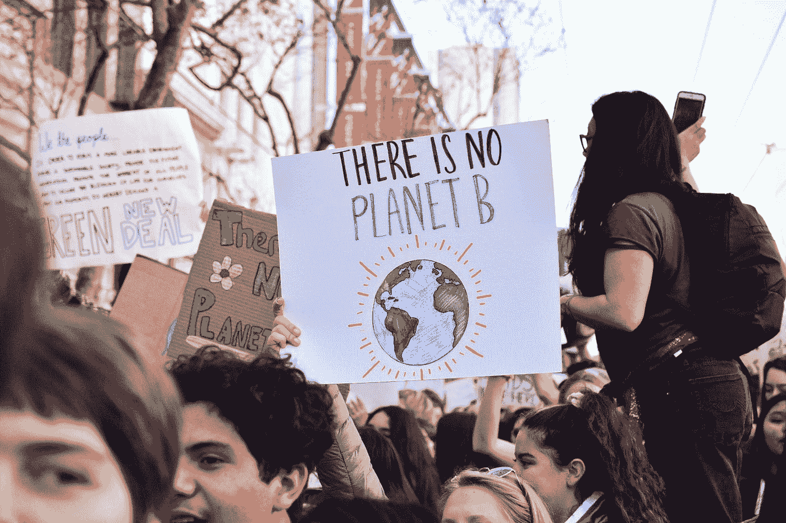

# 作为网络开发者，我们如何帮助应对气候变化？

> 原文：<https://betterprogramming.pub/as-web-developers-how-can-we-help-fight-climate-change-80bc8dd4ec56>

## 互联网是世界范围内日益增长的污染源。我们能成为解决方案的一部分吗？

由 [Unsplash](https://unsplash.com?utm_source=medium&utm_medium=referral) 上 [Bob Blob](https://unsplash.com/@bob_blob?utm_source=medium&utm_medium=referral) 拍摄的照片

当你想到“肮脏”的职业时，IT 专业人员很少首先出现。我们不在办公室烧煤，也不每天扔掉一次性电脑，但是互联网是一个[日益增长的污染源。大部分问题来自于许多国家从化石燃料、煤和其他不可再生资源获取电力的事实。](https://www.mdpi.com/2071-1050/10/9/3027)

最近的研究估计，仅视频流每年就产生 300 吨二氧化碳。(不同的研究得出的数字各不相同，但可以肯定的是，事实是数百吨。)

那么，作为网页开发者，我们能做些什么来帮助你呢？实际上，很多事情。从我们个人的影响开始。

# 适用于任何办公室职员的事情

## 远程工作

不用汽车去上班显然是减少你的影响的一个很好的方法。对于我们这些没有车真的去不了办公室的人来说，有比骑自行车上班更好的事情。在家工作！

即使你 10 天中只有一天这样做，也能减少 10%的汽车污染。

## 少流

流媒体音乐不错，但令人惊讶的是，它并不比购买 CD 更环保。您知道您会一遍又一遍地听一些音乐，那么为什么不将这些音乐保存到您的本地驱动器中呢？

此外，当你播放流媒体音乐时，如果你不打算看的话，避免下载 4K 的视频剪辑。

## 少用

即使距离你上次乘船旅行已经过去十年了，你还在订阅划船时事通讯吗？退订你不再使用的服务对环境有好处，对你的理智更有好处。至少取消订阅你不再喜欢的营销列表。

(如果你也想用{LESS}作为你的 CSS 预处理器，这很酷。)

## 和你的同事谈谈

> “世界不会被作恶的人毁灭，而是被袖手旁观的人毁灭。”―阿尔伯特·爱因斯坦

如果你走到办公室，把午餐放在可重复使用的容器里，那是很棒的，但是如果整个办公室都做出努力，那就更好了。你不必让人讨厌来提高意识水平。看到就建议解决方案。在时机合适的时候展开对话。从长远来看，人们可能会心存感激。

# 网络开发者特有的东西

你会很高兴地发现，让你的网站更环保的一个好方法就是让它们更有性能。

## 你的网站超重了吗？

你可能知道，[网络有一个肥胖问题](https://idlewords.com/talks/website_obesity.htm)。网站变得越来越沉重[年复一年](https://httparchive.org/reports/page-weight)，这对存储和服务它们所需的资源数量产生了影响。显然，制作这些网站的人可以成为解决方案的一部分！

我不会得到技术，但更薄的初始加载的一般想法包括优化媒体资产，延迟加载，优化代码，不使用整个框架只是为了显示文本和图像。需要的话就用一个——不是因为 X 很时髦。

## 不要无缘无故地打电话

另一个让你的项目更环保、更高效的方法是减少 HTTP 请求的数量。

不久前，我偶然发现了一个`forEach`循环，它遍历一个 ID 数组，并向服务器发送每个 ID 的请求。为什么不在一次请求中发送整个数组呢？我做到了。然后表现立马就好了。

您还可以使您的 API 调用更精简。如果 JSON 对象只需要一个值，为什么要发送整个对象呢？用户越多，这些考虑就越重要。

## 自己收拾干净

无论是 SAAS、PAAS 还是 IAAS，所有的云服务都需要能源来运行。如果不是既有精力又有钱！在软件中，很容易无缘无故地留下东西。

你上一次确定你使用的所有服务确实在工作是什么时候？这是一个值得每隔一年重复一次的练习，而且肯定是在每份新工作中。我记得在自动续订时发现 SSL 证书什么都没有，CDN 上托管的几十亿无价值数据，一个 24/7 无所事事的小服务器…

你明白了。如果你不用它，就丢掉它。

## 说到云服务…

现在有了“绿色托管”这种东西。简而言之:

> “绿色托管包括碳抵消、直接使用可再生能源为数据中心供电、在数据中心周围和上方植树、种草，以及更多日常活动，如节能和使用节能设备。”― [维基百科](https://en.wikipedia.org/wiki/Green_hosting)

这在数字上相当于购买有机食品。虽然成本可能会高一点，但如实宣称您的服务器是环保的，是提升公司声誉的一种简单方法。

如果你的老板认为客户不关心绿色认证，你可以给他看看这张 50 万人要求对气候变化采取行动的照片。

2019 年 9 月 27 日，蒙特利尔。来源:[新气候](https://thenewclimate.com/2019/09/28/millions-marched-for-climate-heres-whats-next/)

## 运用你的技能

如果你正在读这篇文章，你可能有一些很受欢迎的技能。为什么不用它们来创造有用的工具呢？你可以用你的专业知识做很多事情！如果你可以:

*   让拼车更简单。
*   减少浪费食物的过程。
*   做有趣的数据可视化，帮助提高意识。
*   为本地计划建立管理工具。

不喜欢我的想法？看看许多已经在进行的开源项目，看看你是否能为它们做出贡献！**你可以做很多事情。绿色和平组织甚至为那些想参与网站重新设计的人准备了一份指南[。你的技能可以成为解决方案的一部分。](https://planet4.greenpeace.org/handbook/dev-contribute-to-planet4/)**

# 结束语

气候变化的挑战最有可能通过大量的小变化来解决，而不是一个超级英雄式的突破。

将一个网站的重量减少 1MB 并不会大大改善网站的生态足迹。但是如果成千上万的人让他们的网站变得更轻 1MB，这是向前迈出的一小步，加载速度也会更快。

在我们取得超级英雄的突破之前，我们至少能做好自己的本分。