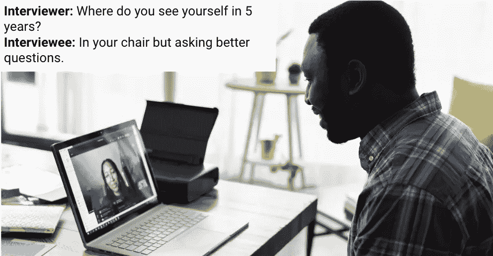
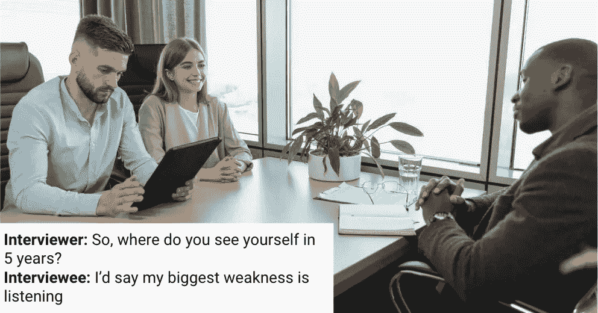
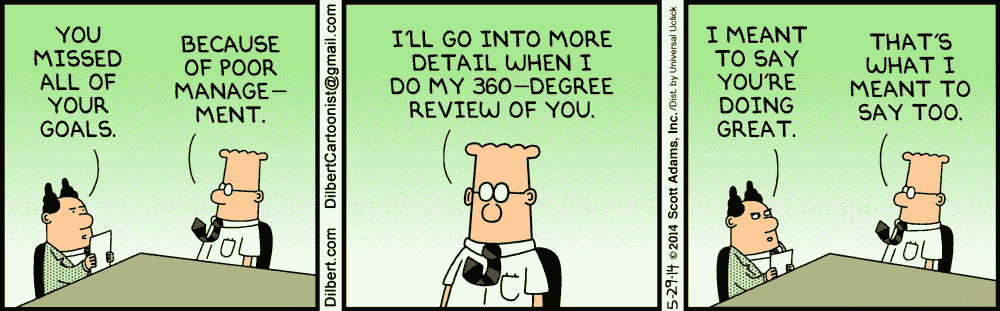

# 通过交换这四个问题，问一些不那么愚蠢的面试问题

> 原文：<https://betterprogramming.pub/ask-less-dumb-interview-questions-by-swapping-these-4-in-cf5d54cffdd4>

## 让我们面对现实吧。你可能厌倦了你的股票面试问题。你的面试官可能已经听腻了。为什么不做出改变，从互动中获得最大收益呢？

来自[像素](https://www.pexels.com/)的图像

经过数百次电话筛选和虚拟/面对面的面试，下面的四个问题让我对面试者有了最深刻的了解，是对你目前问题的一个很好的替代。

这些面试问题不是为了“抓住你”这取决于*你*如何帮助受访者扩展他们的经历。

很多时候，我看到“受访者没有在 X 上展开”的反馈是负面的，没有尝试帮助他们在 X 上展开。受访者不是来表演的，他们是来进行双向对话的。

**自己试试这些，看看你能学到什么。**

1.  [您收到的最后一条反馈是什么？](#8b41)
2.  [您给出的最后一条反馈是什么？](#a48b)
3.  [你最引以为豪的项目是什么？](#ff74)
4.  [有什么项目进行得不太顺利？](#a571)

# 1.您收到的最后一条反馈是什么？

我很喜欢这个问题的几个原因。它让我看了一眼:

1.  候选人如何处理反馈
2.  最重要的反馈类型
3.  当同事提供反馈时，他们会听到什么
4.  一般阅读他们对收到反馈的感受

## 候选人如何处理反馈

不管反馈是积极的还是批评性的，这个问题都直接关系到人们如何看待事后的反馈。他们是对此不屑一顾，不采取额外的行动，还是制定了行动计划，并确保他们要么继续这种行为，要么完全避免这种行为？

其他一些后续问题，以获得更多信息:

*   收到反馈后，他们改变了哪些行为？
*   他们有没有向稍后提供反馈的人汇报？
*   收到反馈是否改变了他们对提供反馈者的看法？

如果受访者是您的直接下属，您*将需要*向他们提供反馈。为什么不多了解一下这个人如何处理建设性的反馈，这样他们就可以在自己的角色中成长？

## 最重要的反馈类型

这里一个容易的陷阱是，如果他们记下他们收到的最后一个积极反馈。你可能会想“嗯，他们说他们只得到积极的反馈”，但是不要偷懒。问一些后续问题。

*   关于*这个*特别是正反馈的原因是什么？
*   此人以前收到过积极的反馈吗？
*   他们做出了被注意到的改变吗？

在面试中听到建设性的反馈(或批评/负面的反馈)是谦逊和脆弱的一个很好的标志，应该以同样的好奇心对待。我发现受访者倾向于从建设性反馈中学到更多，而不是积极反馈(老实说，对我来说也是如此)。

当反馈具有建设性时，检查反馈后的行为变化变得更加重要。

## 当同事提供反馈时，他们会听到什么

一半的交流是在接收信息的人身上。在描述反馈时，受访者可能会增加给予者的语气。

*   对话是什么样的？
*   活动结束后多久您收到反馈？
*   他们还提到什么了吗？
*   你的反应是什么？

有些人喜欢恭维三明治。其他人讨厌他们。

更直接的个性能够看到反馈是什么，并开始采取行动的反馈。其他人会花一些时间来思考所说的话，并考虑多种解决方法。

## 一般阅读他们对收到反馈的感受

一些候选人非常清楚他们收到反馈时的感受。在“感觉不好”的情况下，深入挖掘并询问原因是好的。

*   他们是否因为认为反馈不真实而不予考虑？
*   这是不是一针见血的批评，但因为这是他们收到的第一个重要的建设性反馈而受到伤害？

深入了解候选人过去对反馈的感受，通常可以给你一个可靠的指标，让你知道他们将来会如何接受反馈。

来自[像素](https://www.pexels.com/)的图像

# 2.你给出的最后一条反馈是什么？

与第一个相似，但更侧重于受访者如何看待外部反馈。这个问题揭示的知识:

1.  他们如何将自己的感受转化为反馈
2.  他们认为谁是“能接受的人”和“不能接受的人”
3.  给出反馈的结果是什么

## 他们如何将自己的感受转化为反馈

自从丹尼尔·戈尔曼写了他的书《[情商](https://www.amazon.com/Emotional-Intelligence-Matter-More-Than/dp/055338371X)》以来，公司已经能够把以前只是感觉的东西用文字表达出来。

某人处理事件或对话的方式会有很大的不同，但可以让你大致了解如果被雇佣，他们的反馈会是什么样子。

*   他们会不假思索地给出即时反馈，而不考虑他人的感受吗？
*   他们直接但有思想吗？
*   他们是否需要一些时间来处理、咨询他人并*然后*给出反馈？

不考虑感情的鲁莽行事通常是一个危险信号，但是如果它能被引导到有成效和有建设性的事情上，这种直率是有价值的。一般来说，提供反馈是一项可训练的技能，但必须有一个基础。

## 他们认为谁是“能接受的人”和“不能接受的人”

根据他们的反应，你可能会有一种感觉，他们只是觉得他们可以向他们下面的人或横向的人提供反馈。如果是这种情况，询问后续问题或进一步引导他们:

*   你给同事的任何反馈？
*   你最近给你的经理或老板反馈了吗？

这些倾向于更少地展示个人，更多地展示他们所在组织对反馈的态度。

## 给出反馈的结果是什么

怎么样了？由于各种原因，提供反馈可能会很困难，但之后发生的事情有时会为个人是否愿意继续提供反馈奠定基础。

如果你不确定，消极的积极反馈是不好的。(漫画来自[Dilbert.com](https://dilbert.com))

# 3.你最引以为豪的项目是什么？

没有两个人会用同样的方式回答这个问题。即使你偶然发现两个受访者提到同一个项目，他们引以为豪的*理由*也会完全不同。

## 项目的成功

通常，受访者会提到一个成功的项目。他们是如何获得成功的，这也是他们感到自豪的原因。示例:

*   不管我们面临什么样的障碍，这个团队都团结一致，完成了任务
*   我们能够按时/提前交付项目和 it[在此插入优势]

无论答案是什么，都有一个机会来深入挖掘，找到这个项目与众不同或与众不同的根源。

*   他们在成功中起了什么作用？
*   帮助他们重整旗鼓的团队结构或文化是什么？
*   下次他们会有什么不同的做法？
*   成功的项目中有哪些*做得不顺利的*？
*   当它完成时，团队感觉如何？

希望他们在这里谈论一下他们的团队和队友，让你了解他们是如何与他人合作的。如果他们没有，一定要戳一下，给他们一个扩展的机会。

## 这个项目激发了他们的热情

很多时候，特别是对于更技术性的职位，我看到人们在被问及这个问题时笑逐颜开。特别是当他们开始使用新技术或新方法时，受访者将引导你了解他们在接近项目时的想法，以及它与他们的典型工作有何不同。

询问好奇的后续问题，让受访者引导你了解他们的思维、策略、一般方法和解决问题的风格。对于工程面试，花一些时间在技术方面，并了解他们如何接近技术。他们使用新的东西是因为它有趣而浮华吗？或者它是一把适合所展示的钉子的锤子？

## 旅程

很多时候，有人会因为一个项目的成功所付出的努力而为之自豪。计划、进度、演示，有时工作本身比项目的实际完成更令人愉快。

我们有时会忽略从 A 点到 B 点的所有事情，但是某些人在这方面很成功。了解为什么这个项目比其他项目感觉更好。

# 4.有什么不太顺利的项目？

我通常不相信那些说他们从来没有做过没有出错的项目的人。如果他们没有太多的经验，可能会有一个副业项目，大学项目，甚至是高中项目，他们能想到哪里出了问题。

如果需要的话，给他们一点时间，但是这个概念很简单。他们能够从过去的错误中吸取教训来改进他们未来的项目和团队吗？正如我之前提到的，[的增长不是线性的](/growth-is-not-linear-3e5eb14b1c2c)，所以他们在职业生涯的某个阶段可能会经历低谷。

我什么时候会失败？！(可能是明天，没关系)照片由[拉兹万·苏驰](https://unsplash.com/es/@nullplus?utm_source=medium&utm_medium=referral)在 [Unsplash](https://unsplash.com?utm_source=medium&utm_medium=referral) 上拍摄

总的来说，从失败中学习比从成功中学习更容易，除非你有点金术，否则你将来会在某些方面失败。如果被采访者似乎不愿承认失败，那就提出一个你自己的失败。你上一次*失败是什么时候？将失败正常化是积极的，但是不从失败中吸取教训是不应该被容忍的。*

当他们开始详述失败时，继续问一些奇怪的问题。

*   他们在失败中扮演了什么角色？
*   是否有早期迹象表明他们可能不会成功？
*   他们试图做什么来防止失败？
*   有什么影响吗？
*   团队需要做些什么来恢复？

# 最后的想法

如果你只给我四个问题来恰当地评估一个候选人，我会选择上面的四个。你有机会分析他们对反馈的看法，他们如何给出反馈，以及他们在项目中重视什么。

注意，如果你*只是*问基本问题，它们是不够的。通过跟进每一个，了解更多，你一定能得到你需要的。

如果你通读一遍，然后想，“啊，所以这些只是行为面试问题？”你是正确的。这些肯定是一脉相承的，只是对我和我的同事们过去所看到的工作做了一些额外的扩展。如果你有兴趣了解更多关于行为面试的知识，人力资源管理协会有一个很好的进行行为面试的指南。

如果你正在面试，并对如何构建你的回答感到好奇，一定要看看[明星(情境、任务、行动、结果)反应模型](https://www.thebalancecareers.com/what-is-the-star-interview-response-technique-2061629)。