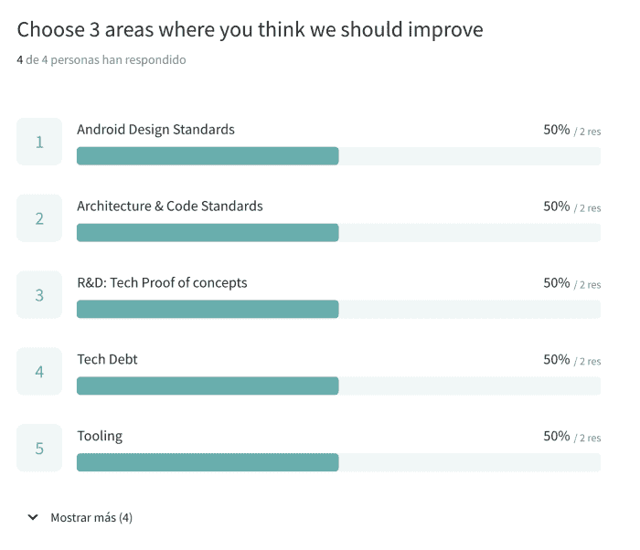
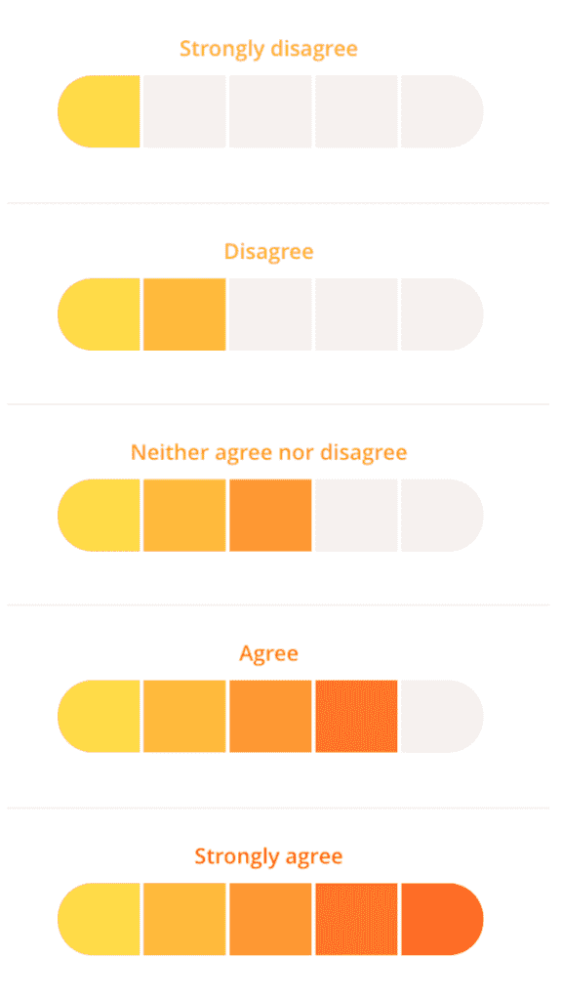

# 如何调查你的团队:询问开发人员他们正面临着什么样的难题

> 原文：<https://betterprogramming.pub/ask-the-developers-what-headaches-really-they-are-facing-b0ff4def4a27>

## 我们需要解决哪些技术问题？开发者调查不仅仅是 KPI。我们需要一个特定的环境来帮助确定路线图的优先级

克里斯蒂安·埃尔富特在 [Unsplash](https://unsplash.com/s/photos/headache?utm_source=unsplash&utm_medium=referral&utm_content=creditCopyText) 上拍摄的照片

想象一下这个场景:你在一条没有尽头的路上高速行驶。油表已经警告你好几英里了，但是你不能停下来加油。你必须尽快到达目的地，没有时间做其他事情了。最终，你会耗尽燃料，引擎会坏掉，你将不得不放弃那辆车。

这个例子可以用来说明许多初创公司的日常工作，他们只关注不惜任何代价推出新功能。没有花时间和停下来问他们的软件开发人员他们需要什么来更有效地工作**或者他们工作的哪些部分让他们最头疼。**

在这里，我们谈论的是一些庞大的东西，因为它们可以是任何东西，从他们没有硬件的软件工具，到代码库本身，到技术债务，到我们从来没有时间更新的过时的库。换句话说，它们可能是我们忽略的东西。在这里，我们包括测试过程、QA 过程、持续集成、实现构建的发布、文档、新成员的入职过程，或者与产品团队其他成员(设计师、产品经理或工程经理)交流的方式。

我们的目标是建立一个行动计划，对路线图上的问题进行优先排序，并对那些到目前为止被隐藏的技术任务给予更多的重视。

**在你的日常工作中，有哪些问题导致了你的困扰？我们需要改进哪些技术问题？显然，这不仅仅是一个 KPI，而是我们需要一个上下文来帮助更好地确定路线图的优先级。解决方案可能是询问团队开发人员的想法。这就是开发人员调查想法的来源。这个调查不应该被误解为开发者快乐的指标；它涵盖了更多的东西。**

指导我们应该解决的任务类型的示例问题

# 创建一个调查，看看开发人员是怎么想的

每天，在团队的周会、回顾会或 1:1 中，有趣的话题会提高生产力和团队的幸福感。但即便如此，要有一些具体的东西来帮助我们做决策、采取行动点，以及将某些技术任务优先于产品要求的功能，仍然是一个挑战。

拥有一个专注于工具、架构和超越产品特性本身的团队非常有帮助。姑且称之为核心、工装、人员，或者平台团队；这取决于公司。但你叫它什么并不重要。

当创建一个严格的技术路线图时，我们需要对将出现并影响不同领域的大量任务进行优先级排序。要做到这一点，只能通过一些具体的指标来确定问题、要解决的目标和要采取的行动。

一个起点是为团队开发人员创建一个关于不同主题的调查:产品和技术问题，以及项目的健康。第二是预测狂热的日常生活中隐藏的未来问题。

我们应该做的第一件事是**把我们感兴趣的话题分开**。乔尔测试是一个很好的起点。这里有一个更大的例子可以作为指导:

*   **开发环境**:必要的工具、团队入职文档、内部流程文档等。
*   **代码库**:对当前代码的满意程度，可能的重构，架构中应该改进的部分，它如何影响遗留代码来提供新的特性，常见错误，等等。
*   **代码评审**:代码评审过程，拉请求，交付代码的质量
*   **测试**:本地和 CI 执行环境，使用的测试类型(UI 或单元)
*   **测试环境**:预生产环境、试运行环境、本地执行环境
*   **CI** :持续集成的使用，基础设施的满意度
*   **发布过程**:主要瓶颈、构建的容易程度、最终用户的部署
*   **文档**:总体满意度，应记录的主题
*   **团队反馈**:快乐程度、协调性、对工作的满意度
*   **远程工作**:通讯工具、协调、同步、会议等。
*   **未来发展**:新的框架、架构的改进、未来的概念验证、研究和开发领域的优先顺序

这个主题列表提供了我们有兴趣在团队中评估的广泛问题。我们想知道他们的健康状况，发现我们做得不好的地方，并强化积极的一面。

有了这个要评估的问题列表，类似于上面描述的，有趣的事情是开始问必要的问题。我想在 Markdown 中分享[一个模板，其中有一些问题](https://bit.ly/3dGiCiU)是我们在开发团队中一直在问的。

# 评估问题还是自由文本答案？

有了主题列表后，理想情况下，我们将使用一组问题来计算分数，并使用另一组自由文本问题。自由文本问题允许开发人员补充他们的分数，并通过尽可能多地解释自己来给出想法。

对于数值，我们可以使用 **NPS 标度(0–10)**或**李克特(1–5)**。由于我们在调查中遇到的问题的性质，我们选择了第二种模式。

[李克特](https://en.wikipedia.org/wiki/Likert_scale)是问卷中常用的心理测量量表，也是研究调查中使用最广泛的量表。具有五个级别的项目的典型格式是:完全满意、满意、一般、不满意或完全不满意。

有了这个模板，你可以选择一组组合:满意、同意、相关、频率或重要性。通过这种评估，我们将尝试向工程师提出问题，以获得更全面的了解。

# 填写调查时的建议

让我们把路准备好。

**完成百分比**。这完全取决于团队的规模。显然，对于一个四至六人的团队，我们可能会决定每个人都应该完成它，这是必须的。在 20-50 人的大型团队中，不可能每个人都完成它，尽管 80%的人不允许任何观点遗漏。

完成调查的时间到了。给你的团队时间去做。这些问题通常很长，所以至少给团队一周的时间冷静地填写。团队需要被警告。

**定义预期响应格式应该如何**。在完成自由文本问题之前设置某些建议。向团队解释，有些问题需要提前书写或分析。诸如“我现在想不出什么”或者“我脑子里什么都没有”这样的回答是无效的。这个调查不是你离开超市时得到的快速民意测验。

**明确调查有目标，有未来计划**。这很重要。否则，团队可能会泄气，看不到调查的任何用处。解释您在获得调查结果后的计划，以及如何创建必要的行动点。

# 我们想从调查中发现什么？

我们最想知道的是车队遇到的问题。最具冲突性的问题是那些我们可能会得到较低分数的问题，例如，文档、团队之间的交流、缺乏工具使用知识，或者阻碍更有效地完成工作。

此外，我们应该获得新任务的想法:最冲突部分的重构，自动化某些粗糙方面的工具，未来的研究想法或概念证明，等等。我们不应该忘记关注新技术的采用——无论是语言、框架、库还是范例——对于保持团队的动力是必要的。

对于所有这些问题，**我们的目标将是制定一个行动计划，在路线图上对这些问题进行优先排序**，并对那些迄今为止被日常产品功能构建所掩盖的技术任务给予更多的重视。

汇总结果后，与团队坐下来就行动要点达成一致。如果可以的话，设定一些与绝对评分相关的行动点，以证明我们已经实现了目标。比如:增加团队对文档的满意度或者审核 PRs 时对速度的感觉。这些可能是最简单的，但它们是一个很好的起点。

格伦·卡斯滕斯-彼得斯在 Unsplash

# 摘要

简而言之，创建您的第一个开发人员调查并观察结果。有些可能会让你震惊。

正如我们之前提到的，我们不应该忘记如何从开发者那里获得反馈(1:1，周刊，公关等。).尽管如此，这些调查让我们能够轻松地记录和创建团队满意度的指标。通过这些开发人员调查，我们将对团队的表现有一个极好的总体了解，这将激励团队成长。

你可以通过创建一个非正式的调查，调查一些开发者关心的话题。最重要的是，在分析和收集数据之后，你就有了行动计划。像 Linkedin 和 Shopify 这样的公司将他们的工具策略建立在年度或半年度开发者调查的基础上。

您可以使用上面的模板创建您的第一份调查。选择最适合您团队的问题。

选择一个能让你创建引人注目且易于填写的在线表格的调查工具，例如， [Google Forms](https://www.google.es/intl/es/forms/about/) 或 [Typeform](https://www.typeform.com/) ，它们已经有了特定的模板，可以让你轻松导出结果并进行汇总。

当然，开发人员的调查也可以用于在连续的迭代中改进自己，所以保留几个问题用于对问卷本身的反馈。