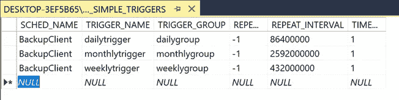
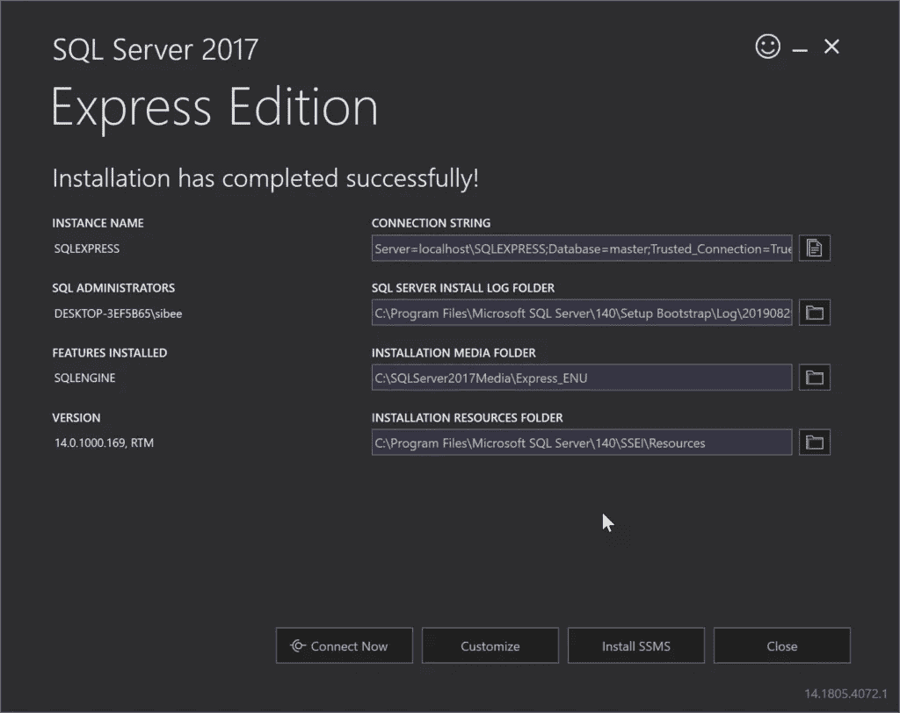
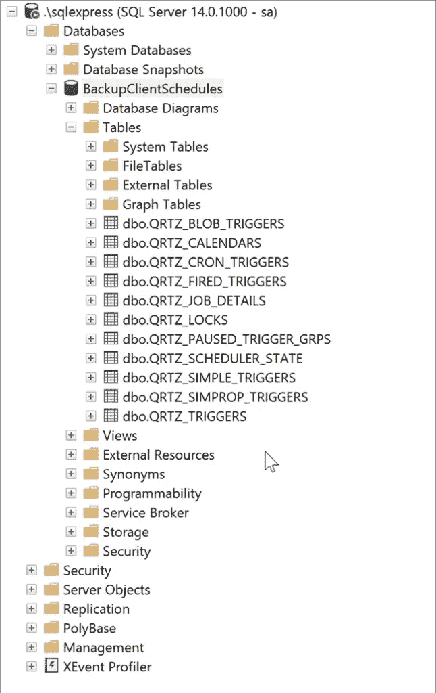
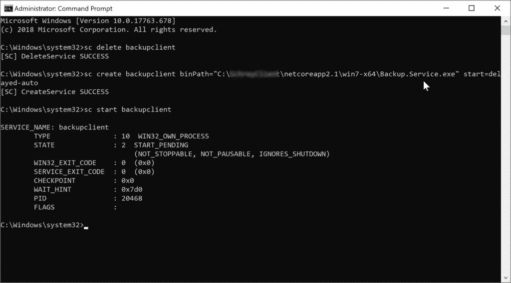
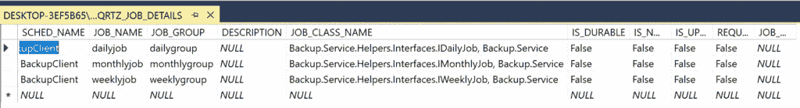
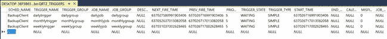

# 如何在数据库中使用 ASP.NET 核心的 Windows 服务任务 Quartz.NET

> 原文：<https://betterprogramming.pub/asp-net-core-windows-service-task-quartz-net-with-database-5972722ab044>

## 石英。NET 是一个令人惊奇的调度程序——我们甚至可以配置一个数据库来接收调度信息

在本文中，我们将了解如何在数据库中创建包含每日、每周和每月计划信息的 ASP.NET 核心 Windows 服务。



石英。NET 与数据库

# 介绍

在我们之前的[文章](https://medium.com/better-programming/asp-net-core-windows-service-task-scheduler-daily-weekly-monthly-700a569d502a)中，我们已经展示了我们可以使用石英。NET 的调度程序，然后将它作为 Windows 服务运行。这种方法的问题是，一旦系统重启或发生不好的事情，调度程序信息就会丢失。

为了纠正这个问题，我们实际上可以将所有调度程序信息保存在一个数据库中。幸运的是，Quartz.NET 调度程序支持这一点，我们可以很容易地实现它。我希望这个介绍对您来说足够清楚，让我们直接开始实现吧。

# 源代码

源代码可以在这个 GitHub 库中找到[。请随意开始，叉，或做任何你想做的事。](https://github.com/SibeeshVenu/Perfect-Scheduler)

# 设置数据库

在我们开始编码之前，让我们建立我们的数据库。您可以选择任何您想要的数据库。我选择 SQL Server Express。

# 安装 SQL Server Express



SQL Server Express

# 启用登录

我们应该启用将在 Quartz 配置中使用的登录。如果您尝试用 Windows 身份验证配置 Quartz，您将得到如下错误。

> 2019–08–29 11:34:02.3570 |信息|石英。CORE . QUARTZSCHEDULER | job factory 设置为:BACKUP。SERVICE . helpers . customjobfactory
> 2019–08–29 11:34:12.6801 | INFO | QUARTZ。传递给 ROLLBACKCONNECTION 的 IMPL . adojobstore . jobstoretx | CONNECTIONANDTRANSACTIONHOLDER 为空，忽略
> 2019–08–29 11:34:12.6892 |错误|QUARTZ。IMPL . adojobstore . jobstoretx |作业恢复期间出现故障:无法从数据源“默认”获取数据库连接:系统。DATA . sqlclient . sqlexception(0x 80131904):无法打开登录名请求的数据库“BACKUPCLIENTSCHEDULES”。登录失败。
> 用户“WORKGROUP\DESKTOP-3EF5B65$”登录失败。
> AT 系统。DATA . sqlclient . sqlinternalconnectiontds..CTOR(DBCONNECTIONPOOLIDENTITY IDENTITY，SQLCONNECTIONSTRING connection options，SQL CREDENTIAL CREDENTIAL CREDENTIAL，OBJECT PROVIDERINFO，STRING NEWPASSWORD，SECURESTRING NEWSECUREPASSWORD，BOOLEAN REDIRECTEDUSERINSTANCE，SQLCONNECTIONSTRING user connection options，session data reconnectsession data，BOOLEAN APPLYTRANSIENTFAULTHANDLING)
> AT SYSTEM。DATA . sqlclient . sqlconnectionfactory . create connection(DBCONNECTIONOPTIONS OPTIONS，DBCONNECTIONPOOLKEY POOLKEY，OBJECT POOLGROUPPROVIDERINFO，DBCONNECTIONPOOL POOL，DBCONNECTION OWNINGCONNECTION，DBCONNECTIONOPTIONS user OPTIONS)
> AT SYSTEM。DATA . provider base . dbconnectionfactory . createpooledconnection(DBCONNECTIONPOOL POOL，DBCONNECTION OWNINGOBJECT，DBCONNECTIONOPTIONS OPTIONS，DBCONNECTIONPOOLKEY POOLKEY，DBCONNECTIONOPTIONS user OPTIONS)
> AT SYSTEM。DATA . provider base . dbconnectionpool . createobject(db connection owning object，DBCONNECTIONOPTIONS USEROPTIONS，DBCONNECTIONINTERNAL old connection)
> AT SYSTEM。DATA . provider base . dbconnectionpool . usercreaterequest(db connection owning object，DBCONNECTIONOPTIONS USEROPTIONS，DBCONNECTIONINTERNAL old connection)
> AT SYSTEM。DATA . provider base . dbconnectionpool . trygetconnection(db CONNECTION owning object，uint 32 WAITFORMULTIPLEOBJECTSTIMEOUT，BOOLEAN ALLOWCREATE，BOOLEAN ONLYONECHECKCONNECTION，DBCONNECTIONOPTIONS USEROPTIONS，DBCONNECTION internal&CONNECTION)
> AT SYSTEM .DATA . provider base . dbconnectionpool . trygetconnection(db CONNECTION owning object，TASKCOMPLETIONSOURCE `1 RETRY, DBCONNECTIONOPTIONS USEROPTIONS, DBCONNECTIONINTERNAL& CONNECTION) AT SYSTEM.DATA.PROVIDERBASE.DBCONNECTIONFACTORY.TRYGETCONNECTION(DBCONNECTION OWNINGCONNECTION, TASKCOMPLETIONSOURCE` 1 RETRY，DBCONNECTIONOPTIONS USEROPTIONS，DBCONNECTIONINTERNAL old CONNECTION，DBCONNECTIONINTERNAL&CONNECTION)
> AT SYSTEM。DATA . provider base . dbconnectioninternal . tryopenconnectioninternal(db connection outer connection，DBCONNECTIONFACTORY connection factory，TASKCOMPLETIONSOURCE`1 RETRY, DBCONNECTIONOPTIONS USEROPTIONS) AT SYSTEM.DATA.SQLCLIENT.SQLCONNECTION.TRYOPEN(TASKCOMPLETIONSOURCE`1 RETRY)
> AT SYSTEM。QUARTZ 上的 DATA . sqlclient . sqlconnection . open()
> 。C:\ PROJECTS \ QUARTZ net \ SRC \ QUARTZ \ IMPL \ ADOJOBSTORE \ JOBSTORESUPPORT 中的 IMPL。CS:LINE 323
> client connection id:2 EFD 5 ab 8-71AA-4598-B5CA-63 C5 aa 6a FBE
> 错误号:4060，状态:1，类:11

是的，这是一个很长的错误，我们不希望任何错误。因此，让我们首先配置一个登录。我已经在我的一篇 StackOverflow [回答](https://stackoverflow.com/questions/3583605/login-failed-for-user-sa-the-user-is-not-associated-with-a-trusted-sql-server/57707682#57707682)中解释了如何做到这一点。

# 根据需要创建数据库和表

现在我们需要创建一个数据库和一些表，我们可以在其中保存调度程序和触发信息。你可以在官方的 Quartz GitHub 库中看到这个表格模式。您也可以在我们的源代码中找到相同的文件。

在 SQL Server Management Studio 中运行该查询之前，请确保首先创建一个数据库，并在那里使用同一个数据库。

```
CREATE database BackupClientSchedules
USE BackupClientSchedules
```

现在，如果您看到数据库`BackupClientSchedules`内部，您应该会看到一些没有数据的表。



石英。网络表

# 将 Quartz.NET 配置为使用数据库而不是 RAM

由于我们已经建立了数据库，现在我们可以开始配置服务了。如果你不熟悉 Quartz.NET 调度程序，我强烈推荐你阅读我以前的文章。

# 编辑 App.config

在继续之前，让我们更改一下`App.config`文件。

App.config

请注意，我们已经将`quartz.dataSource.default.provider`设置为`Sqlserver`，并且还给出了`quartz.dataSource.default.connectionString`。您应该使用您的提供程序和连接字符串来更改这些值。

# 安装 Nuget 包

我们应该在应用程序中安装 Nuget 包`Quartz.Serialization.JSON`。

# 设置调度程序

在上一篇文章中，我们展示了可以通过使用一个名为`GetSchedule`的函数来设置调度程序。现在我们可以编辑该函数的代码。

GetScheduler

请注意上面代码块中的注释。

# 安装服务

一旦我们完成了上述步骤，我们就可以运行带有发布配置的`dotnet` publish 命令并安装服务。



SC 命令

再次，阅读我以前的文章，如果你需要一个关于这个步骤的详细解释。

# 输出

一旦服务成功启动，您应该能够在我们的`win7-x64`文件夹中看到两个日志文件:`backupclientlogfile_backupservice.txt`和`backupclientlogfile_helperservice.txt`。你可以在这个文件中看到所有的日志。

您还应该能够在我们的数据库中的表中看到一些调度信息。下面给出了一些表格的截图。



Quartz 工作详细信息


石英样品触发器



石英触发器

# 结论

现在我们知道了:

*   关于 Windows 服务和 ASP.NET 控制台应用程序
*   关于如何使用 ASP.NET 核心创建 Windows 服务
*   关于如何使用石英调度数据库