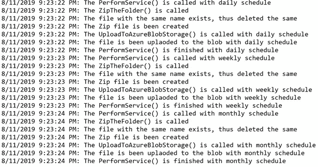
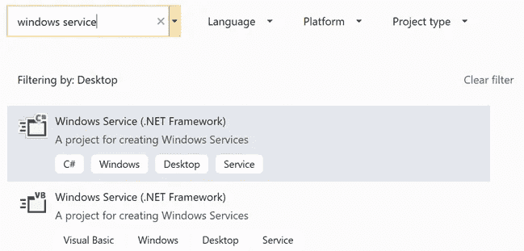
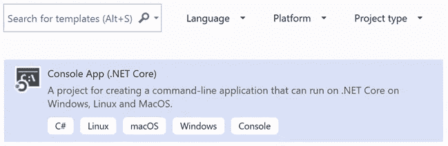
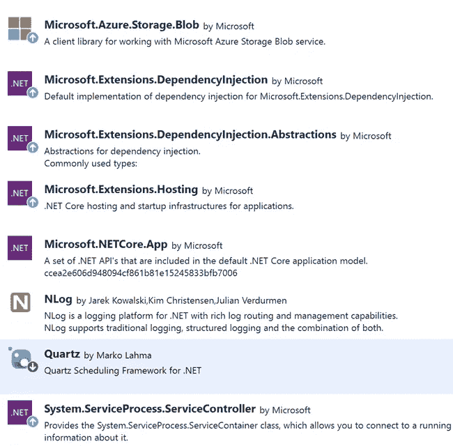
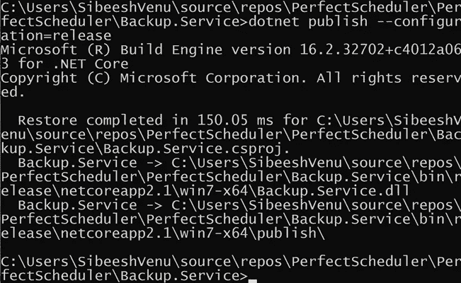
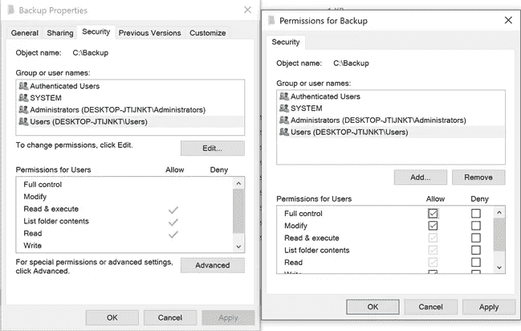

# 构建 Asp.Net 核心 Windows 服务任务计划程序

> 原文：<https://betterprogramming.pub/asp-net-core-windows-service-task-scheduler-daily-weekly-monthly-700a569d502a>

## 每天、每周或每月使用 Quartz 和 DI 创建 zip 文件并上传到 Azure blob 存储

Windows 服务日志

# 介绍

Windows 服务是减少我们必须在系统中做的一些手工工作的好方法。在这篇文章中，我们将使用 Asp.Net 核心编写一个 Windows 服务。分配给此 Windows 服务的作业如下:

1.  压缩文件夹并将文件保存到特定的目录
2.  将压缩文件夹上传到 Azure blob 存储

上述任务将每天、每周或每月运行。我们使用带有依赖注入的 Quartz 调度程序来完成这些令人惊奇的任务。我们使用 Nlog 来记录我们任务的细节。如果你对此感兴趣，那么你来对地方了。让我们制定一个完美的日程表。

# 源代码

这个项目的源代码已经上传到 GitHub。请随意派生、开始、创建拉动请求等。这里可以找到 [**的储存库**](https://github.com/SibeeshVenu/Perfect-Scheduler) 。

# 创建我们完美的调度程序

正如我前面提到的，我们正在用 Asp.Net 核心创建一个 Windows 服务。从技术上讲，没有直接的方法可以做到这一点，因为 Visual Studio 中不提供带有 Asp.Net 核心模板的 Windows 服务。

没有 Windows 服务项目模板

因此，我们将创建一个 Asp.Net 控制台应用程序，然后安装一个作为 Windows 服务生成的可执行文件。

。网络核心控制台应用程序

# 创建 Asp.Net 控制台应用程序

打开 Visual Studio，搜索项目模板控制台应用程序(。Net Core)，并根据您的方便命名解决方案。我将这个项目命名为 Perfect Scheduler，因为我认为我们可以通过创建许多 pull 请求来完善这个 Windows 服务。

一旦创建了应用程序，就安装我们所有的依赖项，这样我们就不需要担心它们了。

Asp。Net 核心 Windows 服务依赖项

# 编写服务

因为我们已经安装了所有的依赖项，所以我们准备创建我们的服务。添加一个名为`BackupService`的新类，并从`IHostedService`继承相同的类，后者是微软的一部分。扩展。承载命名空间。

`IHostedService`有如下两个方法，所以我们应该在我们的服务类中实现它们:

IHostedService

## 开始异步

StartAsync 方法可以按如下方式实现:

开始异步

正如你在上面代码的第一行看到的，我们正在获取 Quartz 的调度程序。让我们创建一个方法并返回一个调度程序:

GetScheduler

下一步是构建一个服务提供者，这样我们就可以使用构造函数依赖注入来注入我们的依赖。默认情况下，Quartz 不会这样做，所以我们必须自己构建配置。

GetConfiguredServiceProvider

如您所见，我们已经为`DailyJob`、`WeeklyJob`、`MonthlyJob`和`HelperService`配置了服务。我们将很快创建这些类和接口。

一旦我们获得了服务提供者，我们就可以将它传递给我们的定制作业工厂，我们将很快实现它。现在，我们可以启动调度程序并调度我们的作业，请确保您对触发器和作业使用不同的身份名称。样品如下所示:

作业和触发器

## 停止异步

`StopAsync`方法可以按如下方式实现:

停止异步

# 创建作业生成器和触发器生成器

现在我们可以为每天、每周和每月的作业创建接口和类。为此，创建一个名为 Helpers 的新文件夹和另一个名为 Interfaces inside 的文件夹。下面是您需要创建的接口。

## IDailyJob

IDailyJob

## 我每周工作

我每周工作

## IMonthlyJob

IMonthlyJob

## IHelperService

IHelperService

# 创建自定义作业工厂

为了实现依赖注入，我们需要创建自己的定制作业工厂。在 Helper 文件夹中创建一个类，如下所示:

定制工作工厂

# 实施作业构建器接口

现在是时候实施我们的每日、每周和每月工作构建器了。

## 日常工作

日常工作

## 每周工作

每周工作

## 每月工作

每月工作

我们已经为每个作业配置了单独的类，并通过构造函数注入了依赖关系`IHelperService`。将来，我们应该能够为这里的每个作业编写自定义逻辑，因为它们在单独的类中。

# 实现 HelperService

在我们开始实现这个服务之前，让我们现在配置 NLog，因为我们将从这个类中写入日志。

## 配置 NLog

要配置 NLog，创建一个新的配置文件`NLog.config`并编辑内容，如下所示:

nllog . config

现在，创建一个方法`SetUpNLog()`并添加如下代码:

设置日志

请确保您已经添加了一个属性`ILogger _logger`。

我们可以用所有必要的私有和公共方法如下实现`HelperService`:

帮助者服务

将为每个调度调用方法`PerformService`(字符串调度)，它将确保执行以下任务。

1.  压缩文件夹并将文件保存到特定的目录
2.  将压缩文件上传到 Azure blob 存储

这里，变量和 blob 存储容器名称的值是相同的，或者是每天、每周或每月。如果你不确定如何将 blob 上传到 Azure 存储帐户，我强烈建议你在这里阅读我的文章*。*

*记得在`App.config`文件中设置`FolderToZipLocation`(文件应该保存的位置)、`FolderFromZipLocation`(文件应该从哪里取出)和`StorageConnectionString`的值。*

*App.config*

# *设置程序*

*如你所知，`Program`类是我们控制台应用程序的开始，现在是时候从`Program`类调用我们的`BackupService`了。让我们编辑如下所示的`Program`类的代码:*

*程序*

*如果我们在本地运行应用程序/调试，我们调用扩展方法`RunConsoleAsync()`或者我们调用我们自己的定制扩展方法`RunTheServiceAsync()`。行`services.AddHostedService()`非常重要，因为这是我们注册`IHostedService`的地方，也就是`BackupService`。下面是我们扩展方法的代码:*

*ServiceBaseLifetimeExtension*

*在`ServiceLifetime`类中，我们覆盖了`ServiceBase`类中的方法。实现如下:*

*服务寿命*

# *创建 Windows 服务*

*由于我们已经创建了 Asp.Net 核心控制台应用程序，现在是时候从它创建一个 windows 服务了。确保您已经在项目的属性中设置了`RuntimeIdentifier`到`win7-x64`和`SelfContained`到`true`，这将确保您的所有依赖项都被添加到您的可执行文件中，这样您就不需要担心手动处理您的依赖项了。你可以在这里 了解更多 [**。为此，右键单击项目，然后单击编辑项目文件。最后，您的`csproj`文件应该类似于:**](https://docs.microsoft.com/en-us/dotnet/core/deploying/#self-contained-deployments-scd)*

*后援。Service.csproj*

# *创建发布配置*

*在尝试安装服务之前，您还应该使用发布配置运行`dotnet publish`命令，因为您需要这个可执行文件来安装服务。*

*使用管理员权限打开命令提示符，并使用`cd`命令转到项目根文件夹。运行命令`dotnet publish --configuration=release`。*

*这将产生你想要的一切。如果您正确运行该命令，您应该会看到以下输出:*

**

*Dotnet 发布版本*

*现在转到`bin`文件夹，然后是`release`文件夹，你应该会看到一个名为`netcoreapp2.1`的文件夹。在这个文件夹里面，会有一个名为`win7-x64`的文件夹，这是你的。exe 文件、日志文件和其他项目。*

# *安装服务*

*要将我们的 Asp.Net 控制台应用程序安装为 Windows 服务，您可以使用`sc`命令。以管理员权限打开命令提示符，并运行命令:*

*延迟开始的 SC 创建*

*然后您可以通过运行命令`sc start BackupService`来启动服务。这将启动您的服务。*

# *授予文件夹权限*

*有时您可能会在服务中遇到权限问题，因为它没有足够的权限从 c 盘读取文件。为了克服这个问题，您应该给用户足够的权限。您可以通过编辑这些文件夹的安全属性来做到这一点。*

**

*为用户设置权限*

*对`BackupZip`文件夹也进行同样的操作。*

# *输出*

*如果您正确运行服务，您应该在您的`win7-x64 folder`中看到一个名为`backupclientlogfile.txt`的日志文件。一旦服务运行，日志将按如下方式写入。*

*完美的调度输出*

*您还可以检查您的 Azure 存储帐户，以检查文件是否已正确上传。*

# *结论*

*哇！我们了解到:*

*   *关于 Windows 服务和 Asp.Net 控制台应用程序*
*   *关于如何使用 Asp.Net 核心创建 Windows 服务*
*   *关于如何使用 Quartz 调度程序*
*   *关于如何在 Windows 服务中使用 NLog*
*   *关于如何配置 Quartz 调度程序使用依赖注入*
*   *关于如何压缩文件夹并保存文件*
*   *关于如何将文件上传到 Azure blob 存储*

# *轮到你了。你怎么想呢?*

*非常感谢你的阅读。我错过了你认为这篇文章需要的东西吗？你觉得这篇文章有用吗？别忘了在评论里和我分享你的想法！*

*最亲切的问候
Sibeesh Venu*