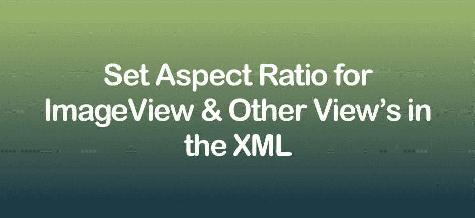
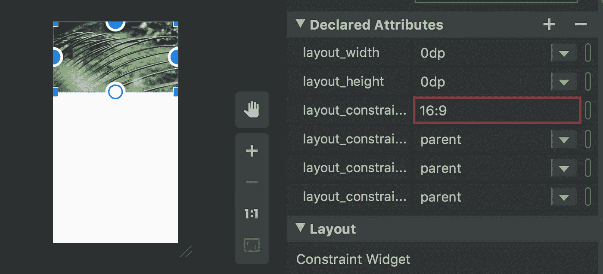
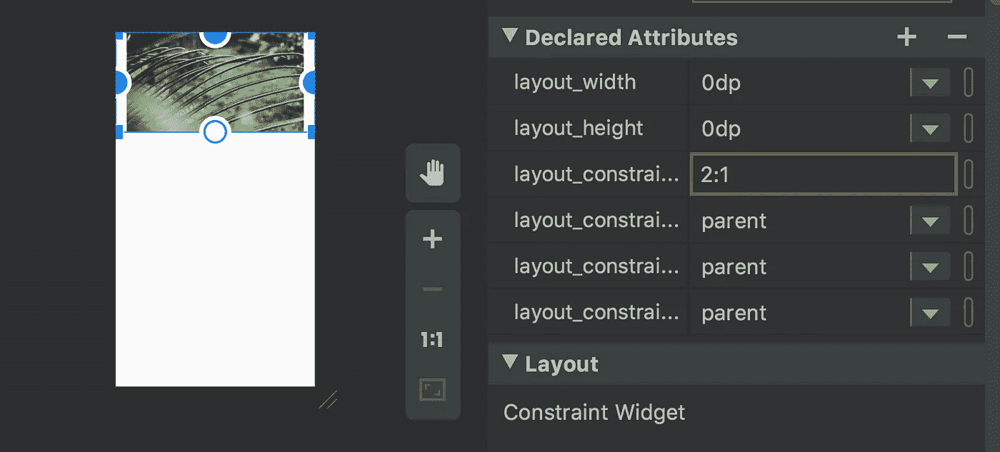

# 如何使用“constraintDimensionRatio”设置 XML 视图的纵横比

> 原文：<https://betterprogramming.pub/aspect-ratio-with-constraint-layout-with-constraintdimensionratio-d55828ec4aae>

## 准确显示您的图像



这篇文章是关于`[ConstraintLayout](https://medium.com/better-programming/essential-components-of-constraintlayout-7f4026a1eb87)`的一个重要而有用的属性，称为`constraintDimensionRatio`。在探索这个之前，我们应该知道纵横比和`[ConstraintLayout](https://medium.com/better-programming/essential-components-of-constraintlayout-7f4026a1eb87)`。

*长宽比*是用来描述视图尺寸的术语，通过比较宽度和高度，用比例的形式表示。长宽比是根据宽度:高度来测量的。如果长宽比为 4:3，则宽度应为 4，而高度应为 3。该比率会相应地设置图像。

在 Android 开发中，在`ConstraintLayout`之前，我们习惯使用长宽比公式，固定宽度或高度来获得图像的完美视图。在引入了`ConstraintLayout`之后，许多事情在 XML 中变得容易了。

要了解更多关于`ConstraintLayout`的信息，请查看“[constraint layout 的基本组件](https://medium.com/better-programming/essential-components-of-constraintlayout-7f4026a1eb87)”比率是`ConstraintLayout`的特性之一，有助于减少一点编程设置纵横比的开销。

# 让我们用一个例子来更好地理解它

当使用`constraintDimensionRatio`属性时，我们需要将至少一个约束维度设置为`0dp`(例如`MATCH_CONSTRAINT`)，并且我们需要将属性`layout_constraintDimensionRatio`设置为所需的比率。例如，查看下面的代码片段:

```
<Button 
    android:layout_width="wrap_content"
    android:layout_height="0dp"
    app:layout_constraintDimensionRatio="1:1"/>
```

上面的 XML 将按钮的高度设置为与宽度相同。

该比率可以用以下两种方式之一表示:

*   一个**浮点值，**表示宽度和高度的比值
*   形式为**“宽度:高度”**的比率

如果两个维度都设置为`0dp`，我们也可以使用比率。在这种情况下，系统在保持给定纵横比的同时，设置满足上述所有约束的最大尺寸。

让我们用一个`ImageView`和一个 16:9 的值来应用`constraintDimensionRatio` 属性，看看是什么样子。

这将按照 16:9 的比例设置`ImageView`的高度，而`ImageView`的宽度将匹配父对象的约束。图像将如下所示:



如果我们改变`ImageView`的比例，那么它会看起来不一样。



# 在比率后附加“W”或“H”

如上所示，当两个尺寸都设置为与约束匹配时，也可以应用比率。

为了根据另一边的尺寸来约束某一边，我们可以预先设置`W`或`H`来分别约束宽度或高度。

例如，如果一个尺寸受到两个目标的约束(例如，宽度是`0dp`并以父对象为中心)，您可以通过在比率前添加字母`W`(用于约束宽度)或`H`(用于约束高度)，并用逗号分隔，来指示应该约束哪一侧。

```
<ImageView
    android:layout_width="0dp"
    android:layout_height="0dp"
    android:id="@+id/imageView"
    app:layout_constraintBottom_toBottomOf="parent"
    app:layout_constraintRight_toRightOf="parent"
    app:layout_constraintLeft_toLeftOf="parent"
    app:layout_constraintTop_toTopOf="parent"
    **app:layout_constraintDimensionRatio="W,1:3"** />
```

在上述示例中，高度将根据应用于它的约束来定义。

在这种情况下，约束被配置为附加到父视图的顶部和底部，实质上是扩展小部件以填充父视图的整个高度。

另一方面，宽度尺寸被限制为`ImageView`高度尺寸的三分之一。

因此，无论布局出现在什么样的屏幕尺寸或方向上，`ImageView`将始终与父布局高度相同，宽度为该高度的三分之一。

# 为不同的屏幕设置不同的比率

由于 Android 有可变的屏幕尺寸，我们可以根据需求灵活地为不同的屏幕设置不同的比例。我们可以在不同的维度文件中定义比率字符串，并在 XML 中访问它们，这样就可以访问特定于屏幕的维度。

例如:

## **res/values/dimens.xml**

```
<**string name="section_image_ratio"**>16:9</**string**>
```

## **RES/values-large/dimens . XML**

```
<**string name="section_image_ratio"**>12:8</**string**>
```

因此，图像纵横比会根据设备尺寸发生变化，我们只需参考参考资料中的`section_image_ratio`。

```
**app:layout_constraintDimensionRatio="@string/section_image_ratio"**
```

# 结论

目前就这些。希望你喜欢阅读这篇文章。

感谢阅读！

## 资源

[约束布局](https://developer.android.com/reference/android/support/constraint/ConstraintLayout)