# 利用深度学习评估音频质量

> 原文：<https://betterprogramming.pub/assessing-audio-quality-with-deep-learning-f66d1761f938>

## 如何使用 TensorFlow 2.0 训练深度学习系统来估计平均意见得分(MOS)

照片由[马蒂厄 A](https://unsplash.com/@innov8?utm_source=unsplash&utm_medium=referral&utm_content=creditCopyText) 在 [Unsplash](https://unsplash.com/s/photos/audio-quality?utm_source=unsplash&utm_medium=referral&utm_content=creditCopyText) 上拍摄

# 介绍

如果您曾经使用过 Skype 或 Hangouts 等 VoIP(IP 语音)应用程序，您就会知道音频质量下降可能是一个问题。在视频或音频会议中，也许是与客户和潜在客户，音频质量很重要。

“语音质量”听起来像是一个主观的概念。但是有一些众所周知的影响语言清晰度的退化类型。我说的可懂度是指语音可以有多“愉悦”。降低可懂度的一些退化包括回声、混响和背景噪声(通常来自你的同事)。

评估音频信号质量的一种常用度量是平均意见得分(MOS)。MOS 是不同用户给出的个人评分的算术平均值。我们稍后将详细讨论 MOS，但如果您以前使用过 Skype，您就会知道我在说什么。

这些 VoIP 服务中的大多数使用类似的策略从用户那里获得 mo。当 VoIP 通话结束时，该工具会要求用户对他们的通话体验进行评分。大多数情况下，用户报告的满意度从 1(差)到 5(优秀)不等。一旦统计上显著数量的人对给定的音频样本进行了评级，MOS 就是所有评级的平均值。

在这篇文章中，我们提出了一个深度卷积神经网络(`ConvNet`)来解决 MOS 估计的问题。此外，我们更进一步，训练一个多类`ConvNet`来估计 MOS，并对给定输入的退化类型进行分类。我们的代码是用 TensorFlow 2.0 编写的，可以从我们的 [GitHub 页面](https://github.com/daitan-innovation/cnn-audio-mos-estimator)获得。

# 问题是

我们将 MOS 估计问题公式化为一个回归任务。换句话说，给定一组表示音频样本的特征，我们希望预测 1 到 5 范围内的真实值(标准 MOS 范围)。要记住的一件重要事情是，MOS 应该衡量用户的体验质量。然而，正如我们将要看到的，音频信号远非稳定。因此，在 Skype 征求用户反馈的例子中，一个 MOS 值可能代表不同的情况。

为了更清楚地看到这个问题，想象一段来自 VoIP 呼叫的简短语音，总 MOS 为 3.9。尽管这是一个相当不错的分数，但有不止一种情况可以解释这一最终评级。一个简单明了的例子是一个从头到尾质量都很好的呼叫。在这种情况下，MOS 在平均值 3.9 附近振荡，没有明显的异常值，即较小的标准差。

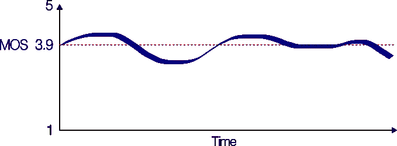

给定音频样本的主观评分为 3.9。整个 3.9 MOS 描述了一个从头到尾质量都很好的音频样本。

然而，问题来了，因为算术平均值对异常值非常敏感，所以 3.9 MOS 也可以用下图来解释。

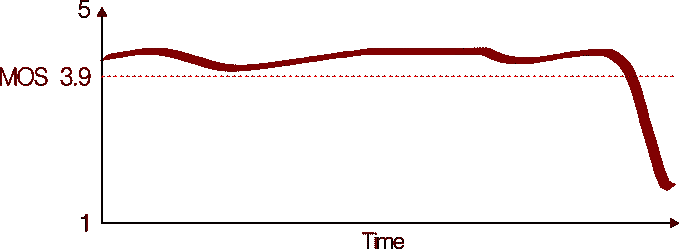

给定音频样本的主观评分为 3.9。整体 3.9 MOS 描述了大多数时间具有优秀(高于 3.9) MOS 的音频样本。质量的突然下降会拉低 MOS。

在这种情况下，MOS 在大部分时间都很高(高于平均值 3.9)。然而，在通话即将结束时，清晰度突然下降，这使得用户对最终体验的评价低于预期。这强调了采用不同策略来更好地测量音频质量的必要性。换句话说，为了获得可靠的音频质量测量，我们需要减轻算术平均值的弱点。

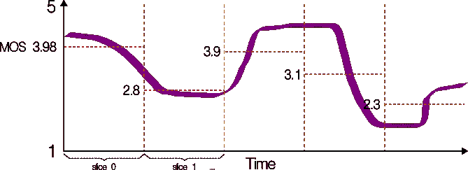

将音频信号分割成小部分并估计每个单独部分的 MOS，给出了对音频质量的整体更好的测量。

要做到这一点，我们可以通过将音频信号分割成小的间隔来测量 MOS。对于每个间隔，我们估计一个单独的(本地)MOS。这样，我们对音频样本进行的切片越多，MOS 的分布就越高。这反过来提供了更好的最终 MOS 估计。在上面的例子中，为了得到样本音频的最终 MOS，我们只需计算所有五个估计值的平均值。举例来说，**就是 3.216** 。

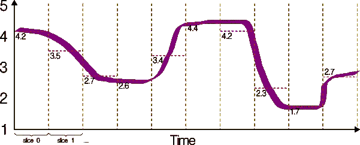

切片越多，整体质量衡量越好。

同样，分数分布越密集，总体 MOS 就越有代表性。对于上面的例子，**就是 3.17** 。

# 数据集

很难找到用于 MOS 估计的人类注释音频数据库。这里，为了简单起见，我们选择了 [TCD-VoIP 数据集](http://www.mee.tcd.ie/~sigmedia/Resources/TCD-VoIP)。

该数据集旨在帮助开发和测试语音质量 VoIP 系统。它包含一组五种类型的 VoIP 降级及其相应的主观意见得分(MOS)。该数据集集中于独立于硬件或网络发生退化，并可免费获得。

TCD-VoIP 涵盖了 VoIP 应用中常见的五种降级。这些是:

*   背景噪声
*   明白易懂的竞争发言人
*   回声效果
*   振幅削波
*   断断续续的讲话

对于每个音频样本，有来自 24 个不同听众的个人主观意见得分。同样，最终主观得分(MOS)是 24 个得分的算术平均值。总共有 384 个音频文件，两个男性和两个女性扬声器。你可以在下面的图片中看到语言退化和 MOS 的分布。

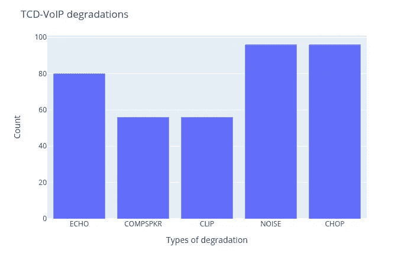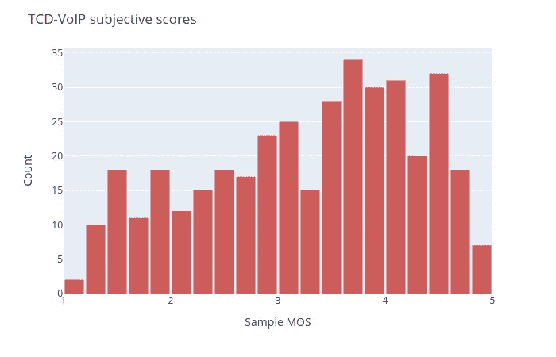

# 特征抽出

为了从音频样本中提取特征，我们实验了用于音频处理的最流行的表示。具体来说，我们使用短时傅立叶变换(STFT)将音频信号编码成四种不同的特征表示。

*   STFT 的光谱星等
*   STFT 的声谱图
*   梅尔光谱图
*   常数 Q 变换
*   梅尔频率倒谱系数

为了简明起见，这里我们只描述 STFT 特征的大小。事实上，连同 STFT 的**声谱图，幅度向量是我们实验中最有效的表示。**

STFT 是音频信号最常见的时频表示。这个想法是在输入信号的一小部分上计算傅立叶变换。由于音频样本是高度不稳定的(主要是音乐信号)，STFT 将信号分成更小的部分，作为提供更鲁棒的最终表示的一种方式。

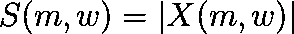

STFT 的星等矢量。

对于 STFT 变换，我们使用覆盖输入音频信号的 512 个样本点的汉明窗口。窗口以 64 点的步幅(跳跃大小)移动，这保证了 75%的重叠。最后，我们取 STFT 的大小，并将其用作最终的特征向量。顺便提一下，要计算 STFT 的声谱图，我们只需计算 STFT 的平方。

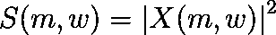

计算 STFT 的光谱图

由于音频样本具有不同的长度，我们使用“环绕”模式填充 STFT，使得特征向量具有相同的形状。这样**，STFT 有 259 个频率仓和 1241 个时间帧**。

# 解决方案

最终解决方案由一个多路输出 ConvNet 组成，可训练参数约为 58K。该架构由以下重复模块组成:

*   [卷积](https://en.wikipedia.org/wiki/Convolutional_neural_network) → [批量归一化](https://en.wikipedia.org/wiki/Batch_normalization) → [ReLU](https://en.wikipedia.org/wiki/Rectifier_(neural_networks)) → [最大汇集](https://en.wikipedia.org/wiki/Convolutional_neural_network#Pooling_layer) → [空间落差](https://en.wikipedia.org/wiki/Dropout_(neural_networks))

在训练期间，该模型接收来自 STFT 震级谱的随机裁剪的小块作为输入。我们在第一个轴上使用 Z 索引标准化来标准化输入面片。这确保了跨越 STFT 向量的 259 个箱的接近 0 的均值和单位方差。

随机裁剪预处理减轻了每个输入的训练计算处理。此外，它增加了训练数据，从而减少了过度拟合。该模型接收固定大小的面片 *(257 x 416)* 作为输入，并产生两个输出。

*   第一个输出是作为回归任务优化的 MOS 估计。这里，我们使用均方误差(MSE)作为目标。该模型产生一个介于 0 和 1 之间的值，该值对应于归一化的 MOS。
*   第二个输出是一组概率，用于对信号的退化类型进行分类。对于这个分类任务，目标被设置为交叉熵损失函数。这里，最后一个密集层有 5 个神经元(每个类一个)和 *softmax* 激活。

最后，我们将这两个成本结合起来产生总损失，并使用 Adam 优化器将其最小化。查看下面的简化模型架构。

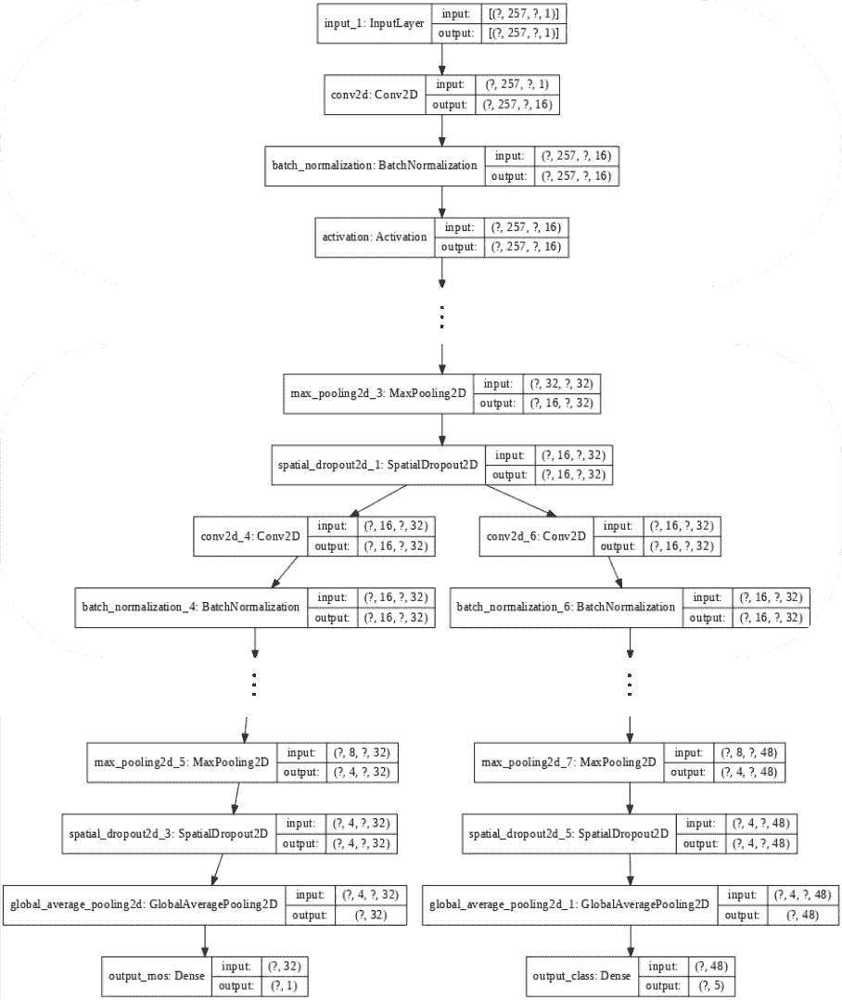

为了平衡每项任务对最终损失的贡献，我们将每项损失的权重与它们的优势成反比。基本上，我们运行 100 个时期的短实验，并存储每个时期的单个原始损失。我们接着计算一个损失相对于另一个损失的平均程度。通过这样做，我们可以测量一个损失与另一个损失相比(平均)有多大。

# 结果

尽管 TCD-VoIP 数据集很小，但结果相当好，尤其是 MOS 估计，其平均绝对偏差仅为 0.06。您可以看到下图，并比较来自测试集和相应估计值的地面真实 MOS。

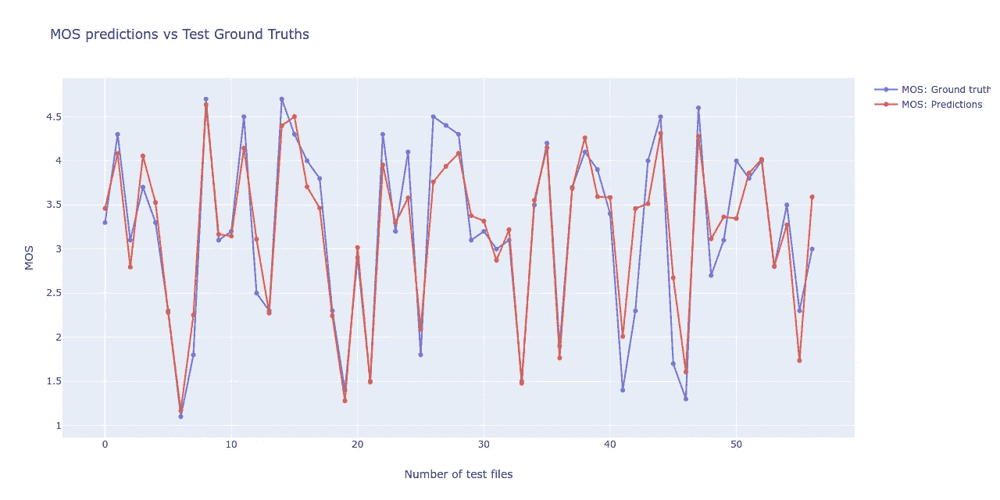

比较地面真实值和预测 MOS 估计值。

您还可以听一些音频样本(来自测试集)，并将**目标**与**预测的**主观分数进行比较。

目标 MOS 为 3.5、估计得分为 3.27 的音频样本

目标 MOS 为 1.8、估计得分为 2.09 的音频样本

目标 MOS 为 1.8、估计得分为 2.251 的音频样本

目标 MOS 为 3.1、估计得分为 3.364 的音频样本

下面，你还可以看到一个退化任务的混淆矩阵。该模型设法将大多数测试示例分类为正确的类。然而，缺乏更多的训练数据是无法实现更高精度的关键因素。总体平衡准确率为 75%，准确率和召回率分别为 82%和 77%。

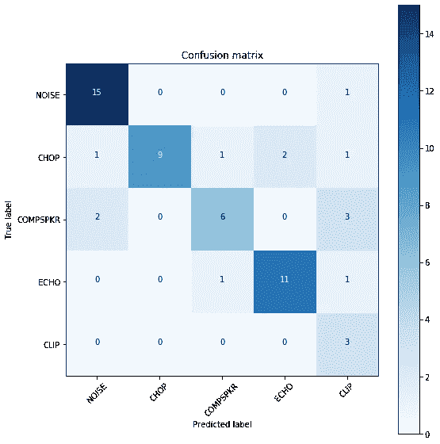

VoIP 常见退化分类的混淆矩阵。

# 结论

即使有一个相对较小的数据集，包含五种常见的 VoIP 质量下降，总体结果也非常好。可悲的是，很难找到具有统计上显著的人类注释主观分数的音频数据库。

尽管如此，由于深度学习模型需要大量的数据才能产生良好的结果，我们不应该指望这个模型能够在野外推广所有数据。事实上，TCD-VoIP 数据集只包含来自四个不同人的语音样本。这种可变性的缺乏使得模型非常局限于数据本身。然而，使用更大的数据集，如[语音转换挑战(VCC) 2018](http://www.vc-challenge.org/) ，这里给出的配方是相同的，我们可以期待更好的泛化。

**感谢阅读。**

*thal les Santos Silva 和 Daitan 的创新团队。*