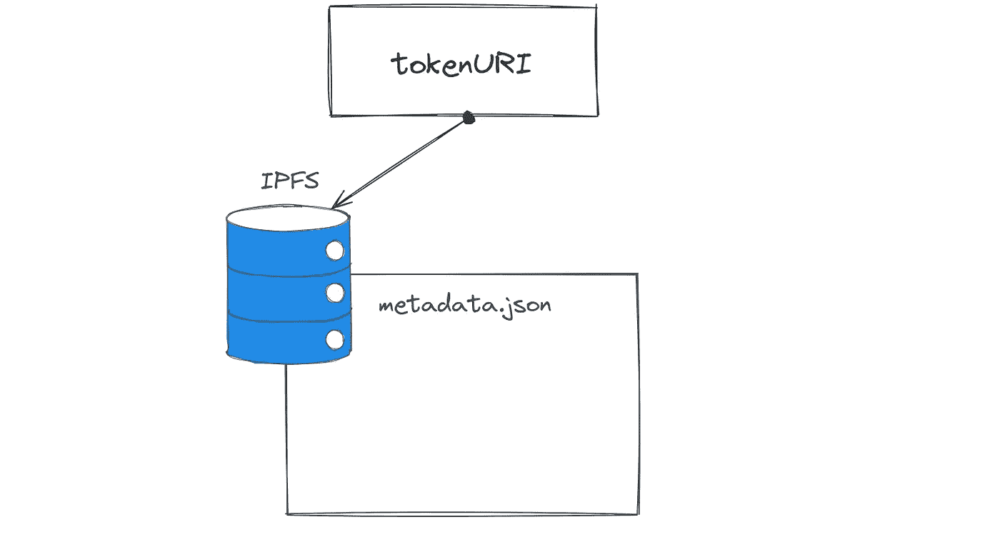
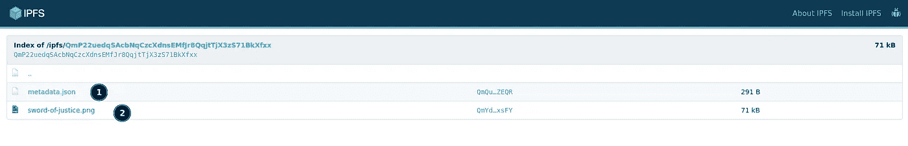
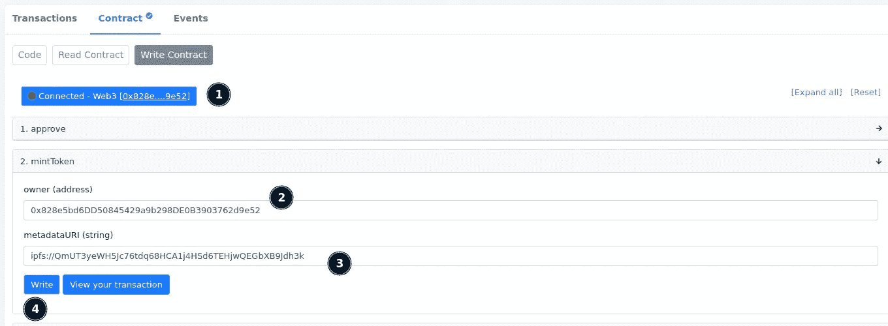
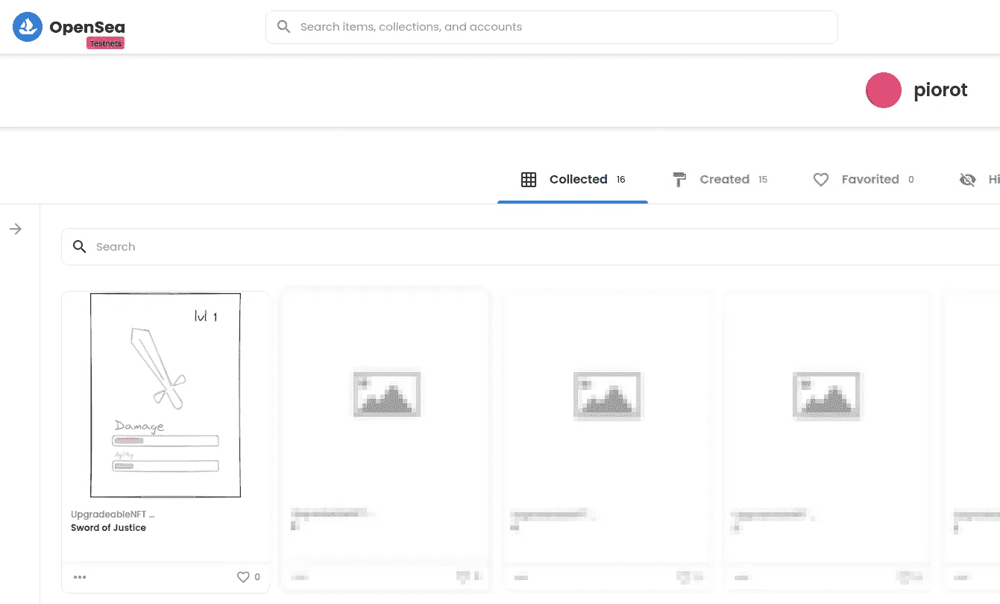
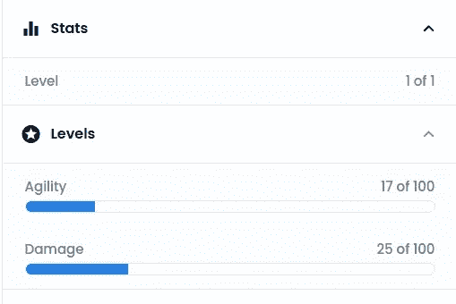

# 将数据分配给 NFT 令牌

> 原文：<https://betterprogramming.pub/assigning-data-to-nft-tokens-46865a3fde39>

## 元数据如何链接到 NFT 令牌，如何上传`metadata.json`和 pic 到 IPFS，等等

由 [Tezos](https://unsplash.com/@tezos?utm_source=medium&utm_medium=referral) 在 [Unsplash](https://unsplash.com?utm_source=medium&utm_medium=referral) 上拍摄的照片

当我第一次介绍[游戏物品作为 NFT 代币](https://www.rotynski.dev/game-items-as-nfts/)时，我们已经看到在铸造阶段有可能添加代币的`tokenURI`。但是我从来没有合理的使用过。相反，我只是输入了一些无意义的值。

令牌的`metadataURI`是一种将一些数据分配给我们的游戏物品，并在我们想要的任何地方使用它的方式，即:

*   市场上
*   在游戏中

# 有意义的 URI

根据[https://eips.ethereum.org/EIPS/eip-721](https://eips.ethereum.org/EIPS/eip-721)T3 应该有以下字段:`name`、`description`和`image`。

名称和描述是显而易见的，但图像字段可以是一个图像(如 jpeg)或链接到另一个文件。然而，实现`[enjin](https://github.com/ethereum/EIPs/blob/master/EIPS/eip-1155.md#erc-1155-metadata-uri-json-schema)`标准会更有用，因为它允许指定游戏物品的属性:)

*注意:根据*[*opensea*](https://docs.opensea.io/docs/metadata-standards#attributes)*的说法，这个项目最好的方式是将每个令牌的元数据扩展成 OpenSea 理解并在其 UI 上表示的特殊属性。*

# 它是如何工作的

每个 NFT 令牌都应该将`tokenURI`设置为解析为`metadata.json`文件的 URL(通常是 IPFS)。

IPFS 可能是一个不错的选择，因为它的好处。不变性是一种特殊的特征，当它应该被交易时就会发光。

# 剑的属性

如果我们回想一下剑的样子，最好在元数据中至少有 4 个字段。

*   剑的形象
*   剑的水平
*   伤害(生命值)
*   灵活

知道了这把剑的元数据之后:

伤害和敏捷都应该显示为进度条，等级只是一个数字。OpenSea UI 使用的配置将如下所示:

**伤害** : `{trait_type: "Damage","value":25, "max_value": 100}`
**敏捷** : `{trait_type: "Agility","value":17, "max_value": 100}`
**等级** : `{trait_type: "Level", "value":1, "displa_type": number}`

因此，完整的元数据将如下所示:

由于有两个文件与令牌相关，我们需要将它们都上传到 IPFS。由于`metadata.json`链接到图像文件，上传的顺序是:

1.  上传图像文件并记下其路径
2.  使用从点 1 开始的路径引用`metadata.json`中的图像文件。
3.  上传`metadata.json`文件

在[上传 ifps 并钉住](https://gateway.pinata.cloud/ipfs/QmP22uedqSAcbNqCzcXdnsEMfJr8QqjtTjX3zS71BkXfxx/metadata.json)(感谢 pinata)后，看起来是这样的:

这两个文件都可以通过`pinata.cloud gateway`来访问(该服务不帮助兼容的浏览器，并将 [ipfs 资源](https://gateway.pinata.cloud/ipfs/QmP22uedqSAcbNqCzcXdnsEMfJr8QqjtTjX3zS71BkXfxx/sword-of-justice.png)视为常规资源)。这是[正义之剑档案](https://gateway.pinata.cloud/ipfs/QmP22uedqSAcbNqCzcXdnsEMfJr8QqjtTjX3zS71BkXfxx/sword-of-justice.png)。

# 将 tokenUri 分配给新生成的令牌的时间

这也很简单，我们可以使用`etherscan`并使用元掩码登录。然后在创建时，我们将使用位于 ipfs 中的特定值`metadata.json`(不是网关地址，因为这是不必要的，会导致单点故障)

如图所示，首先我们用 metamask 登录，然后使用 mint 函数，用我们的地址作为所有者，IPFS 链接到`metadata.json`(它本身链接到图像):

要快速查看如何在我们的以太网智能合约中创建新令牌，请观看以下视频:

然而，这次需要使用 ipfs URL，而不是上面视频中显示的无意义的值。

# 让我们在 OpenSea 上测试一下

在登录到`test.opensea.io` ( *在林克比测试网上，与合同及其令牌*相同)后，我们应该可以看到我们的 NFT 令牌的完整形状。

它应该有一个名称和描述在`metadata.json`，也有图像上传到 IPFS。此外，您将看到如上所述的属性。

登录后，它会显示在列表上。

令牌列表，其中第一个令牌刚刚铸造，并分配了所有参数

令牌属性在 opensea ui 上的呈现方式

我们还可以看到 OpenSea 内部 UI 呈现的属性:

*   等级(*1/1，后者来自于对所有其他等级的分析，因为只有一个等级，所以这就是*
*   灵活
*   损害

# 总结

我们在这里讨论了

*   元数据如何链接到 NFT 令牌
*   什么是元数据标准，OpenSea 是如何使用它们的
*   如何上传`metadata.json`和 pic 到 IPFS
*   属性丰富的令牌如何在 OpenSea 上呈现

*原载于*[*https://rotynski . dev*](https://rotynski.dev/assigning-data-to-nft-tokens/)