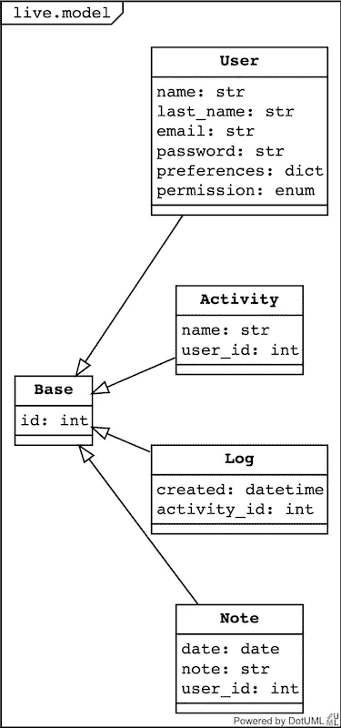

# 异步一直向下！

> 原文：<https://betterprogramming.pub/async-all-the-way-down-2c0cec62480f>

## [SqlAlchemy 1.4](https://docs.sqlalchemy.org/en/14/) 现在支持`asyncio`


卡洛奥。Callay！ [SqlAlchemy 1.4](https://docs.sqlalchemy.org/en/14/) 现在支持`asyncio`。他们所做的工作令人惊叹。

多年来，我一直在用`SqlAlchemy`处理 Tornado，并且不得不求助于`ThreadPoolExecutor`来使我的查询并行运行。不会了。现在，它将一直异步到最后一只海龟。当然，除非您决定使用 ORM。然后 [greenlets](https://pypi.org/project/greenlet/) 会解决你所有的问题。但是让我们后退一步，讨论一下您在设计 API 时所做的编辑决策。

## 函数还是类？

第一个编辑决定通常是习惯问题。我知道有些不允许类的开销——那都是继承和不必要的复杂性。他们有时是错误的。一个优雅的类层次结构通常可以减轻如何在你面前的代码图中导航的痛苦。在其他时候，一堆函数就足够了。

以学习 Java 的容易程度为例。一切都是一个类，一切都需要一个接口的实现。然后你看一个 python 包——这个 wally 用的是什么风格？功能类或者——哦，天哪。文档是有帮助的，但是有时候我不读源代码就不知道他们想要什么。

咆哮结束，让我们看看我们的选择。我们试图实现一个简单的时间表应用程序。我选择将其建模如下:



为什么？因为用户会记录他们一整天的时间使用情况。只有用户可以记录时间，只有用户可以编辑他们的时间。我们已经将活动隔离到用户的名称空间；活动不共享。所以日志只是一个时间戳和一个活动的组合。用户还将保存一天的笔记。

那么我们如何在这个模型上生成视图呢？我们是要公开一个类似 CRUD 的接口还是假设一个上下文？让我们先来看看日志视图:

首先，当前登录的用户是谁？然后，让我们整理一些日期，可能没有日期，也可能格式不正确。我让`python-dateutil`帮我解决这个问题。然后我们开始我们的查询。我们正在使用新的 1.4 `Session`和`select`语句。首先，它是上下文感知的。它在离开上下文时关闭，而不是传入一个 selectables 数组，我们使用*args 来传入它们。很干净直观。我们加入，添加一个 where 和 order_by。这个游标有一个 all()方法，因为每一行都有一个 items 接口，所以我们可以将它们解构为 dto 构造函数的参数。好悲伤的人，它看起来像 SQL。嗯，这不就是重点吗——用 python 写 sql。

现在让我们看看 ORM 世界中的等价查询。

您可以看到查询稍微紧凑一些，并且我们的模型类知道它支持的不同视图。使用`options`选择要使用的加载策略有些复杂。但是等待——没有等待。这是因为我们使用了内置在 SQLAlchemy 1.4 中的名为`session.run_sync`的 greenlet 抽象。它允许我们像对待旧的同步风格一样对待我们的异步模型。这是图书馆的另一个有趣的扩展:

我们的 Log 类声明了一个元数据`__table__`，它允许使用表达式语言中的表和 ORM 中的模型！所以如果你不需要 ORM 的开销，就忽略它。如果您想要 ORM 及其会话缓存，那么就使用它。将这些世界整合成一个无缝隐喻的纯粹努力令人震惊——但是文档仍然支离破碎，难以理解。

所以答案是两者都有。用表定义模式，用模型扩充模式，并编写利用两者优势的函数。为什么是函数？因为我们正在构建一个 api。

## 背景和联系

从 3.7 开始，上下文是 python 中一个丰富的空间。我们的`contextvars`现在同时使用 thread.local 和 task.local。所以我们可以将当前用户放入一个`ContextVar`中，无论我们是在运行任务还是在 ThreadPoolExecutor 中工作，每次我们调用该变量时，它都是正确的。会话也会发生这种情况。

我们可以从环境变量中配置这个`async_session_factory`:

或者，当我们测试时，从我们的`setup.cfg`中选择它们:

你可能会问，`Config`和`command`是什么？这是 Alembic，我们正在 pytest 夹具中准备数据库，有点像 T2。通过使用`alembic`进行数据库迁移，我们获得了可测试性和模式迁移，这是由 tables.metadata 驱动的。我滥用系统，将脚本目录放入我的 python 包中，并将`alembic.ini`重命名为`setup.cfg`。在今天这个由`.cfg`和`.toml`组成的世界里，很难知道所有的配置应该放在哪里。我一直没能摆脱`setup.cfg`，虽然`setup.py`没了。很好，但是没有人能够弄清楚谁在哪里做什么。我确信它最终会澄清，但目前我仍然需要一个`setup.cfg`，一个`alembic`可以理解的格式，以及一个`pyproject.toml`，因为`black`不会在`.cfg`中查找。请注意，这只是为了测试。在生产中，大多数配置是从环境变量或命令行参数中加载的。

因此，现在我们可以测试我们的表和模型，我们可以初始化我们的数据库。所以我们来测试一下。

## 测试

为了测试异步代码，你需要一个对`pytest`的扩展。我用过`pytest.torn-async`和`pytest.asyncio`。因为我们还没有使用`tornado`，所以我将使用`pytest.asyncio`。它需要一个配置，并且会检查你的`setup.cfg` -添加这个:

```
[tool:pytest]
asyncio_mode = strict
```

否则它会抱怨并警告贬值。现在我们要出发了。让我们写一个`register`函数来注册一个用户:

我们执行插入和选择操作，以便从数据库中选择默认值。现在有一种使用`returning`的趋势，这会使这变得不必要，但是我的后端(mysql & sqlite)不支持它。我已经抽象出了`select`,因为它被用在了很多地方。我提出了 integrity error——它可能是抽象的。我们还加密了密码——应该可以加盐。但是我们可以测试一下:

我们的`init_db`设备只是突袭`setup.cfg`并降级和升级数据库。`asyncio`装饰器让`pytest.asyncio`知道我们将异步运行。我们可以测试返回的类是否包含我们没有指定的默认值。我们也不能注册两次。

所以，如果`register`是模型上的一个类方法。用户，我们的测试会是什么样的？

我们在测试中编写了一个同步函数，名为`session.run_sync`。那么我们回答了这个问题吗？是模特还是表？函数还是类？还是两者都有。

希望你能明白这是怎么回事。我们正在构建一个应用程序，其中一个用户将成为我们系统中的 UML 参与者。该用户将记录活动—我们不需要知道活动 id、数据库主键，只需要知道他们使用的文本。

REST 制造端点，CRUD 向参与者公开数据库的实现。它们一起对我们的模型进行了懒惰的抽象。在这种情况下，需要先创建一个活动，然后才能创建日志。日志应该是:

`{id, activity_id, created}`

或者更糟:

`{id, activity:{id, name, user:{id, name}}, created}`

api 的上下文简化了我们的结果，并使我们能够公开一个*功能*接口。每个函数返回一个图，但它不仅仅是一个数据库模型的 rip。所以我们的日志是`{id,activity, created}`。

那么这个神秘的`log`函数看起来像什么呢:

这是`log`的模型版本。比功能版更紧凑。我们创建一个`now`，将它与当前用户和提供的`activity_name`一起传递到我们添加到会话和`commit`的类中！然后我们告诉我妻子的所有设备，她已经添加了一个日志，甚至是她用来添加日志的那个。如果有任何错误，只有一个设备-调用者-会处理它，否则他们都是平等和连接的！

如果你已经读到这里，你会想看看代码。它在 Replit 上，还有一个工作版本。这使用了我在[中描述的`rpc`远程程序，请。](https://pspddo.medium.com/remote-procedures-please-c18f147e3db)

## 最后

模型是关于状态和功能的——封装。它们使得管理图中的关系不容易出错。这可以通过向表模型中添加关系(当然还有一些视图)来看出。但是我们生活在一个功能世界——一个远程程序的世界。并且通常不需要 ORM 的可理解的成本。如果你知道 sql，用表达式语言和`await`你的喜悦来映射它。

SQLAlchemy 的作者应该为他们所做的工作受到高度赞扬。使用他们的包来绘制我的路线，我非常高兴。我已经使用 1.4 一年了，除了开心地笑，什么也没做。结合龙卷风和 vue，人们可以做任何事情。一把真正的*沃帕尔*刀锋。

在下一篇文章中，我们将把所有这些整合在一起，并展示最终产品。前一篇文章:

[](https://pspddo.medium.com/remote-procedures-please-c18f147e3db) [## 请远程操作。

### 我儿子用电子和 Vue 写了一个简单的时间表应用程序。我为我妻子写了一个后端。她有三个…

pspddo.medium.com](https://pspddo.medium.com/remote-procedures-please-c18f147e3db) 

[1][https://www.poetryfoundation.org/poems/42916/jabberwocky](https://www.poetryfoundation.org/poems/42916/jabberwocky)

[2][https://docs . sqlalchemy . org/en/14/ORM/persistence _ techniques . html](https://docs.sqlalchemy.org/en/14/orm/persistence_techniques.html?highlight=returning#fetching-server-generated-defaults)

[3]即将推出。