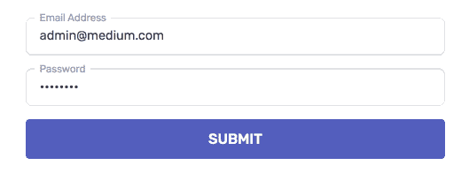

# JavaScript 中作为控制流和守卫的异步/等待错误:未来十年如何处理错误

> 原文：<https://betterprogramming.pub/async-await-errors-as-control-flow-guards-in-javascript-for-the-next-decade-46290deb42c>

## 如何以一种漂亮的方式编写干净的、带错误处理的异步代码


照片由[乔丹·罗兰](https://unsplash.com/@yakimadesign?utm_source=unsplash&utm_medium=referral&utm_content=creditCopyText)在 [Unsplash](https://unsplash.com/s/photos/stadium?utm_source=unsplash&utm_medium=referral&utm_content=creditCopyText) 上拍摄

我们可能仍然认为 JavaScript 是 90 年代遗留下来的语言，但它是这个街区最酷的孩子。

一方面，处理错误是很重要的，否则用户会碰壁，他们不能修改他们输入的数据，也不知道发生了什么，因为错误消息非常模糊。

另一方面，对于开发团队来说，拥有一个像野生动物一样到处都是条件和错误对象的巨大代码库是不可取的。

但是说实话，处理每一个可能的错误都很难。

因此，在这篇博文中，我将向您展示一些在 JavaScript 中有效处理异步错误的方法。



未知错误 lol

在这篇文章中，我从现代编程语言中获得灵感，如 [Go](https://golang.org/) 和 [Swift](https://developer.apple.com/swift/) ，我将跳过对`async/await`、`Promise`和*回调*的解释。

# 灵感

像 Go 这样的语言非常重视错误处理。总有一个名为`err`的变量需要检查。这里有一个[的例子](https://blog.golang.org/error-handling-and-go):

```
if data, err := datastore.Get(c, key, record); err != nil {
    http.Error(w, err.Error(), 500)
    return
}
```

这里是 Swift 中的一个[示例](https://stackoverflow.com/a/39263210/3416691):

```
func icon() -> UIImage {
    guard let image = UIImage(named: "Photo") else {
        return UIImage(named: "Default")!
    }
    return image
}
```

我的目标是用 JavaScript 写出像前面这些例子一样漂亮、简洁和清晰的东西。

# 异步方法

下面是一些`async`方法:

```
async function fetchData() {
  return fetch("...");
}async function sendData(data) {
  return fetch("...", {
    method: "post",
    body: JSON.stringify(data),
  });
}async function signData(data) {
 // Do something cool with cryptography ;)
}
```

我们将在下一节中使用这些方法。

# 完全没有处理

快速而肮脏的解决方法是跳过任何`try/catch`,并希望最好的。如果您对全球互联网网络、您的服务器和用户(世界上最容易被误解的生物)非常有信心，您可以编写如下代码:

```
async function handleClick() {
  const data = await fetchData();
  const signed = await signData(data);
  const saved = await sendData(signed); **setState({ status: "ok ✅" });**
}
```

# 整体捕获

你应该写的最少的附加内容是至少显示一个警告，也许用一个大包装`try/catch`来报告错误。

```
async function handleClick() {
  **try {**
    const data = await fetchData();
    const signed = await signData(data);
    const saved = await sendData(signed);
    setState({ status: "ok **✅**" });
 **} catch (err) {**
    **setState({ status: "Something bad happened 🤷‍♂️" });**
  **}**
}
```

使用这种方法，您让用户或系统重试操作，但是他们永远不会知道错误的原因。这真的很令人沮丧。

# 一步一步让/试/抓

这是一个更好控制的流程，您可以实际判断错误是在哪里触发的。

```
async function handleClick() {
 **let data = null;
  try {
    data = await fetchData();
  } catch (err) {
    return setState({ status: "Network error 🔌" });
  }** **let signed = null;
  try {
    signed = await signData(data);
  } catch (err) {
    return setState({ status: "Signature error 🔑" });
  }** **try {
    const saved = await sendData(signed);
    setState({ status: "ok ✅" });
  } catch (err) {
    return setState({ status: "Could not save data 💾" });
  }**
}
```

个人来说:“我不是`let`的超级粉丝，更不是`var`的粉丝。”那么，我们可以用类似于 Go 或 Swift 的语法实现同样的结果吗？

# 我的建议是:作为后卫接球

如果我们捕捉到错误，用任何需要的副作用处理它，然后抛出一个用户友好的错误，我们可以稍后向用户显示，那么在 JavaScript 中可能有类似于 *guard 子句*的语法。

```
async function handleClick() {
  try {
    const data = await fetchData()**.catch(err => {
      throw new Error("Network error 🔌");
    });**
    const signed = await signData(data)**.catch(err => {
      throw new Error("Signature error 🔑");
    });**
    const saved = await sendData(signed)**.catch(err => {
  **    // Report error or any side effect. **throw new Error("Could not save data 💾");
    });**
    setState({ status: "ok **✅**" });
  } catch (err) {
    setState({ status: err.message });
  }
}
```

跳过包装`try/catch`也是可能的，但是这将使这个承诺无法处理。

这可能不是问题，因为代码是异步的。此外，这不会中断任何 React.js 应用程序的呈现，也不会以错误代码退出任何 [Node.js](https://nodejs.org/) 脚本。

这里有一个使用[逗号操作符](https://developer.mozilla.org/en-US/docs/Web/JavaScript/Reference/Operators/Comma_Operator)的例子(它更简单，但是知道它的人不多):

```
async function handleClick() {
  const data = await fetchData().catch(err => {
 **throw (setState({ status: "Network error 🔌" }), err);**
  });
  const signed = await signData(data).catch(err => {
 **throw (setState({ status: "Signature error 🔑" }), err);**
  });
  const saved = await sendData(signed).catch(err => {
    // Report error or any side effect.
 **throw (setState({ status: "Could not save data 💾" }), err);**
  });
  setState({ status: "ok **✅**" });
}
```

您可能需要禁用 ESLint 规则,以便在没有警告的情况下使用逗号运算符。

事实上，你可以在 JavaScript 中抛出任何值、对象，甚至`undefined`(见 [MDN](https://developer.mozilla.org/en-US/docs/Web/JavaScript/Reference/Statements/throw) )。理论上你甚至可以抛出`setState`的结果，也就是`void`:

```
async function handleClick() {
  const data = await fetchData().catch(err => {
    throw setState({ status: "Network error **🔌**" }); // **throw void;**
  });
  // ...
  setState({ status: "ok **✅**" });
}
```

在我看来，就兼容性和标准化而言，最好坚持使用原生的`[Error](https://developer.mozilla.org/en-US/docs/Web/JavaScript/Reference/Global_Objects/Error)` [对象](https://developer.mozilla.org/en-US/docs/Web/JavaScript/Reference/Global_Objects/Error)。

不应该抛出空值的另一个原因是，您会丢失关于错误的信息，因此调试变得更加困难。

在写这篇文章的时候，我也想过像`setState`一样返回一个数组，让它看起来更像 Go。这里有一个例子:

```
**async function p(promise) {
  return promise
    .then(result => [result, null])
    .catch(err => [null, err]);
}**async function handleClick() {
  **const [data, err0] = await p(fetchData());**
  **if (err0) {**
    return setState({ status: "Network error **🔌**" });
  **}** **const [signed, err1] = await p(signData());**
 **if (err1) {**
    return setState({ status: "Signature error **🔑**" });
  **}** // ... setState({ status: "ok **✅**" });
}
```

最终，有许多方法可以实现相同的结果:一个为用户和工程团队以干净、直观的方式处理错误的编程流程。

您可以使用这些选项中的每一个并将它们混合起来，这样您就可以得到适合您的代码库的东西。这也适用于服务器端应用程序，如 [Express.js](https://expressjs.com/) 或 [Koa.js](https://koajs.com/) 。

与此同时，我将坚持用*接球当后卫*的方法。