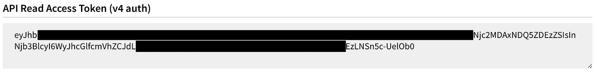
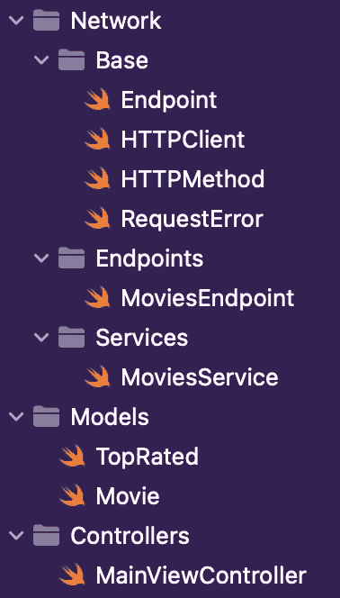
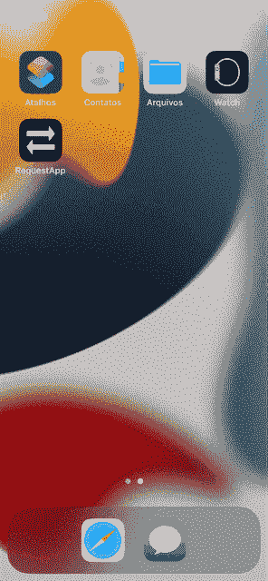
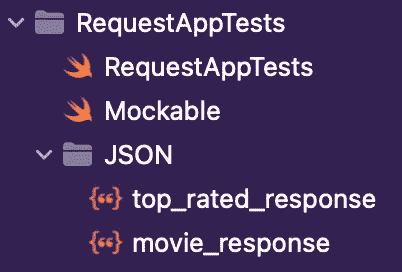

# async/Await:Swift 5.5 通用网络层

> 原文：<https://betterprogramming.pub/async-await-generic-network-layer-with-swift-5-5-2bdd51224ea9>

## 以及如何最大化它


泰勒·维克在 [Unsplash](https://unsplash.com/s/photos/data-center?utm_source=unsplash&utm_medium=referral&utm_content=creditCopyText) 上的照片。

当我们学习如何开发前端应用程序时，从服务器接收响应是最酷的事情之一。正是在这种互动中，应用程序变得栩栩如生。

本文将向您展示如何为您的 iOS 应用程序创建一个简单而通用的网络层，而不必在每次发出请求时都编写大量代码，避免出现样板文件。

如果你还没有掌握 API 的概念，我强烈建议你在继续之前阅读[这篇文章](https://medium.com/free-code-camp/what-is-an-api-in-english-please-b880a3214a82)。此外，很好地理解[面向协议编程(POP)](/difference-between-protocol-oriented-programming-pop-and-object-oriented-programming-oop-in-swift-2dc3048b4fd?gi=1d2e64777904) 和[异步/等待](/async-and-await-in-swift-5-5-5c8abb9f4f85)结构并发性也很重要。

# TMDB:电影数据库

为了在本文中帮助我们，我们将使用 TMDB 的 API 来发出一些请求，你可以在文档[中看到这些请求。简言之，TMDB 是一个包含电影、电视节目、连续剧等信息的数据库。](https://developers.themoviedb.org/3/)

使用 API 是免费的，但这并不意味着它是完全开放的。为了提出请求，你需要一个访问令牌，你可以按照以下步骤在 TMDB 的页面上注册获得:

1.进入 https://www.themoviedb.org/的 TMDB 页面:

2.点击“加入 TMDB”

3.注册然后登录

4.进入设置> API:[https://www.themoviedb.org/settings/api](https://www.themoviedb.org/settings/api)

完成了。在页面底部，您将在 API 读取访问令牌(v4 auth)部分找到您的令牌。大概是这样的:



TMDB 访问令牌。

# 项目

所以你可以继续阅读这篇文章，我创建了这个[示例项目](https://github.com/victorcatao/RequestApp)，它使用 [MVC](https://www.hackingwithswift.com/example-code/language/what-is-mvc) 架构。您可以克隆存储库并打开。xcodeproject 跟进。在该文件中，您将找到这三个文件夹，这三个文件夹是我们首先要处理的主要文件所在的位置。



项目文件夹。

*   `Endpoint`:设置所有端点的协议。
*   `HTTPClient`:本文最重要的文件之一。这是执行通用请求的方法所在的位置。
*   `HTTPMethod`:使用主 HTTP 方法执行请求的 Enum。如果需要，可以添加其他的，如*头*、*迹*、*选项*等。
*   `RequestError`:枚举有一些错误，我们会处理。如果您使用的 API 或您的应用程序有其他特殊情况，请将它们添加到此枚举中。
*   `MoviesEndpoint`:带有 [TMDB API 电影](https://developers.themoviedb.org/3/movies)服务端点的 Enum。对于每种情况，可以配置特定的端点，确定`path`、`method`、`header`和`body`变量。
*   `MoviesService`:负责执行[电影服务请求](https://developers.themoviedb.org/3/movies)的结构。
*   `TopRated`:解码来自[最高额定端点](https://developers.themoviedb.org/3/movies/get-top-rated-movies)的响应的模型。
*   `Movie`:对包含电影的响应进行解码的模型。
*   `MainViewController`:项目唯一的*控制者*，负责发出请求并显示响应。



示例项目

# 网路层

在进入文章最酷的部分(`HTTPClient`)之前，我们需要浏览一下其他部分，这样你就能理解正在发生的一切。

`**Endpoint**`是一个*协议*，其中所有的端点需要符合告知它们所有的细节:`scheme`、`host`、`path`、`method`、`header`和`body`。

`Endpoint`协议有一个默认的`scheme`和`host`实现，因为它通常只有一个用于所有端点。因此，没有必要一直实施它。如有必要，您可以重写此实现。

`path`变量将作为`scheme`和`host`的补充，形成端点 URL。它是这样工作的:`scheme` + `host` + `path`。例如:假设端点 URL 是`https://api.themoviedb.org/3/movie/top_rated`，那么`path`应该是`/3/movie/top_rated`。

当需要时,`header`变量应该返回一个*字典*,其中包含端点文档需要的所有头信息。这通常是通过*授权*执行认证的地方，您将在下面看到。

像`header`变量一样，在必要时，`body`也是一个字典，必须包含端点文档请求发送的主体信息。

`method`变量的类型是`RequestMethod`，代表端点的 HTTP 方法，可以是:GET、POST、PUT、DELETE、PATCH、HEAD 等。对于这个 API，只包含了前五个方法，但是如果在您的上下文中有意义，您可以添加更多的方法。

RequestError 枚举包含一些可能的错误， **HTTPClient** 将识别并返回这些错误，以便应用程序可以处理这些错误。

这个枚举有一个`customMessage`变量，例如，它可以用来向用户显示反馈消息或跟踪错误。

TopRated struct 是一个[可编码](https://developer.apple.com/documentation/swift/codable/)模型，用于解码来自 TMDB API 的 [top_rated 端点](https://developers.themoviedb.org/3/movies/get-top-rated-movies)的响应。请注意，它具有用于将 Snake case 条目(由 API 发送，名为`total_pages`)重命名为 Camel case 的`CodingKeys` enum，这是 Swift 中最常用的模式。

`Movie`结构遵循同样的思想。

好了，现在你已经知道了理解`HTTPClient`的所有必要部分，你终于到了这篇文章最重要的部分。

`HTTPClient`是一个默认实现`sendRequest`功能的协议，负责向服务器发出请求。作为一个参数，它接收模型的`Endpoint`和`type`来解码 API 响应。

作为返回，我们将有一个`Result`，它可以是成功的解码响应，也可以是 RequestError 中创建的一个错误。

正如您所看到的，它伴随着关键字`async`，这表示它是一个异步函数，将在一个单独的线程上运行，并且可以在任何时候返回`Result`。

如前所述，`Endpoint`协议包含了使用它所需的所有信息。这是所有这些信息将被使用的地方。

该方法首先创建我们将与 [URLComponents](https://developer.apple.com/documentation/foundation/urlcomponents) 一起使用的`URL`。这里我们将使用端点的`scheme`、`host`和`path`来配置 *urlComponents* 对象。通过它，我们将得到用于创建`URLRequest`的`URL`，如果失败，将返回`.invalidURL`错误。

之后，我们需要为端点消费创建一个`URLRequest`。但是等等，这个`URLRequest`是什么？[苹果文档](https://developer.apple.com/documentation/foundation/urlrequest)将帮助我们:

> 封装了加载请求的两个基本属性:要加载的 URL 和用于加载它的策略。此外，对于 HTTP 和 HTTPS 请求，`*URLRequest*`包括 HTTP 方法(`*GET*`、`*POST*`等)和 HTTP 头

因此，代码接下来要做的是从实例化的 URL 创建一个 URLRequest。之后，`httpMethod`和`allHTTPHeaderFields`分别通过参数传递的端点的`method`和`header`变量进行配置。

`httpBody`也按照相同的逻辑进行配置，以防有任何数据要发送到端点。

现在你需要做的就是提出请求。我们很接近了！为此，我们将在刚刚创建的 URLRequest 中使用`URLSession.shared.data`。但是等一下，什么是 URLSession？再一次，让我们转向[苹果的文档](https://developer.apple.com/documentation/foundation/urlsession):

> "`[*URLSession*](https://developer.apple.com/documentation/foundation/urlsession)`类和相关类提供了一个 API，用于从 URL 指示的端点下载数据和向其上传数据。"

换句话说，这个类抽象了应用程序和 API 之间的所有通信。带有执行请求所需的所有信息的`URLSession`将返回 API 响应。

在下面一行中，创建了`URL.shared.data()`函数的返回元组。注意，使用`try`是必要的，因为在运行这个函数时可能会抛出异常(这就是为什么我们使用`do/catch`语句)。

此外，它还有`await`关键字，只有当`URL.shared.data()`函数完成并返回元组时，才会导致下一行被执行。

现在这项工作差不多完成了。如果 API 返回任何响应，我们继续分析`statusCode`，如果没有，我们从`RequestError`返回错误`.noResponse`。

因为 API 返回了一个响应，所以对`statusCode`的分析是在可能的 [HTTP 状态](https://httpstatuses.com/)之上完成的。对于本文，筛选了一个理想的案例，其中[200，201，…，299]被认为是成功的，因此我们可以尝试解码响应，将接收到的 JSON 转换为可解码的模型，并最终返回到可以使用它的负责任的方法。

还考虑了 401 ( [未授权](https://httpstatuses.com/401))案例，通常由过期会话引起，其中每个上下文都需要应用程序采取行动(例如，要求用户再次登录)。

# 使用

既然您已经了解了网络层的工作原理，那么就有必要了解如何使用它。跟着我，很简单！

对于`[Movies](https://developers.themoviedb.org/3/movies)`服务中的所有端点，我们将使用`MoviesEndpoint`。

`MoviesEndpoint`是符合端点协议的 enum。它拥有每个端点所需的所有信息。要添加一个新的`[Movies](https://developers.themoviedb.org/3/movies)`服务端点，只需添加一个新的案例并填写每个变量中的信息:`path`、`method`、`header`和`body`。

最后，我们来谈谈`Service`，它是负责发出请求的结构体。

`MoviesService`是 app 用来发出请求的 struct。请注意以下几点:

*   它符合`HTTPClient`协议，这意味着它内部有一个`sendRequest`函数来执行请求，因此不需要为每个请求重复代码。
*   它符合`MoviesServiceable`协议，这对于测试和依赖注入是至关重要的。你很快就会看到更多的细节。
*   函数声明有关键字`async`，遵循已经在`HTTPClient`中注释过的相同逻辑，表明它是一个异步函数。

既然你已经理解了`Service` 结构是如何工作的，那么就看看它们在`MainViewController`中是如何使用的吧。

我们创建的`MoviesService`将通过符合`MoviesServiceable`协议的对象的依赖注入来使用。`MainViewController`是这样实例化的:

有其他方法可以完成这种依赖注入，例如，可以使用 MVVM 架构，并将一个包含服务的`ViewModel`注入到`ViewController`中。然而，为了简洁起见，我们将使用上面显示的方法。

现在，剩下的就是使用注入的`Service`实际发出请求。由于我们正在使用一个`async`函数，我们需要创建一个`Task`来运行异步代码。参见[苹果文档](https://developer.apple.com/documentation/swift/task/3856791-init)了解此功能:

> "当创建代表调用它的同步函数操作的异步工作时，使用这个函数."

只有当请求返回一个`Result<Movie, RequestError>`时`await`才会导致`switch`行被执行。返回后，可以让`switch`根据需要在每个上下文中管理它。

就是这样！现在，让我们看一下如何测试我们的网络层并使用模拟。

吉菲。

# 试验

现在你只需要知道如何测试你的网络层和使用模拟。该项目有以下四个文件:



*   `RequestAppTests`:负责执行 app 测试的类。
*   `Mockable`:将 JSON 文件转换为可编码文件的协议。
*   `top_rated_response`:这是一个. json 文件，带有来自[顶级 TMDB API](https://developers.themoviedb.org/3/movies/get-top-rated-movies) 的返回示例。
*   `movie_response`:这是一个. json 文件，包含一部 TMDB 电影的[细节 API](https://developers.themoviedb.org/3/movies/get-movie-details) 的返回示例。

`Mockable`是一个避免样板文件的协议，默认实现了`loadJSON`函数，它读取一个内部。json 文件并将其转换成给定的可编码模型。

没什么大不了的，对吧？现在看下面的代码来理解我们如何使用`Mockable`协议和`MoviesServiceable`来创建一个 mock。

你还记得我们在 app ( `MoviesService`)中使用的`Service`类也符合`MoviesServiceable`协议吗？你还记得当我们在`ViewController` 上使用依赖注入时，我们注入了一个`MoviesServiceable` 类型的实例，而不是一个`MoviesService`吗？这样，您可以注入另一个不同的实例，以便能够重用和测试您的`ViewController`。参见下面的模拟案例:

由于`loadTableView`函数负责发出请求和更新 movies 变量，因此`movies.count`必须等于 my `top_rated_response.json`中的条目数，在本例中只有一个。此外，代码还测试该项目的标题是否与 JSON 文件中包含的标题相同。

您也可以只测试您的模拟，就像这样:

有几种方法来实现测试。例如，我们可以有一个带有`Service` 的`ViewModel`来测试请求和`ViewModel` 负责的各种功能，并单独用`ViewController`执行 UI 测试。

为了在模拟返回中使用其他 JSONs，我们可以创建其他具有不同返回的`Mockables` & `MoviesServiceable`类，或者使`MoviesServiceMock`类更加可重用，注入文件名、失败类型等。

还可以通过缓存实现、多部分、管理其他状态代码等使网络层更加健壮。此外，我们可以注入 JSONDecoder 和 URLSession 本身，使其更具可重用性和可测试性。本文基于一个简单的上下文，但是每个上下文都需要特定的实现和复杂性。

感谢阅读，让我们继续编码吧！

```
**Want to Connect?**You can add me on [LinkedIn](https://www.linkedin.com/in/victorcatao/).
```