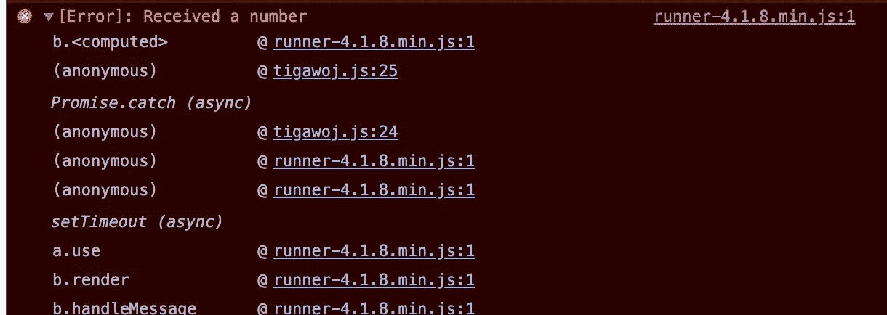
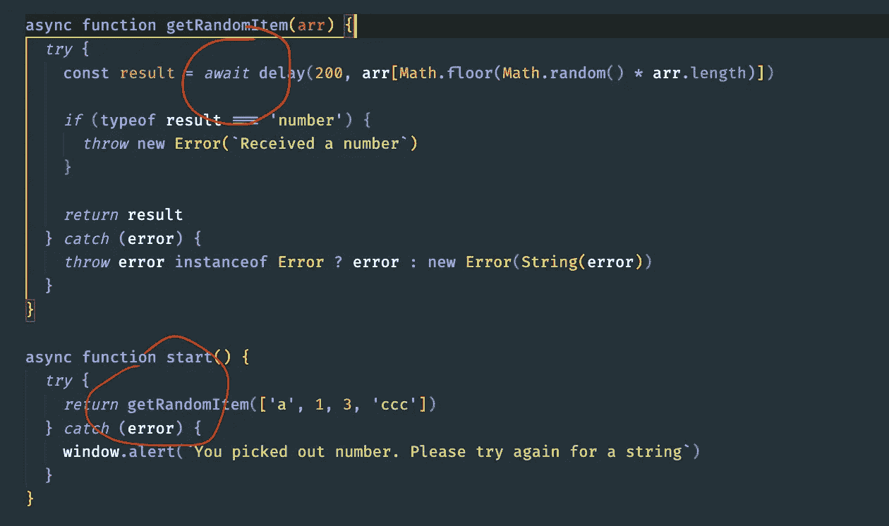

# 始终要注意的异步/等待技巧

> 原文：<https://betterprogramming.pub/async-await-tips-to-be-aware-of-at-all-times-fb5bd15b1baf>

## 请确保您也在等待这些有用的提示

MockupEditor.com[摄影](https://www.pexels.com/photo/silver-imac-near-white-ceramic-kettle-205316/)

JavaScript 中的异步编程长期以来一直是美国开发人员面临的一个挑战。问题是很难编写异步代码。

在[承诺](https://developer.mozilla.org/en-US/docs/Web/JavaScript/Reference/Global_Objects/Promise)出现之前，回调模式是编写异步代码最有效的方式。然而，这种模式仍然受到不可维护代码的困扰，比如[回调 hell](https://en.wiktionary.org/wiki/callback_hell#:~:text=callback%20hell%20(uncountable),understand%20and%20maintain%20the%20code.) ，尤其是在严重依赖异步操作的代码中。

最终，承诺被引入来解决开发人员在使用回调编写异步代码时经常遇到的问题。然而，即使有了承诺，开发者仍然面临困惑。

承诺需要实现返回新的或现有承诺的回调，而新的或现有的承诺必须实现返回下一个值的另一个回调(可以是另一个承诺，以此类推)。这最终会再次带来以前的问题，比如回调地狱。

我们学习的表达代码的方式(以及一般的写作)与 JavaScript 代码在运行时执行的方式略有不同。JavaScript 甚至其他编程语言在设计上没有任何问题，也不是抽象的问题。从上到下、从左到右阅读文本是人的天性。

JavaScript 需要一种合适的方式让开发人员编写这种性质的异步代码，并最终引入了一种使用 ECMAScript 标准的`async`函数和作为表达式的`await`关键字的解决方案。简而言之，这通常被称为 async/await。

在本帖中，我们将回顾一些重要的技巧，每个 JavaScript 开发人员都必须知道这些技巧，以防止应用程序中出现棘手的错误。

# 你要返回的承诺会在同一个函数块中被捕获吗？

在处理 async/await 函数中的错误时，一个棘手的问题是返回拒绝当前函数调用方的承诺。这样做时，我们会将我们的拒绝处理转发给呼叫者。

让我们看看下面的代码示例:

在我们的`start`函数中，我们返回函数`getRandomItem`的结果，并期望我们的拒绝在它的本地`try/catch`块中被捕获，因为我们希望我们的 JavaScript 运行时能够通过向用户显示一个警告窗口来继续运行。然而，当我们运行代码时，它实际上根本不显示弹出窗口，相反，在执行我们放入`getRandomItem`函数的`Throw`后，JavaScript 运行时崩溃:

这是因为我们的承诺由`getRandomItem`返回，而不是在同一个功能块中等待:

要解决这个问题，我们需要做的就是添加一个简单的`await`关键字，这样它就会在同一个功能块中被等待:

理解这一点很重要，它只发生在返回一个全新的承诺时，所以返回像数字这样的常规值不会受到影响:

# 避免在 forEach 内部编写异步代码

新的 JavaScript 开发人员在编写异步代码时更容易受到这种“陷阱”的影响。

这里有一个例子:

将此记录到控制台会给我们一个空数组`[]`，这可能不是我们所期望的。`forEach`函数忽略每次循环返回的承诺！

换句话说，这在技术上等同于:

像`map`这样的迭代函数可以在收集和解析承诺时工作，因为它们在每个循环中都返回调用`callback`的结果。在 JavaScript 中，任何返回 promise 的函数都变成了 thenable(一个带有`.then`方法的对象)。

承诺也是变量，因为`map`返回`callback`的每个结果，这意味着如果需要，我们可以使用回调函数的异步版本，而不是同步版本。

这在技术上与以下内容相同:

在前面的例子中，我们可以在`map`返回的最终结果上使用`Promise.all`(如果我们从回调处理程序中返回了这些结果，那么它们最终可以成为一个变量或`promises`的集合，如果您记得的话):

结果如下:

# 承诺解决链永无止境的循环

如果承诺陷入永无止境的递归循环，它们最终会让我们的应用崩溃。不，我不是在谈论这些类型的递归:

我说的是陷入永无止境的递归承诺链中的承诺，这种承诺链实际上永远不会通过调用自身来解决。

例如，在下面的代码片段中，我们有一个异步函数，它返回一个可解析并返回原始承诺调用(`start`)的名称。这将返回另一个 thenable ( `delay`)，后者将返回原始 promise 调用的另一个调用，依此类推:

最大的问题是对`start`函数的原始调用实际上从来没有办法找到对原始承诺调用的解析。这会导致我们的程序出现内存泄漏，最终导致程序崩溃。

那么，如何才能避免这种情况呢？

我们可以利用类似于我们之前讨论的`forEach`的概念，而不是返回承诺，我们可以让函数忽略承诺结果(就像`forEach`所做的)。因此，每个调用在运行完功能块后都会到达它们的末尾:

虽然这解决了内存泄漏问题，但它完全丧失了从新调用中捕获内部承诺拒绝的能力。

我们可以用一个简单的包装器让`start`捕捉它的任何深层拒绝，这解决了我们的问题。代码如下:

# 结论

我希望你发现这是有价值的，并期待在未来更多！