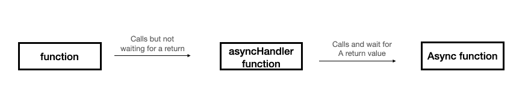

# Swift 即将推出异步功能

> 原文：<https://betterprogramming.pub/async-functions-are-coming-to-swift-75993d0cb4e3>

## 你会爱上它们的


[韦斯利·普里巴迪](https://unsplash.com/@wesleypribadi?utm_source=medium&utm_medium=referral)在 [Unsplash](https://unsplash.com?utm_source=medium&utm_medium=referral) 上的照片。

老 iOS 开发者还记得 Objective C 还不支持块的日子。异步操作是一场噩梦。

Blocks 改进了异步操作，当 Swift 出现时，闭包对我们来说已经很自然了。但是为了帮助我们通过异步调用，闭包仍然有其缺陷。

幸运的是，Swift 即将推出一项名为 async function 的新功能，它将使我们的生活变得更加美好。

# 闭包有什么问题？

闭包是好的，真的，多年来为我们提供了很好的服务。但是我们都知道 async + closures 有它的问题。

# 末日金字塔

让我们来看看下面的片段:

我们都知道这个例子。它被称为末日金字塔。

虽然一开始使用几个嵌套闭包似乎是一个优雅的想法，但它仍然会导致一些问题。

我们在处理嵌套闭包时都知道的一个问题是错误处理。看看下面的片段:

你看到对`completionBlock`的调用和之后的返回语句了吗？现在，想象一下你需要为每个闭包都这样做。不仅如此，你也不能忘记返回语句。否则，你可能会遇到一些难以理解的严重问题。

使用 enum 和 switch 语句会导致更难看、更复杂的代码。甚至不要让我开始抛出函数:

我想这一点现在已经很清楚了。

幸运的是，随着两个最好的伙伴 async 和 await 的出现，事情很快就要改变了。

# 异步会面并等待

Async 和 await 一点都不新鲜。微软拥有这些功能已经很多年了。Net 和 JavaScript 开发人员非常了解这个特性。

就 Swift 而言，开发人员提议增加这一功能已有近五年时间，最终获得了批准。

看起来是这样的:

```
func loadFileFromServer(string : String) async ->Data // this is the async declaration

let fileData = await loadFileFromServer("myFile") // this is the call.
```

就这样？就是这样。

在声明函数时，我们在返回值之前添加了单词`async`，在调用函数之前添加了`await`。

如果你对它有些熟悉，那是因为它看起来类似于将函数声明为 throwing。

现在让我们看看上面带有新的`async/await`机制的代码:

```
func processImageFromServer(string : String) async ->UIImage {
    let fileData    = await loadFileFromServer(string)
    let imageData   = await analyzFile(fileData)
    let image       = await decodeImage(imageData)
    return image
}
```

这不是很简单吗？

使用`await`挂起当前线程并等待回答。这使得代码更加明显和简单。

# 有些事情听起来很奇怪

好了，我们知道我们可以编写看起来和行为都像同步代码的异步代码。

但是一想起来，有些事情很诡异…

我们说过我们有一个名为`await`的新操作符来挂起当前线程。

使用异步操作的一个最流行的用例是不阻塞 UI 线程。如果 UI 线程调用了一个异步函数并使用了`await`，这意味着 UI 线程现在被阻塞了！那么，有什么意义呢？

嗯，实际上并不是这样的。

显然，现在有两种功能:

*   一个是异步函数，标有`async`。
*   另一个是调用 async 函数并包含`await`操作符的函数。这个函数有一个`@asyncHandler`操作符。

`@asyncHandler`函数的“主体”被挂起，但是调用`@asyncHandler`函数的函数没有被挂起，而是继续运行，不等待响应。

我将尝试用代码和图表来解释这一点:



现在让我们看看它的代码:

当`tapped()`功能被触发时，控制台中打印消息的顺序如下所示:

```
1236745
```

这对于理解包含`await`关键字的函数很像完成块是至关重要的。当您调用这样的函数时，run 循环继续，这样，UI 线程就不会被阻塞。

一个问题:如果`@asyncHandler`函数返回值怎么办？嗯，这是一个不可能的情况。`@asyncHandler`不能返回值。它们只能是空函数。

# 摘要

`Async`和`await`对 Swift 开发人员来说是好消息。这是使 Swift 成为现代语言并简化我们所有人生活的又一步。

但是，由于这是我们习惯的一个重大变化，我们需要准确理解它是如何在引擎盖下工作的。仔细阅读上面的代码片段，充分吸收如何使用它。