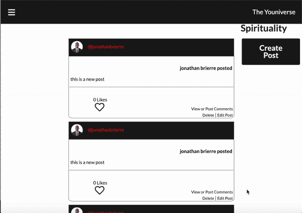
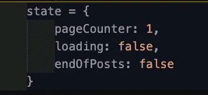
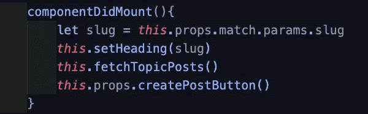
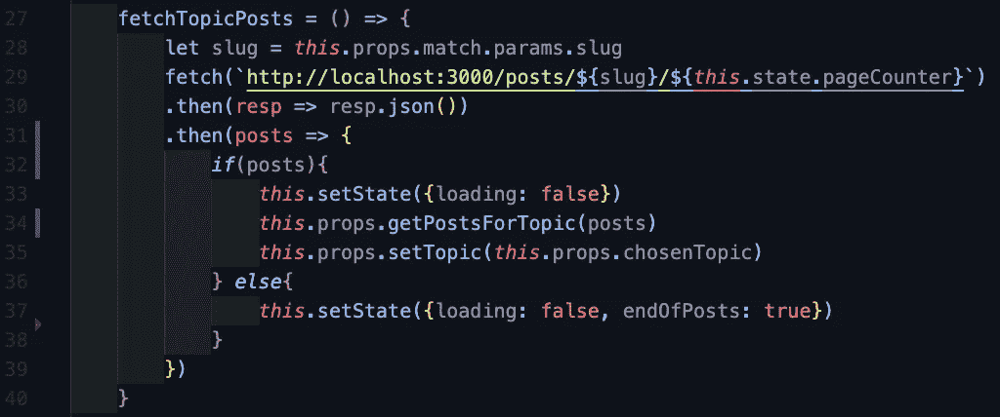
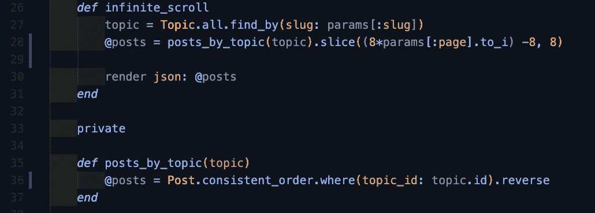
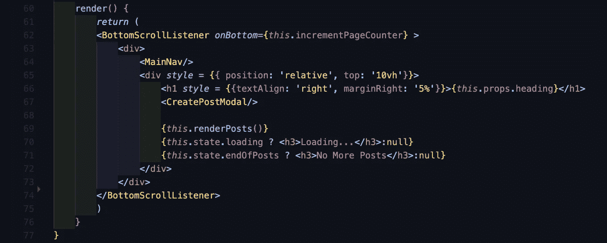
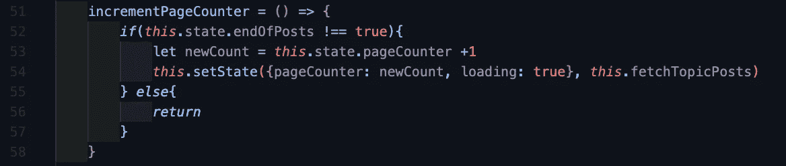

# 如何在 React.js 中构建异步无限滚动

> 原文：<https://betterprogramming.pub/async-infinite-scroll-in-react-js-71a6f1210c75>

## *滚动，获取，滚动，获取，滚动…*

假设您正在设计一个社交媒体提要，并且希望在其中实现一个无限滚动特性。有两种方法可以做这件事。

1.  您调用一个 API 来检索属于特定提要的所有帖子。在获得所有这些帖子之后，您在前端解析它们并显示给用户。
2.  每当用户第一次进入页面并滚动到底部时，您就为特定数量的帖子发出一个 API 调用。

这正是我在熨斗学校创建顶点工程时遇到的十字路口。虽然第一条路线是两条路线中比较容易的一条，但我心想，“如果我的应用程序有数百万用户，他们之间有数十亿条帖子，那么加载和存储这么大规模的提要会破坏我的应用程序！”那时我决定走第二条路。我是怎么做到的？好吧，继续读下去，让我们找到答案！

## **免责声明:**

*   这个应用程序使用 React 前端和 Ruby on Rails 后端。如果你不熟悉 Rails，尽管你想用你的专业语言达到同样的效果，我 99%确定这里的逻辑是可以移植的。
*   这个应用程序使用了`fetch`关键字。这就是允许我对我的 Rails 后端进行 API 调用的方式。如果你不熟悉如何获取发生，然后检查[一些文件在这里](https://developer.mozilla.org/en-US/docs/Web/API/Fetch_API/Using_Fetch)。

## 我们开始吧！

下面是我的应用程序的一个新闻提要在实现后的样子:

这是正在发生的逻辑流程:

1.  有一个存储在本地状态中的计数器，其默认值设置为 1。
2.  当组件挂载时，默认的计数器值被发送到后端以检索第一组帖子。
3.  当用户滚动到页面底部时，会触发一个事件监听器。一旦被触发，我的状态中的计数器递增，然后用新的递增值完成另一个获取请求。有了新的增量值，我可以获得下一组帖子。
4.  加载下一组立柱。用户滚动到底部，计数器递增，获取发生，下一组帖子被检索和加载。
5.  这可以一直进行到给定提要中不再有帖子为止。

首先，我们要建立我们的州。我们希望有一个计数器变量，一个布尔值，它将指示是否正在进行提取(如果您希望有一个加载动画/指示器，这很有帮助)，另一个布尔值，它表示我们是否已经到达提要的末尾(如果您希望在用户到达提要的末尾时告诉他们，这很有帮助)。

以下是我的 componentDidMount 函数:

对于这个博客来说，重要的是第二个被调用的函数。让我们看看 fetch 函数是如何定义的。

现在，这里发生了很多事情，让我们来分解一下:

1.  在第 28 行，我声明了一个名为`slug`的变量。这是正在访问的提要的名称。
2.  在第 29 行，我将这个 slug 以及在我的状态中定义的计数器作为参数传递给我从中获取数据的 URL。(我将在本文的后面介绍如何为此设置端点和控制器配置)。
3.  从第 32 行开始，重要的是如果我得到一个有效的响应(一个 post 数组)，那么 loading 变量被设置为 false，我将检索到的 post 发送到 Redux 中的我的 state 以进行显示(this.props.getPostsForTopic)。
4.  如果没有有效的响应，那么通过将 endOfPosts 的 state 设置为 true 来指示提要的结束。

现在，在我深入到事件监听器，描述它是如何工作的，以及实现加载指示器之前，让我们快速地回到后端。

## 后端

在我的后端，我有一个如下设置的路由:

`get 'posts/:slug/:page', to: 'posts#infinite_scroll'`

这允许我们将不同的参数传入获取 URL。一旦有人访问这个端点，那么所需的逻辑就在我的 Posts 控制器的 infinite_scroll 函数中处理。以下是所述函数，以及我使用的一个助手函数:

这里发生了很多事情，但这本质上是奇迹发生的地方！让我们再一次分解一下:

1.  在无限滚动函数中，我首先找到使用我们之前传递的 slug 参数引用的主题。
2.  一旦我有了我需要的主题，我就用主题的参数调用我定义的名为‘posts _ by _ topic’的函数。
3.  当我们查看截图下半部分定义的函数时，它实际上是在返回一个属于主题的帖子的反向数组。(注意:在 Post 类上调用的方法‘consistent _ order’是我在 Post 的模型文件中定义的一个类方法。它的目的是确保我加载的帖子的顺序与最初创建时一致。)
4.  回到 infinite_scroll 函数——一旦我们得到函数的返回值，我们就对它调用 slice 方法。如果你不熟悉切片法，[这里有一些文档！](https://dev.to/jeremy/ruby-method-spotlight-slice-1f3j)
5.  在第一次加载时(组件已安装)，这个 slice 方法的第一个参数为 0，第二个参数为 8。如果你对第一个参数不清楚，我正在做 8 倍的页面计数，在我的获取中传递下去。在我第一次加载时，页数是 1。八乘以一等于八。然后我减去 8，得到 0。这样，我可以从索引 0 开始，从中获得 8 个 post 元素(直到第 7 个索引)。

在前端，当页面滚动到底部时，计数器增加到 2，并发生另一次提取。在这个切片方法中，第一个参数变成 8，因为 8 乘以 2 等于 16。16 减 8 得 8。现在，我们从第 8 个索引(直到第 15 个索引)中获取所有的 posts 8 元素。

用户再次滚动到底部，并将计数器增加到 3。Fetch 发生了，我们现在用参数 16 和 8 再次切片。16 因为 8 乘以 3 等于 24。24 减 8 等于 16。现在我们从第 16 个索引中得到所有的第 8 个元素。

如果文章数组中剩下的文章少于 8 篇，那么 slice 方法将返回剩余的文章。如果我们到达一个超过数组长度的初始参数，slice 将返回 nil——这是我们上面的 fetch 函数中条件语句的关键。

一旦我们得到了我们的文章集，我们将它们保存到一个变量中，然后将这个变量呈现给我们的前端。

现在，让我们设置我们的事件监听器！

## 回到前面去！

在我的前端，我下载了 npm 包“反应-底部-滚动-监听器”。您可以通过点击此处的[找到文档。](https://www.npmjs.com/package/react-bottom-scroll-listener)这个包提供了一个组件，它有一个名为‘on bottom’的属性，该属性接受一个回调函数的参数。这里，它正在我的应用程序中使用。我将该组件的所有 JSX 都包装在 BottomScrollListener 组件中。

在这里，您还可以看到当加载帖子时(当 fetch 发生时)，或者当没有更多帖子要加载时，用户所看到的逻辑。我在第 70 行和第 71 行使用了三元运算符([关于三元运算符的文档！](https://developer.mozilla.org/en-US/docs/Web/JavaScript/Reference/Operators/Conditional_Operator))。

虽然拥有这些指标并不是这篇博文的主要焦点，但是如果你一直遵循我的代码，我相信你也可以在你的代码中实现它。

另外，请注意，我在我的 JSX 中调用了一个名为 renderPosts 的函数。所有这些都是从我的 Redux 状态开始遍历一个 posts 数组，并为每个元素创建组件。

现在，让我们看看回调函数的逻辑:

在这个函数中，有一个检查来查看我们的帖子是否结束。

*   如果我们还没有到达帖子的末尾，那么我们就增加状态中的页面计数器，将状态中的 loading 变量设置为 true，然后运行函数，再次获取新的计数器值。当 fetch 返回一个有效的 posts 数组时，我们将 loading 设置为 false，并将数组发送到 Redux 状态进行解析。
*   如果我们到达了页面的末尾，没有更多的文章要显示(endOfPosts === true)，那么我们什么也不做。(记住！只有我们的 fetch 函数有能力将我们状态中的 endOfPost 变量更改为 true。如果我们不再从后端获得一组帖子，它就会变成真的)。

所以你有它！这是我对异步无限滚动的尝试。如果你有任何问题，反馈，或者如果你觉得你可以使这更有效，随时联系。我希望您的 React 应用程序在实现这一点后内存效率会高得多！

# 资源:

 [## 使用获取

### 这种功能以前是使用 XMLHttpRequest 实现的。Fetch 提供了一个更好的选择，可以…

developer.mozilla.org](https://developer.mozilla.org/en-US/docs/Web/API/Fetch_API/Using_Fetch)  [## 反应-底部-滚动-监听器

### 一个简单的 React 钩子和 React 组件，当你滚动到底部时，它可以让你监听。

www.npmjs.com](https://www.npmjs.com/package/react-bottom-scroll-listener)  [## Ruby 方法聚焦:切片

### 在我们开始之前，先简单说明一下:这篇文章假设你对 Ruby 数据结构有基本的了解，因为我真的不能…

开发到](https://dev.to/jeremy/ruby-method-spotlight-slice-1f3j)  [## 条件(三元)运算符

### 条件(三元)操作符是唯一接受三个操作数的 JavaScript 操作符:一个条件后跟一个…

developer.mozilla.org](https://developer.mozilla.org/en-US/docs/Web/JavaScript/Reference/Operators/Conditional_Operator)